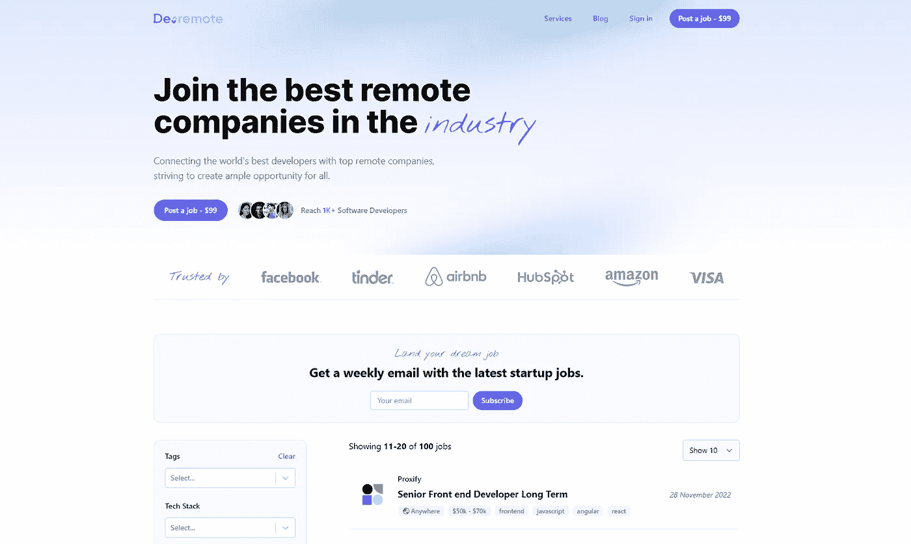
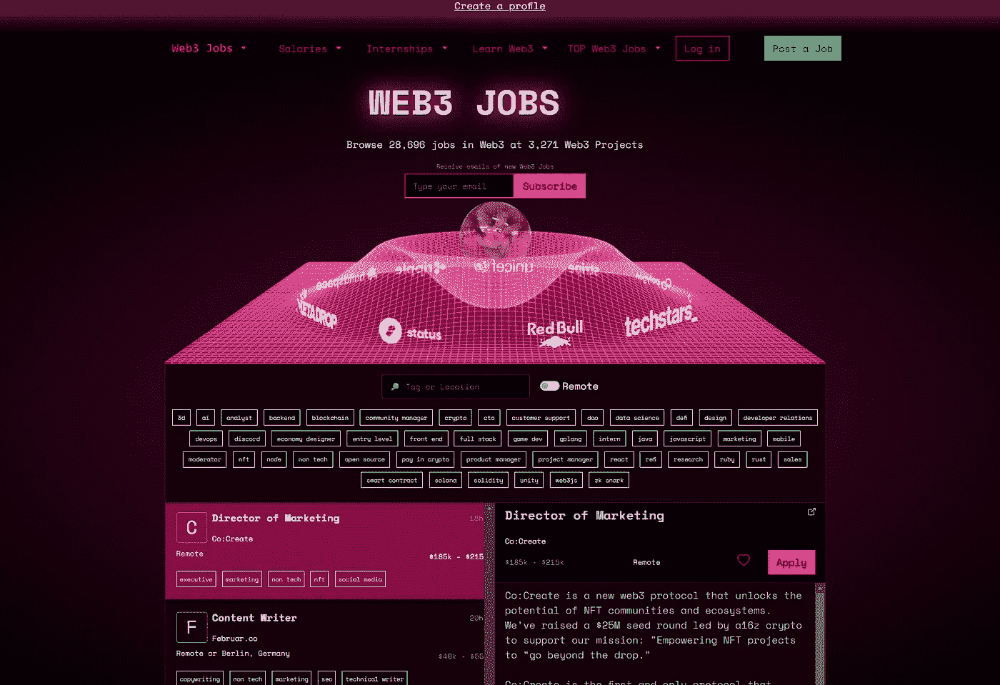
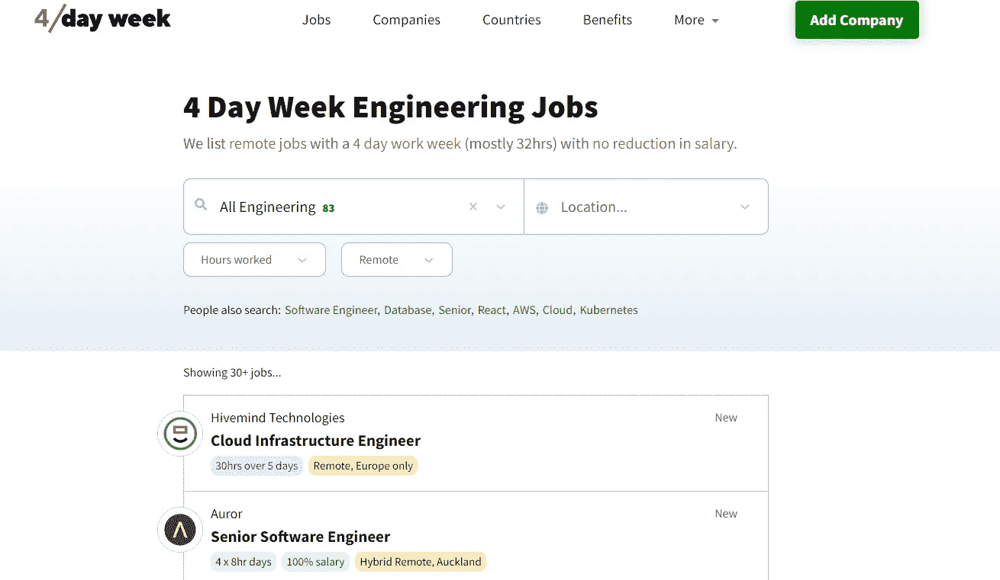
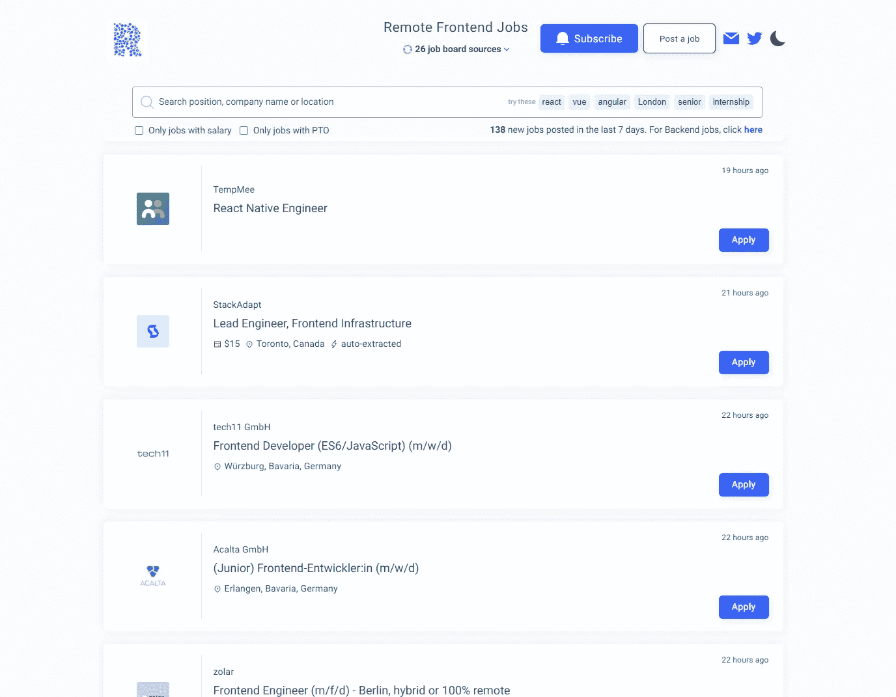
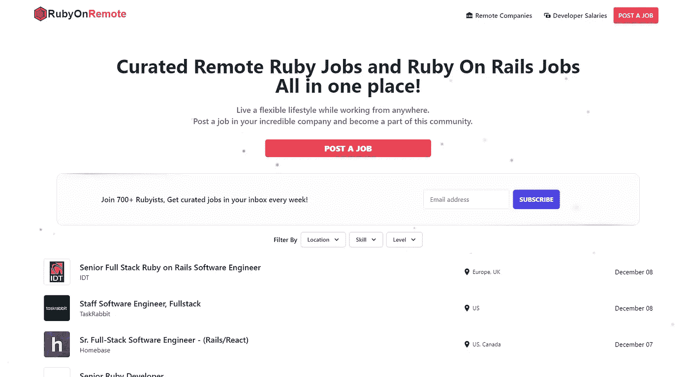
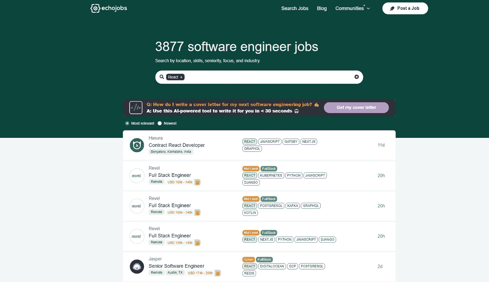

# 寻找远程软件工程工作的 10 个利基网站

> 原文：<https://levelup.gitconnected.com/10-niche-websites-to-find-remote-software-engineering-jobs-88e08c89884b>

大多数远程工作论坛都是针对一般的远程工作的；这里有一些为软件工程师设计的网站。

[拉拉·阿兹利](https://unsplash.com/@lazizli?utm_source=medium&utm_medium=referral)在 [Unsplash](https://unsplash.com?utm_source=medium&utm_medium=referral) 上的照片

我最近一直在寻找一份新的远程开发工作，并决定主流选择是面向美国软件工程师以外的人。因此，我列出了为软件工程师建立的 10 个利基网站。

# 1) Devremote.io

[Devremote](https://devremote.io) 是一个针对所有软件工程工作的工作平台，涵盖了从节点到加密的一系列技术和行业；本质上，Devremote 是所有编程和软件工程工作在一个地方的巨大集合。

## **最佳位**

*   令人难以置信的一套过滤器
*   取消“有竞争力的薪水”的工作
*   包括来自所有与技术相关的职位公告板的 100 个职位

# 2)软件工程岗位

软件工程工作有另一个很好的工作选择和一系列不同的行业，你可以看看。它们还提供了很好的过滤选项。

## 最佳比特

*   固体过滤器组
*   倾向于在这里找到一些不知名的公司

# 3)网络 3 .职业

区块链世界为我们工程师提供了许多好机会，而求职是找到这些机会的好地方。

## 最佳比特

*   非常适合加密机会
*   很多高薪的工程工作

# 4)每周 4 天

第四，我认为我们实行四天工作制是合适的。这是寻找灵活编程工作的一个很好的选择，非常适合那些边工作边兼职的人。

## 最佳比特

*   大多数工作每周 32 小时或更少
*   你可以找到只工作四天却付五天工资的工作。

# 5)远程前端作业

一个简单而有效的工作板，用于查找远程前端工作。这是一个很好的选择，有许多有用的过滤器来查找远程前端工作。

## 最佳比特

*   非常简单实用的设计
*   非常适合仅发现远程前端工作

# 6) RubyOnRemote

对于那些热爱 Ruby 生态系统并在该领域寻找远程工作的人来说，这是一个很好的小宝贝。Rubyonremote 是一个非常小众的网站，为你提供了许多很好的选择。

## 最佳比特

*   全押在 ruby jobs 身上
*   如果你是一名 ruby 开发人员，这会节省你的时间，因为你几乎可以在这里找到任何工作。

# 7)回声工作

Echo jobs 是一个寻找远程工程工作的好地方，有很多不错的选择。他们还有非常有用的过滤器，你可以用你能想到的任何技术进行搜索。

## 最佳比特

*   干净的用户界面
*   围绕技术栈的真正有用的过滤器的色调

# 8)工作

另一个 Javascript 工作板，为偏远的大公司提供了一些难以置信的机会。他们有一些非常酷的特点，比如员工规模。

## 最佳比特

*   提供员工规模指标，帮助您评估公司的规模
*   干净和伟大的过滤器组

# 9)移除

[remotive](https://remotive.com) 提供每周时事通讯，介绍最新的远程开发人员职位，以及提供各种机会的工作板。如果你想了解最新的职位空缺，这是一个很好的资源。

# 10)天使列表

稍微低调一点，但是角度列表是找到顶级远程工作的好地方。过去我已经用它进行了三次面试，发现它有很好的过滤选择，还能从雇主那里获得很好的推广。

## 最佳比特

*   公司来找你
*   硅谷顶级初创企业的令人敬畏的名单

# 结论

这些是我用来寻找优秀的远程客户和机会的主要招聘信息。如果你有更多的建议，请告诉我，我们可以让这篇文章成为寻找远程开发人员工作的重要资源。