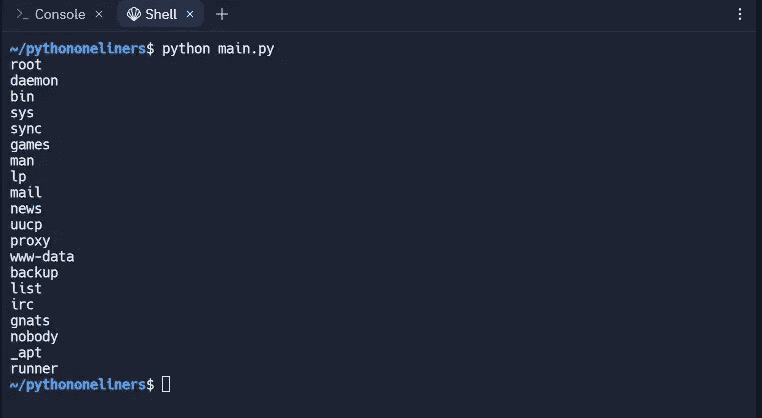
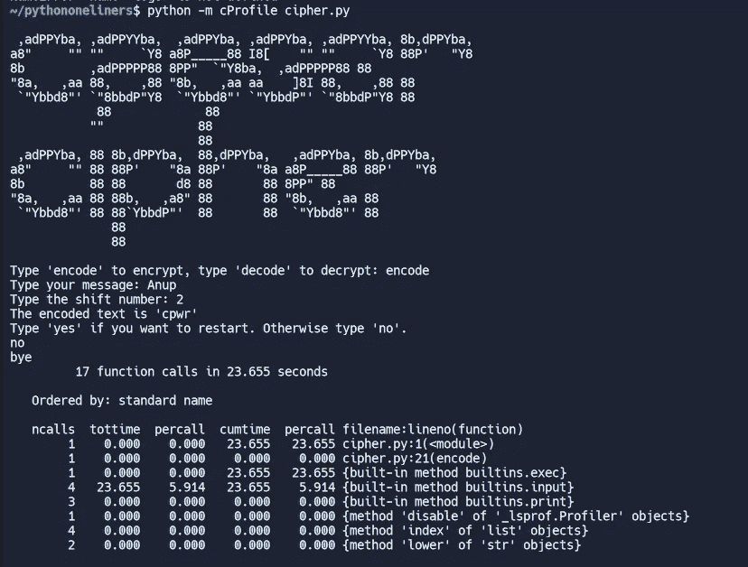
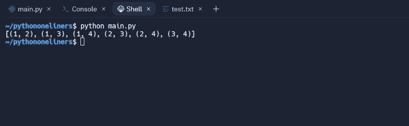
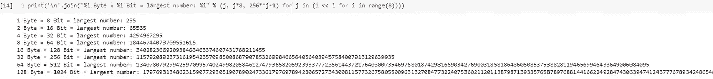

# 日常使用的 15 个强大的 Python 一行程序

> 原文：<https://levelup.gitconnected.com/10-powerful-python-one-liners-for-daily-use-8733dac0bc2c>


Python 是我最喜欢的编程语言之一。使用 python，我们可以创建几乎任何程序，就像许多其他编程语言一样。但是 python 的袖子里有独特的东西；这是 python 单行代码。一行程序可以像一个完整的闪存程序本身一样强大。

在这里，我将谈论我最喜欢的 python 一行程序的前 10 个，您可以在日常生活中使用它们。

# 1.通过创建二维码来共享您的 Wi-Fi 密码📶

在你的系统中尝试这段代码之前，你必须安装[**wifi _ QR code _ generator**](https://pypi.org/project/wifi-qrcode-generator/)库**。使用 pip 就可以轻松完成。在你的命令提示符/终端输入以下命令 ***pip 安装 wifi-二维码-生成器*** *。***

```
import wifi_qrcode_generator as qr
qr.wifi_qrcode('wifi name ', False, 'WPA', 'password')
```

输出:

你会得到一个像这样的二维码。


# **2。将图像转换为视频📹**

你有一堆图像，想转换成视频吗？然后用这个牛逼的 python one liner。

首先，您需要通过在您的终端/cmd 中运行此命令来安装 [moviepy](https://pypi.org/project/moviepy/) 模块

```
pip install moviepy
```

```
from moviepy.editor import ImageSequenceClip as imageSeq

imageSeq(["img1.png", "img2.png"], fps=1).write_videofile("vid.mp4")
```

# 3.显示类 Unix 系统上所有用户的列表👩‍💻

```
print('\n'.join(line.split(":",1)[0] for line in open("/etc/passwd")))
```

输出



# 4.剖析 Python 脚本📜

运行脚本时，输入-m cProfile 以了解代码的性能。

```
python -m cProfile cipher.py
```

输出:



# 5.在一行中寻找集合的所有子集

```
from itertools import combinations
print(list(combinations([1, 2, 3, 4], 2)))
```

输出



# 6.CSV 到 JSON

```
import csv,json

open("data.json", "w").write(json.dumps(list(csv.reader(open('sample_data/california_housing_test.csv')))))
```

这段代码将创建一个 json 文件 data.json。

# JSON 到 CSV

```
import pandas as pd
pd.read_json('data.json').to_csv('data.csv', index = None)
```

# 7.启动服务器并共享当前目录

```
import os
python -m SimpleHTTPServer 8000
```

# 8.从 PDF 中获取表格

想从 PDF 文件中获取表格吗？然后你就可以使用[卡梅洛特图书馆](https://pypi.org/project/camelot-py/)。这是从 PDF 中获取表格的最好的 python 模块之一。

首先通过在您的终端/cmd 中运行以下命令来安装 camelot

```
pip install camelot-py
```

```
import camelot as cl
table = cl.read_pdf('table.pdf', pages='all')
print(table)
```

# 9.压缩 CSS 文件🗜

```
import re

open("compressed.css", "w").write(re.sub("\s*([{};,:])\s*", "\\1", re.sub("/\*.*?\*/", "", re.sub("\s+", " ", open("sample.css").read()))))
```

# 10.下载任何网页

您可以下载任何网页，并使用 python 请求模块离线查看其源代码。下面是 python one liner 来做同样的事情。

```
import requests as req

r = req.get(input("Enter URL: "), headers={'User-Agent':'Mozilla/5'}).text
print(r)
```

# 11.单行拼写检查器

在日常生活中，我们会犯很多拼写错误。如果你需要一个可以自动纠正你的错误的单行脚本，使用这个。

首先在您的终端/cmd 中运行以下命令安装自动更正模块—

```
pip install autocorrect
```

```
import autocorrect as autospell

check = autospell.Speller(lang='en').spell('speling')
print(check)
```

# 12.正在创建集合的幂集

```
from functools import reduce
dataset = {1,2,3}

# Creating powerset
f = lambda l: reduce(lambda z, x: z + [y + [x] for y in z], l, [[]])

print(f(dataset))

"""
output
[[], [1], [2], [1, 2], [3], [1, 3], [2, 3], [1, 2, 3]]

""" 
```

# 13.最大 32 字节数

```
import pandas as pd
pd.read_json('data.json').to_csv('data.csv', index = None)
```

输出:



# 14.重新实施切割

打印输入文件中的每一行，但删除前两个字段。

```
python -c "import sys;[sys.stdout.write(' '.join(line.split(' ')[2:])) for line in sys.stdin]" < input.txt
```

# 15.简单 YT 视频下载器

下载任何 YouTube 视频，只需一行简单的代码就可以离线观看。对于这个脚本，我们将需要 [pytube](https://pypi.org/project/pytube/) 库。

首先安装 [pytube](https://pypi.org/project/pytube/) 模块，在你的终端/cmd 中运行这个命令

```
pip install pytube
```

```
import pytube

pytube.YouTube(input("Enter the URL: ")).streams.first().download()
```

## 结论

好了，这些是我的 15 个顶级 python 一行程序，每个开发人员都必须知道。**非常感谢您阅读文章**。我希望这篇文章对你有所帮助，并让你学到一些新东西。😇

你可以在 [**Linkedin**](https://www.linkedin.com/in/the-anup-das/) 上和我联系，永远不会错过我的任何更新**。**

**感谢阅读！如果你喜欢这一点，这将促进我努力工作，并随时通过评论提供你的反馈和建议，以改进我的工作。😊**

直到下一次，照顾好你自己，你的家人，你的大家庭(邻居)，和你的朋友，保持安全和健康！

*别忘了把这篇文章分享给你的开发者朋友；他们刚刚开始发展。*

# 分级编码

感谢您成为我们社区的一员！在你离开之前:

*   👏为故事鼓掌，跟着作者走👉
*   📰查看[升级编码出版物](https://levelup.gitconnected.com/?utm_source=pub&utm_medium=post)中的更多内容
*   🔔关注我们:[Twitter](https://twitter.com/gitconnected)|[LinkedIn](https://www.linkedin.com/company/gitconnected)|[时事通讯](https://newsletter.levelup.dev)

🚀👉 [**加入升级人才集体，找到一份惊艳的工作**](https://jobs.levelup.dev/talent/welcome?referral=true)