# VS 代码的 10 个非常简单的主题

> 原文：<https://levelup.gitconnected.com/10-pretty-light-themes-for-vs-code-80dbf6405f39>

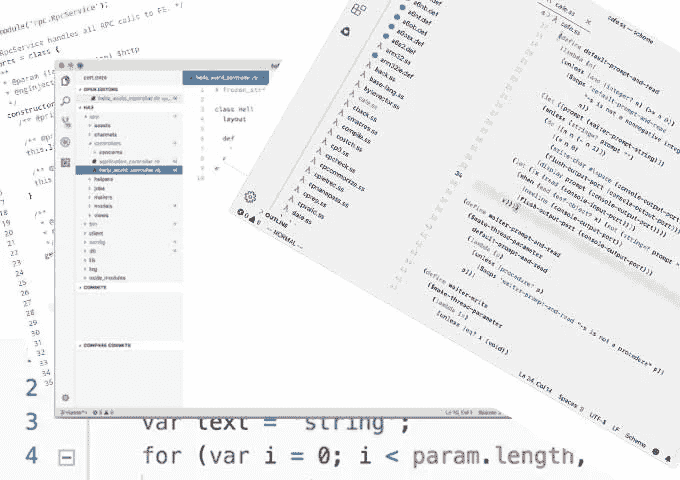

## 轻，更轻，最轻

在为 VS 代码选择主题时，您拥有的选项数量几乎是无限的。我之前写了一篇文章,回顾了 VS 代码的美好主题。然而，一位细心的读者提到，所有这些主题都是黑暗的主题。

当在白天进行编码时，通常推荐使用浅色主题。由于大多数程序员会在白天花大部分时间编码，所以一个相当轻松的主题是必不可少的。

在这篇文章中，我将为那些不喜欢用黑暗主题编码的人分享 10 个非常棒的光明主题。最棒的是，你现在就可以开始使用这些主题中的一个。让我们继续优化您的编码体验吧！

*注意，所有这些主题都可以在*[*Visual Studio market place*](https://marketplace.visualstudio.com/)*上免费获得。*

# 1.原子一光

Atom One 灯光主题是安装数量最多的灯光主题。超过 300，000 安装，这是一个流行的灯光主题。该主题基于 Atom 的 One Light 主题，是市场上评价最高的灯光主题之一。

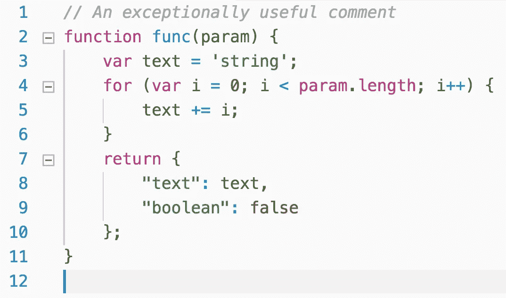

# 2.Github 灯

Github Light 主题看起来很干净，非常悦目。从名字就可以看出，它是基于 GitHub 的外观和感觉，所以看起来应该很熟悉。

这个主题有两种形式。一个纯白色背景，一个灰色背景。随着近 65K 安装，这是一个相当广泛使用的光主题。

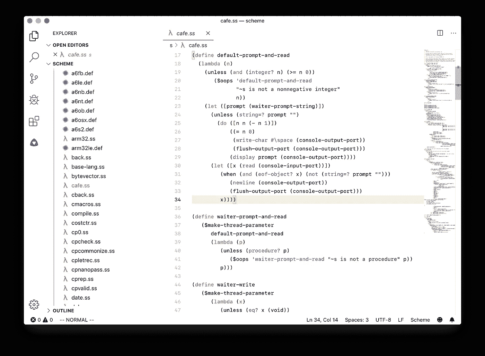

灰色背景的变化，我个人很喜欢，看起来像这样:

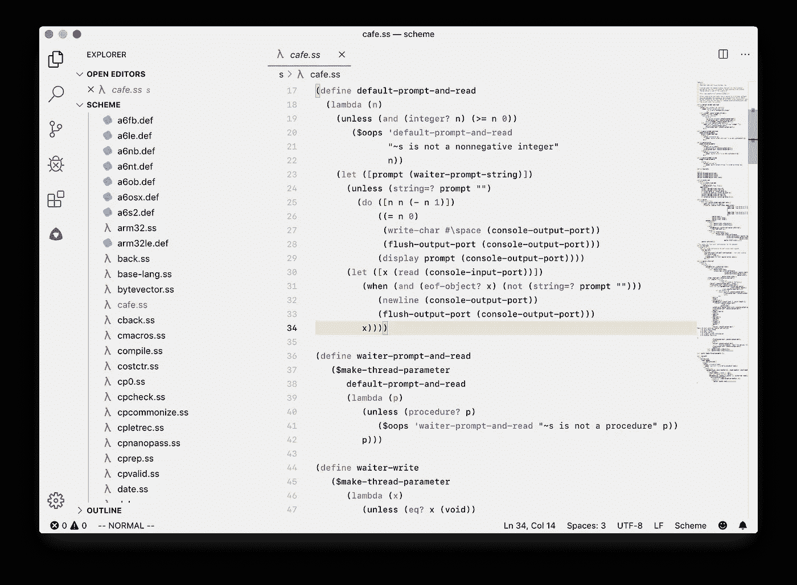

# 3.支架轻型专业版

支架轻亲是一个引人注目的主题，由于其美丽的调色板。就像 Github Light 主题一样，它有将近 65K 的下载量，这使得它成为最常安装的 Light 主题之一。

总的来说，这个主题有一个非常干净的外观，对眼睛来说很容易。

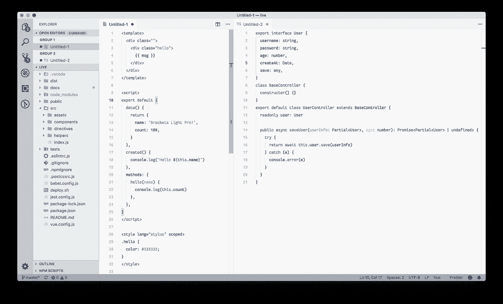

# 4.啤酒花灯

根据它的描述，Hop Light 主题是一个带有友好色彩的主题。这个主题真正好的地方是对比——明亮，但不要太亮。这个主题的巨大反差让一切都很容易读懂。

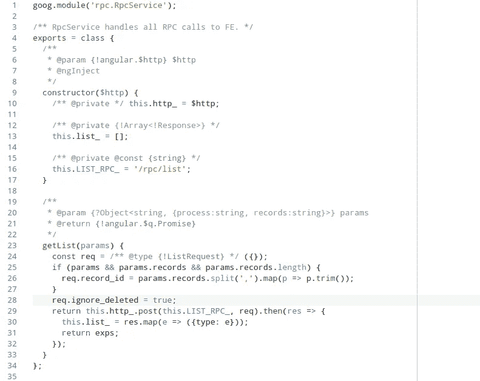

# 5.时髦的灯光

> 时髦的光是一个生动的光色主题。它的颜色基于 Sindre Sorhus 的`[hyper-snazzy](https://github.com/sindresorhus/hyper-snazzy)`，适应浅色背景。

根据作者的说法，这一主题的主要目标是在明亮的环境光条件下显示清晰而鲜明的颜色。例如，即使在必须应对强烈的阳光时，这也应该使主题适合工作。

如果你喜欢在浅色的主题中工作，时髦的光线绝对适合你。

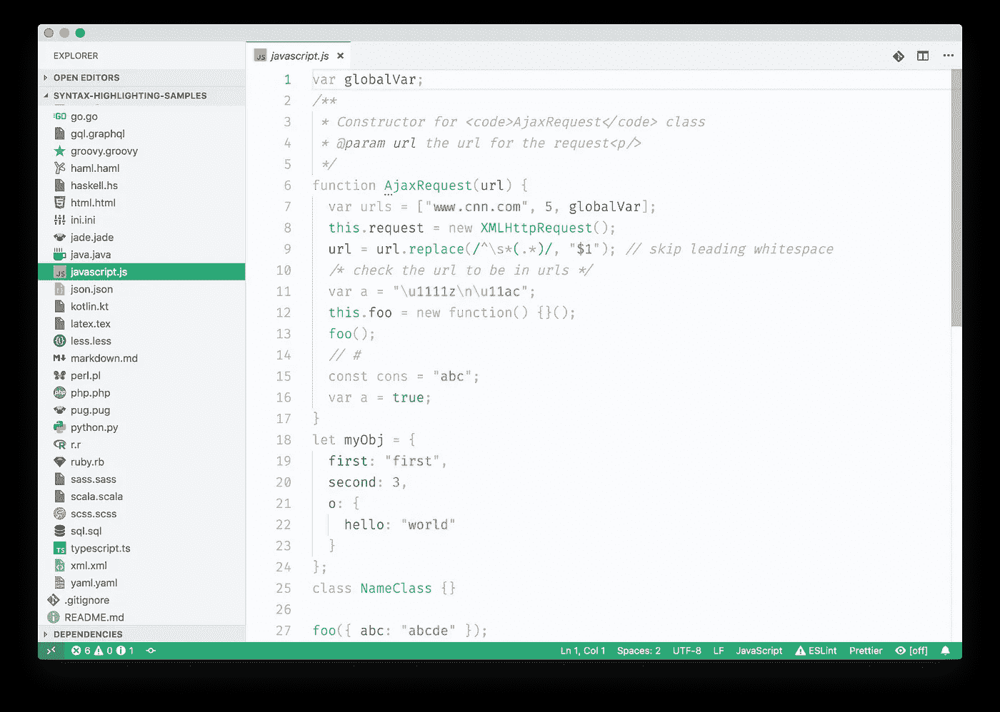

# 6.底漆灯

尽管这个主题只有 9K 多一点的安装量，但 Primer Light 是一个很棒的主题。这个主题是来自崇高文本的引子光主题的一个端口。如果你以前用过 Sublime Text，你可能会觉得这个主题很熟悉。

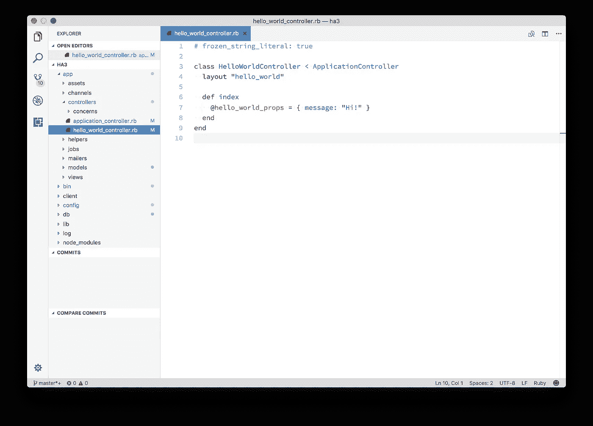

# 7.莫诺凯之光

Monokai 灯光主题因其明亮的颜色而引人注目，这是 Monokai 配色方案的特点。这是 Visual Studio Marketplace 上提供的各种黑暗 Monokai 主题的光等价物。

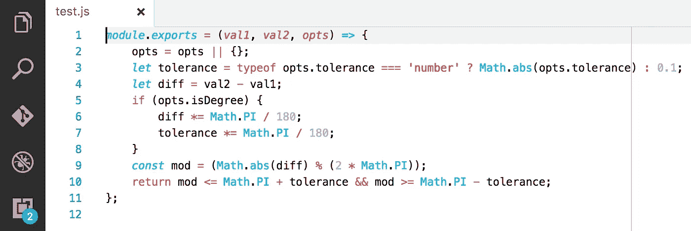

# 8.蓝色灯光

Bluloco Light 是一个奇特而复杂的主题，调色板上有各种各样的颜色。这个主题的特点是更加全面地使用了语法范围和颜色一致性，并充分考虑了美观、对比和可读性。

这个主题最初是从美丽的一个光主题分叉出来的。随着 90K 安装，这是一个更受欢迎的轻主题。

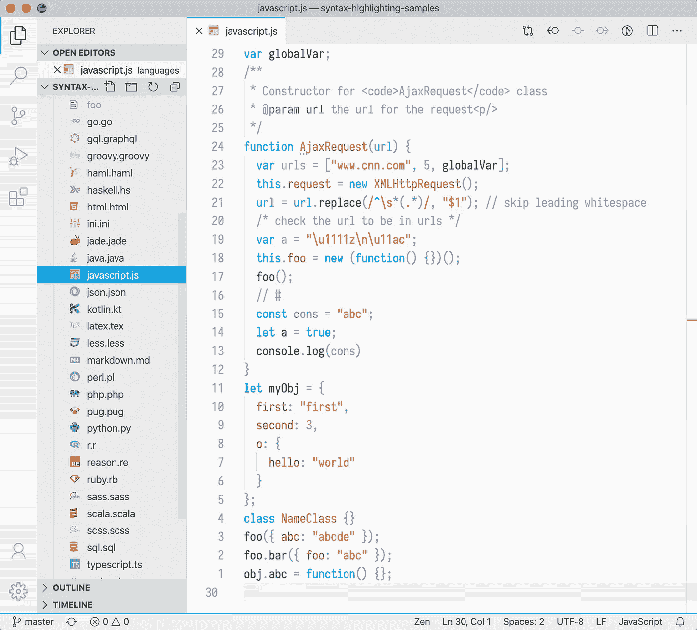

# 9.蓝色

蓝光主题是一个以蓝色为主的主题——从它的名字就可以看出来。这个主题的目标是让事情尽可能简单。例如，为了消除和避免干扰，UI 和语法颜色都只使用了少数几种颜色。最重要的是，红色只用于错误。

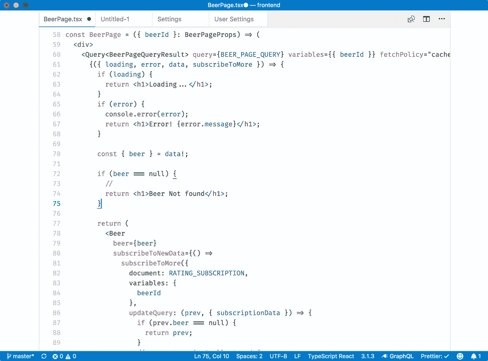

# 10.曝晒的光

日光主题有深色和浅色两种版本。这个主题的浅色版本有一个非常有特色的背景色，你要么喜欢要么讨厌。

如果你不喜欢加粗的存储标记(类型和修饰符)，那么你可以选择*日光(无加粗)*主题。这个主题去掉了所有大胆的造型。

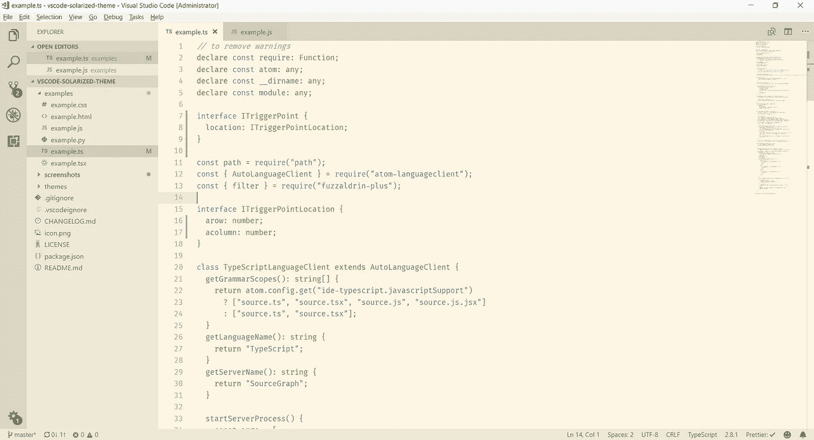