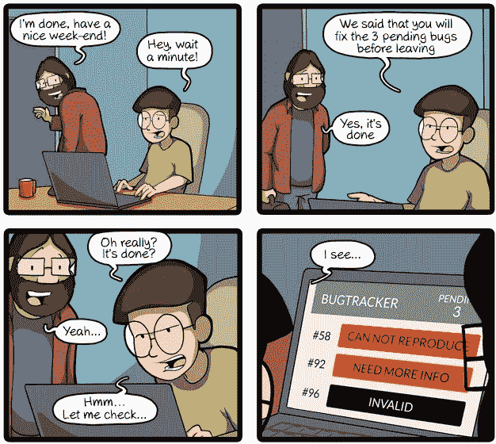
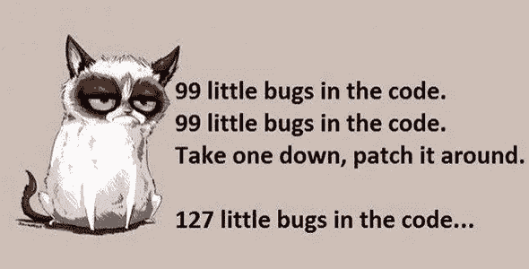
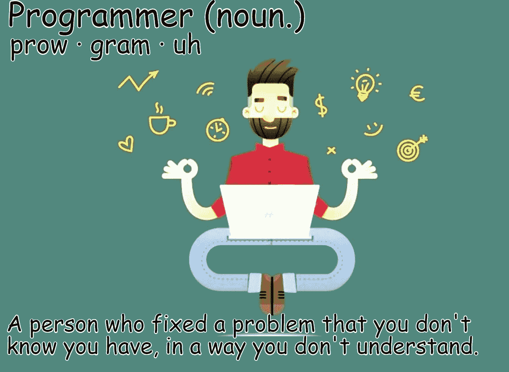
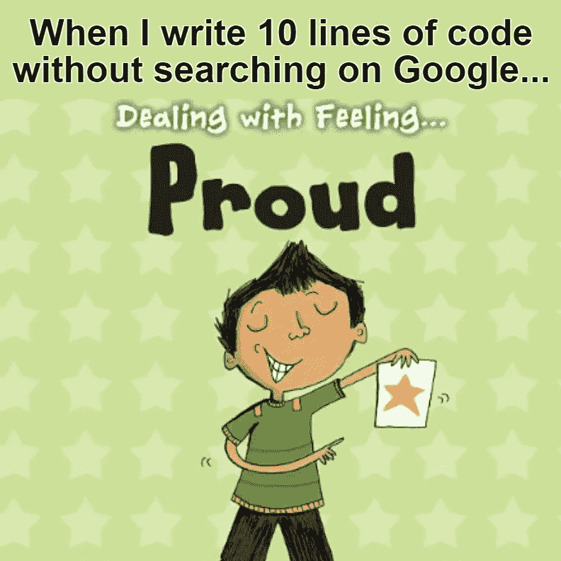
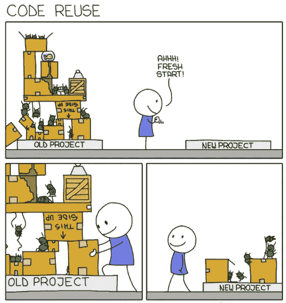
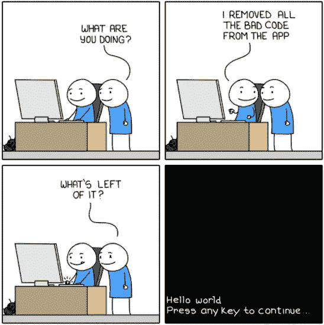
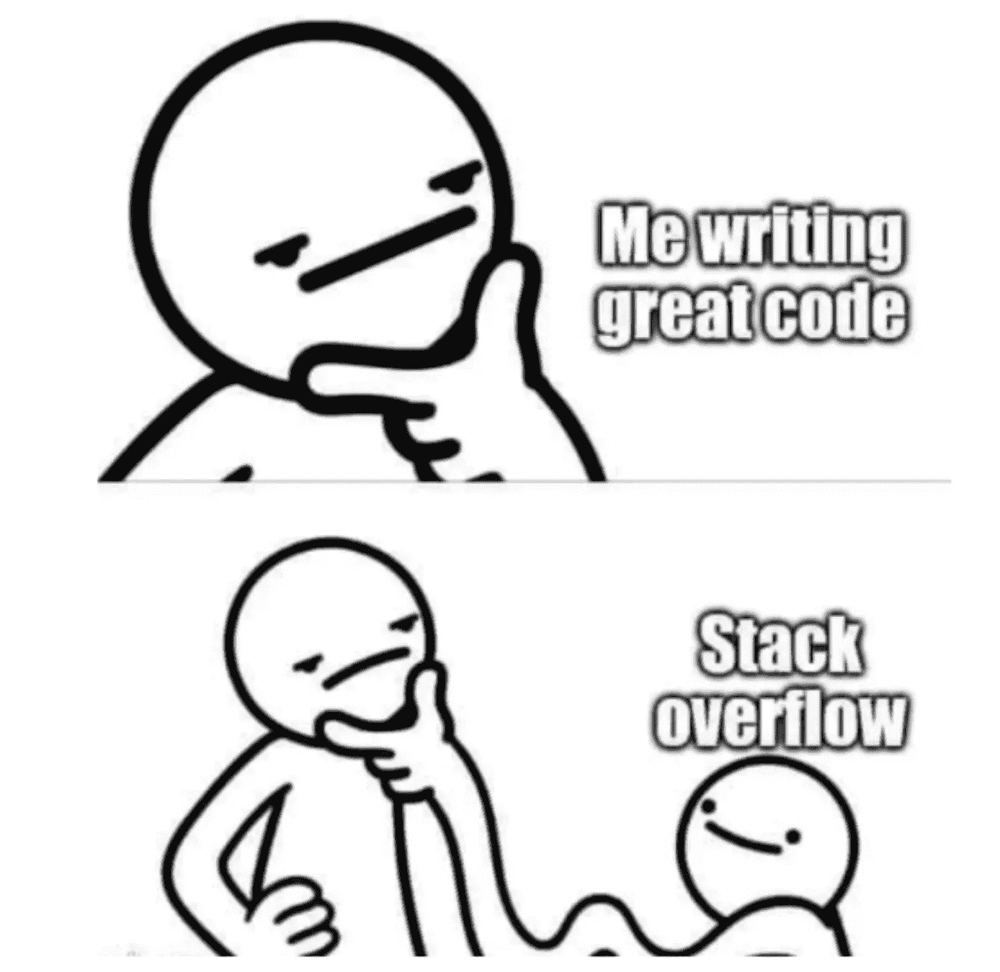

# 程序员的 10 个编程笑话

> 原文：<https://levelup.gitconnected.com/10-programming-jokes-for-programmers-b9c436f3e023>

## 幽默

## 不是程序员也不用担心。这些笑话仍然会逗得你捧腹大笑。

由作者使用 kapwing.com 创建

我们都知道程序员每天都在努力工作，让世界变得更美好。因此，在开发人员社区中开一些内部玩笑来放松心情是有意义的。

我们是天生勇敢的开发人员，他们制造 bug，传播它们，无情地杀死它们，在这个过程中，制造更多的 bug 只是为了娱乐我们。

以下是世界各地这些勇敢的程序员的真实经历中一些令人捧腹的场景。

> **注意:**如果您正在喝热饮，请在继续阅读前安全放下。

# 0.缺陷永远不会是程序员的错

让我们从一开始就弄清楚一个事实(*是的，我们从 0* 开始计数)——开发人员永远不会因为任何缺陷而受到指责。

一个缺陷，如果有效的话，总是一个需求、期望或者测试数据问题。但是，这绝不可能是代码问题。

commitstrip.com

# 1.每个程序员内心都是诗人

程序员就像上帝。我们创造缺陷，也消灭它们。我们花了一整天来修复一个缺陷，而补丁本身又产生了一些它自己的缺陷。

而且——当我们等待代码编译时，我们会写一些诗:d。

imgur.com

# 2.定义程序员

那些不需要离开办公桌就能解决凡人所有问题的神话生物。

由作者使用 kapwing.com 创建

# 3.二进制

你是哪种类型的程序员！

由作者使用 kapwing.com 创建

# 4.自豪的开发者

如果没有谷歌，我们大多数人在软件开发这个职业中活不过六个月。

因此，当我们写了十行代码而不需要从任何地方复制粘贴时，我们感觉就像徒手移动了一座山。

由作者使用 kapwing.com 创建

# 5.Java 开发人员

我可以证明这一点——我是一名 java 开发人员，而且我戴着眼镜。

由作者使用 kapwing.com 创建

是的，我一点也不擅长 C#。:P

# 6.代码可读性

我们编写如此复杂的代码，以至于几天后我们就很难理解了。

由作者使用 kapwing.com 创建

# 7.编译器是编码者最好的朋友

没有编译器，我们大多数人都不会成为程序员。*好了，现在不要再提翻译的故事了。*

不管我们有多害怕编译器，我们最好的朋友还是会确保我们在把代码转移到服务器之前清理干净。

monkeyuser.com

# 8.哦！新项目的刺激

每次有新项目的时候，我们程序员都信誓旦旦地说，这次一定会把它编码得更好。我们为不必处理旧模块中堆积的技术债务而欢欣鼓舞。

给几天时间，你会发现我们以代码重用和时间紧迫的名义从旧模块中复制代码。

monkeyuser.com

# 9.无错误代码

嗯…你认为无 bug 代码是一个神话。

这里有一个简单的方法，你可以实现它；).

monkeyuser.com

# 奖金:我们不都喜欢一点奖金吗

如何在不参考堆栈溢出的情况下完成任何面向程序员的文章？毕竟是每个开发者背后的大脑。

reddit.com

如果您还不是 Medium， [**的付费会员，您可以通过访问此链接**](https://lokajit-tikayatray.medium.com/membership) 进行注册。你可以无限制地阅读媒体上的所有报道。我会收你一部分会员费作为介绍费。

***感谢边看边笑。你可能也想阅读* :**

 [## 作为程序员，如何实现非凡的职业发展

### #1.你的职业是你的责任。

levelup.gitconnected.com](/software-developers-guide-how-to-achieve-an-extraordinary-career-growth-8b9952f3d163)  [## 如何成为一名优秀的软件开发人员

### #3 客户永远是对的——直到你证明他们是错的。

levelup.gitconnected.com](/how-to-become-an-outstanding-software-developer-8409f23716a)  [## 有毒老板在工作场所做的幽默清单

### 如果你从未面对过这些，你应该感到幸运。

levelup.gitconnected.com](/humorous-list-of-things-a-toxic-boss-does-at-workplace-21947df6a565)