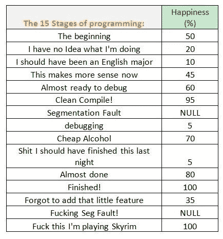

# 10 个你能理解的编程笑话。

> 原文：<https://levelup.gitconnected.com/10-programming-jokes-that-you-can-relate-to-633269508d34>

## 程序员笑话里的秘密。

在 [Unsplash](https://unsplash.com?utm_source=medium&utm_medium=referral) 上由 [Hitesh Choudhary](https://unsplash.com/@hiteshchoudhary?utm_source=medium&utm_medium=referral) 拍摄的照片

软件开发人员的秘密生活。整天坐在桌子上敲键盘。这可能会变得有点忙乱，但偶尔一点幽默会让我们振作起来。

还有什么比拥有一些相关的迷因更好的方法呢？

对于非开发者——让我给出一些见解。我们为自己的成就感到自豪，对错误和失误一笑置之。我们也很有幽默感。天生内向的人，我们借助数字幽默让彼此开心起来。

从购买第一台笔记本电脑到成为全职开发人员，这是一次学习和冒险的经历。以下将坚持我们的经验。

如果你是一个新手(学生),那么你就可以享受一下了。对于一个全职工作或自由职业者来说，这可能会变得有点**暴躁**。

(**注意:这些笑话无意冒犯任何人。我没有这些图像的权利。带有链接的演职员表提供给原始来源。)

所以不要再犹豫了，让我们开始吧:

1.  **调试的不同阶段。**

信用:wyncode.co

**2。Linux 逻辑:“Sudo 让一切工作”。**

信用:qucikmeme.com

3.**当有明显的 122 个错误，但你决定“再做一次”**

信用:Imgur

4.**学习香草 JS peeps。这会救你的命。**

信用:wyncode.co

5.**大脑洞时间。**

脸谱网

6.当你想在办公室有空闲时间时。“对我的经理来说，这不是我。”

信用:memegenerator

7.这真让我恼火。告诉我它在你该死的电脑上是怎么运行的。

谷歌

8.**向所有在斯塔克韦尔之前出生的人致敬。**

脸谱网

9.任何在编码上花了足够时间的人都能感受到这一点。

信用:memeblender.com

10.**玩 Skyrim 的发展阶段和最后的快乐。:^')**

新闻网站名

## 额外收获:额外的剂量。

这就是普通人对计算机编程的看法。这是一个谜。

新闻网站名