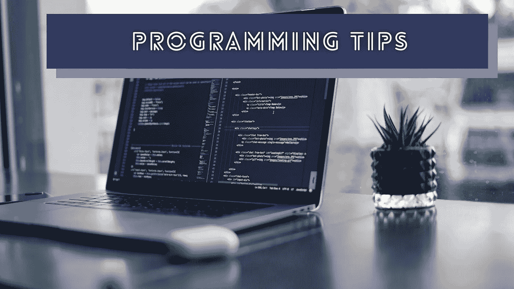
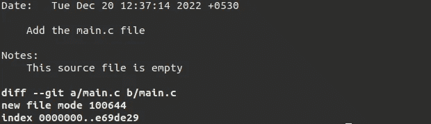

# 我在 2022 年学到的 10 个编程经验和技巧

> 原文：<https://levelup.gitconnected.com/10-programming-lessons-and-tips-that-i-learned-in-2022-6b55a7afe381>

## 检查列表，确保你认识他们！



照片由[詹姆斯·哈里逊](https://unsplash.com/@jstrippa?utm_source=unsplash&utm_medium=referral&utm_content=creditCopyText)在 [Unsplash](https://unsplash.com/photos/vpOeXr5wmR4?utm_source=unsplash&utm_medium=referral&utm_content=creditCopyText) 上拍摄，由 Canva 编辑

程序员使用各种编程语言、环境和工具。例如，一些程序员进行全栈 web 开发，并使用现代前端和后端技术。同时，一些程序员构建桌面应用、移动应用和独立服务(即[守护进程](https://en.wikipedia.org/wiki/Daemon_(computing)))。普通程序员的工作是设计、开发、测试和维护这些计算机程序。编程不是一项简单的任务——程序员经常需要研究、解决具有挑战性的问题，并创新最佳解决方案。

当程序员从事他们的日常任务或试验爱好项目时，他们经常会发现他们以前没有见过的东西。比如我在大学读书的时候，发现 GNU C 编译器标志(即`gcc -S`)可以生成预处理、汇编、目标代码输出。

在这个故事中，我将解释我在 2022 年的日常编程任务和爱好项目活动中学到的几个编程技巧和事实。

# 1.你可以使用 Go 开发本地移动应用

每个移动操作系统都为开发者提供了一个软件开发工具包(SDK)来构建应用程序。mobile SDK 允许您通过用特定语言编写的内置库来访问本机操作系统级 API。例如，我们可以使用 Java/Kotlin 通过内置的包访问 Android APIs。

现在， [Go mobile](https://github.com/golang/mobile) 项目允许你将 Go 运行时作为特定平台的原生库嵌入原生移动应用(Android 和 iOS)中，并使用 Go 编写应用逻辑。这种开发机制允许您在 web 服务和移动应用程序之间共享复杂的 Go 模块！[这个示例项目](https://github.com/codezri/flutter-gomobile)使用 Go mobile 在一个 Flutter 本地应用程序中运行 Go 代码。

# 2.内置的$随机变量

Bash 是一种流行的命令语言，我们可以用它来处理终端和编写自动化脚本。它具有许多内置的生产力功能。例如，Bash 提供了内置的`$RANDOM`变量来生成一个随机数。

您可以生成一个 0–9 范围内的随机数，如下所示:

```
echo $(($RANDOM % 10))
```

# 3.Git 笔记

我们通常使用 Git 提交消息来添加特定代码更改的简短描述。如果您需要将一些额外的细节链接到提交，而不将它们添加到提交消息中，该怎么办？例如，您可能需要为您的 DevOps 工程师添加部署说明。

内置的 Git Notes 特性允许您使用`git notes add`命令链接特定提交对象的注释。添加后，您可以看到带有`git show`和`git log`命令的注释:



git show 命令显示注释，作者截图

您可以从下面的故事中了解更多鲜为人知的 Git 特性:

[](/7-lesser-known-git-commands-and-tricks-9915e9caeb70) [## 7 个鲜为人知的 Git 命令和技巧

### 使用这些命令来处理 Git repos 并提高您的工作效率，而无需 GUI 工具

levelup.gitconnected.com](/7-lesser-known-git-commands-and-tricks-9915e9caeb70) 

# 4.每个跨平台框架都有潜在的缺点

几年前，我写了一篇[文章](https://shalithasuranga.medium.com/goodbye-native-apps-2ffcbd2773e7)，解释了现代重型跨平台应用程序如何取代高性能本地应用程序。这个故事的结论是，原生应用仍然比用现代跨平台技术构建的应用表现更好。Flutter 很好，但是它没有呈现原生的特定于平台的 GUI 元素。电子是好的，但是它经常产生沉重的二进制文件。我维护的是轻量级的 Neutralinojs 框架——它也很流行，但它不适合构建复杂的 GUI，因为它使用 webview，如 Electron、NW.js、Cordova 和 Ionic (Capacitor.js)。

因此，今年，我检查完了所有流行的跨平台框架内部结构，并了解到它们都有隐藏的缺点，永远不会成为本机应用程序开发的完美替代品。

# 5.DevOps 是每个人都必须遵守的概念

DevOps 不是只有系统管理员才能担当的角色或任务。DevOps 工程师不是一个总是作为系统管理员照看云计算机的人。DevOps 运动激励软件开发团队通过自动化来提高生产率和产品质量。DevOps 是在现代软件行业中保持竞争力的一个强制性概念。

2022 年，我为我维护的几乎所有开源项目实现了 DevOps 原则，并写了几个中型故事。这里有一个流行的:

[](/how-to-improve-your-programming-skills-by-learning-devops-73071b9ea507) [## 如何通过学习 DevOps 来提高自己的编程技能

### 成为程序员不需要 DevOps 技能，但成为程序员需要 DevOps 技能

levelup.gitconnected.com](/how-to-improve-your-programming-skills-by-learning-devops-73071b9ea507) 

查看[这篇文章](https://codezri.org/blog/how-we-save-our-time-with-devops)并了解如何将 DevOps 概念用于开源项目。

# 6.通用 macOS 二进制文件

2020 年，苹果开始为他们的 CPU 使用 ARM(高级 RISC 机器)架构，而不是英特尔 x64 CPUs。他们提供了带有 Big Sur 操作系统的 Rosetta 2 动态二进制翻译器，以便在 ARM 上运行 x64 二进制文件。对于我们的开源项目，我们生成 x64 二进制文件，并让 Rosetta 进行翻译。

但是现在，我们交叉编译了 x64 和 ARM 二进制文件，并创建了一个通用的 macOS 二进制文件。如果您想了解有关计算机架构的更多信息，请查看下面的故事:

[](/5-computer-hardware-concepts-that-every-programmer-should-know-32711c759dc0) [## 每个程序员都应该知道的 5 个计算机硬件概念

### 多亏了这些概念，你的计算机执行了你编写的程序

levelup.gitconnected.com](/5-computer-hardware-concepts-that-every-programmer-should-know-32711c759dc0) 

# 7.GNOME GUI 应用程序提供了有用的命令行开关

我们都知道提高我们日常编程效率的 Unix 命令。如果你使用 GNU/Linux，你会知道一些有用的非 Unix 命令，比如`xdg-open`，它们帮助我们完成各种自动化任务。我经常在技术写作活动中使用 GNOME 截图工具截图。我最近发现了`gnome-screenshot`的命令行开关。

我们可以使用`gnome-screenshot`通过 shell 脚本以编程方式截取屏幕截图。例如，以下命令在五秒钟后获取活动窗口的屏幕截图:

```
gnome-screenshot -w -d 5
```

类似地，大多数 GNOME 应用程序都有有用的 CLI 开关。

# 8.将任何 Python 脚本转换成 CLI 的最快方法

Python 是一种流行的通用语言。它在计算机科学的许多子领域都很流行，比如数据科学、软件工程和计算机图形学。大多数程序员使用 Python 作为 Bash 的平台无关的替代品来编写跨平台的自动化和实用程序脚本。有时，我们需要为这些脚本实现 CLI 支持。

您可以使用内置的`argparse`或手动解析`sys.argv`将您的 Python 脚本转换成 CLI。但是，您必须手动编写 CLI 实现。Python Fire 项目可以在创纪录的时间内将任何 Python 脚本变成 CLI！

[](https://github.com/google/python-fire) [## GitHub-Google/Python-Fire:Python Fire 是一个自动生成命令行的库…

### Python Fire 是用 Python 创建 CLI 的一种简单方法。[1] Python Fire 是开发和调试的有用工具…

github.com](https://github.com/google/python-fire) 

# 9.Flutter 可以呈现特定于平台的原生 UI 元素

Flutter 通过提供独立于平台的小部件工具包和高性能的 Dart-to-native 通信协议来解决跨平台开发问题。当您向 Flutter 应用程序添加文本输入时，特定的应用程序通过 Skia 库呈现 Flutter 文本输入，而不是特定于平台的文本输入元素(即`Gtk.Entry`)。

如果您需要在 Flutter 应用程序中呈现复杂的特定于平台的 GUI，该怎么办？平台视图概念提供了一种在 Flutter 窗口小部件/渲染树中添加特定于平台的 GUI 的方式(具有性能权衡)。通过以下故事了解有关平台视图的更多信息:

[](/lesser-known-ways-to-build-advanced-flutter-apps-74d2af638e2) [## 构建高级 Flutter 应用的鲜为人知的方法

### 让 Flutter 超越 Dart 生态系统

levelup.gitconnected.com](/lesser-known-ways-to-build-advanced-flutter-apps-74d2af638e2) 

# 10.我们永远不会写出完美的代码

干净的代码实践激励我们编写可维护的高质量的代码。例如，使用不言自明的标识符无疑是使我们的代码库变得更好的好做法。如果我们通过耗时的代码重构会议和高度严格的代码审查来努力使我们的源代码完美，会怎么样？

因此，功能交付速度将会变慢。此外，代码库的质量会下降，因为编写完美的代码通常会产生[过度工程化的](/how-to-write-manageable-code-without-over-engineering-24bf8d18591b)不可维护的代码。即使我们使我们的源代码看起来近乎完美，依赖关系和变通办法也可能使代码库不完美。

完美的代码无疑是假设的，只存在于开发人员的头脑中——有经验的开发人员通常会写出足够好的代码来交付。

我希望你也有自己的 2022 年小贴士和经验教训清单。2022 年你学到的最有帮助的编程事实是什么？

感谢阅读。