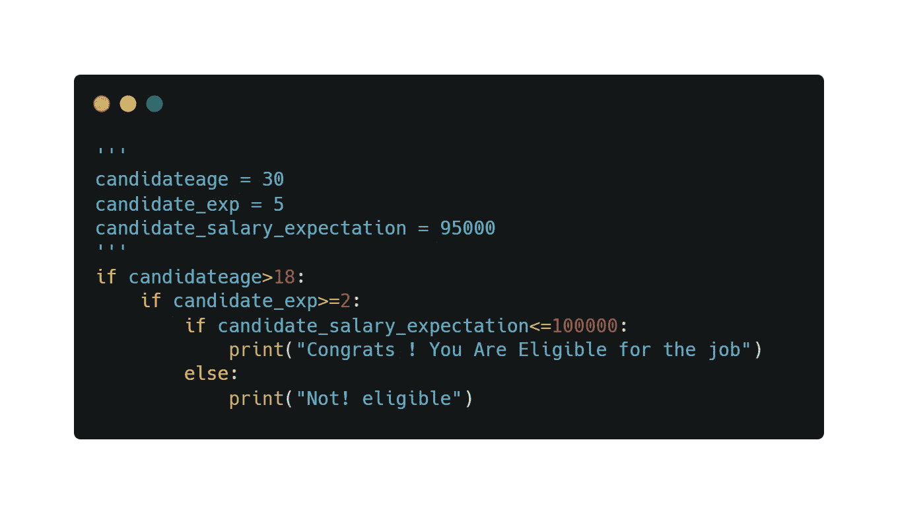
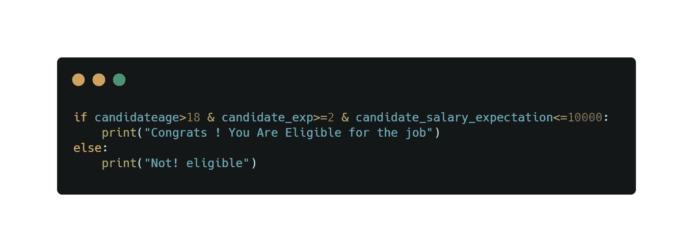
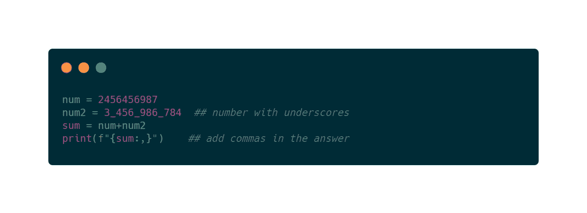
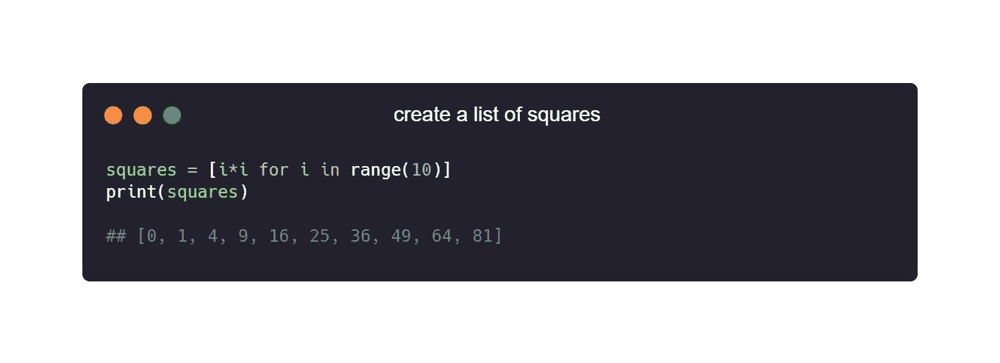
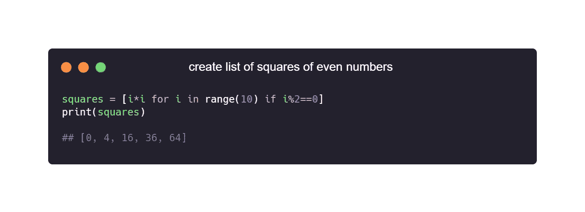
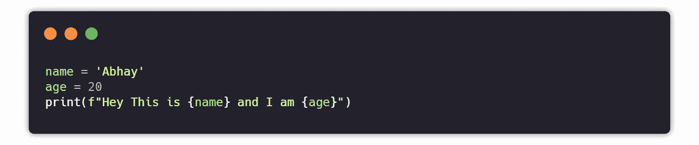
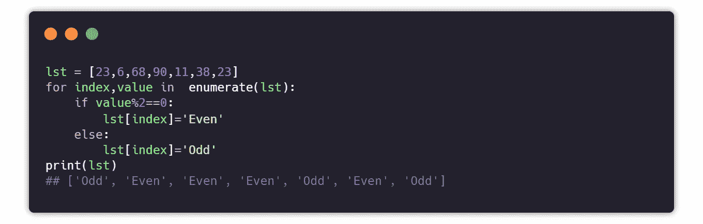
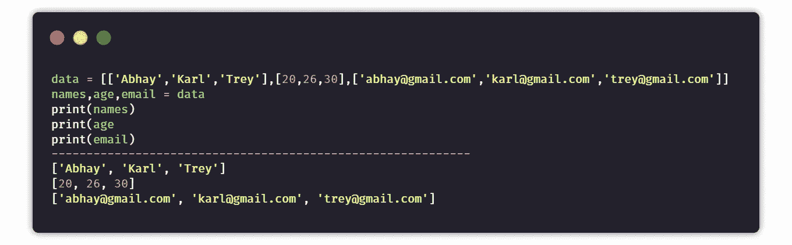
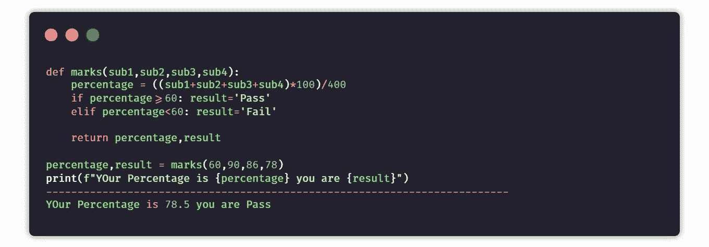
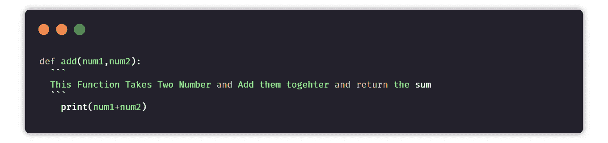

# 提高代码质量的 10 个 Python 技巧

> 原文：<https://levelup.gitconnected.com/10-python-tips-for-better-code-1bbffde3b44d>

## 你应该开始养成这种习惯


Python 学起来很简单。它以[](/25-useful-python-one-liners-that-you-should-ec613df18260)**[](/20-python-packages-that-you-must-try-a81862c913f6)****和简单的语法著称。******

******毫无疑问，python 是一种简单、流行、易于理解的语言。python 中有太多的东西使它与众不同。******

> ********“总有改进的空间”——奥斯卡·德·拉·霍亚********

******为了用 python 写出更好的代码，我们仍然有可以改进的地方。在这篇博客中，你将看到 10 个让你的 python 代码变得更好的技巧。******

# ******1.链接运算符******

******让我们设想这样一个场景，你在一家招聘机构工作，公司的人力资源部给你一个任务，要你建立一个系统，用来选择所有符合标准的候选人。现在你的工作是检索公司的所有候选人。******

******那么，你这样做的第一个想法是什么？您可以创建一个包含多个条件的程序。******

************

******上面的代码没有问题，但是我们可以使用链接操作符以更好的方式来完成它。我们可以在一个 if 语句中把所有的条件连接起来。******

************

# ******2.格式化较大的数字******

******如果我让你读下面写的数字，你能快速阅读和更快理解哪个？******

*   ******2456456987******
*   ******3,456,986,784******

******很明显，答案会是第二个，因为这个数被分解成三分之一。连小孩都知道第四块是十亿，所以数字是三十亿，四亿五千六百万，九十八万六千，七百八十四。识别号码要快得多。******

******在 python 中，可以在数字中的任何地方放置下划线，它们将被视为有效，这意味着可以在任何地方使用数字。******

************

# ******3.内嵌条件句******

******条件句是用来根据某种条件执行任务的。如果条件后面的语句只有一行，那么我们可以使用内联条件使其更加简单易读。******

******我们也可以使用内联语句来设置变量值。******

```
****condition = True
if condition: x=1
else: x=0****
```

******上面的代码可以进一步简化，使用语法`var = value if condition els other_value`写成一行代码******

******此外，您可以将内联语句合并到返回语句中，并与 lambda 函数一起使用。******

# ******4.列出理解******

******列表理解通常是一种更优雅、更有用的列表方式。他们将帮助我们写出**更好的代码。**如果只用一行代码就能创建一个列表，为什么要用 3-4 行代码呢？******

****您可以简单地使用 list comprehensions 来创建一个空列表，同时向列表中添加元素，而不是创建一个空列表，然后在列表的末尾添加每个元素。****

```
**new_list = [**expression** for **item** in **iterable** (if conditional)]**
```

******例如**:****

********

******条件句示例:******

********

# ****5.f 弦****

****F 字符串是 python3 附带的。它们非常有用并且易于使用。它们使我们的代码更加易读易懂。F-strings 提供了一种简洁而方便的方法来将 python 表达式嵌入到字符串文字中进行格式化。****

****让我们定义两个变量`name`和`age`，它们是您想要包含在`print`语句中的。****

```
**name = 'Abhay'
age = 20**
```

****现在，我们有四个选项来在打印输出语句中形成它。首先，让我们看看我们不应该使用的三个。****

1.  ****老派****

```
**print("Hey This is ",name,"and I am ",age)  ## value assignment**
```

****2.串联****

```
**print("Hey This is "+name+"and I am "+str(age)) ## concatenation**
```

****3.格式****

```
**print("Hey This is {} and I am {}".format(name,age))**
```

****现在，让我们看看使用 F 弦的最佳方式。****

********

# ****6.列举****

****如果有一天会为 python 的最佳特性创建一个列表，那么 enumerate 将是列表中最强的特性。****

****这非常类似于在 iterable 中运行一个循环，但不同之处在于，它还为您提供了获取索引以及该索引的值的优势。这是非常有用的情况下，如数据清洗，替换和排序的价值等。****

```
**for **index**,**value** in enumerate(**iterable)**: print(index,value)**
```

****让我们通过一个例子来更好地理解它，在这个例子中，我们需要用 even 替换列表中的所有偶数，用 odd 替换所有奇数。****

********

# ****7.参数解包****

****这是 python 的一个特性，很多开发者不知道如何正确使用。Python 允许大量简单的方法来解包变量。****

****让我们想一个现实生活中的使用案例。您有一个名为`data`的列表，包含不同民族的信息，如他们的姓名、年龄和电子邮件。现在你的任务是将所有的名字、年龄和电子邮件分别放在不同的列表中。****

****您可能会考虑使用一些空列表，然后在列表中追加相应的数据，或者直接赋值，但是有一个更简单的方法，只需一行代码就可以使用参数 unpacking 来完成。****

********

# ****8.从函数中返回许多值****

****许多正在阅读的人可能不知道这一点。我在创建价格比较应用程序时也遇到过这种情况，我必须从一个函数返回多个数据，如产品名称、价格和链接。在 python 中，我们可以返回任意多的值。它也被称为元组解包。****

********

# ****9.一行程序和软件包****

****python 最大的特点之一是它的[一行程序](/25-useful-python-one-liners-that-you-should-ec613df18260)和各种[包](/20-python-packages-that-you-must-try-a81862c913f6)。使用一行程序，你可以只用一行代码就完成一项任务，而不是写 5 行或 10 行代码。一句俏皮话会节省你很多时间。另一方面，我们有包裹。你们中的一些人可能会说，你应该总是编写自己的代码，但是根据我的观点，如果你可以只用一行代码或一次导入就完成一些任务，那么还有什么必要编写成千上万行代码呢？你可能不同意我的想法，但阿尔伯特·爱因斯坦也是这么说的。****

> ****"永远不要背你能查到的东西."****

# ****10.评论****

****注释对于编写更好的代码非常有用。他们帮助你和你的队友更好地理解代码。注释显示了代码的流程。评论是开发者的固定存款。要成为一名更好的开发人员并写出更好的代码，你应该养成写注释的习惯，无论你正在做什么，你的代码将要做什么。****

********

> *******感谢阅读😀，跟随***[***Me***](https://parasharabhay13.medium.com/)***获取更多*** [***此处***](https://medium.com/pythoneers)****

****[](/21-python-mini-projects-with-codes-c4126e4131e4) [## 21 个带代码的 Python 迷你项目

### 学习编程语言的最好方法是用它来构建项目

levelup.gitconnected.com](/21-python-mini-projects-with-codes-c4126e4131e4) [](/how-to-write-comments-the-right-way-8d13b24804bd) [## 如何以正确的方式写评论✔

### 遵循和提高编码水平的最佳实践

levelup.gitconnected.com](/how-to-write-comments-the-right-way-8d13b24804bd) [](/20-python-packages-that-you-must-try-a81862c913f6) [## 你必须尝试的 20 个 Python 包

### 这让你的生活更轻松

levelup.gitconnected.com](/20-python-packages-that-you-must-try-a81862c913f6) [](/25-useful-python-one-liners-that-you-should-ec613df18260) [## 您应该知道的 25 个有用的 Python 命令行程序

### 这使得 python 不朽

levelup.gitconnected.com](/25-useful-python-one-liners-that-you-should-ec613df18260)****