# 提高代码速度的 10 个 Python 技巧

> 原文：<https://levelup.gitconnected.com/10-python-tricks-for-speed-up-your-code-8c189d8c99b6>

## 让您的 Python 代码运行速度提高 10 倍的技巧


“作者提供的图像”

Python 是世界上最常用的编程语言之一。它是一种解释型高级通用编程语言。Python 有广泛的用途，你几乎可以用它做任何事情。它以其简单的语法、一行程序和包而闻名。除了 python 的诸多优点，它还有一个非常大的速度劣势。Python 代码运行缓慢。下面是一些技巧，可以让你的 python 代码速度提高 10 倍。

# 1.适当的数据结构

使用正确的数据结构对 python 脚本的运行时间有很大的影响。Python 有四种内置的数据结构:列表、元组、集合和字典。然而，大多数开发人员在所有情况下都使用列表。这样做是不对的。您应该始终根据您的任务使用数据结构。

复制代码并在您的系统上运行

运行上面的代码，你会发现一个元组执行一个简单的检索操作比列表要快。`dis`模块分解函数的字节码，这有助于看出列表和元组之间的区别。

# 2.内置函数和库

如果你正在使用 python 并且还在编写自己的函数，那么你就是在侮辱 python。Python 有大量的库和内置函数来帮助你不去写那些函数。如果你做一些研究，你会发现几乎 90%的问题已经用更少的代码解决了。你可以通过访问官方的[文档](https://docs.python.org/3/library/functions.html)来检查所有的内置功能。

现在来说说图书馆。他们数量庞大。有些很有用，有些没用。你可以在他们的[官方文件](https://docs.python.org/3/library/)上查看标准库列表，也可以查看这篇文章来了解一些新的[库](/20-python-packages-that-you-must-try-a81862c913f6)。

其中一个例子借用了 [*wiki Python*](https://wiki.python.org/moin/PythonSpeed/PerformanceTips)

避免这个

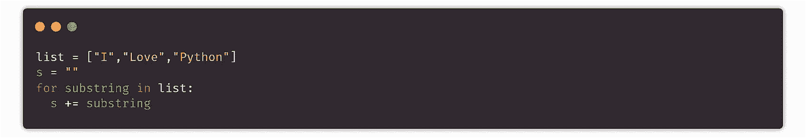

❌

使用

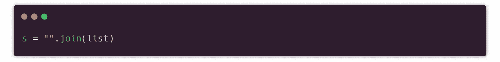

✔

在 [wiki python](https://wiki.python.org/moin/PythonSpeed/PerformanceTips) 上，你可以找到更多使用内置函数的理由。

# 3.减少 For 循环的使用

你能做的是用列表理解和递归函数代替循环。

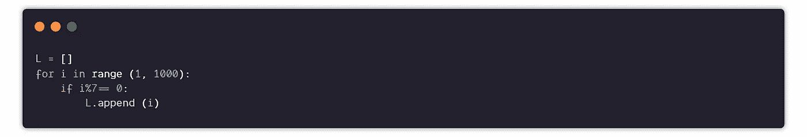

❌

相反，你可以使用列表理解

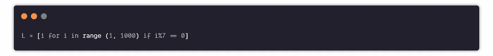

✔

# 4.减少内存占用

内存占用指的是程序运行时使用的内存量。足迹这个词指的是一个对象所占用的内存。为了让我们的 python 代码运行得更快，必须减少程序的内存使用。

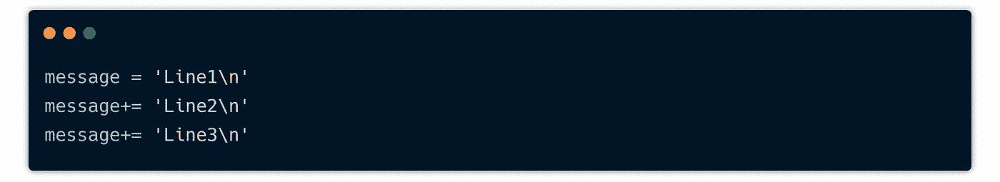

❌

代替上面的代码，你可以用更少的内存使用写一个更简单的代码。

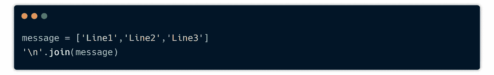

✔

类似地，您应该避免在两个字符串之间使用`+`操作符，而是使用`f-strings`

# 5.将计算移出循环

如果你有一个迭代器，你必须用它的元素做一些大的计算，比如匹配正则表达式模式。那么您应该将您的正则表达式模式放在循环之外，因为只编译一次模式比在循环的每次迭代中一次又一次地编译要好。你应该总是尽可能地在循环之外求值。您可以将函数计算分配给局部变量，然后在函数中使用它。

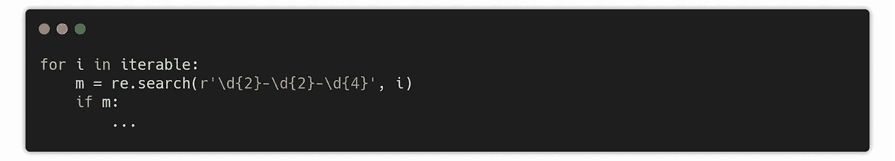

❌

除了以上所述，您可以将正则表达式放在循环之外，然后在必要时在循环内部使用它。

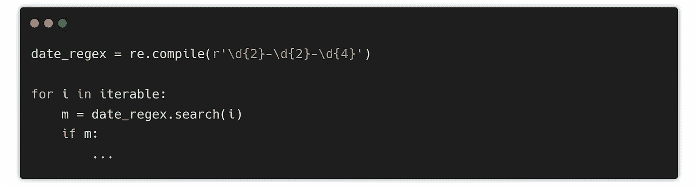

✔

# 6.全局变量❌

Python 访问局部变量的效率比全局变量高得多。除非有必要，否则应该尽量忽略声明全局变量。一个全局变量一旦在一个程序中被定义，它会一直存在直到整个程序编译完成，所以它会一直占用内存空间。另一方面，局部变量只占用内存，直到函数完成它的进程。所以使用一两个局部变量而不是全局变量总是更好的主意。

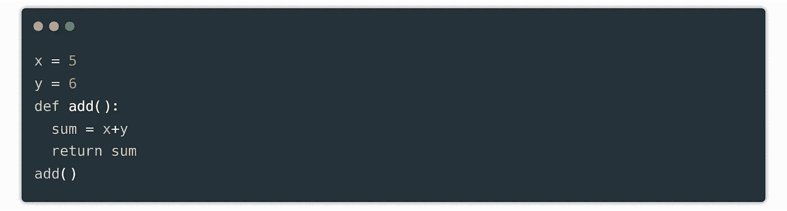

❌

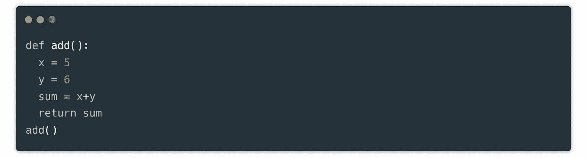

✔

# 7.使用发电机

如果你正在处理列表中的大量数据，并且你需要一次使用一个数据，那么你应该使用`generators`，因为他们会节省很多时间。让我们看一个例子:

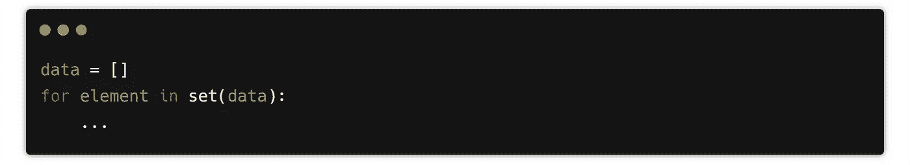

❌

上面的代码看起来很有效率，但事实并非如此。它使用一个集合来删除重复的数据，方法是将一个列表转换成一个集合，这需要花费很多时间。

# 8.避免点运算符

您应该避免使用点操作，因为`dot`操作符并不是真正的操作符，因为右边的操作数被解释为字符串，而不是表达式。同样把一个点变成一个点积运算会让阅读你代码的人感到困惑。

```
data = Vector([1,2])
v.data dot = Vector([1,2])
v.dot
```

如上面的代码所示，您无法知道用户是试图计算点积还是试图访问属性。

# 9.暴力方法😑

我们都喜欢在我们遇到的每个问题陈述中使用蛮力方法。这种方法可能会解决您的问题陈述，但也会增加程序的执行时间。

你应该总是考虑使用不同的算法，递归和动态的方法来解决你的问题。

# 10.尝试不同的方法

即使知道了所有的技巧，你的代码仍然会很慢，不可读。因此，为了避免这种情况，您应该总是尝试不同的、更有效的方法来编写代码。

而不是这个

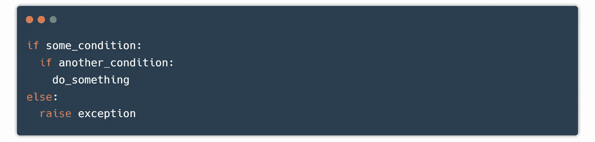

你可以试试这个

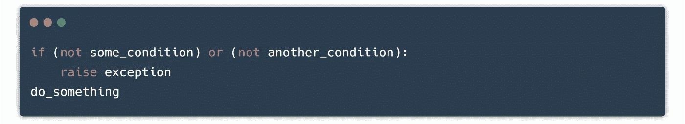