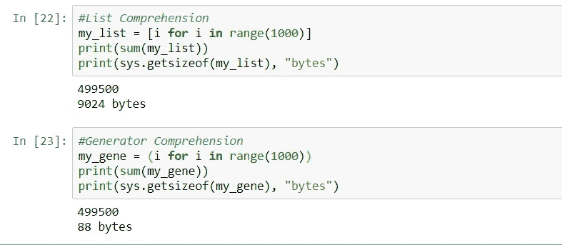
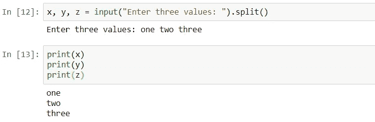
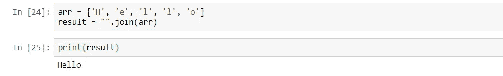
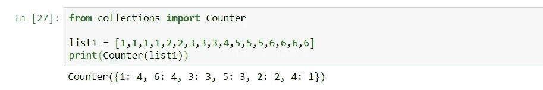
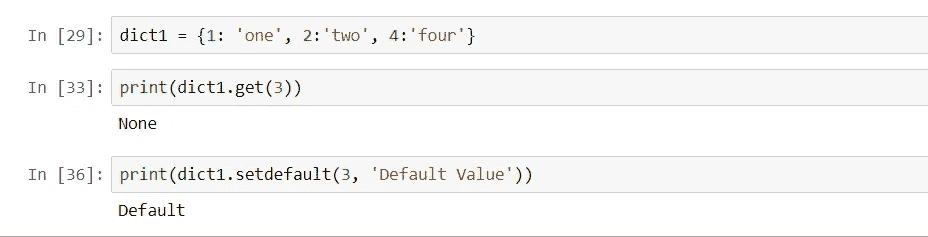
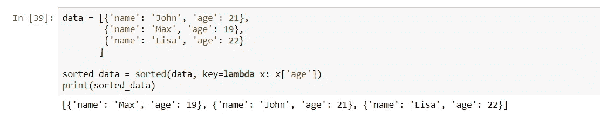
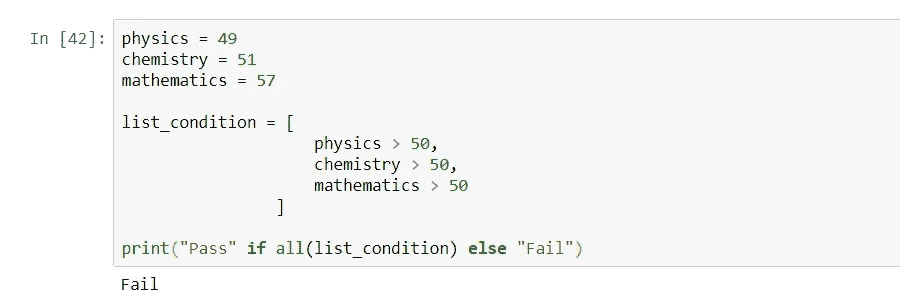
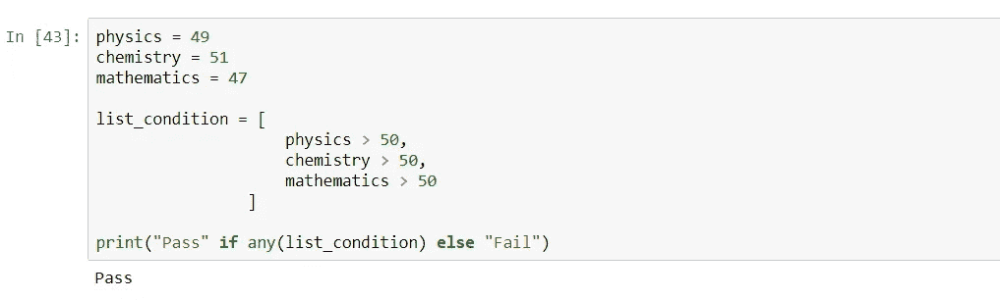
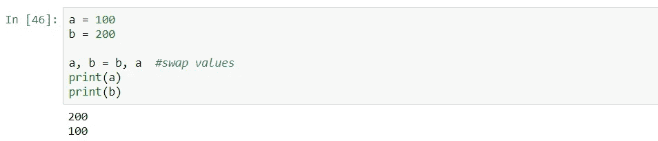
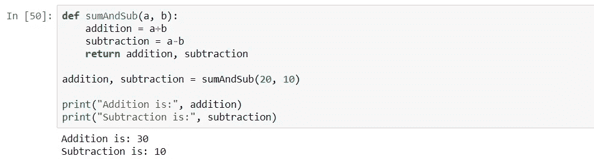

# 像专业程序员一样编程的 10 个 Python 技巧

> 原文：<https://levelup.gitconnected.com/10-python-tricks-to-code-like-a-pro-programmer-a5faaf596542>

## 你绝对应该知道的 Python 技巧


来自 [Pexels](https://www.pexels.com/photo/angry-man-is-screaming-3760044/?utm_content=attributionCopyText&utm_medium=referral&utm_source=pexels) 的 [Andrea Piacquadio](https://www.pexels.com/@olly?utm_content=attributionCopyText&utm_medium=referral&utm_source=pexels) 摄影

# 1.使用发生器节省内存

使用生成器理解，我们可以节省我们的记忆。它的工作原理与列表理解相同，但是它不是创建一个列表并将整个序列保存在内存中，而是根据需要生成下一个项目。



这里我们可以看到，与列表理解相比，生成器消耗的内存最少。

# 2.一次完成多个输入

在编写程序时，我们经常需要在一行中接受多个输入。在 python 中，我们使用`input()`方法获取输入。在这里，我们将看到如何在一行中接受多个输入:

```
x,y,z = input(“Enter values: ”).split()
```



# 3.像专业人员一样连接字符串

字符串的连接变得前所未有的简单。我们可以使用`join()`方法在 python 中连接字符串。我们需要在 join()方法中传递一个 iterable，它将 iterable 的元素连接成一个字符串。

我们还可以指定一个分隔符，通过它来连接字符串。

```
arr = ['H', 'e', 'l', 'l', 'o']
result = "".join(arr)
```



# 4.用计数器计数对象

这个`Counter()`函数在 Python 的集合模块中可用。我们可以使用这个函数来计算一个可迭代列表中每个唯一项的出现频率。这个函数将 iterable 中每个唯一项的频率保存为一个**键，值**对。

我们需要在 Counter 函数中传递一个 list iterable，它会返回每一项的频率作为输出。

```
list1 = [1,1,1,1,2,2,3,3,3,4,5,5,5,6,6,6,6]
print(Counter(list1))
```



# 5.对字典使用 get()和 setDefault()

在 Python 字典中，`get()`和`setDefault()`函数用于返回带有指定键的项目的值。

这些函数的优点是，如果具有指定键的项不存在，这些函数不会抛出错误。

```
dict1 = {1: 'one', 2:'two', 4:'four'}print(dict1.get(3))
print(dict1.setdefault(3, 'Default Value'))
```



# 6.一次性排序复杂的可重复项

Python 内置的 sorted()方法可以用来对 Python 中的任何 iterable 进行排序。这种排序方法的优点是可以很容易地对任何复杂的 iterable 进行排序。
您还可以指定排序的顺序，即升序或降序，这个方法将为您完成所有困难的工作。

```
data = [{'name': 'John', 'age': 21},
        {'name': 'Max', 'age': 19},
        {'name': 'Lisa', 'age': 22}
       ]sorted_data = sorted(data, key=lambda x: x['age'])
print(sorted_data)
```



我们传递了一个 lambda 函数作为键，按照年龄对字典进行排序。

# 7.条件列表-全部

当你的代码中需要满足很多条件时，那么你可以使用**条件列表**和 **All** 来检查所有的条件。我们可以把所有的条件都写在列表里，应用`All`来检验是否所有的条件都为真。

我们可以在列表中写出所有条件并应用所有条件，而不是使用`if`语句并写出由`and`操作符分隔的所有条件。



# 8.条件列表-任何

当我们想要检查即使许多条件中的一个为真时，我们也可以一起使用一个**条件列表**和**任何一个**。

不用使用`if`语句和用`or`操作符分隔的检查条件，我们可以把所有的条件都写在列表里，传递给`Any`。



# 9.像专业人士一样交换

交换值的一种方法是使用临时变量。在 Python 中，我们可以在一行中交换值，而不需要使用任何额外的变量。

```
a = 100
b = 200a, b = b, a  #swap values
print(a)
print(b)
```



# 10.从函数中返回多个值

下面是从函数中返回多个值的方法:



# 结论

这就是这篇文章的全部内容。在本文中，我们讨论了一些 Python 技巧，可以帮助您像“专业”程序员一样编写代码。

这些技巧也可以在竞争性编程中使用，通过利用最少的内存和提高代码速度来编写高效的 python 代码。

我希望你喜欢这篇文章。

感谢阅读！

> *在你走之前……*

如果你喜欢这篇文章，并想继续关注更多令人兴奋的文章，请考虑使用我的推荐链接[https://pralabhsaxena.medium.com/membership](https://pralabhsaxena.medium.com/membership)成为一名中级会员。

另外，你可以在这里免费订阅我的时事通讯: [Pralabh 的时事通讯](https://pralabhsaxena.medium.com/subscribe)。