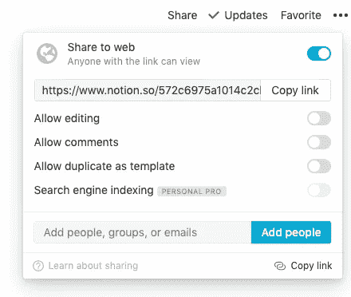
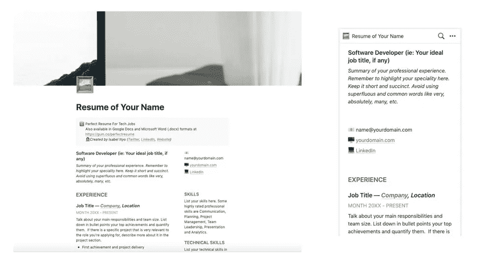
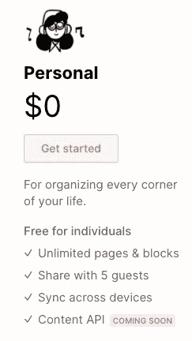
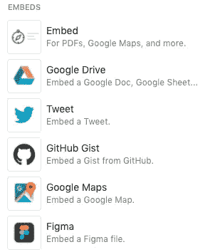
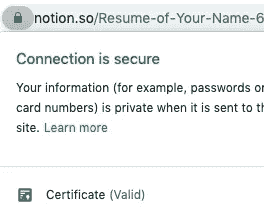
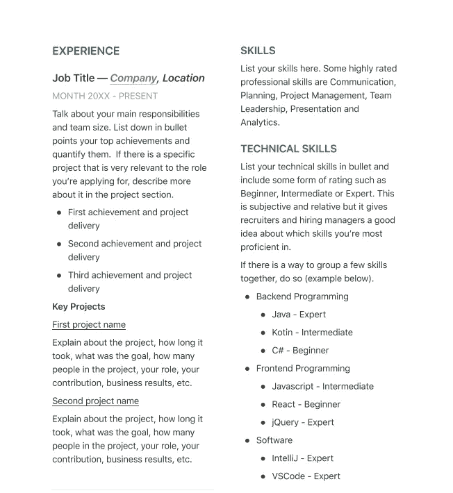
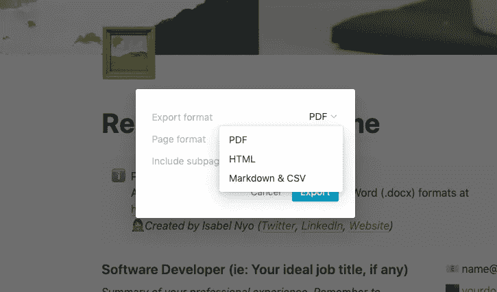
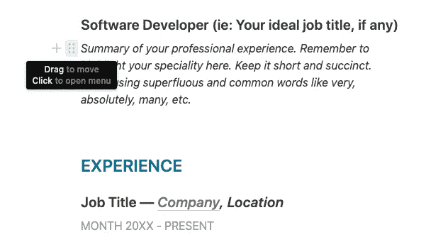
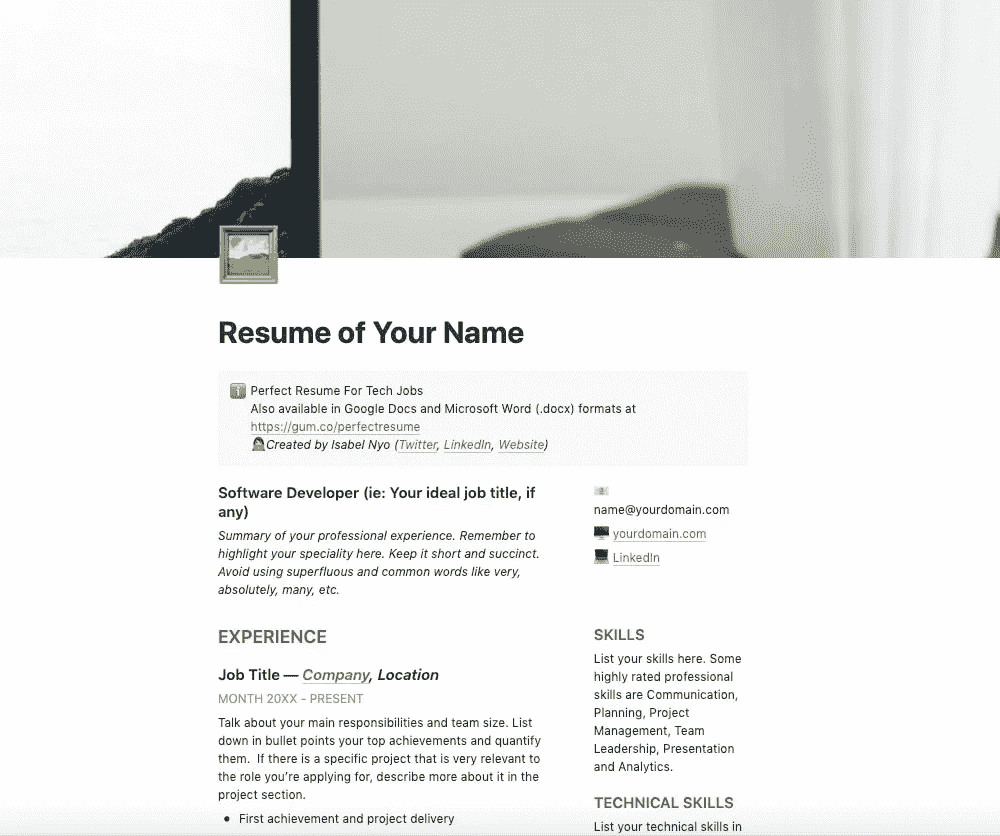

# 你应该在网上简历中使用概念的 10 个理由

> 原文：<https://levelup.gitconnected.com/10-reasons-why-you-should-use-notion-for-your-online-resume-7d07b1579e10>

## 高级共享、免费托管和响应只是其中的一部分原因。

如今，拥有一份网上简历是一种必需品，而不是一个好东西。当你有一份在线简历时，你可以随时随地使用任何设备与任何人分享。

我认识的许多人使用 LinkedIn 作为他们的在线简历，虽然它还不错，但它不符合目的。不要误解我的意思，我有一个 LinkedIn 简介,我在 LinkedIn 上非常活跃——我分享文章、想法和工作机会，并与业内其他志同道合的人互动。然而，LinkedIn 不是在线简历，它是一个专业的社交网络。

因此，别再费什么周折了，以下是你应该在网上简历中使用概念的 10 个理由。

## **1。它提供了一个高级共享**

概念共享对话框

对，没错！您可以轻松地与一群人或每个获得链接的人共享您的概念页面。

你也可以使用额外的设置来允许评论，编辑，复制等。对于您的个人简历，建议设置如下:

*   分享到网络上
*   允许编辑—关闭
*   允许评论—关闭
*   允许复制为模板—关闭

## 2.它提供了一个干净的和反应灵敏的布局

桌面和手机屏幕上的简历

无论您是在智能手机、台式电脑还是像电视屏幕这样的宽屏显示器上查看概念页面，您都可以确保它会得到响应，而无需您做任何事情。

与其他一些在线简历网站不同，你的页面上也没有广告位置。

## 3.免费的！

免费供个人使用

个人使用的想法是免费的。你不需要在你的在线简历中加入广告或文字链接来支持免费版。也没有试用期。只是永远免费。如果你问我，我会说这是一笔非常棒的交易。

## 4.它不需要观众登录

无障碍进入

当你与潜在雇主分享你的在线简历时，你希望尽可能地减少摩擦。其中一个常见的冲突是需要登录或安装一个特殊的应用程序。浏览者不需要登录或安装任何应用程序来查看共享的概念页面。

## 5.您可以轻松嵌入丰富的内容

概念嵌入对话框

无论您是想要包含表格、图像、链接卡，还是想要嵌入丰富的内容，如 Google maps、来自存储库的代码片段或 Figma 设计，您都可以轻松地做到这一点，而无需学习如何用 HTML 或 CSS 编码。内置的基本块和内嵌的概念也确保了在多种设备和屏幕上的最佳观看体验。

## 6.它使用安全协议(https 而不是 http)

连接安全

当你分享你的概念页面 URL 时，你会看到它使用 https://而不是 [http://](http://.) 虽然你可能不会通过你在概念上的在线简历询问查看者的信用卡信息，https 给了查看者更多的信心并提供了数据完整性。

## 7.它便于打印

概念简历模板的打印预览

一些在线简历在屏幕上看起来很棒，但是当它们被打印出来时，所有的格式和栏目都丢失了，使得打印出来的简历不可读。不是概念。idea 保留了打印所需的格式，这样你可以确保你的简历在纸上看起来一样好，以防招聘经理决定打印它。

## 8.它允许轻松导出到其他格式

概念导出对话框

你可以一键将你的在线简历导出为 HTML、PDF 或 Markdown 格式。

## 9.它提供简单的编辑

简历模板的编辑模式

在一个屏幕，一个页面上，提供简单和容易的在线简历编辑。与在线简历创建者不同，你不需要填写多种表格或经历刻板的步骤来编辑你的简历。一切都可以从一个地方无缝、轻松地完成，就像你在像 Microsoft Word 这样的文档编辑软件上自然地编辑文档一样。

## 10.它针对网络浏览进行了优化

概念中的简历模板

概念内置样式已经为网页浏览进行了优化，具有适当的行距、空白、字体样式和大小。概念页面也是高性能的，如果你不在页面中嵌入大的媒体，加载速度会很快。

## 用你的在线简历脱颖而出

由[艾德·罗伯森](https://unsplash.com/@eddrobertson?utm_source=medium&utm_medium=referral)在 [Unsplash](https://unsplash.com?utm_source=medium&utm_medium=referral) 上拍摄的照片

这是你应该在网上简历中使用概念的额外原因。这表明你有创造力和足智多谋。这也证明了你对技术的精通，这总是一个加分项，因为技术是当今每项业务的核心。

以下是如何通过五个简单的步骤开始:

1.  前往[概念](https://notion.so)和[注册](https://www.notion.so/signup)个人账户。
2.  一旦你进入你的工作区，创建一个新的页面或[获取我的简历模板并复制它，这样你就有了一个基础模板。](https://gumroad.com/l/perfectresume?variant=Resume%20Template%20in%20Notion)
3.  更新页面，让它成为你自己的简历。
4.  编辑完成后，点击你的观点页面右上角的分享链接，复制你简历的独特链接。
5.  与你潜在的雇主、你的关系网分享你的在线简历，去获得那份梦想的工作吧！

# 分级编码

感谢您成为我们社区的一员！ [**订阅我们的 YouTube 频道**](https://www.youtube.com/channel/UC3v9kBR_ab4UHXXdknz8Fbg?sub_confirmation=1) 或者加入 [**Skilled.dev 编码面试课程**](https://skilled.dev/) 。