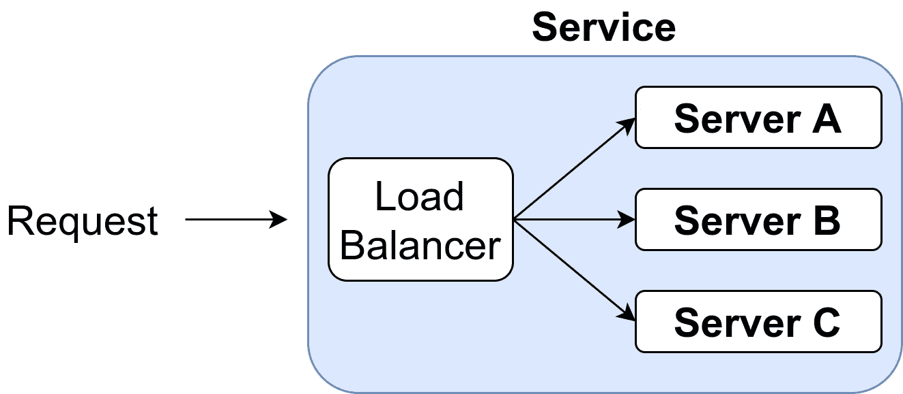

# 今天要学习的 10 个健壮性和弹性设计模式

> 原文：<https://levelup.gitconnected.com/10-robustness-and-resiliency-design-patterns-to-learn-today-c03776f73936>


由[workandpix](https://pixabay.com/users/wokandapix-614097/)在 [Pixabay](https://pixabay.com/photos/resilient-resiliency-resilience-4899283/) 上的图像

如果软件按照规定运行，它就是正确的。如果它能承受高负载直到停机，那么它就是健壮的。如果软件在中断后可以恢复正常，那么它就是有弹性的。中断可能是断电、临时网络中断、磁盘已满或暂时无法访问的 web 服务。有一些模式可以处理这些问题。学习它们，使用它们！

# 1.撤退

你可能知道:当连接中断时，你正在通勤，在智能手机上阅读你最喜欢的文章。你输入你最喜欢的博客网址——我希望是 martin-thoma.com——但是你只知道你失去了互联网连接:


截图由马丁·托马斯拍摄

如果没有连接，您的浏览器无法从互联网上获取任何信息。很明显。但是它能做什么呢？

谷歌浏览器向你展示了一个迷你游戏。它试图告诉你你可以做些什么来修复它，你可以选择和恐龙一起玩。恐龙游戏不是你想要的，而是一个巧妙的退路。

在其他情况下，回退被称为“故障保险”。火车上的[安全开关](https://en.wikipedia.org/wiki/Dead_man%27s_switch)就是一个具体的例子。火车司机必须每隔一段时间踩一次踏板，以显示他没事，而且注意力集中。如果列车驾驶员没有按下安全开关，列车将执行紧急停车。

# 2.重试

当你在玩迷你游戏的时候，浏览器仍然可以访问这个网站。也许你的连接不稳定。这意味着你偶尔会有联系。浏览器可以尝试在后台获取你需要的内容，在你想回去的时候支持你离线阅读。不理想，但一个很好的退路。比迷你游戏好多了。

为了获得这种改进的回退，浏览器必须重试访问网站。


图片来自[维基共享](https://commons.wikimedia.org/wiki/File:Screen_Shot_06-11-19_at_09.58_AM.png)

是的，这是一种模式。一个微不足道的，但却是重要的。我在发送网络请求时用过它。如果收到错误，请重试。Python `requests`库对于一些错误情况有一个内置的 [max_retries](https://docs.python-requests.org/en/latest/api/?highlight=max_retries#requests.adapters.HTTPAdapter) 参数。

在某些情况下，您需要处理不断变化的状态。现在变得棘手了。也许你真的不知道之前的请求是否失败？你能冒险执行请求两次吗？你想要的性质是**幂等** : f(x) = f(f(x))。应用该函数两次会产生与应用一次相同的结果。

举个例子，如果你有一笔类似“马丁给安娜汇了 50 欧元”的转账，那就不是幂等的。如果你有“执行交易 XYZ，如果没有执行之前”，这是。然而，现在您需要确保您有一个锁定机制，并且所有事务都有唯一的 id。

重试连接到失败的服务会带来自身的问题。你可能会让服务更难恢复正常。出于这个原因，你可能要考虑**限制指数补偿**:

```
max_sleep = 300 seconds
base_sleep = 2 seconds
sleep_time = min(max_sleep, base**attempts)
```

为了防止多个服务同时发生，您可以添加抖动:

```
max_sleep = 300 seconds
base_sleep = 2 seconds
jitter = random(0s, 5s)sleep_time = min(max_sleep, base**attempts) + jitter
```

# 3.超时和其他资源限制

在某些时候，你需要接受某些东西坏掉了。但是你什么时候这样做呢？常见的默认情况是等待来自 web 服务的响应 30 秒。那真的很长。在许多情况下，您希望更快地暂停。超时基本上意味着你接受了出错的事实。超时后，您可以重试或使用回退。

限制一个函数、进程或程序的可能执行时间在其他情况下也是有利的。谷歌代码卡突然出现在我的脑海里。这是一个公开的竞赛，开发者提交代码来完成谷歌给出的任务。这些解决方案可能会有导致无限循环的缺陷。这意味着如果谷歌执行这些解决方案，他们需要限制潜在的执行时间。

看门狗可以监控整个系统的响应性，并在系统没有响应时重新启动一切。例如，Web 服务通常有一个`/health`端点，它用一些琐碎的东西来响应，例如常量字符串`"healthy"`或当前系统时间。如果没有响应或响应时间过长，系统将被标记为“不健康”。如果太长时间不健康，Docker 容器会重新启动。

您可能想要限制的另一个资源是内存和磁盘。想想想要检查 ZIP 存档的反病毒软件。存档可能是一个 ZIP 炸弹:

[](https://infosecwriteups.com/zip-bombs-30337a1b0112) [## 拉链炸弹💣😈

### 让您的存储爆炸💥

infosecwriteups.com](https://infosecwriteups.com/zip-bombs-30337a1b0112) 

通过限制这两种资源，你可以确保自己不会受到这个问题的影响。

# 4.断路器


由 [Dmitry G](https://commons.wikimedia.org/wiki/User:Dmitry_G) 拍摄的 [Wikimedia Commons](https://commons.wikimedia.org/wiki/File:TDM_2-pole_circuit_breaker_16A.JPG) 上的双极断路器照片

如果你家一个房间的电力出了问题，比如某个部分短路或耗电过多，你希望其他所有部分都还能正常工作。

在软件的例子中，你可能会想到使用 web 服务 B 的 web 服务 A，现在 A 注意到 B 开始变得越来越慢。现在，A 可以将所有请求发送给 B，并处理潜在的超时。然而，它也可以注意到 B 有问题。a 停止向 B 发送正常请求，给 B 时间恢复。这意味着需要有一种机制来检查 B 是否再次健康。这可能只是一个健康终点。或者它可以是自动测量响应时间的节流模式。

断路器模式略微超出了抖动的上限指数回退。它跟踪来自多个来源的请求。

# 5.限速

我们已经讨论了具有指数补偿上限的重试模式和断路器模式，作为成为“好邻居”的方式，试图保护他们使用的服务。

然而，并不是每个用户都是这样的好邻居。他们可能不会故意伤害你，但是可能开发人员没有意识到他们正在使用一个会导致大量工作的端点。您可能希望能够限制 API 的使用方式——尤其是当它是公共的时候。

# 6.裁员

由于[硬件](https://www.datacenterdynamics.com/en/news/google-and-seagate-use-ai-to-predict-hard-drive-failures/)、[停电](https://www.datacenterdynamics.com/en/news/texas-power-outages-bring-austin-city-data-center-offline/)、[数据中心失火](https://www.reuters.com/article/us-france-ovh-fire-idUSKBN2B20NU)，或者由于施工造成的网络中断，服务器可能会出现故障，这只是其中的几个原因。有了冗余，系统对那些罕见的事件会更加健壮。

对于硬盘，我们有不同的 RAID 级别。对于 API，我们可以启动多个实例并进行循环负载平衡。



图片作者:马丁·托马斯

假设每台服务器都有 99.0%的可用性。这意味着它每年下降 3.65 天。如果您有一个服务器并行运行的冗余系统，如上所述，当至少有一个服务器运行时，服务仍然运行。这意味着可用性增加到 1-(1-p)^n，其中 n 是服务器的数量，p 是一台服务器的可用性。让我们看看这些数字是如何随 n 变化的:

*   n=1:服务的可用性为 99.0%。这相当于每年 3.65 天的停机时间。
*   n=2:服务 99.99%(“四个九”)可用。这相当于每年停机 52 分钟。
*   n=3:服务是 99.9999%(“六个九”)可用的。这相当于每年 31 秒的停机时间。

这是假设一台服务器停机不会损害其他服务器—这不太可能，因为负载会增加。

您还应该注意，这是针对并行运行并且可以相互替换的服务的。如果你有互相依赖的服务，这个公式就变成了 p^n:

*   n=1:服务的可用性为 99.0%。这相当于每年 3.65 天的停机时间。
*   n=2:服务的可用性为 98.01%。也就是说每年有 7.27 天的停机时间。
*   n=3:服务的可用性为 97.03%。这相当于每年 10.8 天的停机时间。

如果您不需要存储或修改状态，那么启动这样的并行机是很容易的。对于数据库来说要困难得多。

我在这里主要写的是服务器，但是你也可以想到**纠错码**在网络通信和存储的情况下也是冗余模式。

# 7.防水壁

隔板提供了故障不会传播的边界。例如，想想 YouTube。用户可以上传视频，视频会被重新编码。在单独的机器上执行该任务可以保证磁盘空间、内存使用、CPU 使用以及所用库中的潜在漏洞不会影响系统的其余部分。让软件在单独的机器上运行是沙盒的一种形式。我们可以通过这种强隔离来保证这个单一特性不会影响到其他特性。

# 8.贮藏

我对缓存又爱又恨。一方面，缓存大大降低了服务器的负载。它们也提供了一个很好的退路。另一方面，您需要处理缓存引入的不一致。也许您需要显式地使缓存无效。

[Adrian Hornsby](https://medium.com/u/a8fba86a184d?source=post_page-----c03776f73936--------------------------------) 写了一篇关于弹性缓存的好文章:

[](https://medium.com/the-cloud-architect/patterns-for-resilient-architecture-part-4-85afa66d6341) [## 弹性架构的模式——第 4 部分

### 弹性缓存

medium.com](https://medium.com/the-cloud-architect/patterns-for-resilient-architecture-part-4-85afa66d6341) 

# 9.边界验证

您希望确保服务的输入按照预期的方式构建，并且您提供了承诺的输出。你可以使用像 [pydantic](https://pypi.org/project/pydantic/) 这样的库来清楚地定义你期望作为输入的模型。检查参数很重要。如果事情不像预期的那样，你应该早点失败。如果一个外部 API 已经改变了它的响应类型，比如从浮点到字符串，你应该尽早知道。最好的情况下，你甚至可以自动转换。如果您收到一个复杂的字典，并且服务在很大程度上改变了响应的结构，拥有清晰的模型会有很大帮助。

对于外部系统，您希望清楚地将输入模型与其余部分分开。这至少应该是它自己的模块或类。如果是更大的东西，甚至可能是它自己的库或包装外部服务的内部服务。

# 10.卷回

并不总是外部世界让我们的软件失败。我们开发人员引入的编程错误也有其公平的份额。事实上，我认为没有一个重要的系统是没有错误的。有些错误是可以接受的，有些则不然。而且有些 bug 问题很大，需要尽快修复。

这就是回滚发挥作用的地方。回滚意味着跳回到稳定的系统状态。我从两个方面了解它们:一个是像 git 这样的版本控制系统，在这个系统中恢复了以前的版本。或者从系统的角度来看，例如使用 [OpenShift 容器平台](https://en.wikipedia.org/wiki/OpenShift)。每个服务都运行在 Docker 容器中。更新服务意味着添加新的图像并更改`service:latest`标签。如果服务从未正常运行，则使用最后一个已知的正常映像。

# 摘要

呈现的设计模式可以分为:

*   **检测**:得知有问题。`Timeouts`和`Checksums`都属于这一类。
*   **遏制**:确保错误不影响其他系统，限制对用户的影响。这一类的模式有`Fallback`、`Resource Limitation`、`Circuit Breaker`、`Bulkhead`、`Caching`
*   恢复:重新站起来。`Retry`和`Rollback`都属于这一类
*   **预防**:首先避免陷入困境。`Rate Limiting`、`Redundancy`、`Caching`、`Boundary Validation`这样做。

希望这对你有帮助！

# 资源

*   [saz zad his sain Khan](https://medium.com/u/936659f5f641?source=post_page-----c03776f73936--------------------------------):[区分系统健壮性、弹性、稳定性、灵活性和性能](https://medium.com/@hissain.khan/distinguishing-system-robustness-resilience-stability-flexibility-and-performance-f509e87bcc49)，2019。
*   Saurabh Hukerikar，Christian Engel Mann:“[弹性设计模式:在极端规模下弹性的结构化方法](https://www.osti.gov/servlets/purl/1407767)”