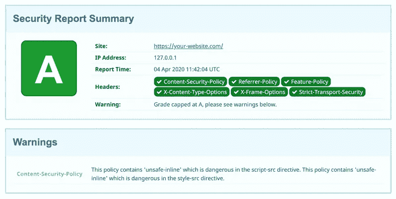

# 前端开发人员的 10 个安全提示

> 原文：<https://levelup.gitconnected.com/10-security-tips-for-frontend-developers-19e3dd9fb069>

## 确保没有东西从前门被偷


马頔·佩丘林在 [Unsplash](https://unsplash.com/?utm_source=unsplash&utm_medium=referral&utm_content=creditCopyText) 上拍摄的照片

Web 安全是一个经常被前端开发人员忽略的话题。当我们评估网站的质量时，我们通常会查看性能、搜索引擎优化友好性和可访问性等指标，而网站抵御恶意攻击的能力通常会被忽略。尽管敏感的用户数据存储在服务器端，并且后端开发人员必须采取重要措施来保护服务器，但最终，保护数据安全的责任由后端和前端共同承担。虽然敏感数据可能被安全地锁定在后端仓库中，但前端掌握着前门的钥匙，窃取它们通常是获得访问权限的最简单方法。

> *“保护用户数据安全的责任由后端和前端共同承担。”*

恶意用户可以利用多种攻击媒介来危害我们的前端应用程序，但幸运的是，我们可以通过一些正确配置的响应头并遵循良好的开发实践来大大降低此类攻击的风险。在本文中，我们将介绍 10 件简单的事情，您可以通过这些事情来提高对 web 应用程序的保护。

# 衡量结果

在我们开始改进网站安全性之前，获得一些关于我们所做更改的有效性的反馈是很重要的。虽然量化什么是“良好的开发实践”可能是困难的，但是安全头的强度可以被相当精确地测量。就像我们使用 Lighthouse 获得性能、SEO 和可访问性分数一样，我们可以使用[SecurityHeaders.com](https://securityheaders.com/)获得基于当前响应头的安全分数。对于不完美的分数，它还会给我们一些提示，告诉我们如何提高分数，从而加强安全性:



安全主管报告

SecurityHeaders 能给我们的最高分是“A+”，我们应该始终努力以此为目标。

# 关于响应标题的注释

处理响应头曾经是后端的任务，但现在我们经常将 web 应用程序部署到“无服务器”云平台，如 [Zeit](https://zeit.co/) 或 [Netlify](https://www.netlify.com/) ，配置它们以返回正确的响应头成为前端的责任。确保了解您的云主机提供商如何处理响应头，并相应地配置它们。

# 安全措施

## 1.使用强内容安全策略

合理的内容安全策略(CSP)是前端应用程序安全的基石。CSP 是浏览器中引入的一种标准，用于检测和缓解某些类型的代码注入攻击，包括跨站点脚本(XSS)和点击劫持。

强 CSP 可以禁用可能有害的内联代码执行，并限制加载外部资源的域。您可以通过将`Content-Security-Policy`头设置为分号分隔的指令列表来启用 CSP。如果您的网站不需要访问任何外部资源，头的一个好的起始值可能是这样的:

```
Content-Security-Policy: default-src 'none'; script-src 'self'; img-src 'self'; style-src 'self'; connect-src 'self';
```

在这里，我们将`script-src`、`img-src`、`style-src`和`connect-src`指令设置为 self，以指示所有脚本、图像、样式表和 fetch 调用应该分别限制在提供 HTML 文档的同一个来源。未明确提及的任何其他 CSP 指令将退回到由`default-src`指令指定的值。我们将其设置为`none`,表示默认行为是拒绝任何 URL 的连接。

然而，现在几乎没有任何 web 应用程序是自包含的，所以您可能希望调整这个头以允许您可能使用的其他受信任的域，例如谷歌字体或 AWS S3 桶的域，但是最好从最严格的策略开始，如果需要的话以后再放松。

您可以在 [MDN 网站](https://developer.mozilla.org/en-US/docs/Web/HTTP/Headers/Content-Security-Policy)上找到 CSP 指令的完整列表。

## 2.启用 XSS 保护模式

如果恶意代码确实从用户输入中注入，我们可以通过提供`"X-XSS-Protection": "1; mode=block"`头来指示浏览器阻止响应。

虽然大多数现代浏览器默认启用 XSS 保护模式，我们也可以使用内容安全策略来禁止使用内联 JavaScript，但仍然建议包括`X-XSS-Protection`头，以确保不支持 CSP 头的旧浏览器具有更好的安全性。

## 3.禁用 iframe 嵌入以防止点击劫持攻击

点击劫持是一种攻击，其中网站 A 上的用户被诱骗在网站 B 上执行一些操作。为了实现这一点，恶意用户将网站 B 嵌入到一个不可见的 iframe 中，然后将该 iframe 放在网站 A 上不知情的用户的光标下，因此当用户单击，或者更确切地说，认为他们单击了网站 A 上的元素时，他们实际上单击了网站 B 上的一些内容

我们可以通过提供禁止在框架中呈现网站的`X-Frame-Options`头来防范此类攻击:

```
"X-Frame-Options": "DENY"
```

或者，我们可以使用`frame-ancestors` CSP 指令，它可以更好地控制哪些父页面可以或不可以嵌入 iframe。

## 4.限制对浏览器功能和 API 的访问

良好的安全实践的一部分是限制对我们网站正常使用所不需要的任何内容的访问。我们已经使用 CSP 应用了这一原则来限制网站允许连接的域的数量，但它也可以应用于浏览器功能。我们可以使用`Feature-Policy` header 命令浏览器拒绝访问我们的应用程序不需要的某些特性和 API。

我们将`Feature-Policy`设置为一个由分号分隔的规则字符串，其中每个规则都是特性的名称，后跟它的策略名称。

```
"Feature-Policy": "accelerometer 'none'; ambient-light-sensor 'none'; autoplay 'none'; camera 'none'; encrypted-media 'none'; fullscreen 'self'; geolocation 'none'; gyroscope 'none'; magnetometer 'none'; microphone 'none'; midi 'none'; payment 'none'; picture-in-picture 'none'; speaker 'none'; sync-xhr 'none'; usb 'none'; vr 'none';"
```

[Smashing Magazine](https://www.smashingmagazine.com/2018/12/feature-policy/) 有一篇很棒的文章非常详细地解释了`Feature-Policy`，但是大多数时候你会想要为所有你不使用的功能设置`none`。

## 5.不要泄露推荐值

当你点击一个离开你的网站的链接时，目标网站将在`referrer`标题中收到你网站上最后一个位置的 URL。该 URL 可能包含敏感和半敏感数据(如会话令牌和用户 id)，这些数据永远不应该公开。

为了防止`referrer`值的泄露，我们将`Referrer-Policy`头设置为`no-referrer`:

```
"Referrer-Policy": "no-referrer"
```

这个值在大多数情况下应该是好的，但是如果您的应用程序逻辑在某些情况下要求您保留 referrer，请查看 Scott Helme 的这篇文章，其中他分解了所有可能的头值以及何时应用它们。

## 6.不要根据用户输入设置 innerHTML 值

恶意代码被注入网站的跨站点脚本攻击可以通过许多不同的 DOM APIs 发生，但最常用的是`innerHTML`。

永远不要根据用户未经过滤的输入来设置`innerHTML`。任何可以由用户直接操作的值——来自输入字段的文本、来自 URL 的参数或本地存储条目——都应该首先进行转义和清理。理想情况下，使用`textContent`而不是`innerHTML`来完全避免生成 HTML 输出。如果您确实需要为用户提供富文本编辑，请使用成熟的库，这些库使用白名单而不是黑名单来指定允许的 HTML 标签。

不幸的是，`innerHTML`并不是 DOM API 中唯一的弱点，易受 XSS 注入影响的代码仍然很难被检测到。这就是为什么必须有一个严格的内容安全策略，禁止内联代码执行。

将来，您可能希望关注新的[可信类型规范](https://developers.google.com/web/updates/2019/02/trusted-types)，它旨在防止所有基于 DOM 的跨站脚本攻击。

## 7.使用 UI 框架

React、Vue 和 Angular 等现代 UI 框架内置了良好的安全性，可以在很大程度上消除 XSS 攻击的风险。它们自动对 HTML 输出进行编码，减少了使用易受 XSS 影响的 DOM APIs 的需要，并对潜在的危险方法给出明确的警告性名称，如`dangerouslySetInnerHTML`。

## 8.让您的依赖关系保持最新

快速浏览一下`node_modules`文件夹会发现我们的 web 应用程序是由数百个(如果不是数千个)依赖项组成的乐高拼图。确保这些依赖项不包含任何已知的安全漏洞对于网站的整体安全性非常重要。

确保依赖项保持安全和最新的最好方法是将漏洞检查作为开发过程的一部分。要做到这一点，您可以集成像[依赖机器人](https://dependabot.com/)和 [Snyk](https://snyk.io/) 这样的工具，它们将为过时或潜在易受攻击的依赖项创建拉请求，并帮助您更快地应用修复程序。

## 9.在添加第三方服务之前请三思

像 Google Analytics、Intercom、Mixpanel 和其他上百种第三方服务可以为您的业务需求提供“一行代码”的解决方案。同时，它们会让你的网站变得更加脆弱，因为如果一个第三方服务受到损害，那么你的网站也会受到损害。

如果您决定集成第三方服务，请确保设置最强的 CSP 策略，该策略仍然允许该服务正常工作。大多数流行的服务都记录了它们需要什么样的 CSP 指令，所以一定要遵循它们的指导方针。

当使用 Google Tag Manager、Segment 或任何其他允许组织中的任何人集成更多第三方服务的工具时，应该特别小心。能够使用这个工具的人必须理解连接附加服务的安全含义，并且最好与他们的开发团队讨论这个问题。

## 10.对第三方脚本使用子资源完整性

对于您使用的所有第三方脚本，确保尽可能包含`integrity`属性。浏览器有[子资源完整性](https://developer.mozilla.org/en-US/docs/Web/Security/Subresource_Integrity)特性，可以验证你正在加载的脚本的加密散列，并确保它没有被篡改。

您的`script`标签可能是这样的:

```
<script src="https://example.com/example-framework.js"
        integrity="sha384-oqVuAfXRKap7fdgcCY5uykM6+R9GqQ8K/uxy9rx7HNQlGYl1kPzQho1wx4JwY8wC"
        crossorigin="anonymous"></script>
```

值得澄清的是，这种技术对第三方库是有用的，但对第三方服务的作用较小。大多数情况下，当您为第三方服务添加脚本时，该脚本仅用于加载另一个依赖脚本。不可能检查依赖脚本的完整性，因为它可以随时被修改，所以在这种情况下，我们必须依靠严格的内容安全策略。

# 结论

保存浏览体验是任何现代 web 应用程序的重要组成部分，用户希望确保他们的个人数据保持安全和隐私。虽然这些数据存储在后端，但是保护这些数据的责任也延伸到了客户端应用程序。

恶意用户可以利用各种各样的 UI 优先攻击，但是如果您遵循本文中给出的建议，您可以大大增加抵御这些攻击的机会。

*最初发表于*[*【https://konstantinlebedev.com】*](https://konstantinlebedev.com/security-for-frontend/)*。*