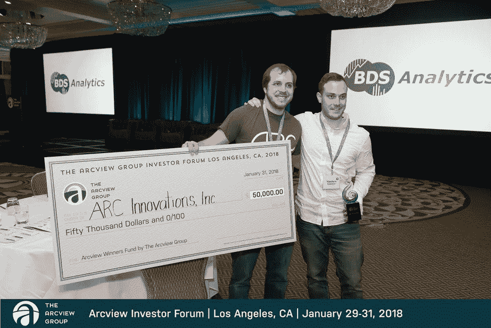

# 我是如何在一场推销比赛中赢得 5 万美元的

> 原文：<https://levelup.gitconnected.com/10-steps-to-winning-a-pitch-competition-a6e96defe6>

在过去的 6 年里，我已经为各种不同的创业公司赢得了 5 次竞标。有些只是为了好玩，有些我赢得了现金奖励。最大一笔是 2018 年 1 月的一张 5 万美元的支票。我也曾指导过其他人赢得球场比赛，以下是我实现这一目标的 10 个步骤。

1.)资料设计—**设计推介资料的最佳方式是考虑最终客户或用户**。从使用的字体到图片，一切都应该代表你的目标客户的人口统计。例如，如果你在给年轻的户外爱好者做标记，那么仔细选择人们露营或徒步旅行的图片，并使用类似于 REI 网页上的字体。你希望观众和投资者想象他们认识的人在使用你的产品。因此，不要把你作为投资者来设计，而是向你的投资者展示谁是客户。

2.)**在你的业务中，用最普通的语言从简单的一行开始**。例如，不要说“Hi im Lou 和我的公司 Arc innovations 开发创新的现代大麻消费设备”…你可以说“你好，我是楼，我的公司 ARC 生产带有内置电子打火机的大麻烟斗”。听起来越简单越好。

3.)**确保你的问题/解决方案陈述是直截了当的**，对你的听众来说非常明显，不要用个人故事浪费时间(相信我，我试过了，但没用)。保持事实和简短。例如:66%的男性经历过男性型秃发，所以我们用包月的方式让男性轻松购买头发修复产品。(我不知道这个统计数据是否正确，但我希望你明白这一点)

4.)**只解释产品的一两个关键特性**。如果需要的话，把这个部分作为它如何工作的一部分。不要在文字上浪费幻灯片的空间，把图片/截图放大。在推销比赛中，你只有很短的时间，所以要确保你说的每一句话都有影响力。你不需要一个接一个地演示你的 AI furby 如何检测生日蛋糕上的蜡烛数量。

5.)**不要浪费时间解释十亿美元的市场机会**。首先，大多数人没有正确识别目标市场，例如，如果你有一家销售健身恢复饮料的公司，说“健康和保健市场是 xx 亿”是非常不正确的。健康和保健市场有如此之多的细分市场，你不可能确定你的市场有多大。所有这些只会给你和你的投资者一些争论的理由，所以不要麻烦了。相反，在下一张幻灯片中给出市场中人/公司的实际数量，然后解释你的产品的成本。j

6.)**使用简单的经济模型** —对于实物产品，只显示这 3 个数字:商品成本、零售价格、混合利润。对于软件显示您的 SaaS 结构或您的许可费。不要讲太多细节；留着回答问题吧。

7.)**简要提及你的竞争对手的存在**并从高层次陈述你所做的与众不同之处。有时这就像说“我和竞争对手一样，但我在追求一个不同的细分市场。”此外，大多数评委讨厌你说“我们没有任何竞争对手”或“我们是唯一这样做的人”。

8.)在谈论你的团队时，**只谈论创始人或关键高管**，说一些他们过去与你公司相关的事情。此外，总是先谈论团队成员，然后谈论你自己；这是礼貌的，会让你听起来很谦卑。对包括你自己在内的每个团队成员说同样的话。它应该是快速和中肯的，并省去你的顾问。

9.)**提前练好公开演讲**。是需要磨练的技能，是最重要的部分。不要用笔记或卡片，死记硬背是必须的。说话清楚，不要急。如果你用外语演讲，或者你有口音，说得更慢。

10.重写你的脚本，让它听起来像是你在和一个朋友说话。像你每天做的那样说话，不要使用大而复杂的单词或过于雄辩的短语。让它听起来很自然，你将摧毁竞争中的任何人。一种方法是只记住每张幻灯片上的关键点，然后让普通语言填写其余部分。然而，这很难做到，一个简单的训练练习是在不使用 um/ahh 的情况下就任何随机话题说一分钟。

**在我的网站**[www.theseedpitch.com](http://www.theseedpitch.com)上可以找到赢得球场比赛所用的卡牌副本。8 月 22 日星期三下午 5 点，我将通过 Zoom 主持一次推介练习会议，订阅接收链接，并准备好 5 分钟的推介，可以带幻灯片，也可以不带幻灯片。