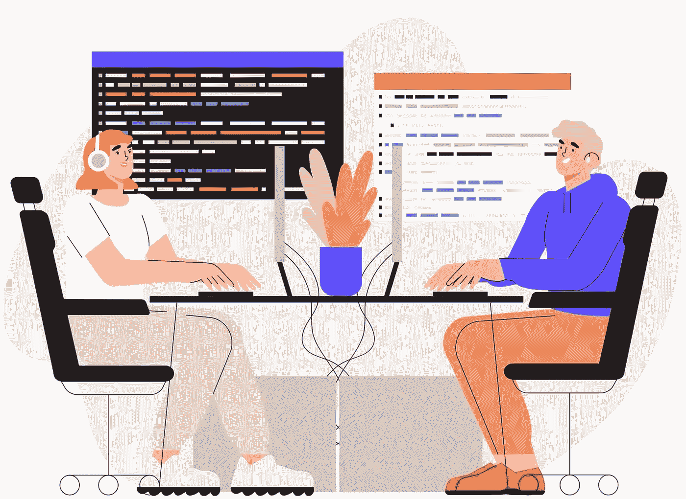

# 从编程新手转变为优秀程序员的 10 个万全之策

> 原文：<https://levelup.gitconnected.com/10-surefire-tips-to-transform-from-novice-coder-to-exceptional-programmer-c272b64b9164>

## 你能做到的

由 Canva 创建

编程是一个不断发展的领域，有许多方面。对于一个优秀的程序员来说，机会是无限的。他们可以选择工作场所，追求令人兴奋的任务，并要求高薪。

但是如果你刚开始做程序员呢？如果你还没有足够的编码技能来利用所有的职业机会，那该怎么办？

当然，成为一名优秀的程序员并不容易。但也不太难。有了正确的指导和毅力，即使你现在还是一个编程新手，你也可以成为一名出色的程序员。

# 1.从学习基础开始

> 你不能在薄弱的基础上建造伟大的建筑。如果你要有一个坚固的上层建筑，你必须有一个坚实的基础。
> 
> ——***戈登·欣克利***

编程也是如此。如果你有兴趣成为一名优秀的程序员，在你继续前进之前，开始建立你的基础。

当你这样做的时候，确保你已经完全理解了基础知识，然后再学习更高级的概念。这样，当你继续成为一名优秀的程序员时，你就有了一个坚实的基础。

许多程序员从“Hello World”开始，从互联网上复制粘贴几个程序，成功地执行它们，并认为它们已经准备好进行专业编程。然而，在现实世界的项目执行过程中，他们会严重失败，并很快失去动力。

当然，成为一名优秀的程序员需要的不仅仅是对基础知识的扎实理解。这也需要奉献精神、努力工作以及不断学习和成长的意愿。但是如果你能掌握基础知识，你就能成为一名优秀的程序员。

# 2.练习，练习，再练习

众所周知，成为一名优秀程序员的最佳方式是大量练习。但是如何练习编程呢？

首先也是最重要的，找到一门你有兴趣学习的语言，开始修修补补。不要害怕尝试和犯错。这是学习正确编码的唯一方法。你动手编程越多，你在编程方面就会做得越好。

一旦你觉得自己已经很好地掌握了基础知识，就开始做一些小项目。这不仅会给你一个检验你技能的机会，还会帮助你建立一个工作组合，你可以展示给潜在的雇主。

同时，修复尽可能多的缺陷。修复缺陷有助于您更好地理解代码。缺陷带来了新程序员经常忘记考虑的场景。您修复的缺陷越多，您就越容易自发地在实现阶段考虑边界条件。

# 3.使用代码编辑器

许多人认为使用没有任何编程支持的普通编辑器有利于练习。我对此没有把握。为什么要把时间浪费在可以使用编辑器轻松完成或避免的任务和错误上呢？

花在这些任务上的时间可以更好地用于实践或学习编程语言。你甚至可以利用节省下来的时间来学习编辑器的提示和技巧。这将使你更有生产力，并帮助你交付高质量的代码。

我相信工具的存在是有原因的。因此，没有必要在记事本上编码。当您让编辑处理琐碎的任务时，您可以专注于编写逻辑来解决业务问题。

我喜欢使用代码编辑器的调试器功能来调试和排除故障变得如此方便。你不必浪费你的脑力去记住语法或寻找哪一行漏掉了分号。

# 4.接受挑战，从错误中学习

一旦你熟悉了基础知识，并且有了一些编码经验，是时候接受更具挑战性的任务了。挑战自我是程序员学习和成长的好方法。

但是不要只是接受你遇到的任何挑战。确保这些挑战与你目前的专业水平相关，这样它们可以帮助你提高技能，而不会让你感到沮丧。

还可以参加编码比赛。一开始可能会觉得很难。您可能无法完成许多任务。但是随着你练习和参与的增多，你会获得自信。每次你都会开始做得更好。

随着你的自信和知识的增长，你会比大多数同龄人表现得更好。

# 5.抛弃熟悉的方式

任何试图学习新编程语言的人都可以证明，放弃熟悉的思维方式并从新的角度处理问题是很困难的。

然而，如果你想成为一名优秀的程序员，接受新思想是很重要的。最好的程序员是那些不断学习和拓展技能的人。通过保持开放的心态，你可以确保你作为一名程序员一直在学习和成长。

此外，通过接受新的想法，你将能够找到别人可能没有想到的问题的创造性解决方案。所以，如果你想成为最好的程序员，一定要保持开放的心态。

# 6.坚持度过困难时期

如果在短时间内看不到进展，许多软件开发人员就会失去希望。他们觉得自己无法学习编码，成为一名优秀的程序员。而且，我可以保证，在你的软件开发生涯中，你会面临很多困难。

但是，请理解，任何值得掌握的技能都是需要时间和努力去学习的。编程也不例外。

尽管一开始看起来很困难，但不要放弃。

坚持度过困难时期，你会一天天慢慢进步的。要成为一名优秀的程序员，你需要有耐心，并与你的实践保持一致。为自己设定小目标，并坚持到底，最终会取得重大成果。

所以，如果事情一开始看起来很艰难，不要气馁——只要继续努力，你最终会成功的。

# 7.提出问题并与其他程序员合作

软件开发是一个团队游戏。没有良好的协作技能，你就无法在这个行业生存或发展。无论你在编码方面有多好，你总是可以作为一个团队更好地交付。

同时，对于编程来说，没有什么愚蠢的问题。如果你不明白某件事，或者你不确定如何去做，你能做的最好的事情就是寻求帮助。

幸运的是，需要帮助的程序员并不缺乏资源。有很多论坛、聊天室和网上社区都有经验丰富的程序员，他们非常乐意分享他们的知识。通过提问，您可以利用编程社区的集体智慧，找到快速的解决方案。

与其他程序员合作也是学习新事物和获得对问题的不同观点的好方法。您还可以通过与他人合作获得对代码的反馈，并从错误中学习。

所以，当你需要帮助的时候，不要害怕寻求帮助——编程社区是一个友好的地方。

# 8.学习软件方法和最佳实践

编程不仅仅是编写代码，成功地构建代码，并将其部署到生产环境中。要成为一名优秀的程序员，你必须学会交付代码的正确方式。为此，您必须了解各种软件方法，并且能够为您的项目执行选择其中的一些方法。

有许多不同的软件方法，很难知道哪一个适合你。然而，最好的方法是阅读它们，并尝试几个，看看哪一个最适合您的编程风格并满足您的项目交付需求。

一些最流行的软件方法包括敏捷、Scrum 和看板。然后你有 BDD，TDD，结对编程等等。每一种都有它的优点和缺点，所以重要的是要不断试验，直到你找到最适合你项目需要的。

一旦你确定了方法，坚持下去，继续完善你的过程。随着时间和实践，你将能够掌握编程的艺术，并成为一名优秀的程序员。

# 9.跟上最新的技术趋势

作为一名程序员，跟上最新的技术趋势是至关重要的。这可能很难，因为新技术在不断涌现和发展。然而，你可以做一些事情来确保你总是最新的。

首先，订阅行业新闻来源、文章和时事通讯。这将有助于你了解你所在领域的新发展。

第二，参加会议和活动。这是学习新技术和与其他专业人士交流的好方法。

最后，确保通过定期练习来保持你的技能。通过遵循这些提示，你将能够保持领先，成为一名优秀的程序员。

# 10.保持积极的态度

> 积极的态度会引起积极想法、事件和结果的连锁反应。这是一种催化剂，它会产生非凡的结果。
> 
> ——***韦德·博格斯***

一个优秀的程序员最必要的特征之一是积极的态度。它意味着在遇到问题时要有耐心，在需要改变时要灵活，并且总是寻找最佳的解决方案。

这也意味着保持积极的态度，支持编程社区中的其他人。通过积极的态度，你不仅会更有效率、更快乐，而且对任何团队来说，你都是一笔财富。

所以请记住，保持积极，乐于助人，永不放弃。如果你想让你的编程技能取得非凡的成果，请始终保持积极的态度。

# 最后的想法

成为一名优秀的程序员需要时间、努力和奉献。作为一名开发人员，总是愿意学习新的东西并保持你的技能是最新的。编程的世界是不断发展的，最好的程序员是那些渴望适应的人。

记住这十条建议，你就能朝着你的目标大步前进。所以继续练习和学习，你最终会达到你作为程序员渴望达到的卓越水平。

谢谢你的阅读。如果你喜欢我的文章，[你可以通过访问这个推荐链接](https://lokajit-tikayatray.medium.com/membership)成为一个中等会员。

**您可能也想阅读:**

 [## 以下是每个程序员成为高级开发人员需要知道的事情

### 学习成为一名成功的高级软件工程师的必备技能

levelup.gitconnected.com](/heres-what-every-programmer-needs-to-know-about-becoming-a-senior-developer-9f55e6c3fd62)  [## 高度成熟的软件开发人员的 5 个标志

### 这些特征很容易识别，但很难实践

levelup.gitconnected.com](/5-signs-of-a-highly-mature-software-developer-a23285e5cf1b)  [## 这就是为什么大多数程序员没能成为高级开发人员

### 5 个习惯可以证明你还没有为下一个角色做好准备

levelup.gitconnected.com](/this-is-why-most-programmers-fail-to-become-senior-developer-143bc8c1342d)