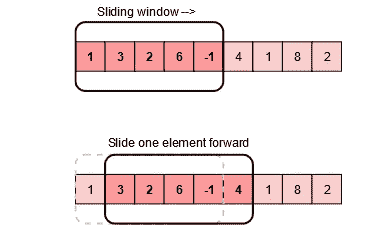
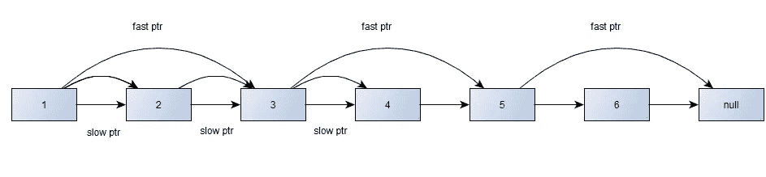
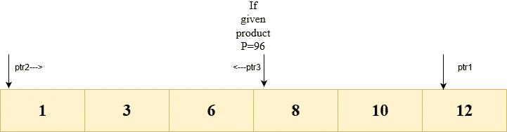
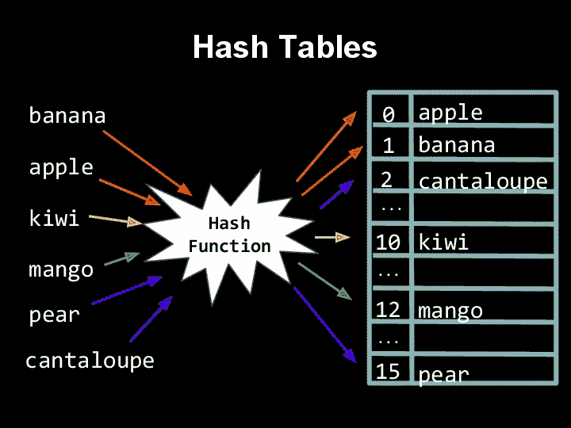
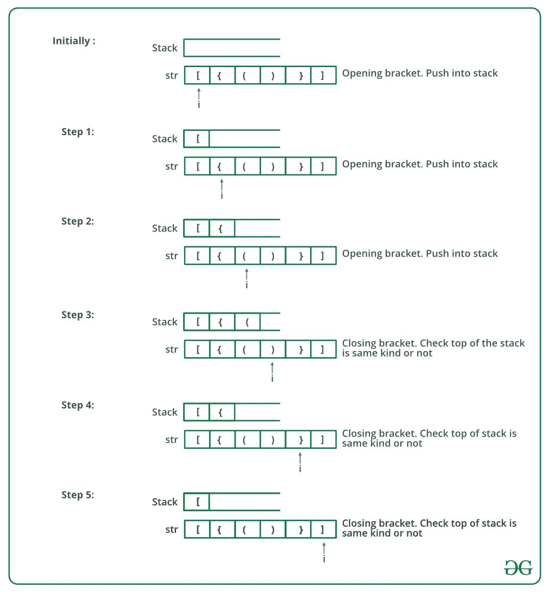
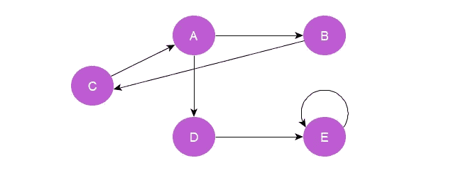
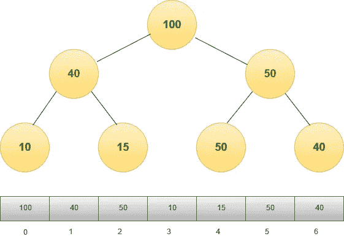
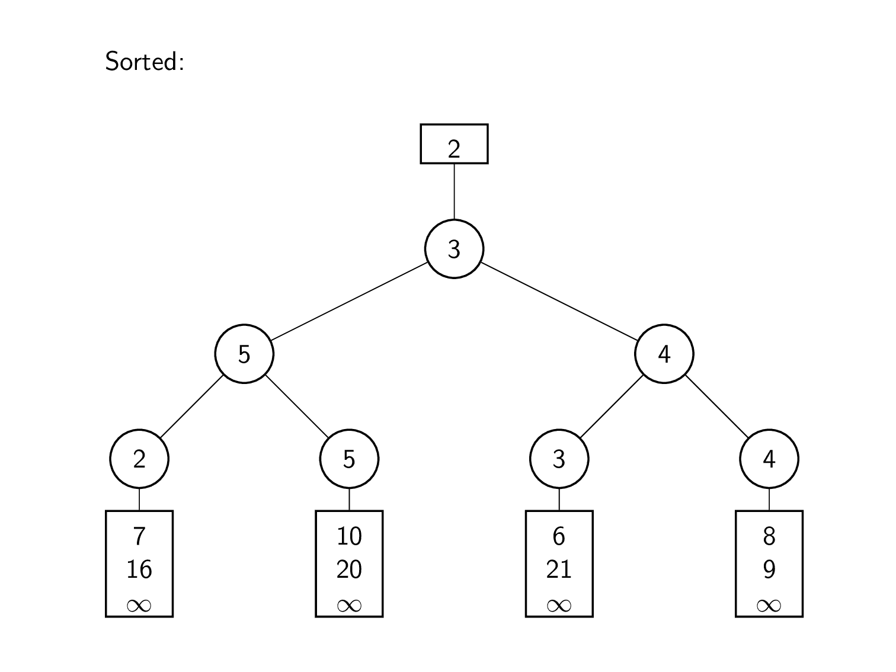

# 掌握编码面试问题的 10 个技巧

> 原文：<https://levelup.gitconnected.com/10-techniques-to-master-coding-interview-questions-b3216d3d3920>

为解决大量的安置问题而烦恼？别担心！尝试这些技术，将帮助您更快地解决大多数问题。

# 介绍

在经历了今年早些时候的技术面试后，我有了写这篇文章的灵感。在浏览不同公司的相关博客时，我发现有些公司要求在第一轮中找到斐波那契数列的第 n 个数字。

很自然地，我想知道为什么一家公司会问这样一个简单的问题？到时候大家不都行了吗？他们将如何筛选出候选人？直到我发现第 n 个斐波那契数可以用公式`F(n)={[(√5+1)/2]^n}/√5`在 O(log n) 中求解。它将复杂度从 O(n)降低到 O(log n)！我们大多数人甚至没有意识到这一点。

> 毕竟，不是谁得到正确的解决方案，而是谁得到最优的解决方案！

这只是一个简单的例子，但是花在准备解决编码问题上的时间有时会变得相当繁重。由于有大量的话题需要准备，人们经常花时间费力地研究数百个不同的问题(就像我最初做的那样)。最后，一些重要的主题被遗漏了。因此，在这种时候需要一种有组织有系统的方法！

**与其努力学习，不如聪明学习！**

为了加快这个过程，我创建了这个教程。我在这里巩固了一些技巧(是的，在淘了几百个问题之后，感叹！).它们可用于在更短的时间内以更好的性能解决安置期间的一些常见问题。

你彻底理解这些方法了吗？那么，你肯定是在坚实的基础上，几乎可以走了！

> 虽然我无法在这篇博客中涵盖所有内容，但对于那些正在经历面试的人，我强烈建议你参考这些书籍——破解编码面试([此处](https://www.pdfdrive.com/cracking-the-coding-interview-d52072841.html))、探索编码面试([此处](https://www.educative.io/collection/5668639101419520/5671464854355968))、Narsimha Karumanchi 的《数据结构和算法变得简单》(此处[此处](https://www.docdroid.net/ZPfHmS5/data-structures-and-algorithms-narasimha-karumanchi.pdf))。当然还有一个我在准备时发现非常有用的网站， [GeeksForGeeks](https://www.geeksforgeeks.org/company-interview-corner/) 。

# 1.推拉窗

滑动窗口是一种非常流行的技术，用于在通常大小固定的子数组或子串上执行操作。
**将时间复杂度降低到 O(n)** 。

图片来源:搜索编码面试

## 推拉窗的常见问题:

**(i) Kadane 的算法:**
大小为`k`的最大和子阵列或要移除的最小元素数，使得剩余元素的和等于`k` —
该循环迭代`(n-k)`次。首先计算从索引 0 到`kth`元素的元素之和，并存储在一个变量中(`sum`)。每次窗口滑动 1 个元素，减去现有窗口的第一个元素，并在新窗口中添加`(k+1)th`元素。

**(ii)** 尺寸为 k 的最小乘积子阵列

**(ii)** 具有 k 个不同字符的最长子串

**(iii)** 作为另一个字符串的任何子字符串的变位词的子字符串的数目

> 注意:窗口的大小可能是固定的，也可能不是固定的。我们可以根据问题的要求修改窗口大小。

# **2。慢速指针和快速指针(弗洛伊德循环寻找算法):**

一个非常喜欢在面试中被问到的问题！这种技术主要用于与链表相关的问题。它使用两个指针，一个慢速指针和一个快速指针。每当慢速指针移动一个节点，快速指针就移动两个节点。
**它把时间复杂度降低了一半。**

## 使用快速和慢速指针的常见问题:

**(i)** 检查链表是否为回文:使用快指针和慢指针遍历链表。直到快速指针到达链表的末尾，将慢速指针访问的每个元素推入堆栈。慢速指针现在将到达中间元素，并且堆栈将具有从第一个到中间的逆序的所有元素

**(ii)** 检测链表中的循环:如果快速指针在任意一点变得与慢速指针相等，则链表中存在循环

**(iii)** 在链表中寻找中间节点:当快指针到达链表的末尾时，慢指针将已经到达中间节点。

**(iv)** 寻找一个快乐的数字:如果一个数字在一系列步骤之后导致 1，其中每个步骤的数字被其数字的平方和代替，则该数字被称为“快乐”。

# 3.在中间相遇

“折中”是一种技术，它将一个问题分成大小相等的两个部分，解决它们，然后将两个部分的相应结果合并在一起，得到一个整体最优解。当两个解决方案的合并是一个**聚合函数**，如 **count，sum，max** 时，可以执行该操作。它可以用于线性数据结构。

## 雇主的常见问题是折中的:

**(i)** 寻找给定乘积的所有三元组:使用三个指针。对于每次迭代，指针 1 保持固定在 n(其中 n =初始大小-1)。指针 2 位于第 0 个位置，指针 3 位于(大小为 2)的位置。这将检查 ptr2 和 ptr3 处的元素是否给出 ptr1 处的相应元素作为结果。ptr1 每次递减 1，直到找到三元组。这又需要 O(n)。使用散列法可以将其降低到 O(n)。

用给定的乘积寻找三元组

**(二)**寻找毕达哥拉斯的三胞胎

**(iii)** 从一个数组中找出两个数相加得到一个给定的和 s。这需要 O(n)。

**(iv)** 在不重新排列的情况下，构成字符串回文的最小追加数

# 4.散列法

这是降低时间复杂度的另一个极其重要的技巧！但是请记住，它会导致额外空间的使用。哈希表用于将键与值相关联。它用于快速存储和检索信息。

**时间复杂度:**虽然**哈希算法最坏情况下的时间复杂度是 O(n)，但它平均给出 O(1)。**

散列函数计算值的索引后，值被映射到桶中

## 哈希下的常见问题:

**(i)** 从数组中寻找重复和缺失的元素:使用大小为 256 的整数数组(`arr[256]`)。对数组进行迭代，对于每个元素，将对应于元素的 ASCII 值的数组索引处的值增加 1 ( `arr[ASCII value of element]+=1`)。遍历新数组，当值大于 1 时，该 ASCII 值处的元素将重复，当值为 0 时，对应于该 ASCII 值的元素将丢失。

从一个 a 字符串中删除重复项

**(iii)** 检查链表中的循环

**(iv)** 从一个字符串中删除存在于另一个字符串中的字符

**(v)** 从一个和为 s 的数组中找出所有的对，这需要 O(n)的时间复杂度。

# **5。堆栈和队列**

这是我们大多数人都非常熟悉的东西。为了唤起你的记忆，栈是一种遵循 **LIFO(后进先出)**原则的数据结构，最后进入的元素最先出来。另一方面，队列是一种遵循 **FIFO(先进先出)**原则的数据结构。使用堆栈和队列的概念可以解决许多问题。

## **堆栈和队列常见问题:**

使用堆栈实现队列

**(ii)** 使用临时堆栈对堆栈进行排序

**(iii)** 中缀、前缀和后缀形式之间的转换

**(iv)** 检查表达式中的平衡括号

图片来源:GeeksforGeeks

**(v)** 股票跨度问题

**(六)**名人问题

**(vii)** LRU 缓存使用队列实现

**(viii)** 使用优先级队列找到 3 个元素的最大值

# 6。广度优先搜索(BFS)或层次顺序遍历(树):

使用层次顺序遍历可以解决树的许多问题。是的，这是面试中另一个最受欢迎的问题！

树的层次顺序遍历只不过是树的广度优先遍历。它从根节点开始逐层遍历树的所有节点。图形的 BFS 也以类似的方式工作。只有在这里，第(n+1)层的顶点是第 n 层节点的所有相邻的**未访问的**邻居。

**对上图的 BFS 遍历:A B D C E**

一般来说，队列用于存储图形和树的顶点。你可以用这种方法来解决所有那些需要一个接一个处理级别的问题。

**时间复杂度** — O(n)其中 n 是树中节点的数量。

## **树的层次顺序遍历常见问题:**

**(i)** 之字形层次顺序遍历一个 BST。需要 O(n)额外空间。

**(ii)** 寻找二叉树的深度/寻找距离为 k 的所有节点

**(iii)** 寻找二叉树中节点的有序后继

**(iv)** 求 BT 中每个级别的平均值

用于查找二叉树中每一层的平均值的函数

**(v)** 连接所有级别顺序的同级。时间复杂度是 O(n ),其中 n 是节点的数量。

## **图的层次顺序遍历常见问题:**

**(vi)** 无向图中的圈检测:如果所有顶点都是可达的，则该图是连通的。如果任何节点保持标记为未访问，那么它是不可访问的。

**(vii)** 单词阶梯:从给定单词开始，遍历其所有邻居(相差 1 个字符的单词)。重复这一过程，直到找到目标单词或遍历完所有单词。

**(viii)** 腐烂一格中所有橙子所用的时间

**(ix)** 迷宫中到达目的地的方法有多少种

**时间复杂度** — O(V+E)其中 V 是图中顶点的个数，E 是图中边的个数。

## **问:检查一个图是否是树:**

无向图是树如果—
(i)没有圈— O(V+E)
(ii)图是连通的—O(V)
总时间复杂度— O(V+E)
由于图是无向图，所以可以用 BFS，也可以用 DFS。

# **7。深度优先搜索(DFS)**

它用于遍历树和图。该算法从根节点开始(在图的情况下选择一些任意节点作为根节点),并在回溯之前沿着每个分支尽可能远地探索。
—维基百科

**上图的 DFS 遍历:A B C D E**

## DFS 下的常见问题有:

**(i)** 检测图形中的周期

**(二)**迷宫中到达目的地的方法有多少种

**(iii)** 寻找图的强连通分量— O(V+E)

**(iv)** 寻找从给定节点可到达的所有节点

检查一个图是否是二分的

# 8。二进制堆

这是一个完整的树，其中每个父节点的值要么更大(对于 MaxHeap)要么更小(对于 MinHeap ),并且该属性对所有节点都成立。

**为什么使用堆来解决问题？时间的复杂性！**
获得最小或最大元素需要 O(1)，与 O(n)相比，这是一个显著的减少。堆排序的时间复杂度为 O(n log n)。像提取最小元素、插入或删除键这样的操作需要 O(log n)。

**最大堆**

> 注意:
> 堆不遵循二叉查找树的规则。在堆中，左兄弟可能比右兄弟小，也可能不比右兄弟小。

## 使用堆的常见问题有:

**(i)** 实现优先级队列(也可用于使用二项式堆执行更快的联合操作)

**(ii)** 查找数组中第 k 个最大或最小的元素

**(iii)** 对一个几乎排序好的数组进行排序

**(iv)** 合并 k 个排序后的数组

# **9。二分搜索法**

这是一种我们都非常熟悉的技术。但是不应该掉以轻心，因为对于大多数被问到的问题，你将不得不稍微修改一下传统的二分搜索法。所以，如果你在面试前先试着回答几个关于改良二分搜索法的问题会更好。

简单概括一下，二分搜索法通过将一个元素分成两半来寻找一个排序数组中的元素。如果键大于中间的元素，值可能在数组的右半部分，否则可能在左半部分。

**时间复杂度:**在最坏的情况下，给出了 O(log n)的时间复杂度。

二进位检索

对二分搜索法稍加修改就能帮助解决许多问题。

## 二分搜索法面临的常见问题:

**(i)** 在排序旋转后的数组中查找元素

**(ii)** 大于/小于给定数字的最小元素的索引

**(iii)** 寻找矩阵中具有最大和最小数量的零的行

**(iv)** 数组中第 k 个最小的元素使用常数空间

**(v)** 将一个数组拆分成 K 个子数组，使得所有子数组的最大和最小

# **10。合并 k 个数组**

这包括从所有 k 个数组中找到最小元素。可以使用堆来找到最小元素，如在第 8 点中已经讨论过的，或者通过使用锦标赛树或展曲树来找到最小元素，所有这些都在 **O(log k)** 中。然后，最小元素被下一个最小元素重复替换。

**时间复杂度:**得到的运行时间为 **O(n log k)。**

来源:谷歌 k-way 合并图片

## k 路合并下的常见问题有:

**(i)** 合并 k 个大小相同的排序数组:将所有子数组的第一个元素插入一个 min 堆中。将堆的最小元素放入另一个数组。然后用数组中的下一个元素替换堆的根。重复这(nk)次。

**(ii)** 合并 k 个不同大小的排序数组

**(iii)** 寻找相邻子阵列的中间值

> 仅此而已！感谢您一路阅读！请留下您的反馈。如果你喜欢这个博客，请留下一些掌声👏太。
> 
> 你可以在—
> LinkedIn:[https://www.linkedin.com/in/spreehadutta/](https://www.linkedin.com/in/spreehadutta/)
> Twitter:[https://twitter.com/DuttaSpreeha](https://twitter.com/DuttaSpreeha)与我联系