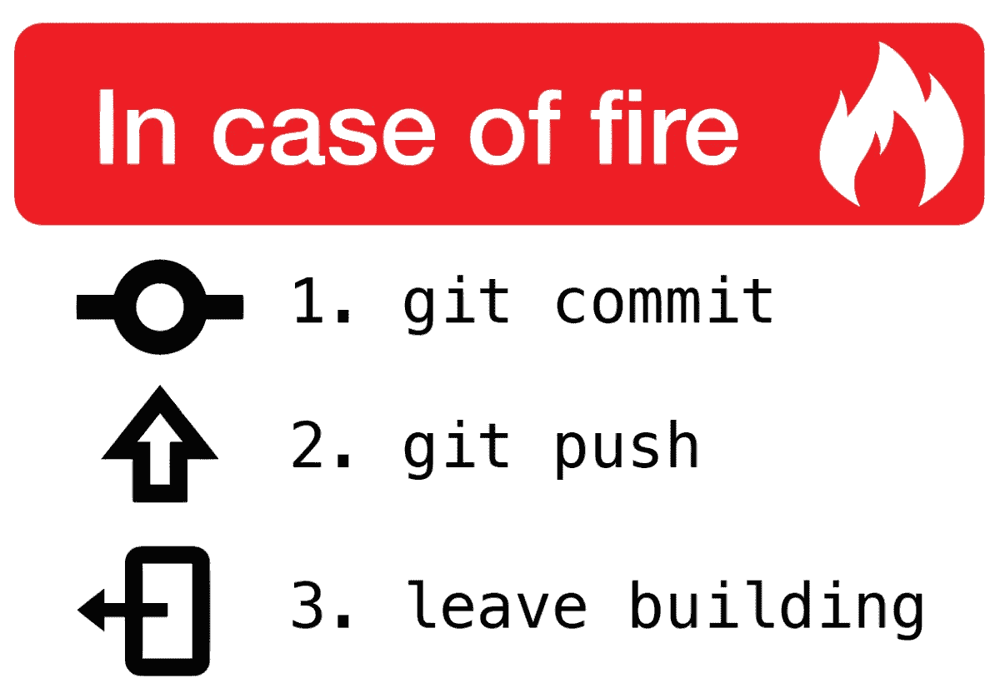

# 我希望在开始编程时就知道的 10 件事

> 原文：<https://levelup.gitconnected.com/10-things-i-wish-id-known-when-i-started-programming-789400763971>

*#6:出轨没关系。*

由[彼得·冈博斯](https://unsplash.com/@pepegombos?utm_source=unsplash&utm_medium=referral&utm_content=creditCopyText)在 [Unsplash](https://unsplash.com/s/photos/programmer?utm_source=unsplash&utm_medium=referral&utm_content=creditCopyText) 上拍摄

所以你想成为一名程序员？太好了！你已经比我刚开始的时候好多了。早在 2012 年，我想成为一名机械工程师，但我没有足够的分数进入一所好大学。长话短说，我进入计算机科学不是因为选择，而是命运。

正如史蒂夫·乔布斯在 2005 年斯坦福大学毕业典礼上的著名演讲中所说，

> 你无法把向前看的点点滴滴串联起来；你只能回头看才能把它们联系起来。

计算机科学如何改变了我的生活，这是另一个时代的故事。我希望在开始之前就知道这 10 件事。如果我这样做了，我会成为一个更好的程序员。

如果你是一个新的开发人员，刚刚开始涉足软件开发的浩瀚海洋，这 10 件事会让你在未来的漫长旅程中做好更好的准备。或者，如果你是一个有多年经验的资深开发人员，我肯定你会同意&可能会增加更多的分数。

## 1.你只能通过做来学习

这是我学得太迟的最重要的一课。我在大学学习概念，认为当我开始专业编程时会有用。在你开始为一个项目写代码之前，印度的许多大公司都会提供长达数月的特殊培训。

这种想法阻止了我在为世界编码之前真正开始我的项目和为我自己编码，正如生活所愿，我在一家初创公司找到了一份工作，该公司希望我从第一天起就提供价值，无需特殊培训。

不要被这样的假设所拖累，不管你知道多少概念，不管你看多少教程和视频，你永远不会真正学到东西，直到你用你的知识建立了一些东西。

## 2.做软件开发人员不像写测试。

背代码没有帮助。该软件的目标是为一个独特的问题提供一个独特的解决方案，所以你永远无法通过记忆东西来相处。

理解概念&你将永远不必记住代码。

## 3.不要对你的任务感情用事。

作为一名程序员，您会比想象中更经常地看到巨大的错误消息。搞砸是成为程序员过程中不可或缺的一部分，所以你需要学习如何在心理上处理这些错误。

看到错误信息堆积对你的大脑没有任何好处，你可能会在某个时候质疑自己的能力。

犯错误是可以的，你需要接受这样一个事实:将按钮放在屏幕中央是很困难的，但这并不意味着你不好！

***真实故事:*** *我曾经从生产数据库里删除了一个有 50 万条目的表。愤怒的老板&愤怒的顾客教会你许多宝贵的经验。*

## 4.你会在很长一段时间里感觉自己是个骗子。

是的，冒名顶替综合症是真实存在的。它有能力在几秒钟内摧毁你的信心。*“我不能这么做”*这种想法极其普遍，尤其是在每天都有新框架出现或者技术不断变化的科技行业。

什么都不知道很正常。好处是，你总能学到你不知道的东西。

## 5.你不需要成为数学天才。

我讨厌数学，真的。我在大学里两次数学不及格。除非你在设计复杂的算法，否则你不擅长数学也没关系。

即使你不擅长数学，你也可以成为一名程序员。您所做的大多数日常开发都不会涉及繁重的数学计算。*唷！*

## 6.出轨是可以的。

哦是的！关于这个有一个有趣的故事。在我的第一份工作中，当我在谷歌上搜索我的问题时，我在同事面前使用谷歌是如此尴尬，以至于我会去男厕所或假装在走廊上接电话。

这种情况持续了一周，直到人们开始问我是否感觉良好。

Google 是程序员最好的朋友！用它！作为一个有 4 年经验的软件开发人员，如果我必须用 JavaScript 做任何日期和时间操作，我仍然会去 Google。我花在谷歌上的时间比我写代码的时间还多，其他大多数程序员也是如此。

## 7.你不需要 3 台显示器和昂贵的设置来编码。

电影已经把这种想法植入我们的大脑，我们需要 3 个宽屏显示器和昂贵的椅子和耳机来编写代码。你不需要 Macbook 或者任何其他昂贵的硬件来开始写代码。

我开始在一台破旧的戴尔笔记本电脑上编程，攒够钱后，我开始使用 MacBook。我仍然没有一个昂贵的设置和外部显示器来帮助我编码，我也不打算得到一个。

开始写代码吧！

## 8.学会最小化&忽略(有时！)打断。

任务切换会破坏你的注意力。虽然你学会了如何处理干扰，但它永远不会停止伤害。如果你正在进行一项艰巨的任务，试着不要查看社交媒体或玩游戏来休息一下。

相反，散步。

散步让你头脑清醒，让你以全新的心态重新专注于你的任务。

戴上耳机&听有助于你集中注意力的音乐，freeCodeCamp 的[代码收音机](https://coderadio.freecodecamp.org/)是一个很好的收藏。

哦，对于不应该被忽视的干扰，请遵循以下流程:

是

## 9.以正确的方式寻求帮助

“哎！这个坏了，能帮我修一下吗？”

绝对不行。每当你向同事寻求帮助时，一定要遵循这些简单的规则:

1.  过度传达你的所见和所知。
2.  解释什么是预期的。
3.  说明你尝试过的。

很有可能，当你准备好上面的细节时，你会在不寻求帮助的情况下想出解决办法。它有助于重组你的问题陈述，让你更全面地思考。

如果这不能解决你的问题，它将帮助你的同事了解情况并提供快速支持。

## 10.你永远不会停止学习。

做一名程序员是艰难的。在我们的领域，技术可以在一夜之间改变，我们需要适应。自从开始编程以来，我每天都在学习新的东西，现在我意识到这是旅程的一部分。

为了支持这一点，我通常每周花大约 3-4 个小时来学习新的东西，可能是新的编程语言或概念。如果你想成为一名成功的程序员，你需要不断提高你的技能。

回顾过去，我走过了漫长的道路。这些都是很难学习的课程，但我真的很感激。希望这些对你的软件开发之旅有所帮助！

编码快乐！😃