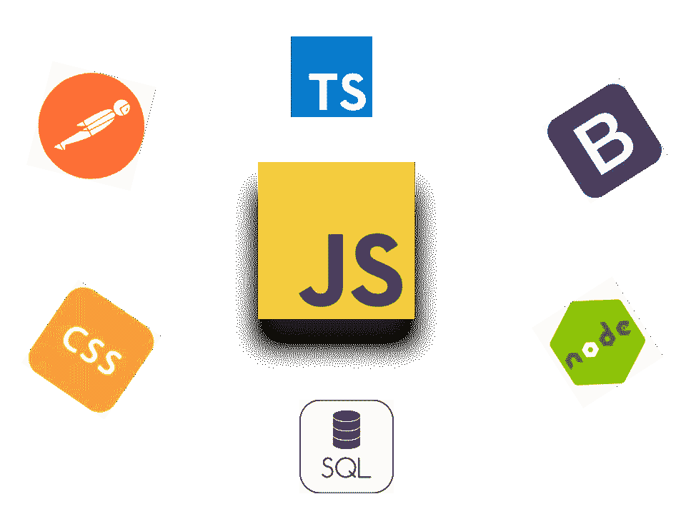

# 成为可靠的全栈 JavaScript 开发人员需要学习的 10 件事

> 原文：<https://levelup.gitconnected.com/10-things-to-learn-for-becoming-a-solid-full-stack-javascript-developer-8b76467711ac>

## …以及一些入门提示

JavaScript 世界是无穷无尽的

在编程的世界里，在简单中发现美意味着我们希望尽可能重用相同的工具/语言，并尽可能避免大量的代码。如果您是一名 web 开发人员，您可能知道 JavaScript 既可以用作前端语言，也可以用作后端语言。也许你已经在考虑全栈 JavaScript 或者正在积极使用它。不管你在哪里，如果你想成为一名全栈 JavaScript 开发人员，这里有 10 件你应该学习的事情。

快速提示:成为一名全栈开发人员意味着能够编写在操作系统上运行的服务器代码(后端),该代码从数据库中获取数据，并在 web 浏览器(前端)中显示给用户。

## 1.对 JavaScript 有基本的了解

当然，如果不学习 JavaScript 本身，你就不能进行全栈 JavaScript 开发(或者任何 web 开发)。你不需要成为一个大师来开始，但是应该对范例和控制流有一个基本的理解。与一些人所说的相反，JavaScript 并不是一门硬语言。它有很多奇怪的地方，但是一旦你习惯了这些，这是一门非常有趣的语言。您在那里遇到的许多示例代码可能有些草率，但是如果使用得当，JavaScript 实际上可以写得相当有说服力。

事实上，它既是一种动态语言，又是一种基于原型的语言，这可能会让那些传统的面向对象背景的人感到有些厌烦，但是这里有一个快速入门的技巧，我希望我能早点知道。JavaScript 基本上可以归结为两种类型:对象和原语。这 5 个原语分别是`boolean`、`number`、`string`、`null`和`undefined`；其他的都是对象。ES6 中的函数、类和数组都是底层的对象。最基本层次的对象可以被认为是一组键/值对，键总是一个字符串，值是…无论你想要什么:一个原语，另一个对象，一个函数，数组等等。如果你想了解更多关于 JavaScript 对象的知识，请随意阅读这篇文章。

JavaScript 的下一个最重要的方面可能是它对异步编程的高度重视。这允许程序执行的主线程继续，同时等待其他方法完成。实现这一点的两种主要方式是通过回访和承诺。这篇中型文章[这里](https://medium.com/@siddharthac6/javascript-execution-of-synchronous-and-asynchronous-codes-40f3a199e687)是对异步和同步编程的一个很好的介绍，而这篇[文章](/understand-javascript-promises-by-building-a-promise-from-scratch-84c0fd855720)提供了对承诺的一个很好的概述。

## 2.前端框架

由于性能优势，单页面应用程序是当今的主流。学习前端框架是最实用的制作方法。三个大的是 Angular，React 和 Vue，但当然这些不是你唯一的选择。关于哪一个是最好的，在 JavaScript 世界里有一点争论。如果你在谷歌上搜索“角度与反应”，你会看到相当多的文章散布在互联网上，比较每个人的优势和劣势。我偏爱棱角分明的原因在这里提到[。我承认在某些情况下 React 或 Vue 可能更适合。我建议你读一些这样的文章，从高层次上理解它们的区别，然后选择最适合你需求的那一篇。](/deciding-between-angular-and-react-for-hobbyist-web-developers-9247def281fb)

## 3.自举 4

今天，当几乎所有的 web 应用程序都需要看起来漂亮时，无论它们是在普通的桌面还是移动设备上打开，你都没有时间自己编写所有必要的 CSS 代码来实现这一点。前端 web 开发中也有许多功能可以增强用户体验，如弹出窗口、弹出窗口、导航栏、提醒等。如果你试图自己实现这些东西，只会产生大量的锅炉板代码，而这些代码将永远需要开发和维护。Bootstrap 是 Twitter 创建的前端库，它提供了大量的实用程序。它包括了从样式到交互性的很多东西，所以你不必从头开始写。

当然，你不需要马上了解 Bootstrap 的所有特性，但是我强烈建议你在开始你的第一个 web 应用之前熟悉网格布局和导航条。它们在网络上无处不在，对于让你的网站移动友好至关重要。之前提到的两大前端框架(Angular 和 React)都有与 Bootstrap 集成的库，所以你不用担心它的特性在这些框架内不兼容。

## 4.HTML/CSS

即使 Bootstrap 可以为您承担大量 CSS 任务，您仍然需要应用自己的定制样式，并对您可能使用的任何前端库进行轻微修改。你需要在 CSS 中做的大多数事情都可以很快地在谷歌上找到，但是如果你真的想让你的网站变得更有趣，并且像我一样热爱设计，你需要对 CSS 有一个很好的理解。这包括导入自定义字体并设置其样式，基于屏幕宽度设置引导网格可能无法覆盖的属性，以及使用像`:nth-child()`这样的 CSS 选择器。至于 HTML，没有太多东西需要马上学习，你可以边学边做，但是在制作你的第一个模板之前，要知道像``这样的内嵌元素之间的区别，以及它们和像`
`这样的块元素有什么不同。这将使你在摆弄 CSS 代码时省去大量的麻烦。

如果你像我一样，你可能会发现 HTML 的打开/关闭标签和 CSS 的所有选择器有点臃肿。好消息是，有许多预处理程序可以使这些模板语言更加有趣和简洁。对于 HTML，我们有像帕格和 HAML 这样的工具:Html 预处理程序不像 CSS 那样经常使用。对于 CSS，有许多选项，如手写笔、LESS、SASS 和 PostCSS。Angular 的命令行内置了一些插件，React 也有单独的插件。我偏爱 Pug 和 Stylus，因为它们功能丰富。

## 5.NodeJS 和后端框架

NodeJS 是在后端运行 JavaScript 的环境，就像运行任何其他编程语言一样。当然，在桌面上，与浏览器中的 JavaScript 会有一些细微的不同。浏览器和节点都执行 JavaScript，并且都使用 V8 引擎。主要区别是浏览器添加了一个额外的 API 来访问 DOM，而 Node 添加了一个 API 来与操作系统交互。想做全栈 JavaScript，就得懂 NodeJS。好消息是你不必学习一种完全不同的语言。

就像前端一样，在选择后端框架时，您有许多选择。然而，ExpressJS 是事实上的标准。Express 使旋转后端 web 服务器和开始编写 API 变得很容易。如果您想尝试不同的后端框架，我建议您从 Express 开始，一旦您对后端 JavaScript 有了感觉，就开始尝试。

## 6.学习打字稿

JavaScript 已经过时了；它有无数的问题。跨浏览器兼容性，NodeJS 的不同版本，没有类型安全，这使得伸缩困难，只有半面向对象的 ES6 的`class`关键字。TypeScript transpiles 来清理 ES5 代码，这消除了许多兼容性问题。它还使您能够以更传统的面向对象的方式编写 JavaScript，类似于 C#/Java。

使用 TypeScript 使我成为一名更好的程序员，并帮助我更好地理解接口、继承、访问控制(公共、私有等)和抽象等概念。如果你的背景和我一样，你会觉得 TypeScript 比普通的 JavaScript 更自然。关于 TypeScript 的另一个有用之处是，它可以与强制执行某些编码标准的 lint 文件一起使用。

## 7.熟悉 API 调用工具

许多新的全栈开发人员(包括我自己)容易犯的一个大错误是，他们会在开发后端时从前端触发 API。这将大大增加实现服务器代码的时间。每次页面刷新时，您都必须重新输入您的值，并导航到调用 API 的前端部分。为了加快这个过程，你应该分别开发你的后端和前端。熟悉一个类似 [Postman](https://www.getpostman.com) 或者 [SoapUI](https://www.soapui.org/) 的 API 调用工具，这样你就可以不用碰前端就可以调用你的 API 了。知道如何将它们用于认证路线，你也可以在不登录应用程序的情况下进行 API 调用。

## 8.懂点 SQL

尽管有 NoSQL 数据库的宣传和 MongoDB 在 NodeJS 开发人员中的流行，关系数据库仍然是许多应用程序最实际的选择。无论您是否使用 JavaScript 作为后端，对于任何想自称为全栈 web 开发人员的人来说，良好的 SQL 知识都应该是一个先决条件。就像 JavaScript 一样，您不需要成为专家，但是首先您应该知道如何进行基本的连接、创建/更新表以及插入数据。

大多数主要的关系数据库，特别是 MySQL 和 PostgreSQL，都可以很好地与 NodeJS 集成。您可以像对待 MongoDB 或任何其他 NoSQL 数据库一样轻松地与他们交谈。就个人而言，我发现标准的 SQL 查询比一些使用 JSON(JavaScript 对象)查询的数据库更直观。如果您想将数据存储为 JSONs，猜猜看，PostgreSQL 和 MySQL 仍然允许您这样做。

## 9.单元和端到端测试

不要，我重复一遍，不要低估测试的重要性。我注意到在现实世界中有一种忽视单元测试的趋势，尤其是在前端。测试不仅能为用户防止错误，还能让你的代码更加健壮，并迫使你重新审视它。像 Angular 这样的框架有内置的测试工具，所以你不需要做太多的配置；你可以开始写测试。

网页上任何行为根据用户交互而改变的元素都需要进行单元测试。在后端，所有可以由用户触发的路由和公共方法也需要进行单元测试。端到端测试(又名集成或 e2e 测试)应该针对任何跨越多个网页并与后端对话的用户交互进行。例如，使用重定向登录需要进行 e2e 测试。如果用户在成功登录账户后被重定向到一个个人资料页面，那就需要进行 e2e 测试。

## 10.用户身份验证的基础

有许多方法可以保证网站的安全:客户端令牌、会话存储、将身份验证交给 MS Active Directory 等第三方工具。你不需要知道所有的信息，但是你应该知道有哪些可用的信息。一旦你这样做了，选择最容易的选项，并在此基础上积累你的知识。此外，大致了解黑客对你的网站可能采用的主要攻击形式。你不需要成为互联网安全专家，但要知道主要的安全问题，这样你的网站就不会受到攻击。这包括跨站点脚本请求和 SQL 注入攻击。这里有一篇很好的文章[涵盖了互联网安全的一些基础知识。](https://www.creativebloq.com/web-design/website-security-tips-protect-your-site-7122853)

为了保护后端的 API，我建议从 JSON web 令牌(JWT)开始。NodeJS 有一些很棒的第三方库，可以和 Express 一起使用，而且非常容易使用。jwt 是一种客户端身份验证的形式，您可以使用它来只允许有效用户(即那些已经登录的用户)向您的后端发出请求。jwt 还可以存储加密的 JSON 对象，这样您就可以识别是谁发出了安全请求。如果您想为用户创建持久的信息(例如，当用户离开站点时为他们存储购物车)，您最终需要了解会话。

你觉得这份名单怎么样？如果你认为缺少了什么或者不需要什么，请随意发表评论。请记住，JavaScript 世界是巨大的，所以有很多要涵盖，但这些是我在制作我的第一个网站时需要自学的主题。即使你是一个新的 web 开发人员，不确定将来是否会使用全栈 JavaScript，了解这些技能将会使你成为一个更有生产力的全面的程序员。

另外，如果你有兴趣在 ExpressJS 中使用后端 TypeScript，请查看我的 OvernightJS 库，它为 express routes 添加了 decorators。这里有一个[链接](/overnightjs-the-best-way-to-use-expressjs-with-typescript-35d71941aade)到一篇描述如何使用它的中型文章。

祝网络设计愉快:)

 [## 学习 JavaScript -最佳 JavaScript 教程(2019) | gitconnected

### 排名前 64 的 JavaScript 教程。课程由开发者提交并投票，使您能够找到最好的…

gitconnected.com](https://gitconnected.com/learn/javascript)