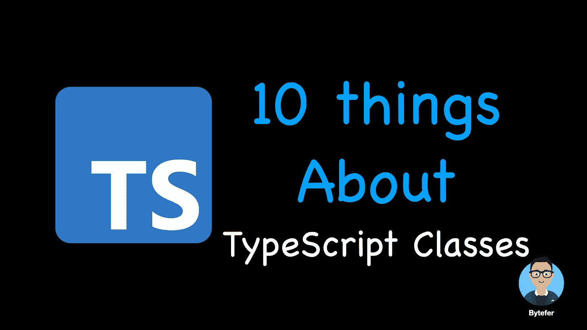
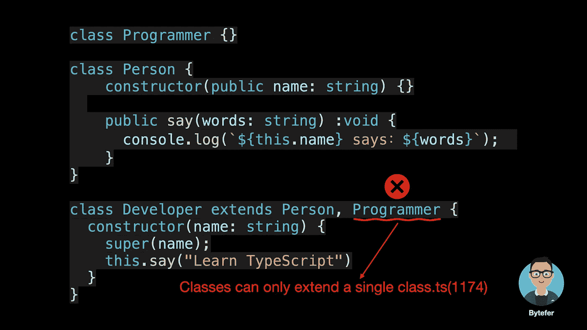
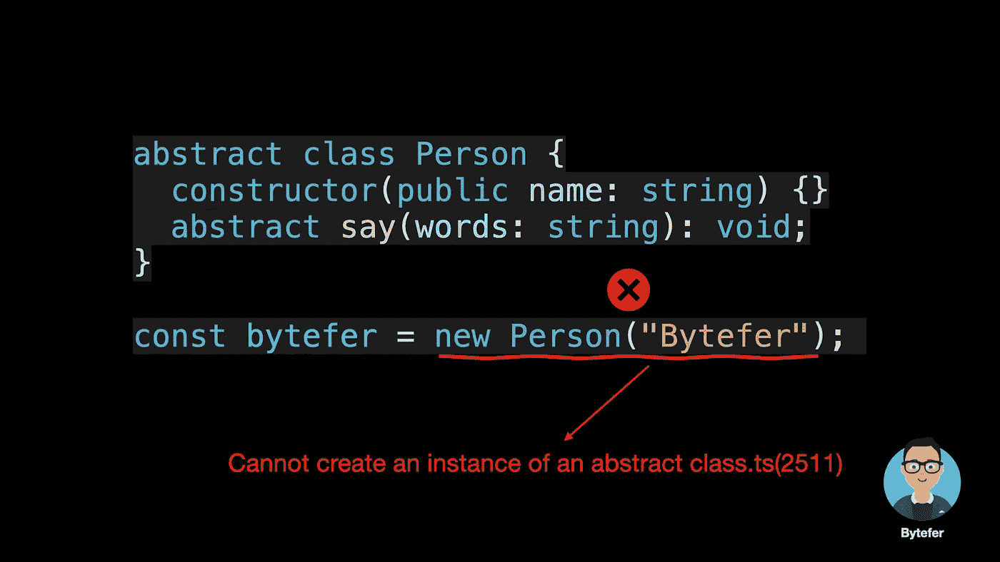
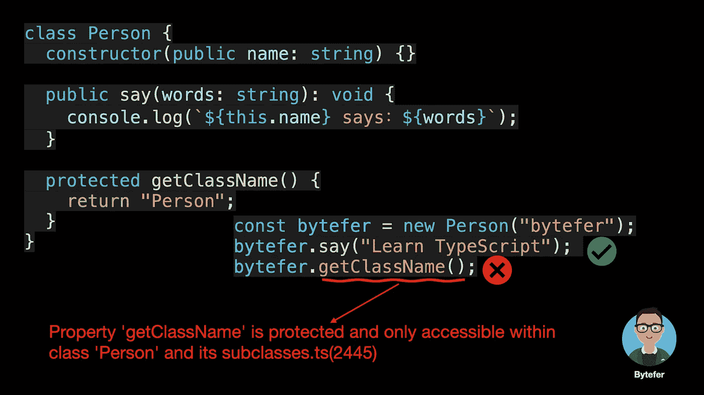
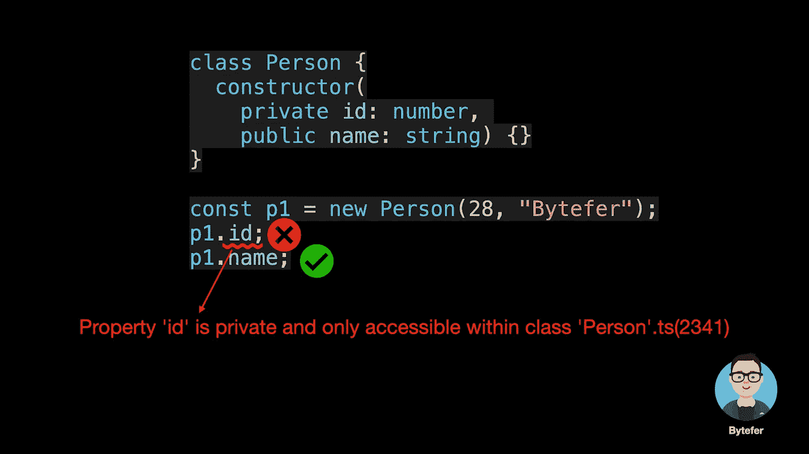
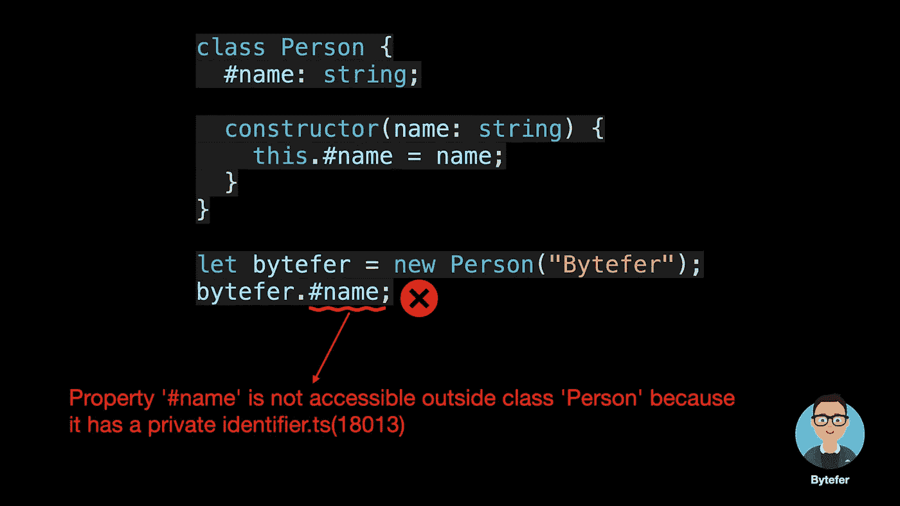
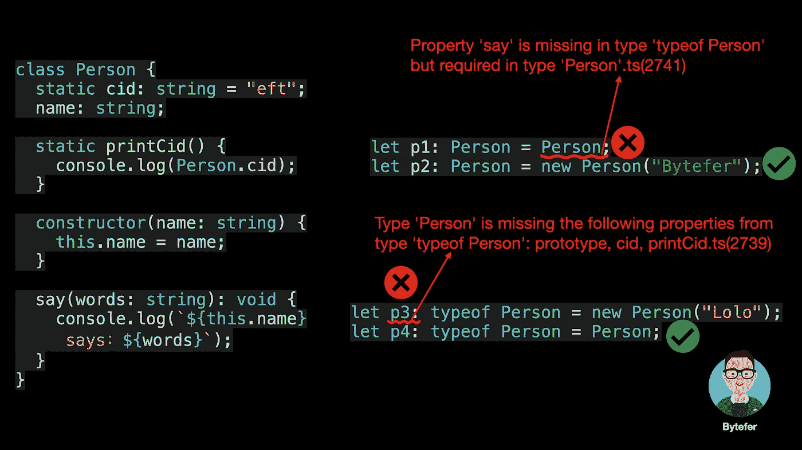

# 关于 TypeScript 类你需要知道的 10 件事

> 原文：<https://levelup.gitconnected.com/10-things-you-need-to-know-about-typescript-classes-f58c57869266>



欢迎来到**掌握打字稿**系列。本系列将以动画的形式介绍 TypeScript 的核心知识和技术。让我们一起学习吧！以前的文章如下:

*   [**TypeScript 泛型中的 K、T、V 是什么？**](https://medium.com/frontend-canteen/what-are-k-t-and-v-in-typescript-generics-9fabe1d0f0f3)
*   [**使用 TypeScript 像 Pro 一样映射类型**](https://javascript.plainenglish.io/using-typescript-mapped-types-like-a-pro-be10aef5511a)
*   [**使用 TypeScript 条件类型像亲**](https://javascript.plainenglish.io/use-typescript-conditional-types-like-a-pro-7baea0ad05c5)
*   [**使用 TypeScript 交集类型像亲**](https://javascript.plainenglish.io/using-typescript-intersection-types-like-a-pro-a55da6a6a5f7)
*   [**利用打字稿像专家一样推断**](/using-typescript-infer-like-a-pro-f30ab8ab41c7)
*   [**使用 TypeScript 模板字面类型像亲**](https://medium.com/javascript-in-plain-english/how-to-use-typescript-template-literal-types-like-a-pro-2e02a7db0bac)
*   [**可视化打字稿:15 种最常用的实用类型**](https://javascript.plainenglish.io/15-utility-types-that-every-typescript-developer-should-know-6cf121d4047c)
*   [**关于类型脚本类你需要知道的 10 件事**](/10-things-you-need-to-know-about-typescript-classes-f58c57869266)
*   [**TypeScript 中‘declare’关键字的用途**](https://javascript.plainenglish.io/purpose-of-declare-keyword-in-typescript-8431d9db2b10)

在面向对象的语言中，类是创建对象的蓝图，描述所创建对象的公共属性和方法。在本文中，我将介绍关于 TypeScript 需要了解的 10 件事情。

# 1.类属性和方法

## 1.1 类成员属性和静态属性

在 TypeScript 中，我们可以用关键字`class`定义一个类:

```
class User {
  name: string; constructor(name: string) {
    this.name = name;
  }
}
```

在上面的代码中，我们使用 class 关键字定义了一个用户类，其成员属性名为`name`。其实 TypeScript 中的类就是句法糖(**句法糖就是在一个之前的语法基础上改变一种写法，实现同样的功能，只是写法不同，主要是让开发者在过程中使用。更方便，更容易理解。**)，如果将编译目标设置为 ES5，将会生成以下代码:

```
"use strict";
var User = /** [@class](http://twitter.com/class) */ (function () {
    function User(name) {
        this.name = name;
    }
    return User;
}());
```

除了定义成员属性，类还可以通过`static`关键字定义静态属性:

```
class User {
  static cid: string = "eft";
  name: string; constructor(name: string) {
    this.name = name;
  }
}
```

那么成员属性和静态属性的区别是什么呢？在回答这个问题之前，我们先来看看编译好的 ES5 代码:

```
"use strict";
var User = /** [@class](http://twitter.com/class) */ (function () {
    function User(name) {
        this.name = name;
    }
    User.cid = "eft";
    return User;
}());
```

从上面的代码可以看出，成员属性是在类的实例上定义的，而静态属性是在构造函数上定义的。

## 1.2 类成员方法和静态方法

定义 TypeScript 类时，我们不仅可以定义成员属性和静态属性，还可以定义成员方法和静态方法，如下所示:

```
class User {
  static cid: string = "eft";
  name: string; constructor(name: string) {
    this.name = name;
  } static printCid() {
    console.log(User.cid);
  } send(msg: string) {
    console.log(`${this.name} send a message: ${msg}`);
  }
}
```

那么成员方法和静态方法的区别是什么呢？同样，在回答这个问题之前，我们先来看看编译好的 ES5 代码:

```
"use strict";
var User = /** [@class](http://twitter.com/class) */ (function () {
    function User(name) {
        this.name = name;
    }
    User.printCid = function () {
        console.log(User.cid);
    };
    User.prototype.send = function (msg) {
        console.log("".concat(this.name, " send a message: ").concat(msg));
    };
    User.cid = "eft";
    return User;
}());
```

从上面的代码可以看出，**成员方法将被添加到构造函数的 prototype 对象中，静态方法将被添加到构造函数**中。

# 2.类访问器

类也可以有访问器*。*我们可以通过 getter 和 setter 方法实现数据封装和有效性验证，防止数据异常。

```
class User {
  private _age: number = 0; get age(): number {
    return this._age;
  } set age(value: number) {
    if (value > 0 && value <= 120) {
      this._age = value;
    } else {
      console.log("Error: The set age value is invalid!");
    }
  }
}
```

# 3.类继承

继承是将类链接到类的层次模型。它指的是一个类继承另一个类的功能并添加自己的新功能的能力。继承是类与类或接口与接口之间最常见的关系。通过类继承，我们可以实现代码重用。

在 TypeScript 中，我们可以通过`extends`关键字实现类继承。类可能`extend`来自基类。派生类具有其基类的所有属性和方法，并且还定义了其他成员。

## 3.1 基本类别

```
class Person {
  constructor(public name: string) {}

  public say(words: string) :void {
    console.log(`${this.name} says：${words}`);  
  }
}
```

## 3.2 派生类

```
class Developer extends Person {
  constructor(name: string) {
    super(name);
    this.say("Learn TypeScript")
  }
}const p2 = new Developer("Bytefer"); 
// "Bytefer says：Learn TypeScript"
```

因为 Developer 类扩展了 Person 类，所以我们可以在 Developer 类的构造函数中调用`say`方法。需要注意的是**在 TypeScript 中使用扩展时，只能继承一个类:**



虽然在 TypeScript 中只允许单一继承，但它允许我们实现多个接口。相应的例子如下:

```
interface CanSay {
   say(words: string) :void 
}

interface CanWalk {
  walk(): void;
}

class Person implements CanSay, CanWalk {
  constructor(public name: string) {}

  public say(words: string) :void {
    console.log(`${this.name} says：${words}`);  
  }

  public walk(): void {
    console.log(`${this.name} walk with feet`);
  }
}
```

除了能够继承具体的类，在实现继承的时候，我们还可以继承抽象的类。

# 4.抽象类

TypeScript 中的类、方法和字段可能是抽象的。用`abstract`关键字声明的类称为抽象类。**抽象类无法实例化，因为它包含一个或多个抽象字段/方法。**



抽象类的作用是作为实现所有抽象成员的子类的基类。

```
class Developer extends Person {
  constructor(name: string) {
    super(name);
  }

  say(words: string): void {
    console.log(`${this.name} says ${words}`);
  }
}const bytefer = new Developer("Bytefer");
bytefer.say("I love ts!"); // Bytefer says I love ts!
```

# 5.成员可见性

在 TypeScript 中，我们可以使用`public`、`protected`或`private`来控制某些方法或属性对类外的代码是否可见。

## 5.1 公共

类成员的默认可见性是`public`。可以在任何地方访问`public`成员:

```
class Person {
  constructor(public name: string) {} public say(words: string) :void {
    console.log(`${this.name} says：${words}`);  
  }
}
```

## 5.2 受保护

受保护的属性或方法是受保护的，它类似于 private，只是受保护的成员仍然可以在派生类中访问。



从上面的错误消息可以看出，用 protected 修饰符修改的方法只能在当前类或其子类中使用。

```
class Developer extends Person {
  constructor(name: string) {
    super(name);
    console.log(`Base Class：${this.getClassName()}`);
  }
}const bytefer = new Developer("Bytefer"); // "Base Class：Person"
```

## 5.3 私人

private 修改的属性或方法是私有的，只能在类中访问。



从上面的错误消息可以看出，用`private`修饰符修改的属性只能在当前类中访问。但真的是这样吗？事实上，这只是来自 TypeScript 类型检查器的一个提示，即我们仍然可以在运行时访问 Person 实例的 id 属性。我们来看看编译好的 **ES5** 代码:

```
"use strict";
var Person = /** [@class](http://twitter.com/class) */ (function () {
    function Person(id, name) {
        this.id = id;
        this.name = name;
    }
    return Person;
}());
var p1 = new Person(28, "bytefer");
```

## 5.4 ECMAScript 私有字段

为了应对 private 修饰符的问题，TypeScript 团队在 3.8 中开始支持 **ECMAScript 私有字段**。用法如下:



那么与私有修饰符相比，ECMAScript 私有字段有什么特别之处呢？这里我们来看看编译好的 **ES2015** 代码:

```
"use strict";
var __classPrivateFieldSet = // ignore related code;
var _Person_name;
class Person {
    constructor(name) {
        _Person_name.set(this, void 0);
        __classPrivateFieldSet(this, _Person_name, name, "f");
    }
}
_Person_name = new WeakMap();let bytefer = new Person("Bytefer");
```

从以上结果可以看出，ES2015 中新增的 WeakMap 数据类型在处理私有字段时使用。让我们总结一下私有字段与常规属性(甚至是那些用 private 修饰符声明的属性)的区别:

*   私有字段以一个`#`字符开始。有时候我们把这些私有的*名字叫做*。
*   每个私有字段名都唯一地限定在其包含的类的范围内。
*   像`public`或`private`这样的 TypeScript 可访问性修饰符不能用于私有字段。
*   私有字段不能在包含类之外被访问，甚至不能被检测到——即使是 JS 用户！有时我们称这种硬为隐私。

# 6.类别表达式

TypeScript 1.6 增加了对 ES6 类表达式的支持。类表达式是用于定义类的语法。像函数表达式一样，类表达式可以是命名的或匿名的。在命名类表达式的情况下，名称只能在类体中访问。

类表达式的语法如下([]括号是可选的):

```
const MyClass = class [className] [extends] {
  // class body
};
```

基于类表达式的语法，我们可以定义一个点类:

```
let Point = class {
  constructor(public x: number, public y: number) {}
  public length() {
    return Math.sqrt(this.x * this.x + this.y * this.y);
  }
}let p = new Point(3, 4);
console.log(p.length()); // 5
```

注意，当使用类表达式定义类时，我们也可以使用`extends`关键字。

# 7.通用类

在类中使用泛型也非常简单。我们只需要在类名后使用语法 **< T、… >** 来定义任意数量的类型参数。具体例子如下:

```
class Person<T> {
  constructor(
    public cid: T, 
    public name: string
  ) {}   
}let p1 = new Person<number>(28, "Lolo");
let p2 = new Person<string>("eft", "Bytefer");
```

接下来，我们以实例化 p1 为例来分析其处理过程:

*   在实例化 Person 对象时，我们传入数字类型和相应的构造参数；
*   然后在 Person 类中，类型参数 T 的值变成了 number type
*   最后，构造函数 cid 的参数类型也会变成数字类型。

那么我们什么时候需要使用泛型呢？通常，在决定是否使用泛型时，我们有以下两个参考标准

*   当您的函数、接口或类将处理多种数据类型时；
*   当函数、接口或类在多个地方使用该数据类型时。

如果你不理解类型参数，我建议你阅读下面的文章:

[](https://medium.com/frontend-canteen/what-are-k-t-and-v-in-typescript-generics-9fabe1d0f0f3) [## TypeScript 泛型中的 K，T，V 是什么？

### 用动画讲解，让你轻松掌握 TypeScript 泛型类型参数。

medium.com](https://medium.com/frontend-canteen/what-are-k-t-and-v-in-typescript-generics-9fabe1d0f0f3) 

# 8.构建签名

定义 TypeScript 接口时，可以使用 new 关键字来描述构造函数:

```
interface Point {
  new (x: number, y: number): Point;
}
```

上面接口中的 **new (x: number，y: number)** 称为构造签名，其语法如下:

```
ConstructSignature: new TypeParametersopt ( ParameterListopt ) TypeAnnotationopt
```

在上述构造签名中，TypeParametersopt、ParameterListopt 和 TypeAnnotationopt 分别表示可选类型参数、可选参数列表和可选类型注释。那么知道构造签名有什么用呢？这里我们举一个例子:

```
interface Point {
  new (x: number, y: number): Point;
  x: number;
  y: number;
}class Point2D implements Point {
  readonly x: number;
  readonly y: number;constructor(x: number, y: number) {
    this.x = x;
    this.y = y;
  }
}const point: Point = new Point2D(1, 2); // Error
```

对于上述代码，TypeScript 编译器将提示以下错误信息:

```
Type 'Point2D' is not assignable to type 'Point'.
 Type 'Point2D' provides no match for the signature 'new (x: number, y: number): Point'.ts(2322)
```

为了解决这个问题，我们需要重构前面定义的点接口:

```
interface Point {
  x: number;
  y: number;
}interface PointConstructor {
  new (x: number, y: number): Point;
}
```

完成接口重构后，除了之前定义的 Point2D 类，我们还定义了一个`newPoint`工厂函数，用来根据传入的 **PointConstructor** 类型的构造函数创建对应的 Point 对象。

```
class Point2D implements Point {
  readonly x: number;
  readonly y: number; constructor(x: number, y: number) {
    this.x = x;
    this.y = y;
  }
}function newPoint(
  pointConstructor: PointConstructor,
  x: number,
  y: number
): Point {
  return new pointConstructor(x, y);
}const point: Point = newPoint(Point2D, 3, 4);
```

# 9.抽象构造签名

TypeScript 4.2 中引入了抽象构造签名来解决以下问题:

```
type Constructor = new (...args: any[]) => any;abstract class Shape {
  abstract getArea(): number;
}let Ctor: Constructor = Shape; // Error
// Type 'typeof Shape' is not assignable to type 'Constructor'.
//  Cannot assign an abstract constructor type to a non-abstract 
// constructor type.ts(2322)
```

从上面的错误消息中可以看出，我们不能将抽象构造函数类型赋给非抽象构造函数类型。要修复这个错误，我们需要使用抽象构造签名:

```
type AbstractConstructor = abstract new (...args: any[]) => any;abstract class Shape {
  abstract getArea(): number;
}let Ctor: AbstractConstructor = Shape; // Ok
```

之后，我们可以创建一个 makeSubclassWithArea 函数来创建 Shape 类的子类:

```
function makeSubclassWithArea(Ctor: AbstractConstructor) {
  return class extends Ctor {
    #sideLength: number;
    constructor(sideLength: number) {
      super();
      this.#sideLength = sideLength;
    } getArea() {
      return this.#sideLength ** 2;
    }
  };
}let Square = makeSubclassWithArea(Shape);
```

如果非抽象构造函数类型本来是可以赋值的，那么它们也可以赋值给抽象构造函数类型。

```
abstract class Shape {
  abstract getArea(): number;
}class Square extends Shape {
  #sideLength: number; constructor(sideLength: number) {
    super();
    this.#sideLength = sideLength;
  } getArea() {
    return this.#sideLength ** 2;
  }
}let Ctor: AbstractConstructor = Shape; // Ok
let Ctor1: AbstractConstructor = Square; // Ok
```

在介绍了抽象构造签名之后，让我们以简单介绍类类型和类类型的类型之间的区别来结束。

# 10.类类型和类类型的类型



基于以上结果，我们可以得出以下结论。

*   当使用`Person`类作为类型时，可以将变量的值约束为 Person 类的实例；
*   当使用`typeof Person`作为类型时，您可以约束变量的值以包含类中的静态属性和方法。

另外需要注意的是，TypeScript 使用的是结构化类型系统，与 Java/C++使用的标称类型系统不同，所以下面的代码可以在 TypeScript 中正常工作:

```
class Person {
  constructor(public name: string) {}  
}

class SuperMan {
  constructor(public name: string) {}  
}

let s1: SuperMan = new Person("Bytefer"); *// Ok*
```

好了，这里介绍一下 TypeScript 类的比较常见的知识。如果遇到不清楚的内容，可以给我留言。

如果你喜欢学习动画形式的打字稿，可以在[中](https://medium.com/@bytefer)或者[推特](https://twitter.com/Tbytefer)关注我，了解更多关于 TS 和 JS 的内容！

# 资源


[Bytefer](https://medium.com/@bytefer?source=post_page-----f58c57869266--------------------------------)

## 掌握打字稿系列

[View list](https://medium.com/@bytefer/list/mastering-typescript-series-688ee7c12807?source=post_page-----f58c57869266--------------------------------)46 stories[](https://www.typescriptlang.org/docs/handbook/2/classes.html) [## 文档-类别

### 类如何在 TypeScript 中工作

www.typescriptlang.org](https://www.typescriptlang.org/docs/handbook/2/classes.html) 

# 分级编码

感谢您成为我们社区的一员！在你离开之前:

*   👏为故事鼓掌，跟着作者走👉
*   📰查看[升级编码出版物](https://levelup.gitconnected.com/?utm_source=pub&utm_medium=post)中的更多内容
*   🔔关注我们:[Twitter](https://twitter.com/gitconnected)|[LinkedIn](https://www.linkedin.com/company/gitconnected)|[时事通讯](https://newsletter.levelup.dev)

🚀👉 [**加入升级人才集体，找到一份神奇的工作**](https://jobs.levelup.dev/talent/welcome?referral=true)