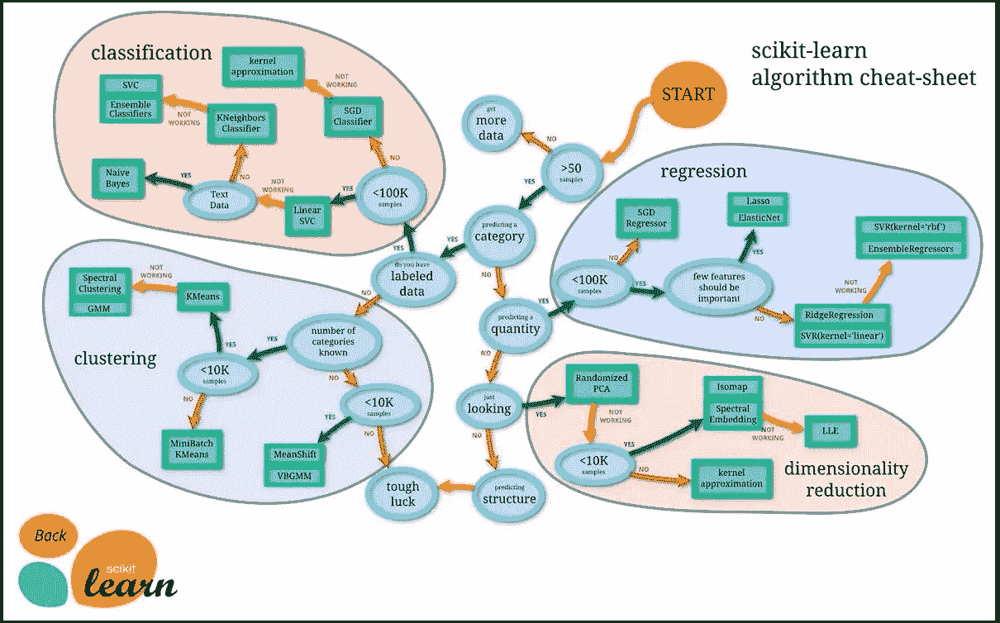

# 作为数据科学家，你应该知道的 10 件事

> 原文：<https://levelup.gitconnected.com/10-things-you-should-know-as-a-data-scientist-ebfc2529991>

## 数据科学家技能概述

数据科学家应该知道的 10 件事

如果你是一名数据科学家或者想成为一名数据科学家，有些事情你应该知道。这篇博文将讨论其中最重要的 10 个。

我们将涵盖各种主题，包括机器学习、大数据等。因此，无论您是刚刚开始您的数据科学职业生涯，还是希望扩展您的知识库，请继续阅读，获取一些有价值的信息！

## 摘要

1.  数据争论
2.  数据可视化
3.  探索性数据分析
4.  统计和概率基础
5.  处理不同类型的数据
6.  数据预处理
7.  构建机器学习模型
8.  有效沟通
9.  团队合作是数据科学家的另一项重要技能
10.  数据科学家是软件工程师

# 谁是数据科学家？

数据科学家分析和解释数据以发现趋势或模式。他们利用这些信息做出预测或建议。

数据科学家通常在营销、金融和医疗保健领域工作。数据科学家的日常任务可能因行业而异。

然而，一些日常工作包括探索数据集、开发模型和创建可视化。

数据科学家也可以将他们的发现传达给客户或利益相关者。事不宜迟，下面是数据科学家应该知道的十件事！

## 1.数据争论

任何数据科学项目的第一步都是争论数据。

您将清理、转换和组织用于分析的数据。

数据争论可能很耗时，但是确保数据为建模做好准备是必要的。

它还允许您更好地理解整个数据集。

> **数据争论是必不可少的**,因为它可以决定你项目的成败。

如果数据没有得到清理和适当的组织，模型可能会不准确；此外，*争论不休的数据将需要更长的时间来建立*模型并找到洞见。

## 2.数据可视化

数据可视化是数据科学家的另一项关键技能。

您将创建图表和图形来帮助可视化数据。数据可视化可以探索数据，**发现模式**，以及**发现异常值**。

这也是向利益相关者传达结果的一个有价值的工具。

数据可视化是探索性分析(EDA)的重要组成部分，是任何数据科学项目中必不可少的步骤。

> EDA 有助于您更好地理解数据集，并且通常可以揭示出通过其他方式很难发现的见解。

值得注意的是，EDA 不应该与统计建模或机器学习混淆；相反，这是一种在建立模型之前探索和更好地理解数据的方法。

## 3.探索性数据分析

一旦你有了数据，是时候进行探索性数据分析(EDA)了。

**EDA** 是各种技术的集合，比如**可视化**，汇总**统计**，以及**假设检验**。

虽然数据挖掘在一些公司是由数据分析师完成的，但是一个数据科学家必须至少有一个合理的基础来讨论结果。

> 这是您开始理解数据和寻找模式的地方。

在构建模型之前彻底探索数据是至关重要的，因为这将帮助您选择正确的特征并避免过度拟合。

你还应该熟悉一些标准的机器学习算法。

其中包括**线性回归**、**逻辑回归**、**决策树**、**随机森林**、 **k 近邻**、**支持向量机**。

> 数据科学家也训练[神经网络](https://en.wikipedia.org/wiki/Neural_network)被称为**深度学习**。

如果你了解了每种算法的“家族”优势和劣势，选择一种适合你要解决的问题，那将是最好的。

> 数据科学家也可以轻松使用各种 Python 数据科学库，比如 [NumPy](https://numpy.org/) 、 [pandas](https://pandas.pydata.org/) 和 [scikit-learn](https://scikit-learn.org/stable/) 。

## 4.统计和概率基础

这些知识在构建模型和解释结果时会派上用场。

当然，作为一名(未来的)数据科学家，你必须知道如何计算基本的统计数据，如均值、中值、众数和标准差。

但是你也应该熟悉相关和回归等概念。

当进行 EDA 并评估哪些数据对您试图解决的问题至关重要时，您需要很好地理解**统计假设测试。**

所有都从[零假设](https://en.wikipedia.org/wiki/Null_hypothesis)开始，并且必须使用适当的测试结束:

*   [Z-测试](https://en.wikipedia.org/wiki/Z-test):用于在严格条件下比较平均值的正态性和已知的标准偏差。
*   [卡方检验:用于决定两个变量是相关还是独立](https://en.wikipedia.org/wiki/Chi-squared_test)
*   [F 检验](https://en.wikipedia.org/wiki/F-test)(方差分析，ANOVA):用于决定数据按类别分组是否有意义。
*   等等。

另外，**概率**的工作知识对于理解机器学习算法是必不可少的。

## 5.处理不同类型的数据

数据科学家也应该知道不同类型的数据。

数据主要有四种类型:**数值型**、**分类型**、**序数型**和**文本型**。

每种数据类型都有独特的特征，需要不同的方法来有效地分析它:

*   **数字数据**可能是最直接的，因为它可以直接输入大多数统计软件程序。
*   **分类数据**将数据分组，如男性和女性。
*   **序数数据**可以排序，比如低、中、高。
*   **文本数据**是非结构化的，你无法用传统方法快速分析它，你将不得不学习 **N** 自然 **L** 语言 **P** 处理(NLP)以从中获取价值。

## 6.数据预处理

数据预处理是任何数据科学项目中的另一个重要步骤。

数据预处理可以包括**输入缺失值** s，**缩放数值变量**，以及**将分类变量**转换为虚拟变量。

> 数据预处理不是数据清理，而是为建模准备数据的步骤。

虽然一些数据科学家可能会选择进行数据预处理，但许多优秀的工具也可以自动完成这一过程。

## 7.构建机器学习模型

在你准备好数据之后，下一步是建立一个模型。

事情可能会变得令人兴奋✨，因为有许多不同的方法来处理建模数据。

一些标准方法包括[线性回归](https://medium.com/p/a9a0fde49130)，逻辑回归，决策树和支持向量机。

每种方法都有优点和缺点，因此您必须为任务选择合适的模型。

来自 Scikit-Learn 文档:用于机器学习的 Python 库

一旦选择了一个模型，就该用数据来训练它了。

当您调整模型以获得最佳结果时，您的数学和数据知识将会大放异彩。

坦白说吧；这是你最具挑战性和最耗时的任务之一，也是一旦你取得好成绩后最有回报的任务！

> 训练完模型后，就该根据看不见的数据对它进行评估了。

数据科学的真正力量开始发挥作用，因为模型可以用于对新数据进行预测。如果模型运行良好，您可以在生产环境中部署它。

数据工程师可能会帮助你[部署你的应用](/10-things-you-should-know-as-a-data-engineer-2f1ad23abd9d)，但我知道一些数据科学家也在负责这项任务。

## 8.有效沟通

能够有效地交流结果对于数据科学家来说至关重要。

你必须能够向非技术人员解释复杂的技术概念。你需要确定最关键的见解，并传达给你的听众。

**记住数据不是一切，讲故事是吸引人的关键。**

> 优秀的数据科学家会影响决策者，并帮助他们塑造组织的方向。

大多数数据科学家缺乏实际的沟通技巧，这就是为什么他们可能会发现很难推进自己的职业生涯。

## 9.团队合作是数据科学家的另一项重要技能

数据科学需要协作，与他人良好合作至关重要。

你必须能够给予**和接受**建设性的反馈。善于团队合作的数据科学家在职业生涯中会比那些不善于团队合作的人更成功，因为每个工作都需要沟通技巧。

采取主动意味着区分成功的数据科学项目和失败的项目。

> 一个优秀的数据科学家分享成功的荣誉，并承担失败的责任

如果你积极主动地发现沟通或人际关系问题以及潜在的解决方案，这将会有所帮助。

数据科学不仅与数据有关，还与人与人之间的联系有关:积极主动地寻找新的机会来使用数据改善组织的运营，你的同事会喜欢并尊重你。

他们会在需要帮助的时候来找你，这很好。

## 10.数据科学家是软件工程师

作为一名数据科学家，**你必须有很强的编程能力**。

**你是一名软件工程师**:你创建和开发需要部署和维护的机器学习应用。

您必须确保应用程序的性能保持良好，因此您必须测试它们。因为你不是独自工作，你将记录你的工作和过程📄

当然，在没有任何 Python/R/Java 知识的情况下创建和部署机器学习应用程序是可能的，但这并不常见。

在某些时候，成为一名优秀的开发人员会让你区别于其他数据科学家，尤其是那些有数学背景的科学家。

像亚马逊 AWS 或谷歌云平台这样的云提供商的一些基本知识是有价值的，但对于复杂的东西，你会向数据工程师寻求帮助[。](/10-things-you-should-know-as-a-data-engineer-2f1ad23abd9d)

# 结论

数据科学是一个快速发展的领域，蕴含着巨大的机遇。那些对从事数据科学职业感兴趣的人应该拥有成功的必要技能。数据科学家需要一套特定的技能才能获得成功。

这些技能包括:

*   强大的分析和数学技能
*   有效传达调查结果的能力
*   处理大型数据集的能力
*   识别数据模式和趋势的能力
*   开发算法和模型的能力
*   测试和验证模型的能力
*   将模型部署到生产中的能力
*   强大的编程技能
*   创造性地思考解决方案的能力
*   在团队环境中工作的能力

不要害怕！从学习这个列表中的东西开始，它永远不会停止🚀🚀

**如果你想了解数据分析师和数据工程师的角色，可以看看我的其他文章:**

 [## 数据分析师应该知道的 10 件事

### 数据分析师技能概述

medium.com](https://medium.com/geekculture/10-things-data-analysts-should-know-7297fb0c19b7)  [## 作为数据工程师，你应该知道的 10 件事

### 数据工程技能概述

levelup.gitconnected.com](/10-things-you-should-know-as-a-data-engineer-2f1ad23abd9d) 

别忘了[跟着我](https://medium.com/@mickael-andrieu/)；以后发布文章我会通知你的！

 [## 通过我的推荐链接加入 Medium-mickal Andrieu

### 作为一个媒体会员，你的会员费的一部分会给你阅读的作家，你可以完全接触到每一个故事…

medium.com](https://medium.com/@mickael-andrieu/membership)