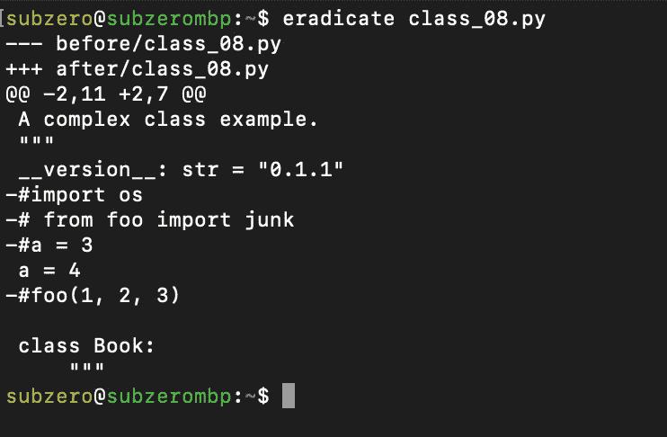

# 我用来制作更好的 Python 代码的 10 个工具

> 原文：<https://levelup.gitconnected.com/10-tools-i-use-to-craft-better-python-code-b9a9776a7871>


图片归功于[https://www.pexels.com/@pixabay](https://www.pexels.com/@pixabay)

我每天都使用这些工具来使我的 Python 代码看起来更好。它们免费且易于使用。

编写漂亮的 Python 比看起来要难。作为我的发布工作流程的一部分，我使用以下工具来使我的代码看起来更好，并删除可避免的错误。

# 1.黑色

在#1 我们有黑色的。Black 是一个不折不扣的 Python 代码重新格式化程序。它将确保你的代码符合 PEP 8 的建议。

您可以使用 pip3 从 pypi 获得黑色:

```
pip3 install --upgrade --user black
```

黑色有丰富的选项，使用`black -h`打印帮助文本。

```
black -t py38 --check *<yourfile>*
```


黑色输出

要使 black 修复文件，请在运行`black`时移除`— check`选项。

# 2.消灭

[根除](https://pypi.org/project/eradicate/)是查找注释掉的代码块的便利工具，排在第二位。你可能不再需要它们了！

您可以使用 pip3:

```
pip3 install --upgrade --user eradicate
```

根除选项很少，使用`eradicate -h`打印帮助文本。

```
eradicate *<yourfile>*
```



根除产量

使用选项`-i`将就地修复你的代码。

# 3.秃鹰

哇，这些模块有令人兴奋的名字！[秃鹫](https://pypi.org/project/vulture/)在#3 会发现不可达的，死代码，并把它处理掉。我在我的美化管道的早期使用这个。

您可以使用 pip3 从 pypi 获得 Vulture:

```
pip3 install --upgrade --user vulture
```

Vulture 有几个选项，使用`vulture -h`打印帮助文本。

```
vulture *<yourfile>*
```


秃鹰输出

# 4.新闻报道

[覆盖率](https://pypi.org/project/coverage/)是 Python 代码分析的鼻祖！第四，我在我的发布工作流中使用覆盖率，只是为了在我的文件中找到我还没有用我的`assert`语句执行的不可到达的代码。

您可以使用 pip3 从 pypi 获得覆盖率:

```
pip3 install --upgrade --user coverage
```

覆盖率有很多选项，我在这里使用它来查找未达到的代码的行号:

```
coverage erase # *erase previous data*
coverage run --branch *<yourfile>* *# run a branch analysis* 
coverage report -m *<yourfile>* # *create a report*
```


覆盖率输出

# 5.Pycodestyle

Pycodestyle 是一个对代码格式吹毛求疵的好工具。它告诉你你的代码与 PEP-8 中的建议有什么不同。因为我通常在我的工作流程中首先运行 black，所以这个工具通常没有什么可报告的。排在第五位的是，这是一个值得加入的列表！

您可以使用 pip3 从 pypi 获得 pycodestyle:

```
pip3 install --upgrade --user pycodestyle
```

Pycodestyle 有很多选项，我在这里使用它来查找未到达代码的行号:

```
pycodestyle --show-source --statistics *<yourfile>*
```


Pycodestyle 输出

# 6.皮林特

Pylint 是这个列表中最重要的工具！我经常在编写向广大读者发布的代码时使用它。

您可以使用 pip3 从 pypi 获得 pylint:

```
pip3 install --upgrade --user pylint
```

Pylint 有大量的选项。我在这里使用可选插件。Pylint 还提供了非常方便的代码评级，有利于游戏化:)

```
pylint --include-naming-hint=y --load-plugins=pylint.extensions.mccabe,pylint.extensions.redefined_variable_type *<yourfile>*
```


Pylint 输出

# 7.Mypy

[Mypy](https://pypi.org/project/mypy/) 在 Python 3.8 中很有用，因为它检查我定义的类型提示是否被正确使用。如果在 Python 代码中使用类型提示，Mypy 真的很有用。

您可以使用 pip3 从 pypi 获得 mypy:

```
pip3 install --upgrade --user mypy
```

Mypy 有很多选择。我在这里以严格模式使用它，并将 Python 版指定为目标。

```
mypy --python-version 3.8 --strict *<yourfile>*
```


Mypy 输出

# 8.Pyflakes

[Pyflakes](https://pypi.org/project/pyflakes/) 是一个非常强大的查找错误的程序。在我的管道的这一点上，pyflakes 很少发现任何新的东西，但是无论如何运行它不需要任何成本！Pyflakes 不检查样式，它检查 bug。

您可以使用 pip3 从 pypi 获取 pyflakes:

```
pip3 install --upgrade --user pyflakes
```

Pyflakes 实际上没有选择——它被设计得非常简单和快速。

```
pyflakes *<yourfile>*
```


薄片产量

# 9.Doctest

[Doctest](https://docs.python.org/3/library/doctest.html) 是 Python 安装的一部分，一个很大的额外收获！如果我在代码中使用了 doctest，那么我希望在发布之前运行它。这里有一个有趣的概念:通过文档进行测试(文字测试)。Doug Hellmann 的这篇文章提供了一些很好的背景。

Doctest 不需要安装。大多数选项都可以在代码文件的 doctest 部分进行配置。这里我使用-v 选项进行详细输出。

```
python3 -m doctest -v *<yourfile>*
```


doctest 输出

# 10.强盗

[Bandit](https://pypi.org/project/bandit/) 是一款安全测试工具。我将它作为最后一道防线包含在我的工作流程中，没有人愿意为安全漏洞负责！

您可以使用 pip3 从 pypi 获得 bandit:

```
pip3 install --upgrade --user bandit
```

Bandit 有许多选项——它被设计成非常可配置的。在这里，我将其配置为跳过错误 B101(断言的使用),只报告中高错误。

```
bandit -s B101 -ll -f screen *<yourfile>*
```


# 11.氡

奖金时间！Radon 是一个非常好的静态代码分析工具。它提供了各种各样的指标，其中一些您可能需要密切关注。Radon 给你的模块、类和方法从 A 到 f 的评级。

您可以使用 pip3 从 pypi 中获取氡:

```
pip3 install --upgrade --user radon
```

Radon 有很多选择。在这里，我运行它的所有检查，并将所有结果打印到终端。

```
radon cc mi raw *<yourfile>* -na
```


氡输出

我真的希望你喜欢这个故事！也许你已经找到了一些你可以使用的东西，或者你有了一些有趣的补充，无论哪种情况，祝你编码愉快，Pythonistas！