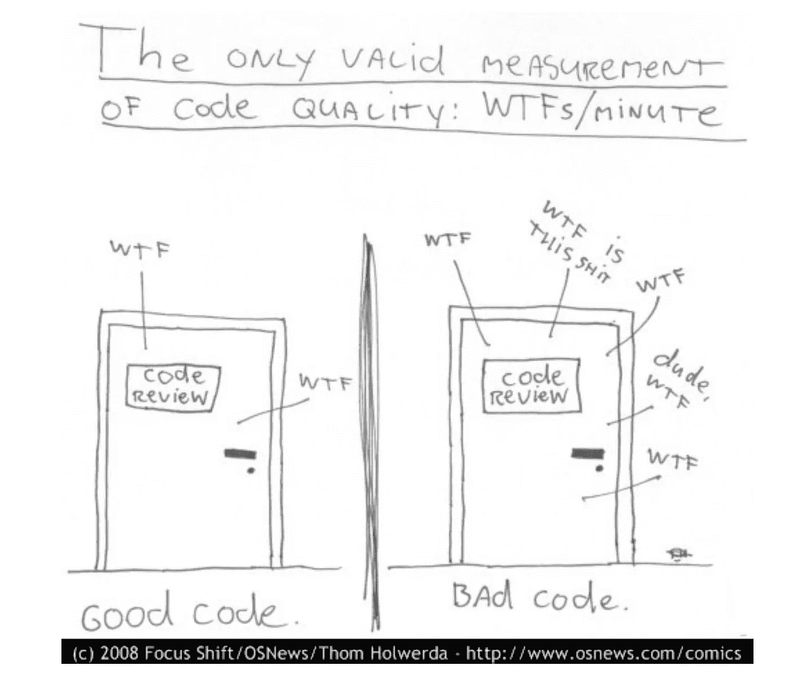
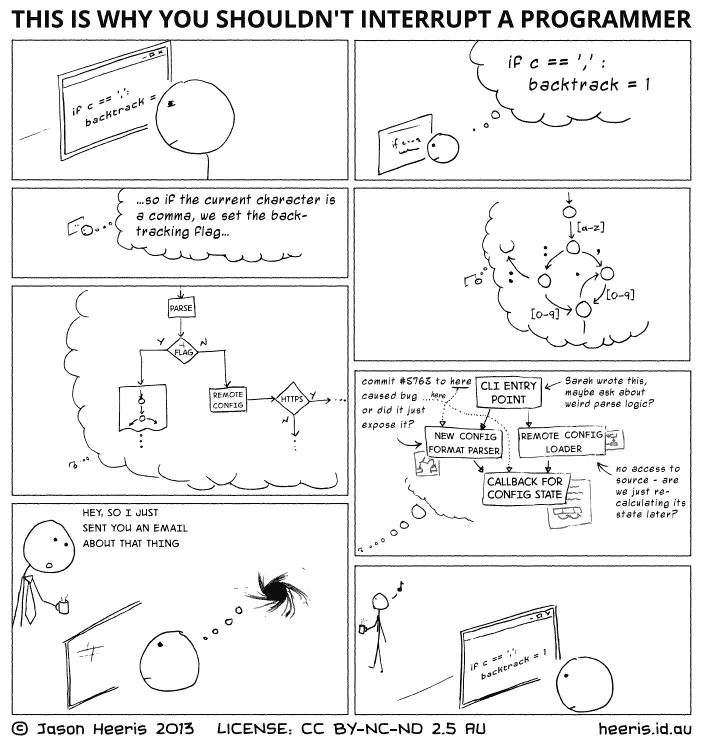
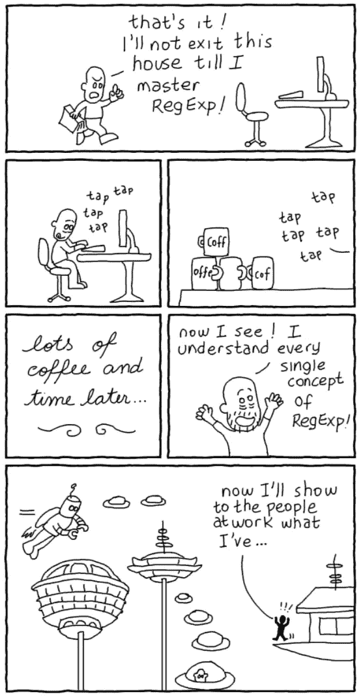
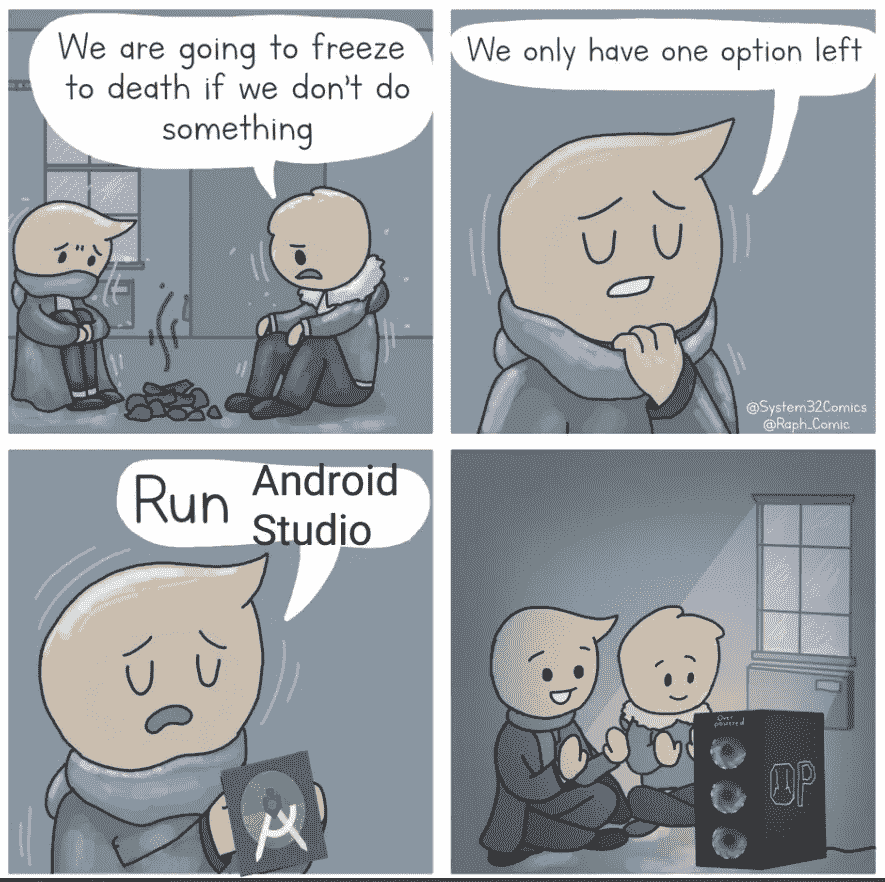
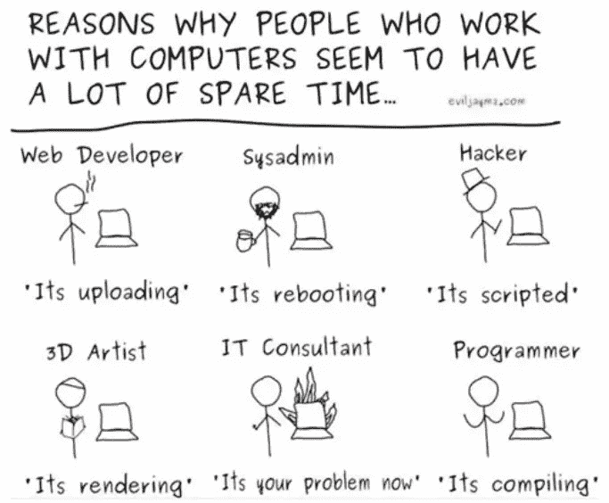
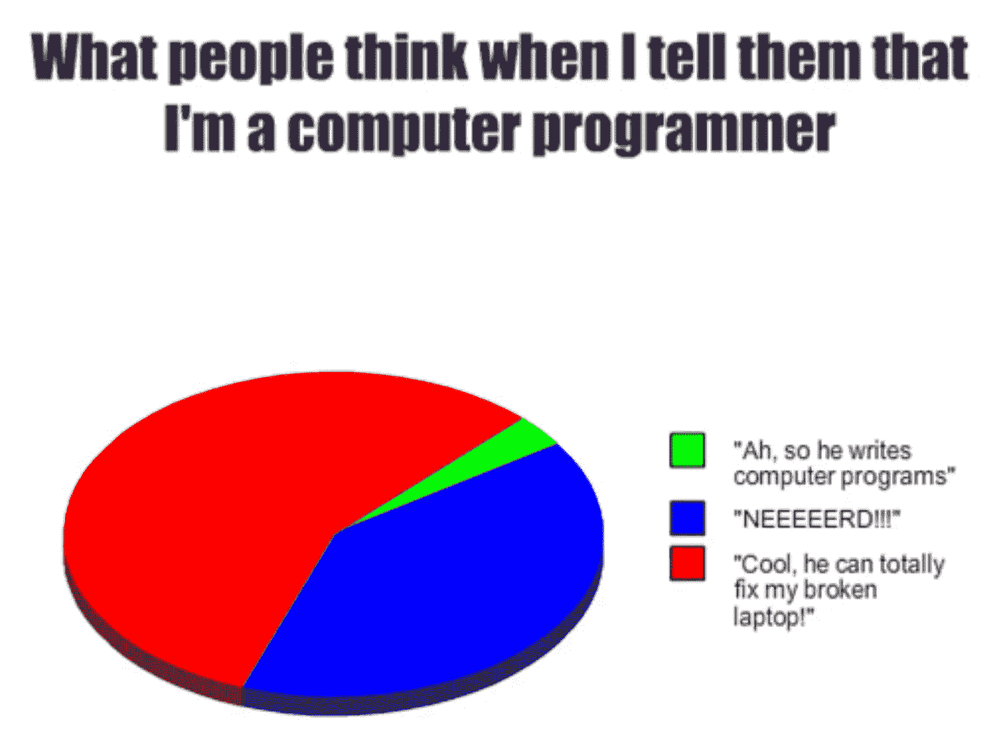
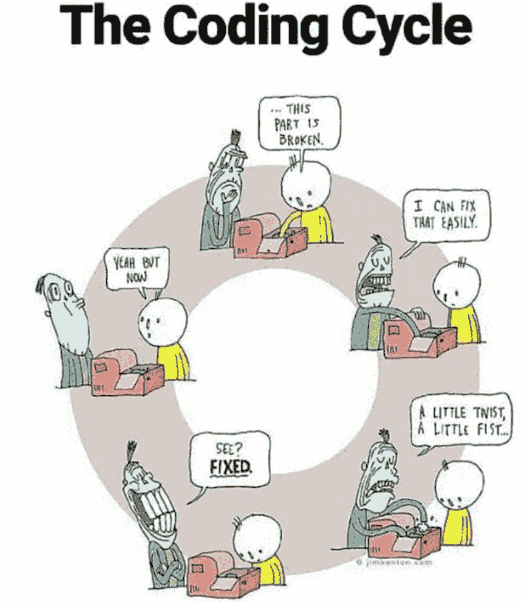
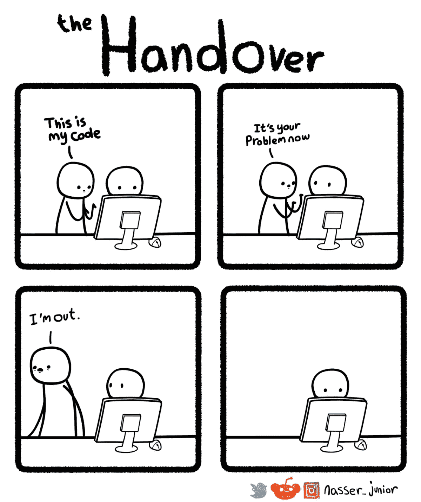
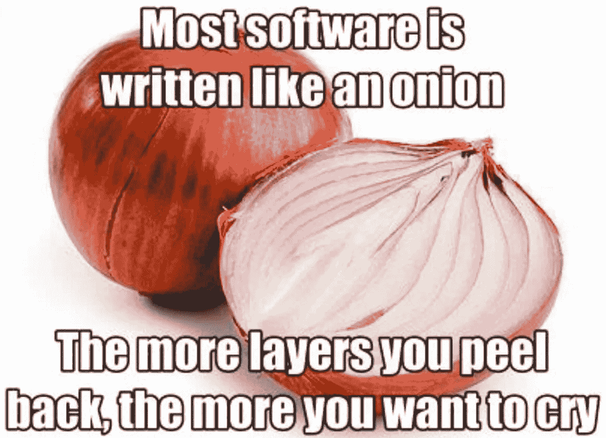

# 10 个终极编程笑话

> 原文：<https://levelup.gitconnected.com/10-ultimate-programming-jokes-96660ff1f92c>

## 幽默

## 程序员生活中的笑话来逗你开心

图片由 [JudaM](https://pixabay.com/users/judam-1486966/?utm_source=link-attribution&utm_medium=referral&utm_campaign=image&utm_content=995213) 来自 [Pixabay](https://pixabay.com/?utm_source=link-attribution&utm_medium=referral&utm_campaign=image&utm_content=995213)

笑是减轻压力的最好工具之一。随着所有疯狂的 WFH 局势的继续，我们——软件开发人员——需要一些东西来让我们振作起来。有什么比嘲笑我们自己更好的方式呢，充分意识到其中隐藏着许多真理。

# 0.你如何衡量代码质量？这部 2008 年的漫画仍然很受欢迎😃

信用:【osnews.com】T4

# 1.自 2013 年以来，又一部超级感人的漫画

致谢:[杰森·赫里斯](https://heeris.id.au/trinkets/ProgrammerInterrupted.pdf)

# 2.这就是为什么我从来没有尝试学习正则表达式

信用:[关闭.美国](http://turnoff.us/geek/mastering-regexp/)

# 3.我的旧笔记本电脑在冬天用来保暖很有用😆

信用:[程序员名称](https://twitter.com/ProgrammersMeme/status/1082230573903593472/photo/1)

# 4.在使用电脑的人的生活中，没有一刻是无聊的

信用: [Jaymz](https://jaymzcd.github.io/)

# 5.我希望我能修好我的笔记本电脑

信用: [CommanderBrot](https://profile.cheezburger.com/CommanderBrot/)

# 6.直觉总是在评估中胜出😉

信用:[monkeyuser.com](https://www.monkeyuser.com/2019/gut-feeling/)

# 7.编码的永恒循环

信用:[编程极客](https://www.facebook.com/programminggeeks.in/posts/the-coding-cycle/1201724583300129/)

# 8.像这样的小错误已经让我多次怀疑我一生的决定

信用:[纳赛尔 _ 朱尼尔](http://www.nasserjunior.com/)

# 9.我喜欢做交接，但不太喜欢做交接😄

信用:[纳赛尔 _ 朱尼尔](http://www.nasserjunior.com/)

# 奖金:我知道我们都喜欢一点点奖金

我可以为这一个担保😢

信用:[编程极客](https://www.facebook.com/programminggeeks.in/photos/1597775270361723)

如果您还不是 Medium， [**的付费会员，您可以通过访问此链接**](https://lokajit-tikayatray.medium.com/membership) 进行注册。你可以无限制地阅读媒体上的所有报道。我会收你一部分会员费作为介绍费。

***感谢边看边笑。如果你想切换到更有趣的话题，你可能会喜欢阅读* :**

 [## 3 分钟内 101 个令人捧腹的编程笑话

### 你了解二进制吗？别担心，这些笑话仍然会逗得你捧腹大笑。

levelup.gitconnected.com](/101-hilarious-programming-jokes-in-3-minutes-6a2ebcd81f56)  [## 作为一名软件开发人员，如何在工作中保持动力

### 有一个适当的计划来避免精疲力尽并在不断挑战和要求的软件中茁壮成长是至关重要的…

levelup.gitconnected.com](/how-to-stay-motivated-at-work-as-a-software-developer-884b4e75fb51) 

# 分级编码

感谢您成为我们社区的一员！ [**订阅我们的 YouTube 频道**](https://www.youtube.com/channel/UC3v9kBR_ab4UHXXdknz8Fbg?sub_confirmation=1) 或者加入 [**Skilled.dev 编码面试课程**](https://skilled.dev/) 。

 [## 编写面试问题+获得开发工作

### 掌握编码面试的过程

技术开发](https://skilled.dev)