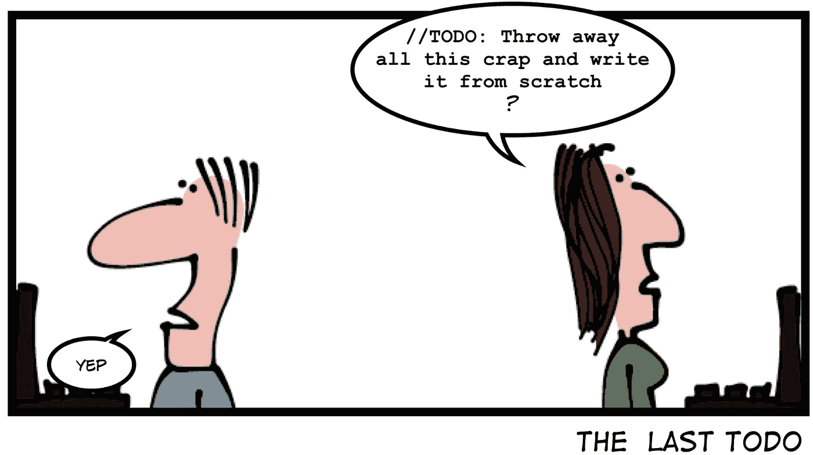

# 10 个终极编程笑话

> 原文：<https://levelup.gitconnected.com/10-ultimate-programming-jokes-a5fbc5880a57>

## 幽默

## 让你笑到肚子疼的笑话

使用 kapwing.com 创建的图像

软件开发不仅仅是一份工作；这是一种体验。这是一种创造性的努力。

开发人员认识到他们每天都在经历一场疯狂的旅程，来构建能够减轻地球上其他人的问题的软件。兴奋、绝望、焦虑、沮丧和其他各种各样的情绪都是程序员日常工作的一部分。

从所有这些经历中得到线索，这里试图通过笑话和连环漫画来呈现开发人员的旅程。

> **注意:**如果您正在喝热饮料，请在进一步阅读前安全放下。

# 0.产品开发 101

信用:[猴子用户](https://www.monkeyuser.com/2021/outcome-variables/)

需求规格通常是抽象的。任何曾经为客户开发过软件的人都知道，这些规格很难与期望的最终产品相匹配。最重要的是，低于要求的预算和紧张的截止日期使得很难满足客户的期望。

# 1.期望与现实

信用: [CommitStrip](https://www.commitstrip.com/en/2017/01/21/first-deployment/)

作为开发人员，我们总是对自己有很高的期望。我们在开发过程中尽最大努力，并期望其他可能发生的事情尽可能顺利。部署对我们来说是小菜一碟。

不幸的是，部署经常暴露我们所有的失误和疏忽。整个时间感觉就像坐在椅子上，直到一切都解决了，我们得到了认可。

# 2.你质疑生活中一切的时候

信用:[猴子用户](https://www.monkeyuser.com/2021/meaning/)

软件工程是一个令人兴奋的职业。但是有些时候会觉得无法继续下去。交付压力、精疲力竭、客户的频繁投诉、试图赶上最新的技术趋势等等。，让保持动力变得很困难。

这就是为什么有时候开发者会质疑他们自己的存在。

# 3.谁会阅读文档呢

信用:[极客&戳](https://geek-and-poke.com/?offset=1441229868030)

我承认我不太喜欢阅读文档。任何超过六到七页的内容都会让我昏昏欲睡。但是，这并不意味着创建文档的人可以放松。

有些情况下，有人需要参考文档，而且文档最好是准确的。

# 4.权宜之计

信用:[工作时间](https://workchronicles.com/long-term-thinking/)

聪明的软件开发人员可以随时找到任何问题的解决方案。在很多情况下，这些解决方案更多的是补丁，而不是真正的修复。但是你不能因此责怪程序员。他们经常不得不用有限的资源来挽救局面。

然而，请永远记住，未来公司中的一些聪明的开发人员也可能会有同样的想法。😄

# 5.努力工作的程序员

信用: [CommitStrip](https://www.commitstrip.com/en/2014/09/12/just-another-friday-afternoon/)

程序员是勤奋的生物。无论是在一周中的哪一天或一天中的什么时间，他们都喜欢支持他们的系统。只要确保你没有背着他们偷看他们的屏幕。

# 6.软件的永恒魅力

信用:[岔道](https://turnoff.us/geek/the-depressed-developer-51/)

我可以为这一个担保。每当我得到一台新的笔记本电脑或重新制作它的映像时，我保证会小心安装软件。我不想让我的系统因为我很少使用的软件而变得臃肿，并降低它的速度。

不幸的是，这个承诺和我的新年决心一样多。

# 7.最后一件事

鸣谢:[极客&戳](https://geek-and-poke.com/?offset=1441229868030)

添加 TODOs 很容易，但删除编程元素却很难。这就是为什么当我在代码中看到 TODOs 时，我会紧张。我在编码时尽量少用它们。

然而，即使一个 TODO 也有能力改变你的整个程序。

# 8.面试中最受欢迎的问题

信用:[工作时间](https://workchronicles.com/learn-to-say-no/)

我也不打算详细阐述这一点。😄

# 9.主动审查者

信用:[工作场所漫画](https://www.reddit.com/r/ProgrammerHumor/comments/lxk09d/code_reviews/)

当有人删除了一段代码，认为他们保持了代码的整洁，但是却破坏了一个功能时，你有什么感觉？

我不太喜欢评审员不经核实就删除我的代码。评论者有多聪明并不重要；这种英雄行为的结局几乎总是很糟糕。

# 奖金:我知道我们都喜欢一点点奖金

好了，是时候结束我们开始的笑话了。

有一个关心团队动机的领导者总是好的，只要他们知道如何正确地做。

信用:[工作时间](https://workchronicles.com/get-inspired/)

如果您还不是 Medium， [**的付费会员，您可以通过访问此链接**](https://lokajit-tikayatray.medium.com/membership) 进行注册。你可以无限制地阅读媒体上的所有报道。我会收你一部分会员费作为介绍费。

**感谢你阅读时的欢笑。您可能还想阅读:**

 [## 这就是软件开发人员在职业生涯中失败的原因

### 知道原因，这样你就可以避免犯同样的错误

levelup.gitconnected.com](/this-is-why-software-developers-fail-to-succeed-in-their-career-5dd9fa94c006)  [## 让你开怀大笑的 10 个令人捧腹的编程笑话

### 即使你不是程序员，这些笑话也会让你的一天变得更好

levelup.gitconnected.com](/10-hilarious-programming-jokes-to-make-you-laugh-hard-9959cbdccb47)  [## 缺乏经验的程序员的 7 大标志

### 了解这些迹象，这样你就不会在你的软件开发生涯中犯同样的错误

levelup.gitconnected.com](/top-7-signs-of-an-inexperienced-programmer-5fc3f04658f3)