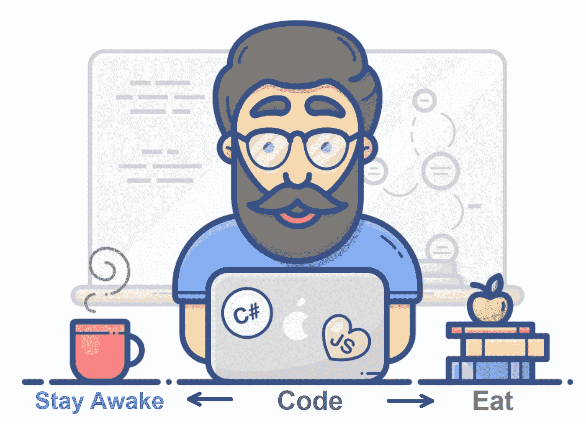
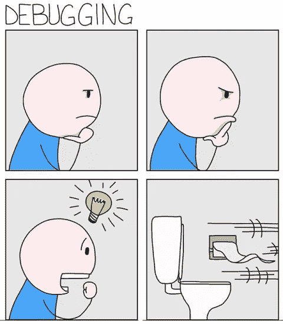
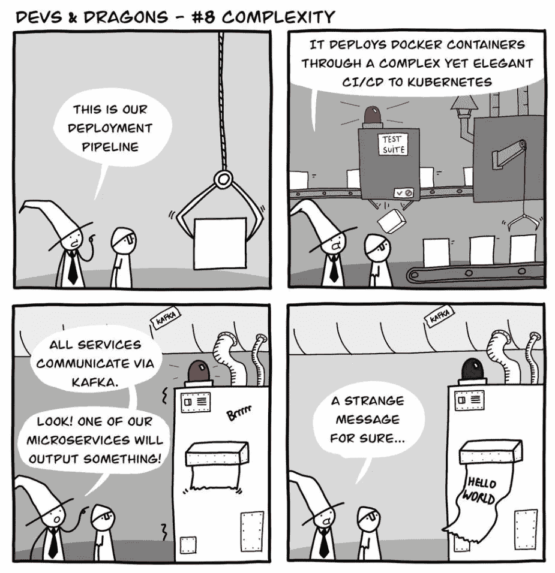
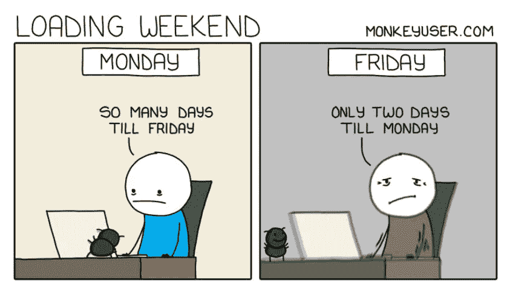
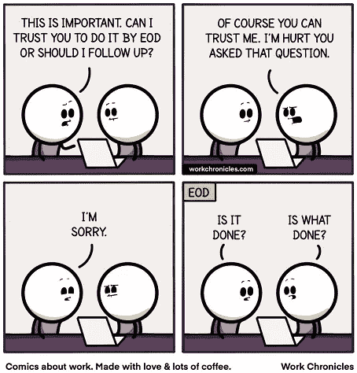
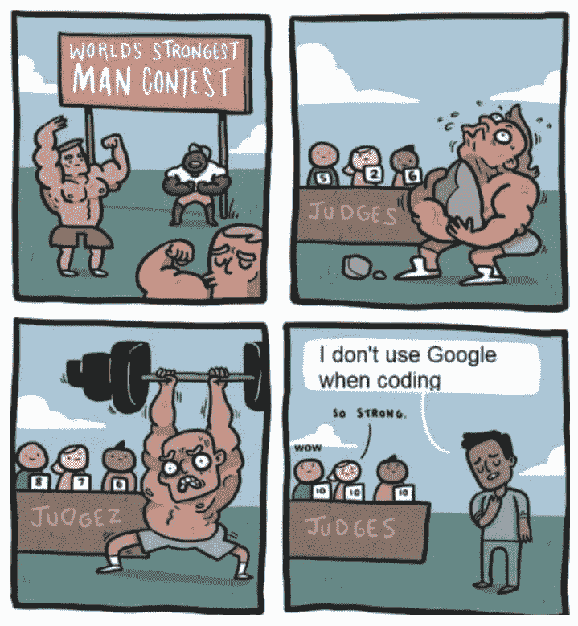
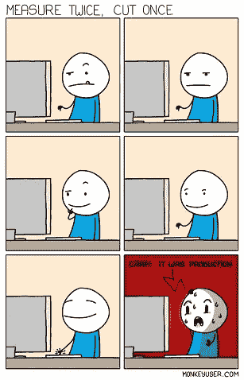
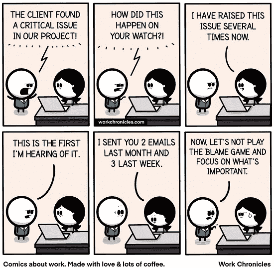
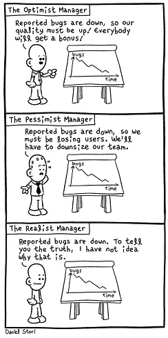
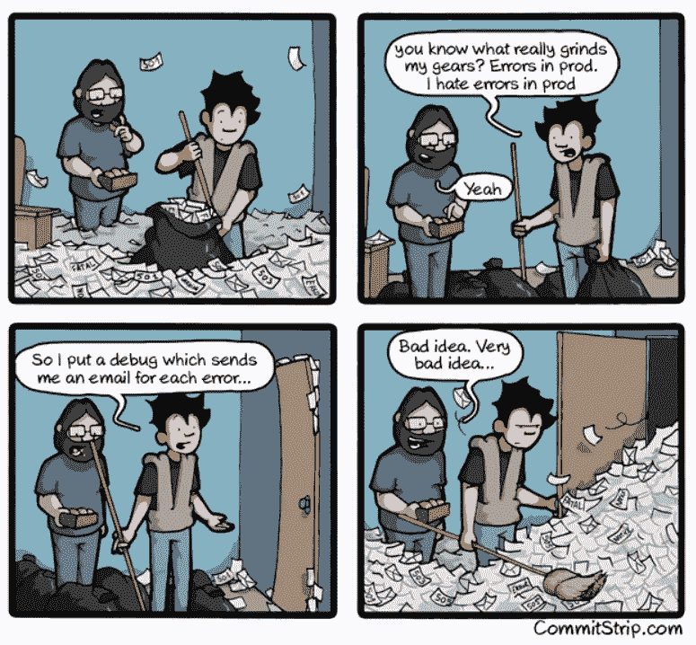

# 10 个终极编程笑话，由程序员为程序员而写

> 原文：<https://levelup.gitconnected.com/10-ultimate-programming-jokes-by-the-programmers-for-the-programmers-4e24a3b701f2>

## 幽默

## 让你笑破肚皮的笑话，即使你不是程序员

使用 kapwing.com 创建的图像

软件工程师的日常生活充满了激动人心的事件。我们既要和男人/女人(经理)打交道，也要和机器打交道。因此，成为一名程序员需要真正的勇气。

没有比通过笑话和连环画更好的方式来表达一个开发者的日常生活了。因此，我给你带来了一些基于程序员真实生活事件的最好笑的笑话。请坐下来享受它们。我肯定你会笑得前仰后合。

> **注意:**如果您正在喝热饮，请在继续阅读前安全放下。

# 0.当一个想法出现时

信用:[猴子用户](https://www.monkeyuser.com/2018/debugging/)

程序员的头脑总是忙于寻找新的想法或试图找到解决问题的方法。即使在去洗手间的时候，他们也一直在思考。而且，当想法最终出现时，他们迫不及待地去尝试。

哦，等等，笑话还没完呢。读到最后的奖金笑话，看看美丽心灵是如何捉弄程序员的。

# 1.保持简单

致谢:Dev & Dragons

几乎所有的公司都希望他们的应用程序和管道采用最新最好的技术。手头的任务是否需要工具和软件并不重要。谁还在乎保持简单的原则！

# 2.时间总是相对的

信用:[猴子用户](https://medium.com/p/4e24a3b701f2/edit)

这是程序员们的一种长期感觉。对周五的等待似乎永无止境。但是一旦星期五到来，接下来的两天会以闪电般的速度过去。

# 3.信任被高估了

鸣谢:[作品编年史](https://workchronicles.com/)

没有一个程序员喜欢被跟踪。他们知道如何做好自己的工作并负责任。你需要相信他们会在截止日期前交付。

除非你以前因为信任他们而吃过苦头。既然如此，就不要问了；稍微跟进一下。

# 4.地球上最强壮的人

信用:thecoderpedia.com

我们这些程序员无法想象没有谷歌的编码。StackOverflow 是我们解决日常问题的首选。在这种情况下，如果有人不用它们就能编码，他们就能在比赛中获得所有 10 分的荣誉。

# 5.生产的恐怖

信用: [MonkeyUser](https://www.monkeyuser.com/)

当谈到做出改变时，只有勇敢和无垢者才能参与制作。对于我们这些普通的程序员来说，non-prod 是一个完美的环境。

因此，在把手指放在键盘上之前，要十次确认你在哪个环境下工作。

# 6.程序员的迷人生活

thecoderpedia.com

我们程序员总是忙于我们最喜欢做的事情，也就是编程。即使在睡梦中，我们也会梦到它。所以，我想，让我开始培养一种爱好，让我不再想编程。

我做了什么？我开始写关于编程的东西。

# 7.请不要推卸责任

鸣谢:[作品编年史](https://workchronicles.com/accountability/)

在软件开发中，除非经理同意，否则什么都不是问题。由于人员和流程的责任，经理很难跟踪周围发生的一切。所以，让他们休息一下。

下次你想指出他们的错误(责任)时，就在他们没在听的时候指出来。

# 8.现实主义经理

信用:[关闭美国](https://turnoff.us/geek/the-realist-manager/)

确切的数字对不同的人有着不同的含义，这总是让我感到惊讶。根据他们的观点，结论从高度肯定到完全否定不等。但是现实主义者总是说实话。

现在，难道我们都不希望有一个现实主义的经理吗？

# 9.这一次打击离家如此之近

信用: [CommitStrip](https://www.commitstrip.com/en/2015/03/23/brace-yourself-debug-is-coming/)

开发人员记录错误，然后在 Splunk 中创建电子邮件通知，在每次发生错误时提醒他们。最棒的是，他们将群电子邮件 id 添加到通知中。

结果是，数百封通知邮件大多自动发送到删除文件夹，没有人查看它们。

# 奖金:我知道我们都喜欢一点点奖金

好了，是时候结束我们开始的笑话了。

通常情况下，这些想法不会实现。而且，程序员回到他们的君临，在试图完成他们以前未完成的工作时，进一步构思。

信用:[猴子用户](https://www.monkeyuser.com/2018/debugging/)

如果您还不是 Medium， [**的付费会员，您可以通过访问此链接**](https://lokajit-tikayatray.medium.com/membership) 进行注册。你可以无限制地阅读媒体上的所有报道。我会收你一部分会员费作为介绍费。

**感谢阅读时的欢笑。您可能还想阅读:**

 [## 让你疯狂的 10 个搞笑编程笑话

### 程序员日常生活中的笑话逗你笑骨

levelup.gitconnected.com](/10-hilarious-programming-jokes-to-make-you-go-rofl-2e1ab8182b1d)  [## 缺乏经验的程序员的 7 大标志

### 了解这些迹象，这样你就不会在你的软件开发生涯中犯同样的错误

levelup.gitconnected.com](/top-7-signs-of-an-inexperienced-programmer-5fc3f04658f3) 

# 分级编码

感谢您成为我们社区的一员！[订阅我们的 YouTube 频道](https://www.youtube.com/channel/UC3v9kBR_ab4UHXXdknz8Fbg?sub_confirmation=1)或加入 [Skilled.dev 编码面试课程](https://skilled.dev/)。

 [## 编写面试问题+获得开发工作

### 掌握编码面试的过程

技术开发](https://skilled.dev)