# 使用 Python 循环的 10 种未知方法

> 原文：<https://levelup.gitconnected.com/10-unexplored-ways-to-use-python-loops-3064ab3c9bcb>

## 这将有助于你在竞争编程

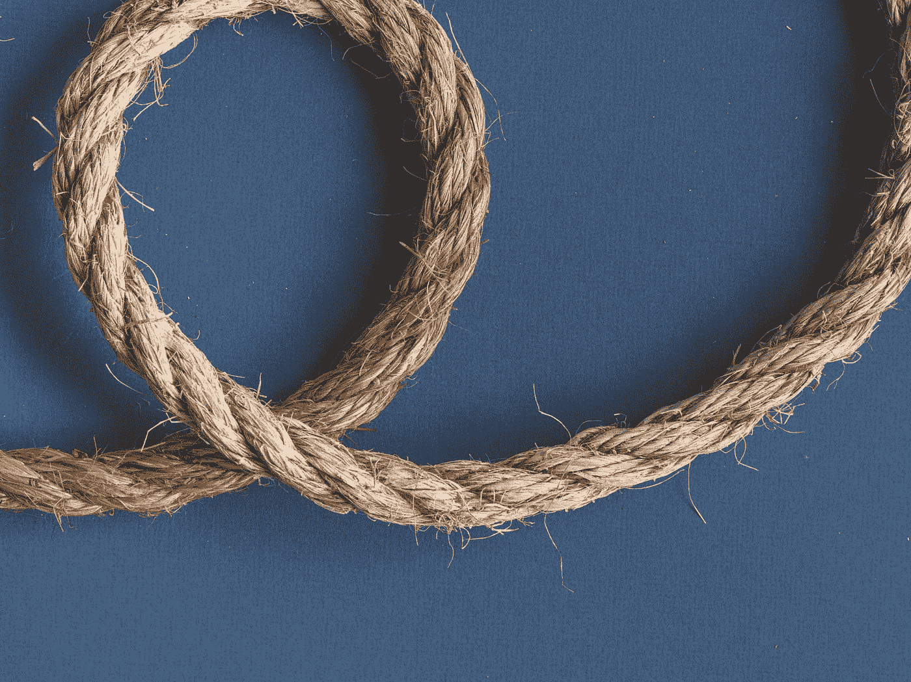

照片由[基尔拍摄...在望](https://unsplash.com/@kierinsight?utm_source=medium&utm_medium=referral)上[下](https://unsplash.com?utm_source=medium&utm_medium=referral)

Python 支持各种循环策略，每种策略都通过特定的内置方法实现，并存储在各种顺序容器中。

这些方法在各种项目中很有帮助，这些项目需要特定的方法，循环保持代码的一般结构。

此外，这些方法有助于竞争性编程。由于在使用传统的循环方法时不需要声明额外的变量，因此节省了大量的时间和存储空间。

# 为什么 Python 中需要循环？

在大多数情况下，组成函数的语句按以下顺序执行:首先执行函数中的第一条语句，然后执行第二条语句，依此类推。您可能会发现自己必须连续多次运行一段代码。

编程语言配备了各种控制结构，使得创建更复杂的执行路径成为可能。我们可以使用循环语句重复执行一条语句或一系列语句。

# **1。While 循环**

Python 的 while 循环允许连续执行一组语句，直到满足指定的条件。这可以通过使用 while 关键字来实现。当条件不再满足时，程序中位于循环之后的那一行代码将被执行。

> 例子

```
count = 0while (count < 5):
    count = count + 1
    print(“Hey young readers”)
```

> 输出

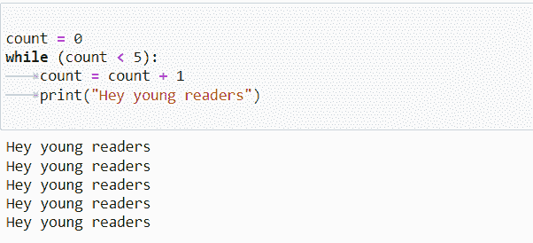

# 2.For 循环

为了进行顺序遍历，使用了`for` 循环。例如，遍历列表、字符串、数组等中的项目。让我们回顾一下 for-in 循环执行顺序遍历的步骤。

> 例子

```
a = 5for i in range(0, a):
    print(i)
```

> 输出

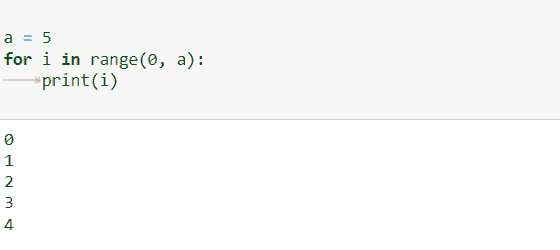

# 3.无限循环

通过使用 while 语句，我们可以生成一个无限循环——当 while 循环的条件始终为真时，就会产生一个无限循环。

> 例子

```
while True:
    num = int(input(“Enter an integer: “))
    print(“The sqaure of”,num,”is”,num * num)
```

> 输出

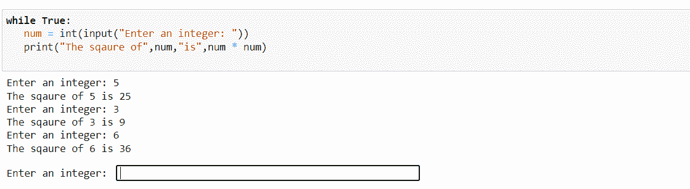

# 4.在字符串中循环

甚至字符串也可以作为可迭代对象，因为它们的字符有预先确定的顺序:

> 例子

```
for x in “Python”:
    print(x)
```

> 输出

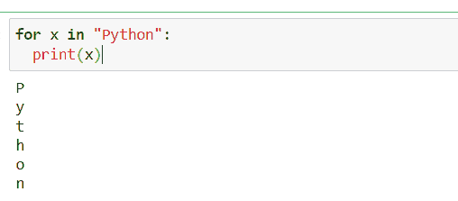

# 5.通过序列的索引进行迭代

此外，我们可以使用序列中项目的索引进行迭代。最关键的一步是计算出列表有多长，然后继续迭代序列，同时记住列表的长度。

> 例子

```
list = [“Loops”, “in”, “python”]for index in range(len(list)):
    print (list[index])
```

> 输出

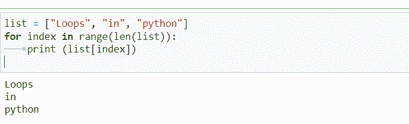

# 6.Range()函数

我们可能会多次使用 range()方法来遍历一个代码块。range()函数生成一个整数序列，默认情况下，该序列从 0 开始，按 1 递增(默认情况下)，并在您作为函数参数提供的数字处停止。

> 例子

```
dance = [‘salsa’, ‘classical’, ‘jazz’]for i in range(len(genre)):
    print(“I love”, genre[i])
```

> 输出

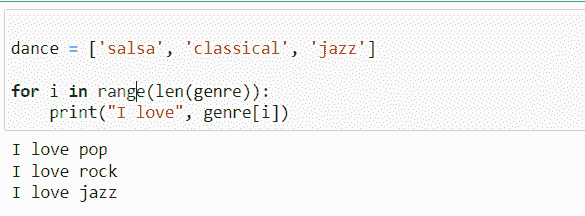

# 7.嵌套循环

当一个循环包含在另一个循环中时，就形成了嵌套循环。每次通过外循环时，内循环将执行一次，然后继续下一次迭代。

> 例子

```
from __future__ import print_functionfor i in range(2, 8):
    for j in range(i):
        print(i, end=’ ‘)
    print()
```

> 输出

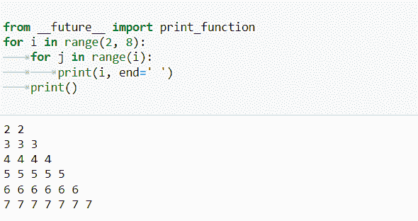

# 8.否则在 For 循环中

在 for 循环中使用时，else 关键字标识循环完成后将执行的一段代码:

> 例子

```
for x in range(8):
    print(x)else:
    print(“Executed the program!”)
```

> 输出

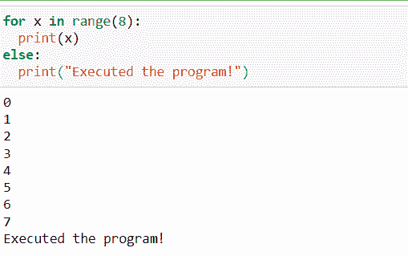

# 9.连续语句

在 continue 语句的帮助下，我们能够结束当前运行的循环迭代，并继续下面的操作。

> 例子

```
Days = [“Monday”, “Tuesday”, “wednesday”]for x in Days:
    print(x)
    if x == “Tuesday”:
        continue
```

> 输出

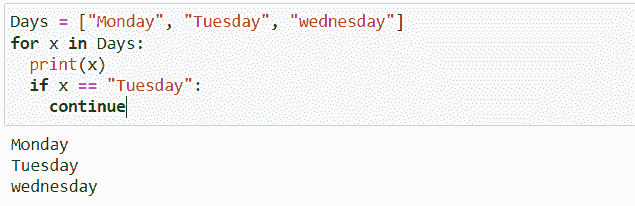

# 10.break 语句

如果我们使用 break 语句，我们可以在循环遍历完所有对象之前终止循环:

> 例子

```
Days = [“Monday”, “Tuesday”, “wednesday”]for x in Days:
    print(x)
    if x == “Tuesday”:
        break
```

> 输出

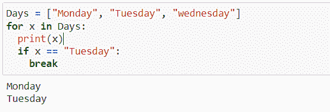

# 结论

在这篇文章中，我们讨论了 Python 中可能用到的各种循环，以及不同的语句和它们各自的语法。在上一节中，我们还给出一个可视化示例，解释了如何在 Python for 循环中使用 break 和 continue 命令。

> *在你走之前……*

如果你喜欢这篇文章，并希望**继续关注**更多关于 **Python &数据科学**的**精彩文章**——请点击这里[https://pranjalai.medium.com/membership](https://pranjalai.medium.com/membership)考虑成为一名中级会员。

请考虑使用 [**我的推荐链接**](https://pranjalai.medium.com/membership) 报名。通过这种方式，会员费的一部分归我，这激励我写更多关于 Python 和数据科学的令人兴奋的东西。