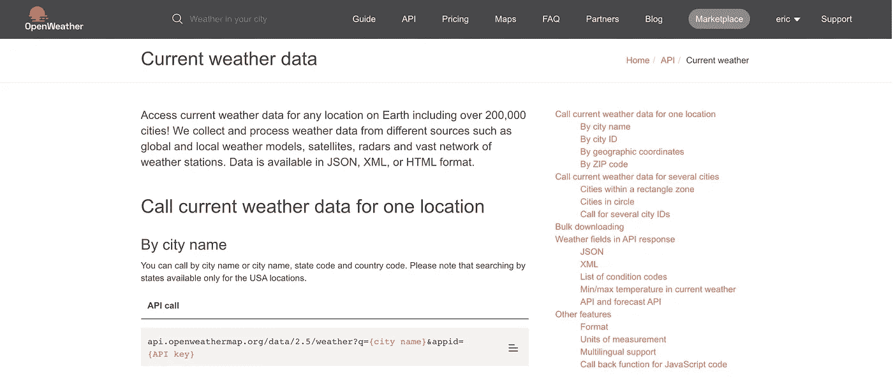
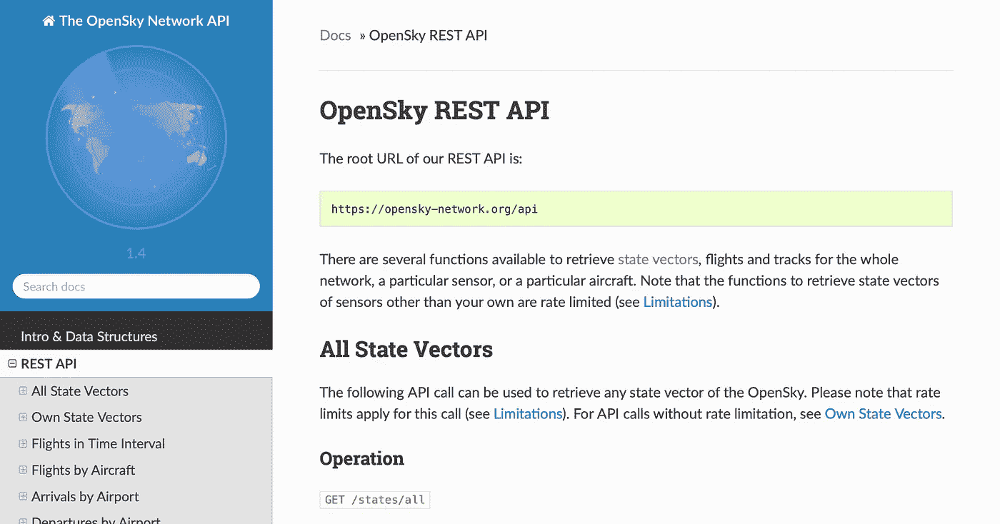
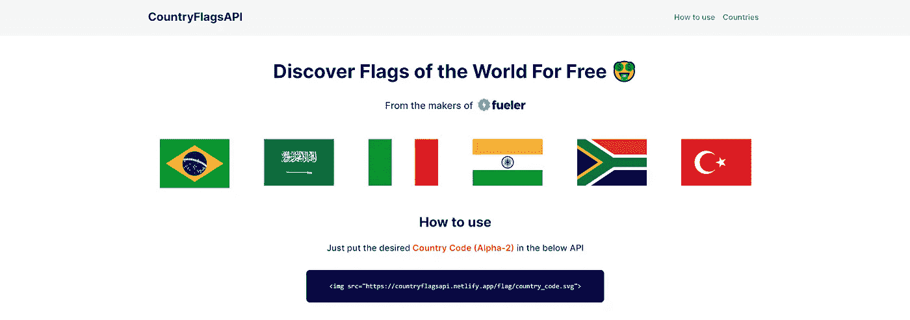
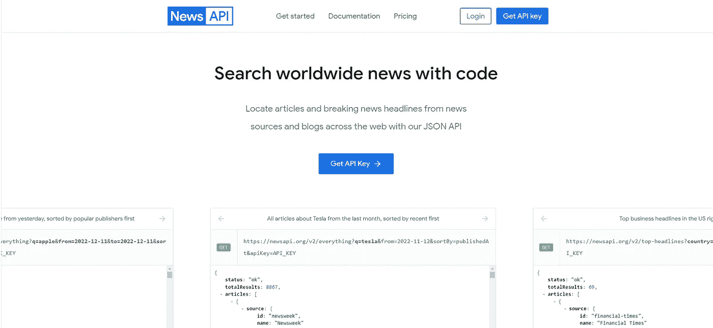
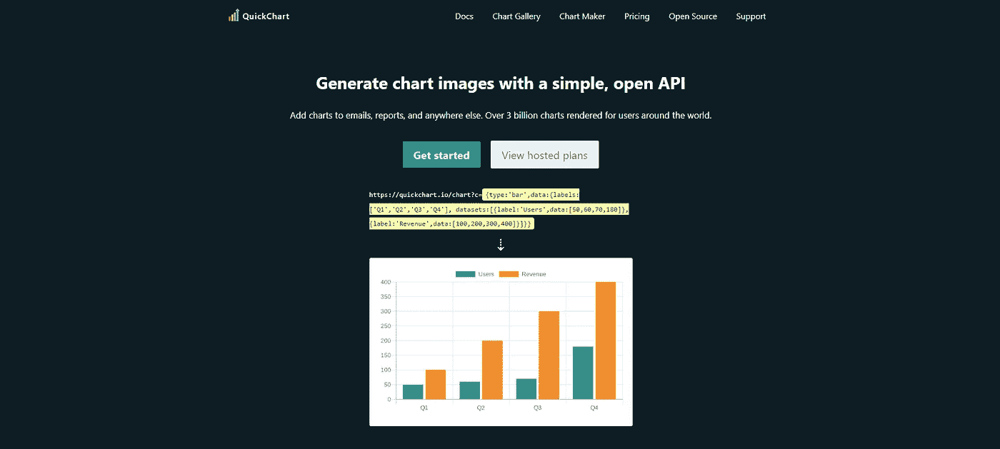
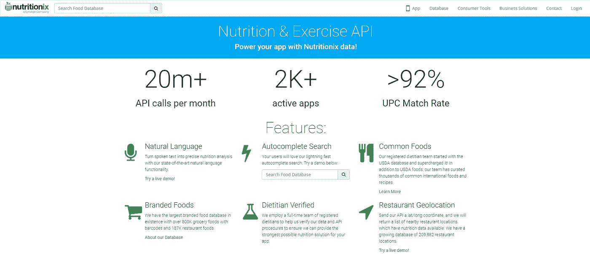
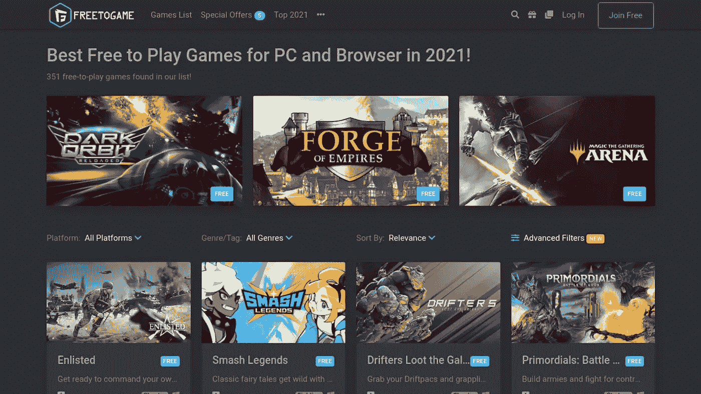
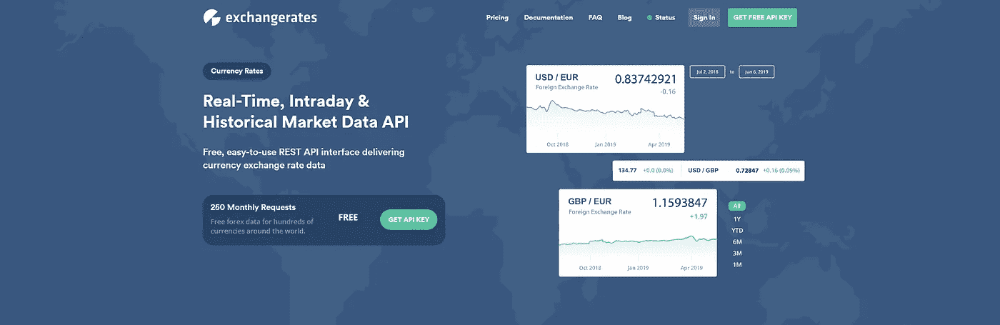
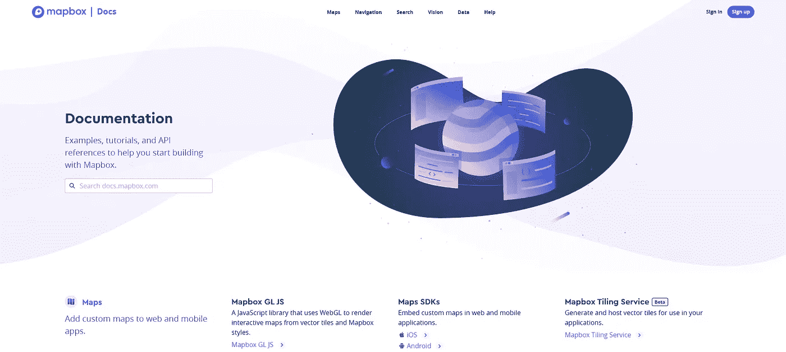

# 10 个对你下一个项目有用的 API

> 原文：<https://levelup.gitconnected.com/10-useful-apis-for-your-next-project-4236e4b45bbf>

有兴趣为您的下一个项目配备最强大的 APL 吗？我整理了 11 个可用的最佳 API 列表。

这里有一些很棒的 API，可以用来增强你的下一个项目！

## 1.[打开天气图](https://openweathermap.org/api)

开放的天气地图提供了当前的天气信息，任何地方，包括超过 20 万个城市。

OpenWeather API 是一个非常有用的 API，对于那些想了解 REST APIss 是什么以及如何在他们的项目中使用 REST API 的编程初学者来说。

打开天气图 Img

## 2. [OpenSky API](https://openskynetwork.github.io/opensky-api/)

您可以将 OpenSky 的 REST API 用于个人和非盈利用途，但任何商业用途都必须经过批准。APl 是专门为 REST API 编写的。APl 包括对飞机数据库的访问。

## 3.[国旗](https://countryflagsapi.netlify.app/)

免费探索世界各国国旗！

## 4.[新闻 API](https://newsapi.org/)

News API 是一个简单易用的 REST API，它返回全球 80，000 多个来源发布的当前和历史新闻文章的 JSON 搜索结果。

## 5.[快速图表 API](https://quickchart.io/)

通过一次 API 调用创建一个图表图像，并将其嵌入到任何地方。向电子邮件、报告和任何其他地方添加图表。

## 6.[打开库 API](https://openlibrary.org/developers/api)

Open Library 提供了一套 API 来帮助开发者使用我们的数据。这包括 RESTful APIs，它使得开放库数据以 JSON、YAML 和 RDF/XML 格式可用。

还有一个更早的，现在已经废弃的 JSON API，它是为了向后兼容而保留的。

## 7. [Nutritionix API](https://www.nutritionix.com/business/api)

Nutritionix API 为数百种健康和健身应用提供了一流的营养数据库解决方案。

## 8.[电影 API](https://rapidapi.com/apidojo/api/online-movie-database)

这个 API 帮助查询关于电影、演员、角色等的所有信息。创建电影/连续剧/流媒体内容网站/应用程序

## 9.[免费游戏 API](https://www.freetogame.com/api-doc)

免费游戏数据库 API(又名 FreeToGame API)可供任何人无限制使用。请注意，我们的 API 是免费使用的，只要您将 FreeToGame 作为数据源。

## 10.[汇率 API](https://exchangeratesapi.io/)

Exchangeratesapi.io 是一个金融 api，为 160+种世界货币和贵金属提供可靠准确的货币汇率。

该 API 易于使用，既适合小型创业公司，也适合较大的公司。它广泛应用于金融部门、移动应用程序和后台系统。

## 11. [Mapbox API](https://docs.mapbox.com/#maps)

Mapbox 是一个位置数据平台，为许多流行应用程序中使用的地图和位置服务提供支持。

## 结论

简而言之，API 可以显著增强项目的功能和能力。无论你在做什么类型的项目，都可能有一个 API 可以帮助你实现它。

有了这些 API，你可以用你的想法创造出真正创新和令人印象深刻的解决方案。

感谢阅读，如果你喜欢这篇文章，请分享🤞💜

查看我的[Twitter](https://twitter.com/souptikdn)&[LinkedIn](https://www.linkedin.com/in/souptikdn/)获取更多精彩内容。

立即创建您的 [Fueler](https://fueler.io/register) 个人资料！

