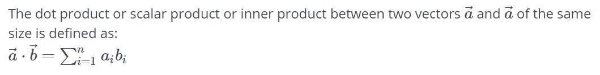
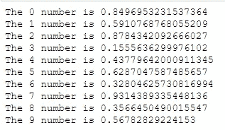
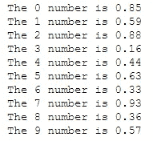

# 数据科学家的 10 个有用提示

> 原文：<https://levelup.gitconnected.com/10-useful-tips-for-data-scientists-1b5762285086>

## 面向数据科学家的 Python 和 R 技巧和窍门


[Unsplash](https://images.unsplash.com/photo-1471922694854-ff1b63b20054?ixid=MnwxMjA3fDB8MHxwaG90by1wYWdlfHx8fGVufDB8fHx8&ixlib=rb-1.2.1&auto=format&fit=crop&w=2252&q=80) 上的图像

我们已经开始为数据科学家撰写一系列关于技巧和诀窍的文章(主要在 **Python** 和 **R** )。

# 数据科学家过去的技巧和诀窍

如果你错过了:

**第一卷:**

[](https://betterprogramming.pub/10tips-and-tricks-for-data-scientists-vol-1-a870455325da) [## 数据科学家的 10 个技巧和诀窍

### R 和 Python 中有用的代码片段

better 编程. pub](https://betterprogramming.pub/10tips-and-tricks-for-data-scientists-vol-1-a870455325da) 

**第二卷:**

[](https://betterprogramming.pub/10-tips-and-tricks-for-data-scientists-vol-2-5640ccd1aa5e) [## 数据科学家的 10 个惊人技巧和诀窍

### 一些更有用的 R 和 Python 代码片段

better 编程. pub](https://betterprogramming.pub/10-tips-and-tricks-for-data-scientists-vol-2-5640ccd1aa5e) 

**第三卷:**

[](https://betterprogramming.pub/10-tips-and-tricks-for-data-scientists-part-3-52ffbddcba26) [## 数据科学家会喜欢的 10 个真实世界的提示和技巧

### Python、R 等语言中一些更有用的代码片段

better 编程. pub](https://betterprogramming.pub/10-tips-and-tricks-for-data-scientists-part-3-52ffbddcba26) 

**第四卷:**

[](https://betterprogramming.pub/10-tips-and-tricks-for-data-scientists-vol-4-76b0b732a94f) [## 数据科学家的 10 个 Python 和 R 技巧

### 在 Pandas 中输入缺失值，用 mode 替换分类变量，等等

better 编程. pub](https://betterprogramming.pub/10-tips-and-tricks-for-data-scientists-vol-4-76b0b732a94f) 

**第五卷:**

[](https://betterprogramming.pub/10-tips-and-tricks-for-data-scientists-vol-5-ef86aea08b6c) [## 数据科学家的 10 个更多提示和技巧(第 5 卷)

### 对日常任务有用的代码片段

better 编程. pub](https://betterprogramming.pub/10-tips-and-tricks-for-data-scientists-vol-5-ef86aea08b6c) 

**第六卷:**

[](https://betterprogramming.pub/5-powerful-python-and-r-tricks-for-data-scientists-e35dd9050750) [## 数据科学家的 5 个强大的 Python 和 R 技巧

### R 和 Python 中有用的代码片段

better 编程. pub](https://betterprogramming.pub/5-powerful-python-and-r-tricks-for-data-scientists-e35dd9050750) 

# 计算机编程语言

## 1.Numpy 数组和 Python 列表的区别

Numpy 数组和 Python 列表之间有一些区别。我们将提供一些代数运算符的例子。

**'+'运算符**

```
import numpy as np

alist = [1, 2, 3, 4, 5]   # Define a python list. It looks like an np array
narray = np.array([1, 2, 3, 4]) # Define a numpy array

print(narray + narray)
print(alist + alist)
```

**输出:**

```
[2 4 6 8]
[1, 2, 3, 4, 5, 1, 2, 3, 4, 5]
```

注意，NumPy 数组上的 **'+'** 操作符执行元素相加，而 Python 列表上的相同操作会导致列表串联。编码时要小心。知道这一点可以省去很多头疼的事。

**'* '运算符**

与产品操作员`*`相同。在第一种情况下，我们缩放向量，而在第二种情况下，我们连接三次相同的列表。

```
print(narray * 3) 
print(alist * 3)
```

**输出:**

```
[ 3 6 9 12] 
[1, 2, 3, 4, 5, 1, 2, 3, 4, 5, 1, 2, 3, 4, 5]
```

## 2.numpy 数组之间的点积



点积接受两个向量并返回一个数字。

```
nparray1 = np.array([0, 1, 2, 3]) # Define an array
nparray2 = np.array([4, 5, 6, 7]) # Define an arrayflavor1 = np.dot(nparray1, nparray2) # Recommended way
print(flavor1)flavor2 = np.sum(nparray1 * nparray2) # Ok way
print(flavor2)flavor3 = nparray1 @ nparray2         # Geeks way
print(flavor3)# As you never should do:             # Noobs way
flavor4 = 0
for a, b in zip(nparray1, nparray2):
    flavor4 += a * b

print(flavor4)
```

**输出:**

```
38 
38 
38 
38
```

## 3.获取 numpy 数组的行或列的平均值和总和

对矩阵执行的另一个常规操作是按行或按列求和。正如我们对功能规范所做的一样，**轴**参数控制操作的形式:

*   **axis=0** 表示将每列的元素加在一起。
*   **axis=1** 表示将每一行的元素加在一起。

```
nparray2 = np.array([[1, -1], [2, -2], [3, -3]]) # Define a 3 x 2 matrix. 

sumByCols = np.sum(nparray2, axis=0) # Get the sum for each column. Returns 2 elements
sumByRows = np.sum(nparray2, axis=1) # get the sum for each row. Returns 3 elements

print('Sum by columns: ')
print(sumByCols)
print('Sum by rows:')
print(sumByRows)
```

**输出:**

```
Sum by columns: 
[ 6 -6] 
Sum by rows: 
[0 0 0]
```

同样，对于平均值，您可以使用`np.mean`

## 4.如何在 Python 中获取循环的索引

假设您有一个列表，并且除了列表元素之外，您还想获得元素的位置，即索引。对于这种情况，**枚举**函数将完成这一任务。例如:

```
mylist = [10,30,100] for index, element in enumerate(mylist): 
    print(index, element)
```

**输出:**

```
0 10 
1 30 
2 100
```

## 5.f 字符串中的十进制位数

如果我们想返回 f 字符串中特定数量的十进制数字，我们可以使用`f'{v:.2f}'`，其中 **v** 是我们的变量。例如:

```
import numpy as np
my_random = np.random.rand(10)

for i, n in enumerate(my_random):
    print(f'The {i} number is {n}')
```



现在，如果我们通过了`:.2f`，我们将得到 2 个小数位。例如:

```
for i, n in enumerate(my_random):
    print(f'The {i} number is {n:.2f}')
```



## 6.如何在 Python 中生成序列

我们可以使用`range`函数在 Python 中生成序列，但是它只支持整数。当然，我们可以生成一系列整数，然后将它们除以一个数，比如 10，但是让我们讨论一些使用 numpy 的更直接的方法。

**排列**

我们可以使用`numpy arange`生成一个序列，如下所示:

```
import numpy as np

# start point = 0 , end point (not incl) is 1.05 and step is 0.05
np.arange(0, 1.05, 0.05)
```

**输出:**

```
array([0\. , 0.05, 0.1 , 0.15, 0.2 , 0.25, 0.3 , 0.35, 0.4 , 0.45, 0.5 , 0.55, 0.6 , 0.65, 0.7 , 0.75, 0.8 , 0.85, 0.9 , 0.95, 1\. ])
```

林空间

使用`numpy linspace`,我们可以指定起点、终点和要返回的点数，然后它估计步数。

```
np.linspace(0,1, 21)
```

**输出:**

```
array([0\. , 0.05, 0.1 , 0.15, 0.2 , 0.25, 0.3 , 0.35, 0.4 , 0.45, 0.5 , 0.55, 0.6 , 0.65, 0.7 , 0.75, 0.8 , 0.85, 0.9 , 0.95, 1\. ])
```

## 7.如何在 Python 中删除字符串中的换行符

新换行符可以是`\n`或\ `r`的形式，也可以是两种形式。我们可以使用`strip()`方法将它们从字符串中移除。

```
'this is a string\n'.strip()
```

**输出:**

```
'this is a string'
```

请注意，还有用于文本中空白的左右去除的`lstrip()`和`rstrip()`。我们还可以通过键入以下内容来更具体地说明:

```
'this is a string\n'.strip("\n")
```

# 稀有

## 8.如何重命名和重新调整因子

R 中的一个“特殊”数据结构是“因子”。我们将提供一些例子来说明如何重命名和重新调整这些因素。在接下来的示例中，我们将使用以下数据:

```
df<-data.frame(ID=c(1:10), Gender=factor(c("M","M","M","","F","F","M","","F","F" )), 
           AgeGroup=factor(c("[60+]", "[26-35]", "[NA]", "[36-45]", "[46-60]", "[26-35]", "[NA]", "[18-25]", "[26-35]", "[26-35]")))
```

**输出:**

```
> df
   ID Gender AgeGroup
1   1      M    [60+]
2   2      M  [26-35]
3   3      M     [NA]
4   4         [36-45]
5   5      F  [46-60]
6   6      F  [26-35]
7   7      M     [NA]
8   8         [18-25]
9   9      F  [26-35]
10 10      F  [26-35]
```

**重命名因子**

假设我要把性别的空字符串从未知转换成**【U】**。

```
levels(df$Gender)[levels(df$Gender)==""] ="U"
```

假设我们想合并年龄组。例如，新的类别将是**、【18–35】、【35+】、【NA】、**

```
levels(df$AgeGroup)[levels(df$AgeGroup)=="[18-25]"] = "[18-35]" levels(df$AgeGroup)[levels(df$AgeGroup)=="[26-35]"] = "[18-35]" levels(df$AgeGroup)[levels(df$AgeGroup)=="[36-45]"] = "[35+]" levels(df$AgeGroup)[levels(df$AgeGroup)=="[46-60]"] = "[35+]" levels(df$AgeGroup)[levels(df$AgeGroup)=="[60+]"] = "[35+]"
```

请注意，我们本来可以一次完成，但这是非常冒险的，因为有时我们可能会遇到与预期不同的顺序。

```
levels(df$AgeGroup)<-c("[18-35]","[18-35]","[35+]","[35+]","[35+]", "[NA]")
```

通过应用我们之前提到的更改，我们获得了以下数据。

```
> df
   ID Gender AgeGroup
1   1      M    [35+]
2   2      M  [18-35]
3   3      M     [NA]
4   4      U    [35+]
5   5      F    [35+]
6   6      F  [18-35]
7   7      M     [NA]
8   8      U  [18-35]
9   9      F  [18-35]
10 10      F  [18-35]
```

**相关因素**

假设我们希望**【NA】**年龄组先出现

```
df$AgeGroup<-factor(df$AgeGroup, c("[NA]", "[18-35]" ,"[35+]"))
```

另一种改变顺序的方法是使用`relevel()`在列表中首先创建一个特定的级别。(这不适用于有序因子。).假设我们首先想要 F 性别。

```
df$Gender<-relevel(df$Gender, "F")
```

通过应用这些变化，我们可以看到这些因素是如何改变水平的。

```
> str(df)
'data.frame': 10 obs. of  3 variables:
 $ ID      : int  1 2 3 4 5 6 7 8 9 10
 $ Gender  : Factor w/ 3 levels "F","U","M": 3 3 3 2 1 1 3 2 1 1
 $ AgeGroup: Factor w/ 3 levels "[NA]","[18-35]",..: 3 2 1 3 3 2 1 2 2 2
```

## 9.如何估算 R 中的缺失值

在真实的数据世界中，处理缺失值(称为 n as)是很常见的。有时，需要估算缺失值，最常见的方法是:

*   **数值数据**:用**均值**或**中值**估算缺失值
*   **分类数据**:用**模式**估算缺失值

让我们举例说明如何根据数据类型进行动态估算。

```
library(tidyverse)

df<-tibble(id=seq(1,10), ColumnA=c(10,9,8,7,NA,NA,20,15,12,NA), 
           ColumnB=factor(c("A","B","A","A","","B","A","B","","A")),
           ColumnC=factor(c("","BB","CC","BB","BB","CC","AA","BB","","AA")),
           ColumnD=c(NA,20,18,22,18,17,19,NA,17,23)
           )

df
```

我们得到:

```
# A tibble: 10 x 5
      id ColumnA ColumnB ColumnC ColumnD
   <int>   <dbl> <fct>   <fct>     <dbl>
 1     1      10 "A"     ""           NA
 2     2       9 "B"     "BB"         20
 3     3       8 "A"     "CC"         18
 4     4       7 "A"     "BB"         22
 5     5      NA ""      "BB"         18
 6     6      NA "B"     "CC"         17
 7     7      20 "A"     "AA"         19
 8     8      15 "B"     "BB"         NA
 9     9      12 ""      ""           17
10    10      NA "A"     "AA"         23
```

对于分类变量，我们将应用我们必须构建的“模式”函数，因为 r 没有提供它。

```
getmode <- function(v){
  v=v[nchar(as.character(v))>0]
  uniqv <- unique(v)
  uniqv[which.max(tabulate(match(v, uniqv)))]
}
```

现在我们有了“mode”函数，我们可以根据列的数据类型来估算数据帧中缺失的值。因此，如果列数据类型为“数字”，我们将使用“**均值**估算，否则使用“**模式**”估算。注意，在我们的脚本中，我们考虑了列名，并且“dplyr”包需要一个特殊的符号(**！！cols:=**！！rlang::sym(colname) )动态选择列名。

```
for (cols in colnames(df)) {
  if (cols %in% names(df[,sapply(df, is.numeric)])) {
    df<-df%>%mutate(!!cols := replace(!!rlang::sym(cols), is.na(!!rlang::sym(cols)), mean(!!rlang::sym(cols), na.rm=TRUE)))

  }
  else {

    df<-df%>%mutate(!!cols := replace(!!rlang::sym(cols), !!rlang::sym(cols)=="", getmode(!!rlang::sym(cols))))

  }
}

df
```

**瞧啊**！缺失值已被估算！

```
> df
# A tibble: 10 x 5
      id ColumnA ColumnB ColumnC ColumnD
   <dbl>   <dbl> <fct>   <fct>     <dbl>
 1     1    10   A       BB         19.2
 2     2     9   B       BB         20  
 3     3     8   A       CC         18  
 4     4     7   A       BB         22  
 5     5    11.6 A       BB         18  
 6     6    11.6 B       CC         17  
 7     7    20   A       AA         19  
 8     8    15   B       BB         19.2
 9     9    12   A       BB         17  
10    10    11.6 A       AA         23
```

## 10.如何根据不同列的多个条件赋值

在之前的[帖子](https://predictivehacks.com/pandas-how-to-assign-values-based-on-multiple-conditions-of-different-columns/)中，我们展示了如何根据不同列的多个条件在 Pandas 数据框中赋值。

同样，我们将使用著名的`titanic`数据集，我们的场景如下:

**加载数据**

```
library(dplyr)url = '[https://gist.githubusercontent.com/michhar/2dfd2de0d4f8727f873422c5d959fff5/raw/ff414a1bcfcba32481e4d4e8db578e55872a2ca1/titanic.csv'](https://gist.githubusercontent.com/michhar/2dfd2de0d4f8727f873422c5d959fff5/raw/ff414a1bcfcba32481e4d4e8db578e55872a2ca1/titanic.csv')df = read.csv(url, sep="\t")
```

**使用*case _ when*dplyr*T33*功能**

对于该任务，我们将如下使用`dplyr`的`case_when`功能:

```
df<-df%>%mutate(New_Column = case_when(
  is.na(Age) & Pclass==1 ~ 40,
  is.na(Age) & Pclass==2 ~ 30,
  is.na(Age) & Pclass==3 ~ 25,
  TRUE~Age
  ))
```

让我们看看我们创建的 Age、Pclass 和 New_Column。

```
df%>%select(Age, Pclass, New_Column)
```

正如我们所看到的，我们得到了预期的结果。

```
Age Pclass New_Column
1   22.00      3      22.00
2   38.00      1      38.00
3   26.00      3      26.00
4   35.00      1      35.00
5   35.00      3      35.00
6      NA      3      25.00
```

*原载于*[*https://predictivehacks.com*](https://predictivehacks.com/10-tips-and-tricks-for-data-scientists-vol-7/)*。*