# JavaScript 扩展运算符的 10 种用法

> 原文：<https://levelup.gitconnected.com/10-uses-for-javascripts-spread-operator-f7027ffc8dca>

随着 ES6 的引入，JavaScript 获得了几个提高效率和提供新功能的新特性。这些新特性之一是 spread 运算符。它写起来很简单，并且有许多不同的便利用途。编写 spread 操作符再简单不过了——您只需要键入三个句点`…`。我将介绍使用 spread 操作符的几种方法，以便您今天就可以开始！

# 复制数组

如果您想要制作现有数组的精确副本，可以使用 spread 运算符快速完成。您所需要做的就是输入 spread 操作符，然后添加您分配给第一个数组的变量名。瞧啊！

# 从字符串中的字符创建一个数组

如果您需要将一个字符串分解成一个由单个字符组成的数组，您会发现 spread 操作符让这变得非常简单。在字符串的变量名前加上 spread 运算符，就大功告成了！

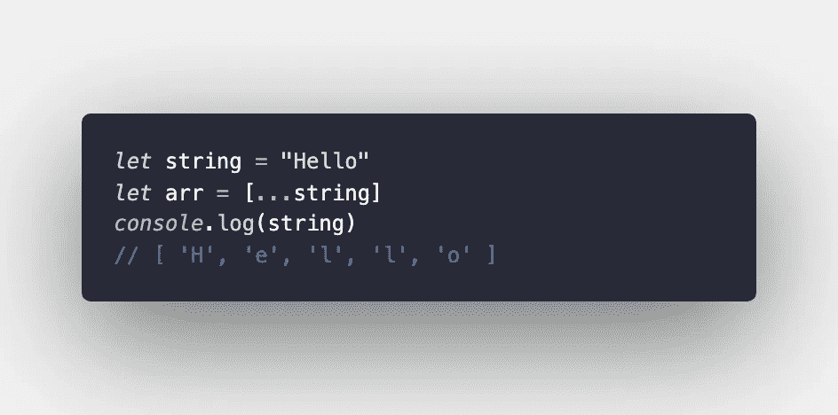

# 将一个数组添加到另一个数组的末尾

使用 spread 运算符可以更有效地将数组元素添加到现有数组的末尾。您只需要分配第一个数组的变量名，并用 spread 操作符将两个数组的名称相加，如下所示。

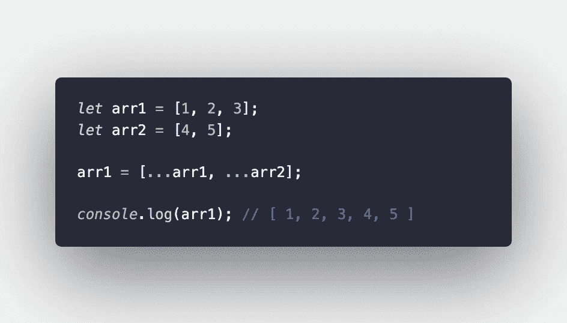

稍有不同的是，您也可以按照相同的过程创建一个新的数组。这是一个非破坏性的过程，所以最后你会得到三个数组。

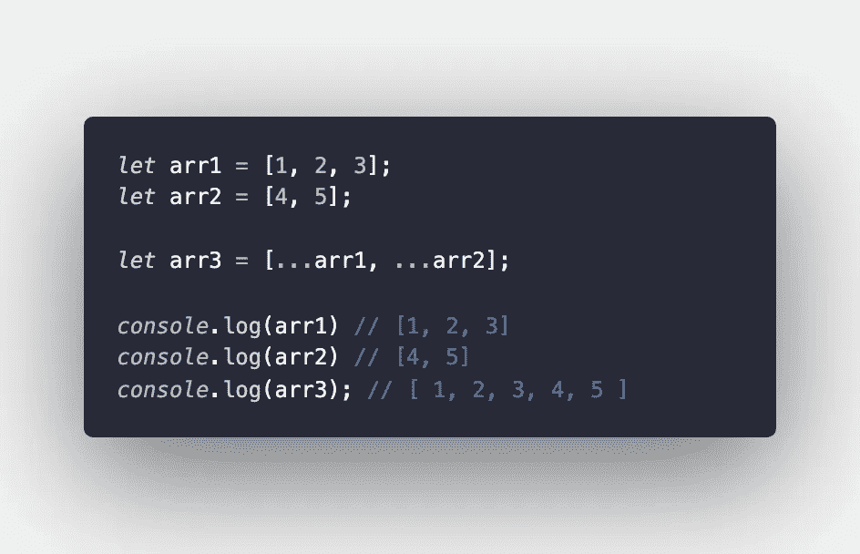

这也可以通过使用。使用扩展运算符 push():

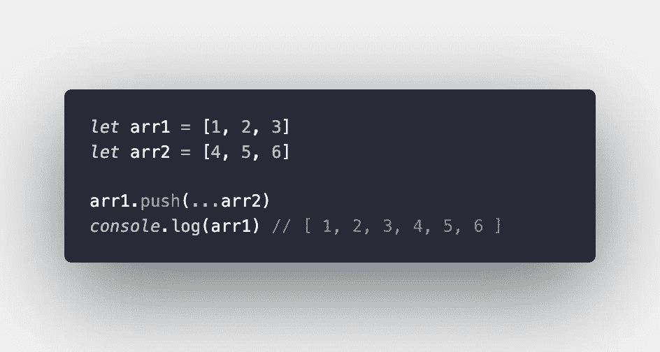

# 将一个数组的元素添加到另一个数组的开头

通过使用与上一个例子类似的语法，我们还可以改变数组的顺序——有效地将一个数组放在另一个数组的开头。同样，这可以通过创建一个新数组或重新分配现有数组的变量名来实现。

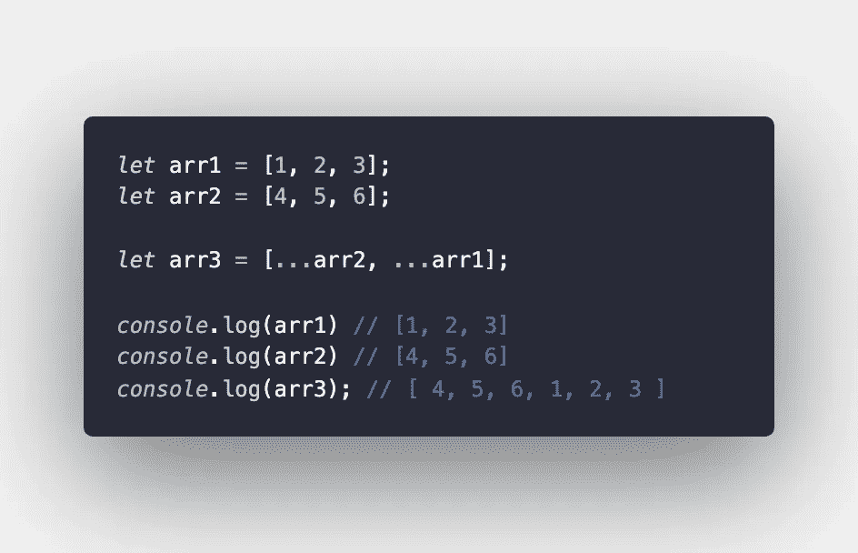

比如说。push()，这也可以通过。unshift():

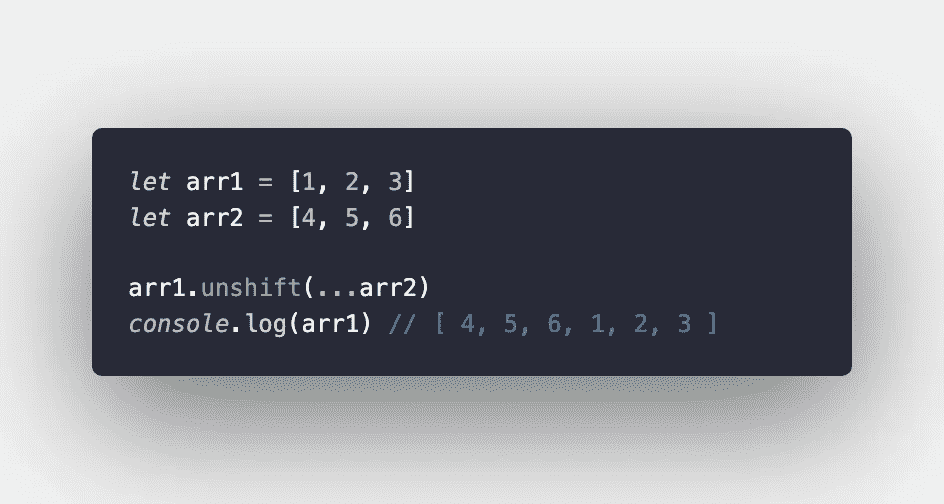

# 将一个数组的元素添加到另一个数组的中间

我知道你在想什么。我刚刚向您展示了如何在数组的开头或结尾添加元素——但是中间呢？！别担心。扩展操作符也允许这样做！只需将您要添加的数组的名称添加到您希望它在另一个数组中占据的位置。

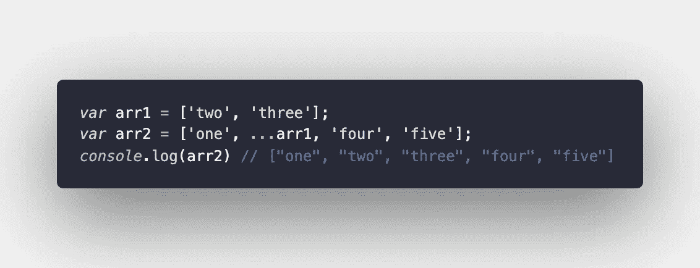

# 查找数组中最小的数字

spread 运算符与 Math.min()很好地结合在一起，用于查找数组中的最小数字。

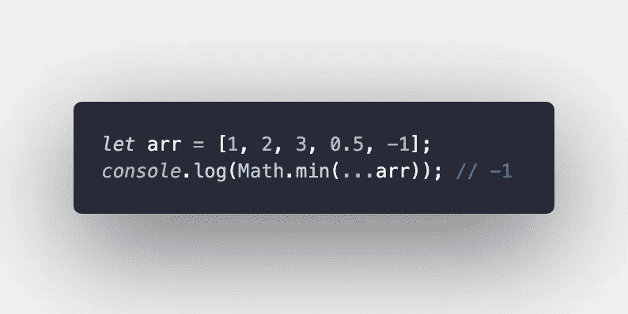

# 查找数组中的最大数字

我知道这可能令人惊讶，但这也适用于 Math.max()！

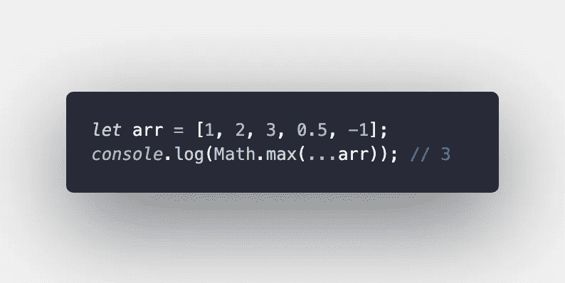

# 在箭头函数中接受任意数量的参数

如果你有似曾相识的感觉，那是因为我在最近的文章中回顾了这一点。如果您不知道在一个 arrow 函数中需要接受多少个参数，您可以使用带有' rest '参数的 spread 操作符来完成这项工作。

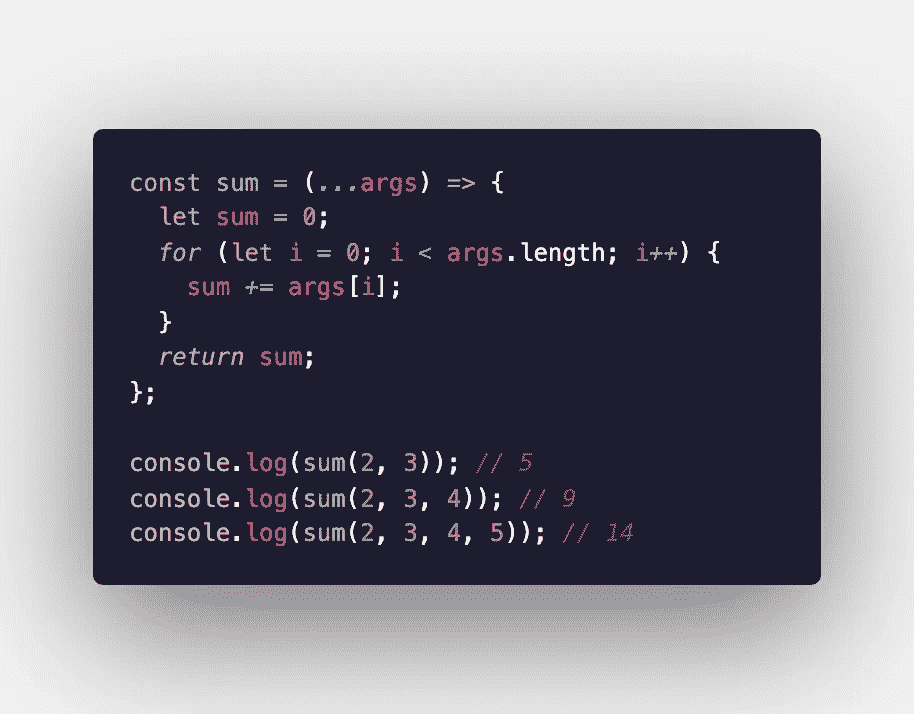

是的，这周我改了我的 VS 代码主题。谢谢你注意到了。

# 合并对象

spread 操作符提供了一种简单、非破坏性的方法来合并两个对象。遵循类似于上面解释的合并两个数组的语法。

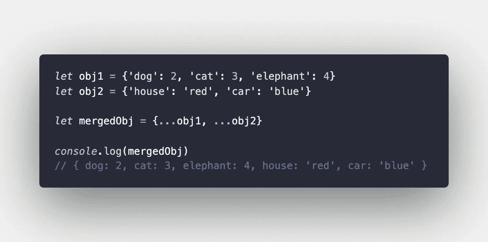

# 析构一个对象

如果要将变量名分配给对象中的值，spread 运算符会很有用。在 spread 运算符后写入的所有内容都被赋给后面的变量名。请参见下面的示例进行说明。

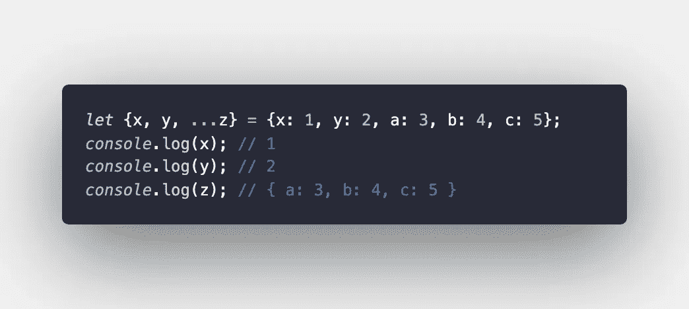

希望这些例子能帮助你写出更干净、更有效的代码。让我知道你最喜欢的使用 spread 运算符的方式！

阿曼达·特劳特勒