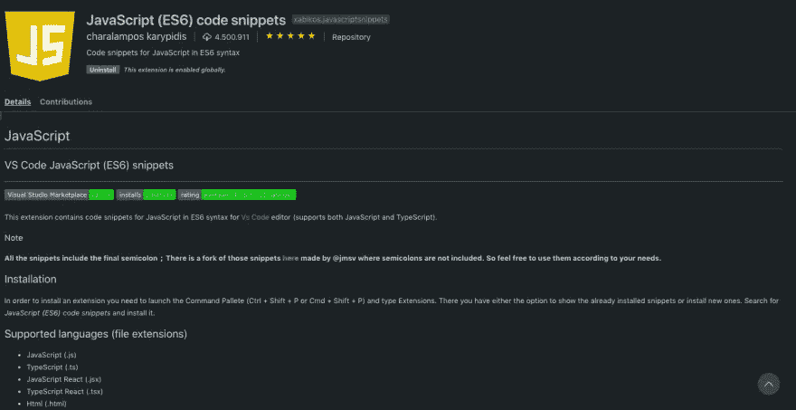
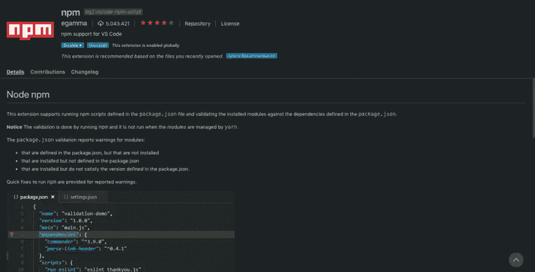
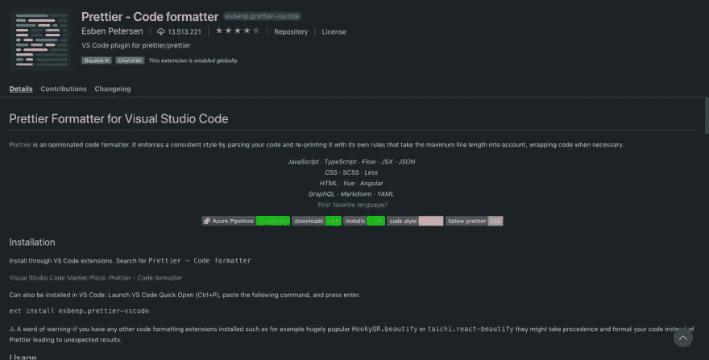
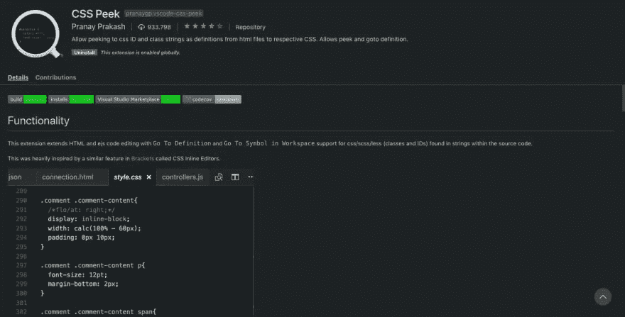
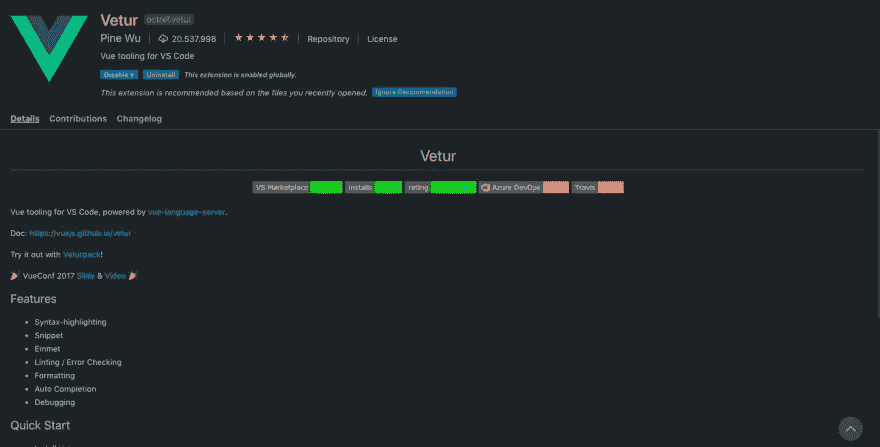
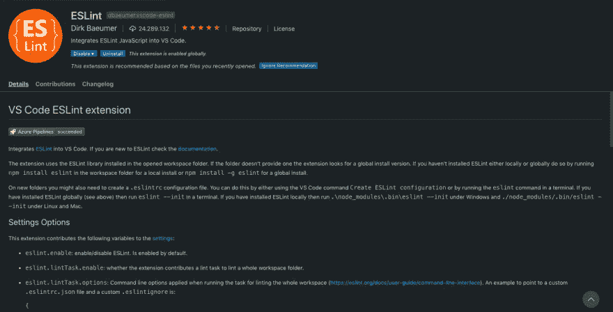
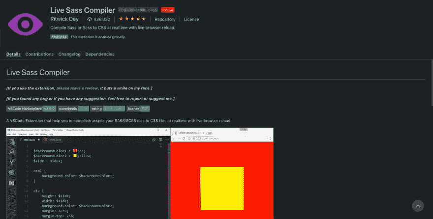
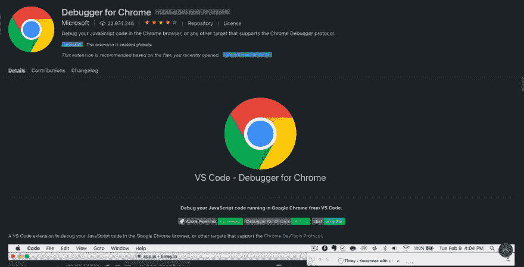
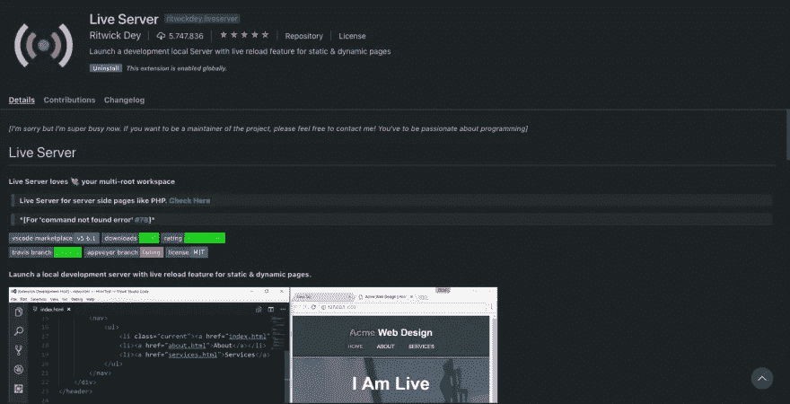
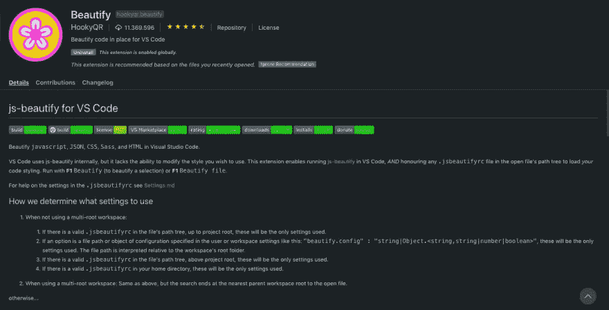

# 2023 年面向前端开发人员的 10 个 Visual Studio 代码扩展

> 原文：<https://levelup.gitconnected.com/10-visual-studio-code-extensions-for-frontend-developers-in-2023-8a73bab8f794>

## 最佳代码编辑器的最佳扩展

> 我用 ClickUp 为我的博客收集和管理想法——你应该去看看。太棒了，而且是免费的！
> 
> [https://bit.ly/3hd3ksY](https://bit.ly/3hd3ksY)

Visual Studio Code 在 2021 年拥有 1400 万月活跃用户(这是我能找到的最新官方数据——现在无疑更多了),可以说是目前最好的代码编辑器。最好的特性之一是 Market Place，它提供了大量的扩展来根据您的需求定制它，并帮助您编写高质量的代码。在本文中，我将为使用 HTML、CSS、JavaScript 和 VueJS 或 ReactJS 等框架的前端工程师推荐 10 个 VS 代码扩展。

# JavaScript 代码片段

这个扩展由 Charalampos Karypidis 创建，已经被下载了 970 万次。它提供了用于编写 JavaScript、Typescript、React、Vue 和 HTML 的代码片段，并且支持 ES6 语法。

# NPM

每个开发人员都知道 NPM——节点包管理器。这个扩展帮助您管理 Package.json，如果还没有安装依赖项，它会提供警告，并有助于版本控制。

# 较美丽

Esben Petersen 的 prettle 是一个非常简洁的扩展，已经被下载了近 2600 万次。它帮助您格式化代码，并为可读性更好的代码提供颜色关键字。

# CSS Peek

CSS Peak 通过识别和枚举已经应用的不同样式来帮助您处理标记语言类字符串和 id。这很方便，因为你不再需要在 HTML 和 CSS 文件之间切换。

# 韦图尔

Vetur 是 VueJS 的官方扩展，已经被下载了超过 1100 万次。它提供了错误检查功能、自动完成特性，并提供了 Vue 片段。如果你是像我一样的 Vue 开发者，这真的很酷！

# 埃斯林特

我能说什么呢？许多人喜欢林挺，但也有许多人不喜欢。但是林挺为干净代码提供的价值几乎没有争议，如果你用 JavaScript 开发，这个有 2200 万次下载的扩展是最好的工具。

# 实时 Sass 编译器

实时 Sass 编译器扩展是一个小而强大的工具，它可以将您的 SASS/SCSS 文件实时编译成 CSS 文件，并在您的浏览器中提供已编译样式的实时预览。

# Chrome 调试器

对于许多开发人员来说，Chrome 是开发、测试和调试代码的首选浏览器。有了 VS 代码的这个官方扩展，您可以直接从 Visual Studio 代码中这样做——这多酷啊？！

# 实时服务器

Ritwick Dey 的 Live Server(他也创建了 Live Sass 编译器)用 Visual Studio 代码创建了一个本地开发服务器，为您的静态和动态站点提供服务。使用编辑器中的 go-live 按钮，您可以立即提供您的代码，并且该扩展还支持实时重新加载——太棒了！

# 美化

最后但并非最不重要的是这个集合中的美化，代码格式化的另一个伟大的扩展，很像漂亮。几乎 900 万次下载说明了一切，您可以格式化用 JavaScript、JSON、CSS、Sass 和 HTML 编写的代码。

# 结论

这个集合还远未完成，扩展也不一定是最好的，但我希望它为您提供一些好的工具，帮助您编写高质量的代码，成为更好的 web 开发人员。如果你发现有用的东西或者有其他你认为是一流的扩展建议，请在评论中告诉我。