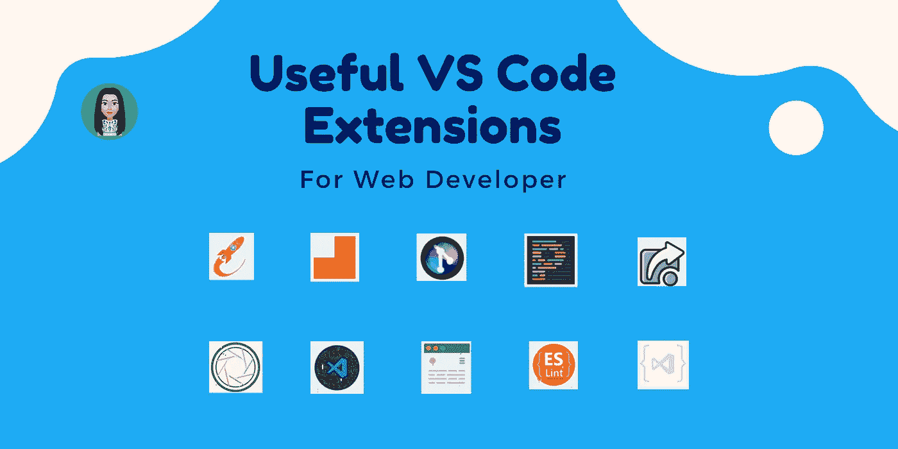
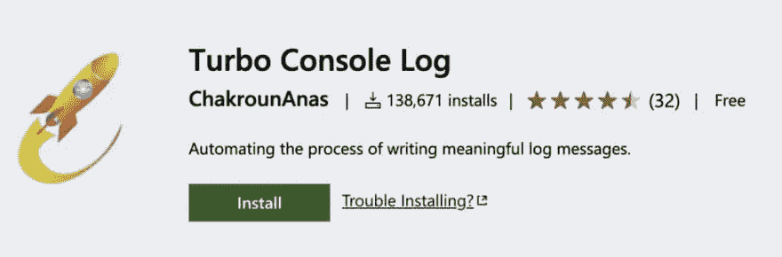
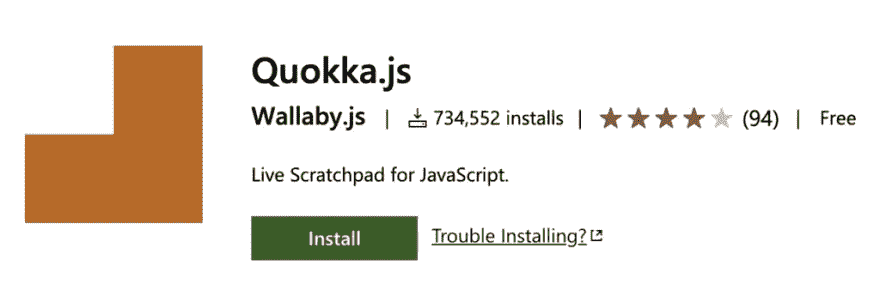
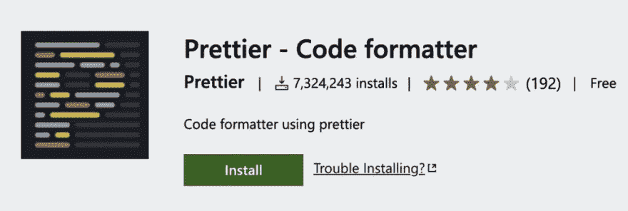
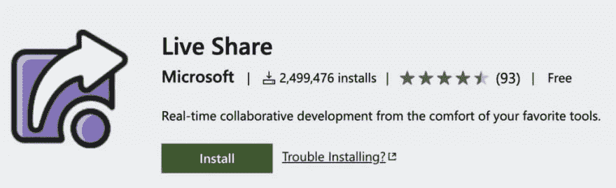
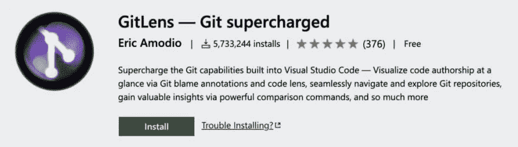
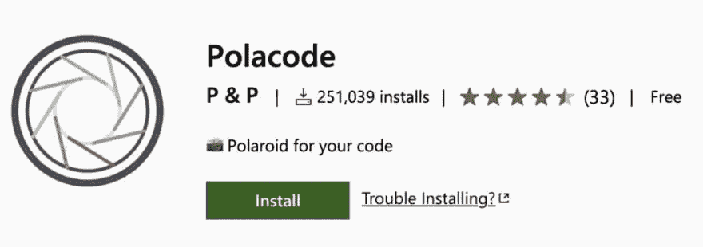
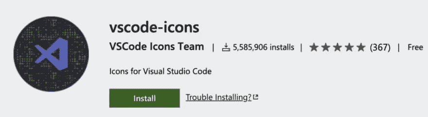
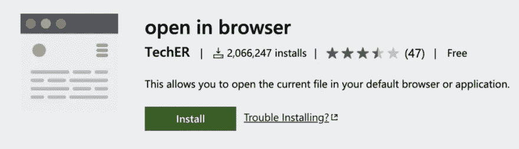
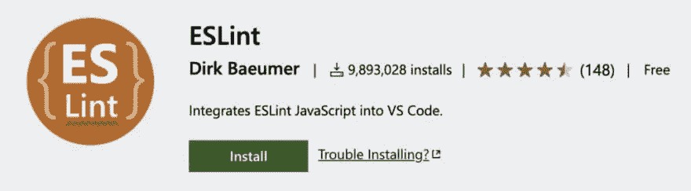

# 面向前端工程师的 10 VS 代码扩展

> 原文：<https://levelup.gitconnected.com/10-vs-code-extensions-for-frontend-engineer-db9b823cd56a>

vs 代码扩展

Visual Studio 代码有很多扩展。编辑器附带了一种叫做 Market Place 的扩展商店(就像你的应用程序的应用程序商店)。有用于调试代码、格式化代码、键映射、开发技术(如 heroku、github、docker、azure)、IDE 主题、代码 linters、代码片段和许多其他类别的扩展。

在这篇文章中，我将强调 2020 年必须拥有的 10 个 VS 代码扩展。

# 1.[涡轮控制台日志](https://marketplace.visualstudio.com/items?itemName=ChakrounAnas.turbo-console-log)

这个扩展通过自动化编写有意义的日志消息的操作，使调试变得更加容易。

# 2.[阔卡](https://marketplace.visualstudio.com/items?itemName=WallabyJs.quokka-vscode)

该扩展用于在 Visual Studio 代码编辑器中测试 JavaScript 代码，而不是在浏览器控制台中签出代码。您可以在下面的链接中找到关于这个扩展的详细信息。

# 3.[更漂亮](https://marketplace.visualstudio.com/items?itemName=esbenp.prettier-vscode)

这是 Esben Petersen 的一个非常流行的扩展。它目前号称拥有近 400 万次下载。它有助于格式化 Javascript 代码和给关键字着色，以使您的代码易于阅读。还有其他类似的扩展，其中比较流行的一个是美化。

# 4.[直播服务器](https://marketplace.visualstudio.com/items?itemName=MS-vsliveshare.vsliveshare-pack)

Ritwick Dey 的这个很酷的扩展为您的静态和动态页面创建了一个开发本地服务器。一个上线按钮出现在您的任务栏上，因此您可以作为开发服务器无缝地运行您的代码。它还有一个闪亮的功能:Live Reload，一旦你保存了你的工作，它就会重新加载页面。相当棒。

# 5. [GitLens](https://marketplace.visualstudio.com/items?itemName=eamodio.gitlens)

这个扩展用于从可以在 VS 环境中编辑的 Git 源获取信息。可以在 VS 代码内部查看来自 Git 存储库文件的提交日志、文件历史等，这也节省了时间。

# 6. [Polacode](https://marketplace.visualstudio.com/items?itemName=pnp.polacode)

这个扩展用于截取代码片段截图。它可以用来在 snippet 截图中轻松复制粘贴你需要的代码，安装扩展后保存。您可以在下面的链接中找到关于该扩展的详细信息。

# 7.[虚拟代码图标](https://marketplace.visualstudio.com/items?itemName=vscode-icons-team.vscode-icons)

该扩展用于将图标添加到 Visual Studio 代码中。

# 8.[在浏览器中打开](https://marketplace.visualstudio.com/items?itemName=techer.open-in-browser)

您可以用默认程序打开任何类型的文件，而不仅仅是 HTML 文件。

# 9. [eslint](https://marketplace.visualstudio.com/items?itemName=dbaeumer.vscode-eslint)

这里是你的 Javascript 和 jsx 的所有林挺。可插拔，并确保你坚持标准的做法，如缩进和定位等等。它是 VS 代码中下载量最大的扩展之一，下载量接近 1200 万次。

# 10.[降价预览增强](https://marketplace.visualstudio.com/items?itemName=shd101wyy.markdown-preview-enhanced)

Markdown Preview Enhanced 是一个扩展，为您提供了许多有用的功能，如自动滚动同步，数学排版，美人鱼，PlantUML，pandoc，PDF 导出，代码块，演示文稿作者等。它的很多想法都是受 Markdown Preview Plus 和 RStudio Markdown 的启发。

感谢你阅读这篇文章，❤️

我希望这篇文章对你有用🤩

🌟[推特](https://twitter.com/suprabhasupi)👩🏻‍💻 [suprabha.me](https://www.suprabha.me/) |🌟 [Instagram](http://instagram.com/suprabhasupi)