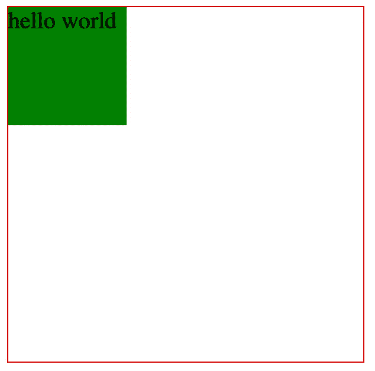
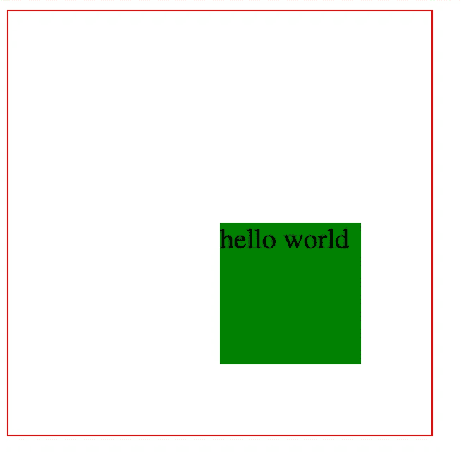
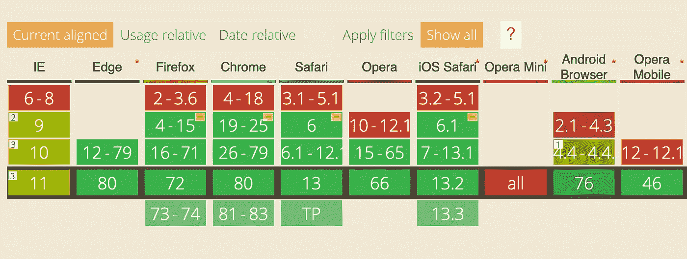
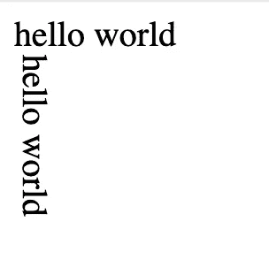

# 在 CSS 中水平和垂直居中 Div 的 10 种方法

> 原文：<https://levelup.gitconnected.com/10-ways-to-center-a-div-horizontally-and-vertically-in-css-53ca5eb912db>

## 彻底掌握这个常见的面试问题。


照片由[潘卡杰·帕特尔](https://unsplash.com/@pankajpatel?utm_source=medium&utm_medium=referral)在 [Unsplash](https://unsplash.com?utm_source=medium&utm_medium=referral) 拍摄

将一个元素横向和纵向居中是非常常见的面试问题。假设子元素周围有一个父元素:

```
<div class="father">
    <div class="child">hello world</div>
</div>
```

为了更清楚，我们可以给这两个元素添加一个基本样式。

```
.father {
    border: 1px solid red;
    width: 300px;
    height: 300px;
}.child {
    background: green;    
}.child {     
    width: 100px;
    height: 100px;
}
```

结果如下:



注意，在上面的例子中，我们假设子元素的宽度是固定的。在本文的后面，我们将讨论子元素没有固定宽度的情况。

同时，在上面的代码中，父元素的宽度和高度被设置为 300px，而在实际中，父元素的高度和宽度可以是任意值。我这里用 300px，只是一个大概的参考。我们永远不会在后续代码中使用这个值。

现在，让我们在上面的演示代码中添加一点 CSS 样式，使子元素居中。

# 绝对+负边距

很容易认为`position`定位允许我们设置子元素相对于父元素的位置。例如:

```
.father {
    position: relative;
}
.child {
    position: absolute;;
    top: 50%;
    left: 50%;
}
```



但是上面的代码有一个缺陷，就是我们只把顶点居中在子元素的右上角，而不是子元素的中心。

为了使子元素居中，我们可以这样想:

```
.father {
    position: relative;
}
.child {
    position: absolute;;
    top: 50% - 50px;
    left: 50% - 50px;
}
```

我们只需要将子元素向左移动 50 像素，向上移动 50 像素。不幸的是，CSS 不直接支持这种语法。

为了纠正这个问题，我们可以使用外部边距的负值来定位相反方向的元素。通过将子元素的外部边距指定为子元素宽度一半的负值，我们可以将子元素居中。CSS 代码如下:

```
.father {
    position: relative;
}
.child {
    position: absolute;;
    top: 50%;
    left: 50%;    
    margin-left: -50px;
    margin-top: -50px;
}
```

因为这里我们使用子元素的宽度和高度，所以这个方法要求我们知道子元素的宽度和高度。

# 绝对+计算

在新的 CSS 标准中，CSS 引入了`calc`函数，允许我们编写类似于`50% — 50px`的代码。

```
.father {
    position: relative;
}
.child {
    position: absolute;
    top: calc(50% - 50px);
    left: calc(50% - 50px);
}
```

但是请注意，并不是所有的浏览器都支持这种语法。这里是语法兼容性。



来自 CanIUse.com

 [## 我能用吗...HTML5、CSS3 等的支持表

### “我可以使用吗”提供了最新的浏览器支持表，以支持桌面和移动设备上的前端 web 技术…

caniuse.com](https://caniuse.com/#search=calc) 

这个方法要求我们知道子元素的宽度和高度。

# 绝对+变换

使用`position: absolute`定位后，前两种方法继续使用其他手段来修正子元素的位置。其实我们也可以通过属性`transform`来调整子元素的位置。

`transform`属性将 2D 或 3D 变换应用于元素。此属性允许您旋转、缩放、移动、倾斜等。，元素。

```
.father {
    position: relative;
}
.child {
    position: absolute;
    top: 50%;
    left: 50%;
    transform: translate(-50%, -50%);
}
```

`transform: translate(-50%, -50%)`意味着，相对于这个元素的原始位置，我们将其向左移动其宽度的 50%，然后向上移动其高度的 50%。

这个方法**不要求我们知道子元素的宽度和高度。**

# 绝对+自动边距

我们习惯在定位后设置子元素的`top`和`left`值来完成对中。其实还有一个更简单的方法，就是将子元素的`margin`属性设置为`auto`。根据 CSS 的规则，子元素上下边距的值会相等，左右边距的值也会相等，所以子元素会自然居中。

```
.father {
    position: relative;
}.child {
    position: absolute;
    top: 0;
    left: 0;
    right: 0;
    bottom: 0;
    margin: auto;
}
```

这个方法**不要求我们知道子元素的宽度和高度。**

# 文本对齐

我们可以将子元素设置为内嵌元素`display: inline-block;`，然后将父元素设置为`text-align: center;`，这样子元素就可以水平居中了。同时我们也可以给子元素设置`vertical-align: middle;`，这样子元素就可以垂直居中。

```
.father {
    line-height: 300px;
    text-align: center;
    font-size: 0px;
}
.child {
    font-size: 16px;
    display: inline-block;
    vertical-align: middle;
    line-height: initial;
    text-align: left;
}
```

# 桌子

曾经`table`用于页面布局，现在没人用了，但是`table`也可以实现横向和纵向居中，但是会增加很多多余的代码。

```
<table>
    <tbody>
        <tr>
            <td class="father">
                <div class="child">hello world</div>
            </td>
        </tr>
    </tbody>
</table>
```

`tabel`单元格中的内容自然垂直居中。只需添加一个水平居中属性。

```
.father {
    text-align: center;
}
.child {
    display: inline-block;
}
```

# CSS-表格

CSS 中新增的`table`属性使我们能够将普通元素变成表格元素的真实效果。通过这个功能，我们还可以实现水平和垂直居中。

```
.father {
    display: table-cell;
    text-align: center;
    vertical-align: middle;
}
.child {
    display: inline-block;
}
```

# 弯曲

作为一种现代化的布局方案，flex 颠覆了过去的体验，可以在几行代码中优雅地水平居中和垂直居中。

```
.father {
    display: flex;
    justify-content: center;
    align-items: center;
}
```

# 格子

网格还支持水平和垂直居中。

```
.father {
    display: grid;
}
.child {
    align-self: center;
    justify-self: center;
}
```

# 书写模式+文本对齐

最后，一个不常见的方法，`writing-mode`属性。总之，`writing-mode`可以改变文本的显示方向。例如，您可以使用`writing-mode`将文本的显示方向改为垂直方向。



所以我们可以在`father` div 和`child` div 之间添加一个`middle` div。首先将`writing-mode`和`text-align`设置在母体内，使`middle`垂直居中，然后将`writing-mode`和`text-align`设置在`middle`内，使`child`水平居中。

```
<div class="father">
     <div class="middle">
          <div class="child">hello world</div>
     </div>
</div>.father {
    writing-mode: vertical-lr;
    text-align: center;
}.middle {
    writing-mode: horizontal-tb;
    display: inline-block;
    text-align: center;
    width: 100%;
}.child {
    display: inline-block;
    margin: auto;
    text-align: left;
}
```