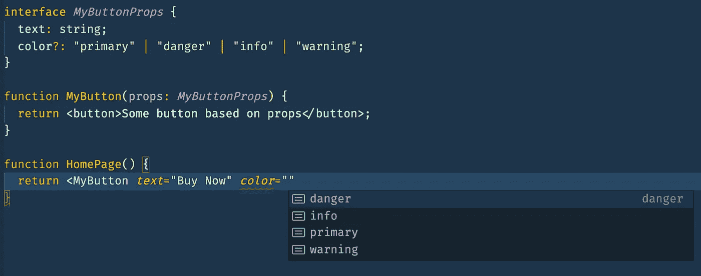

# 您应该考虑的 10 个 Web 组件挑战

> 原文：<https://levelup.gitconnected.com/10-web-component-challenges-you-should-consider-2a435d8ccec9>

由[博尼瓦尔·塞巴斯蒂安](https://unsplash.com/@gentlestache?utm_source=medium&utm_medium=referral)在 [Unsplash](https://unsplash.com?utm_source=medium&utm_medium=referral) 上拍摄的照片

在 web 上创建可重用的组件并不是一个简单的挑战。你将把重点放在保持它们的轻量级、易用性和高性能上，记住每一个都应该只服务于一个目的。每个主要的前端框架都定义了指导原则，可以帮助您做到这一点。

但是如果你打算使用 Web 组件实现一个设计系统，有一些挑战会影响你的团队的开发速度。

## 1.需要新的开发人员技能

因为 Web Components 使用新的浏览器 API，所以您的开发人员可能不熟悉它们，并且需要一段时间来理解它们是如何工作的。学习时间不要太乐观；可能需要 3 周以上的时间才能完全适应。

以下是开发人员应该了解的完整规格列表:

 [## 使用 WebComponents 前应具备的技能

### 自定义元素、影子 Dom、模板很常见，但列表不全；还有几个没人…

drazvan91.medium.com](https://drazvan91.medium.com/skills-you-should-have-before-using-webcomponents-ceb8008fb742) 

## 2.资产管理

如果您需要添加图像或字体等资源，有不同的方法。最简单的选择是使用 **base64 编码**将它们嵌入到 web 组件中。

维护 base64 值对开发人员来说并不是一种很好的体验，这就是为什么有解决方案可以在构建时自动将 URL 转换为 base64。Postcssurl 插件是一个很好的例子，在 postcss 管道中非常流行。它还可以与使用 webpack 或 rollup 等工具构建的项目集成。

当然，这可能会导致包大小的问题，尤其是当您需要在多个 web 组件中重用相同的资源时。剩下的唯一选择是使用静态或相对的`url(...)` CSS 值来交付它们。如果组件包与使用它的应用程序分开托管，那么静态 URL 是一个很好的选择，但是如果您必须在它们内部托管，您将必须处理配置。

大多数 WebComponents 框架不支持处理资产，即使支持，也是最低限度的。例如， [StencilJS](https://stenciljs.com/docs/local-assets) 有一个名为`getAssetsPath`的实用程序，它受到限制，因为它只能在类型脚本代码中使用，而不能在样式表文件中使用。

## 3.UI 测试自动化

最有可能的是，您将使用 [Shadow DOM](https://developer.mozilla.org/en-US/docs/Web/Web_Components/Using_shadow_DOM) ，这是允许 DOM 封装的机制。这意味着您不能像以前一样访问 web 组件中的 DOM 元素；您首先必须获得对 WebComponent 的影子根的引用，然后查询您正在寻找的元素。

您的自动化测试人员会觉得这很痛苦。虽然有些 UI 自动化框架如 [Cypress](https://docs.cypress.io/api/commands/shadow.html#Syntax) 已经为影子 DOM 添加了足够好的支持，但有些却没有。不幸的是，Selenium 就是其中之一，您必须实现类似于这篇好文章中的解决方法。

## 4.易接近

几个月前，在一次会议上，发言者说，如果你是一名开发人员，不关心可访问性，你是一个可怕的人。我感到尴尬，因为她是对的。

同样，因为阴影 DOM 边界属性像`tab-index`、`label for`、`aria-pressed`和`role`并没有像你预期的那样工作。解决方法很痛苦，它使用了一个新的浏览器 API，叫做[可访问性对象模型](https://github.com/WICG/aom)。

## 5.表单提交

当所有的 web 应用程序都使用服务器端渲染时，`form`标签已经不那么流行了。如今，即使它被用作语义标签，提交动作也不是很流行，因为在单页面应用程序中，与服务器的交互将使用 HTTP 客户端库来完成，如 Axios、HttpClient for Angular 或简单的`fetch()`浏览器 API。

但是如果你仍然需要实现一个 HTML `<form>`，你会因为影子 DOM 而遇到两个挑战。举个例子:

这在默认情况下不起作用，因为`<input/>`标记将只把表单数据填充到影子 DOM 内部的`<form />`标记中，而不填充到影子 DOM 外部的标记中，这意味着当提交外部表单时，它将没有任何值。这是一个很大的限制！

幸运的是有一个解决方法，它需要使用[表单参与 API 手动处理 web 组件表示的表单值。](https://docs.google.com/document/d/1JO8puctCSpW-ZYGU8lF-h4FWRIDQNDVexzHoOQ2iQmY/edit)同样的方法也适用于`<button type="submit" />`。

## 6.服务器端渲染和搜索引擎优化

我记得像 AngularJS 这样的第一个前端 web 框架流行起来的时候。他们都面临着同样的 SSR 挑战，现在依然如此。尽管 VueJS、React 和 Angular 对服务器端渲染有现成的支持，但很有可能您使用的是不支持它的第三方 UI 组件。

现在，5 年多过去了，同样的事情正在 WebComponents 上发生，如果你需要服务器端渲染，这可能是一个很大的技术挑战。StencilJS 正在使用一种叫做[水合物应用](https://stenciljs.com/docs/hydrate-app)的机制来支持它。

## 7.自定义封装样式

DOM 封装很棒，因为它在使用您的组件的所有应用程序之间创建了一致性。开发人员将很难尝试打破外观和感觉，并根据他们的需求进行定制。而且这是故意的！您不希望您的开发人员开始使用`!important`指令并制造混乱。另一方面，您仍然希望在遵循您的设计系统规则的同时允许一点灵活性。

在一些项目中，我看到了一种通过使用属性来实现这些扩展点的糟糕方式:

正确的设计方法是使用 CSS 变量，因为它们允许级联。您将在`html {}`级别声明所有的设计令牌，然后所有的 web 组件都将使用这些变量。不仅如此，您还可以使用内联的`style`属性或样式表来定制特定的元素。

因此，挑战不在于如何实现 CSS 自定义变量，而在于如何决定组件的哪些部分是可自定义的，哪些是不可自定义的。

允许定制的另一种方式是使用 [CSS 部件](https://developer.mozilla.org/en-US/docs/Web/CSS/::part)。尽管如此，我还是不推荐使用它，因为如果你给了开发者这样的权力，他们会滥用它，开始破坏设计系统的一致性。另外，在撰写本文的时候，`::part()`并不被所有的浏览器完全支持。

## 8.z 指数

像下拉菜单、工具提示、弹出窗口这样需要在其他元素之上显示动态元素的组件，实现起来会变得很困难。即使在我实现了自定义下拉菜单之后，我也没有弄清楚 Shadow DOM 内部的 z-index 如何影响 web 组件外部的呈现。

## 9.IDE 支持

如果您正在使用 Angular 或 React with TypeScript，那么当您使用组件时，您很有可能会喜欢这两者都具有智能感知和漂亮的 linters 这一事实。

使用 React 组件时的智能感知示例

一些 Web 组件框架生成类型定义和文档，这样 IDE 就可以获取它们，然后帮助开发人员。

## 10.旧浏览器支持

我真的相信 2021 年将是我最后一次提到 11。希望，微软停止支持的决定会被其他公司效仿，尤其是大企业。

同时，许多 web 组件 polyfills 是可用的，但是它们的性能不是很好，而且尺寸相当大。在某些情况下，有一些限制肯定会惹恼开发人员。

## 结论

一旦你克服了这些挑战，并设法构建了一些组件，你将开始注意到使用它们的新方法或它们适用的新情况。只要想到[微前端](https://micro-frontends.org)。