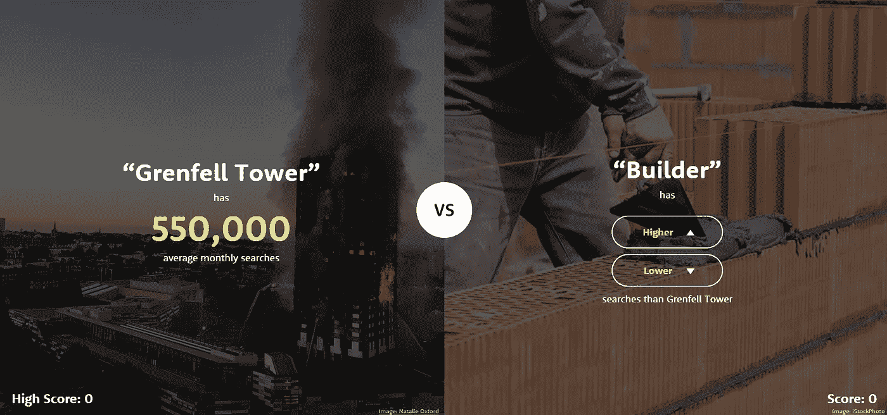
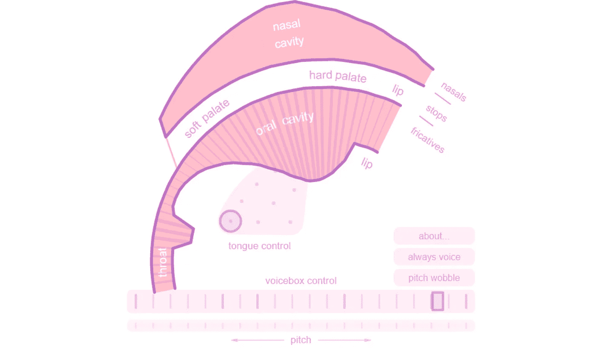
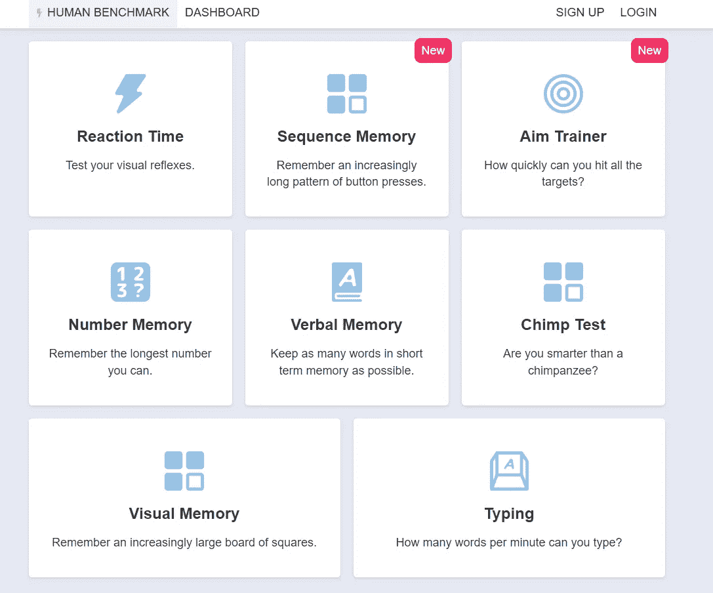
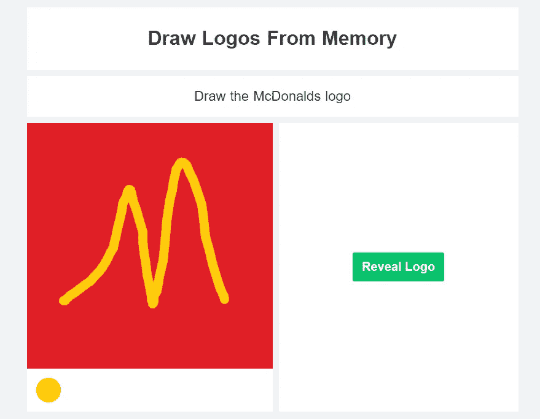
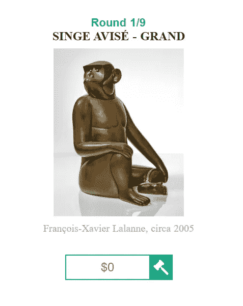
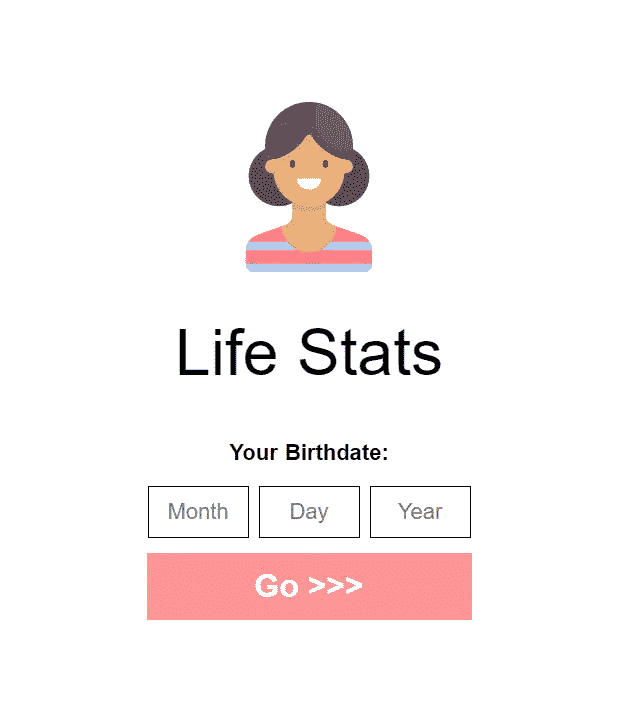
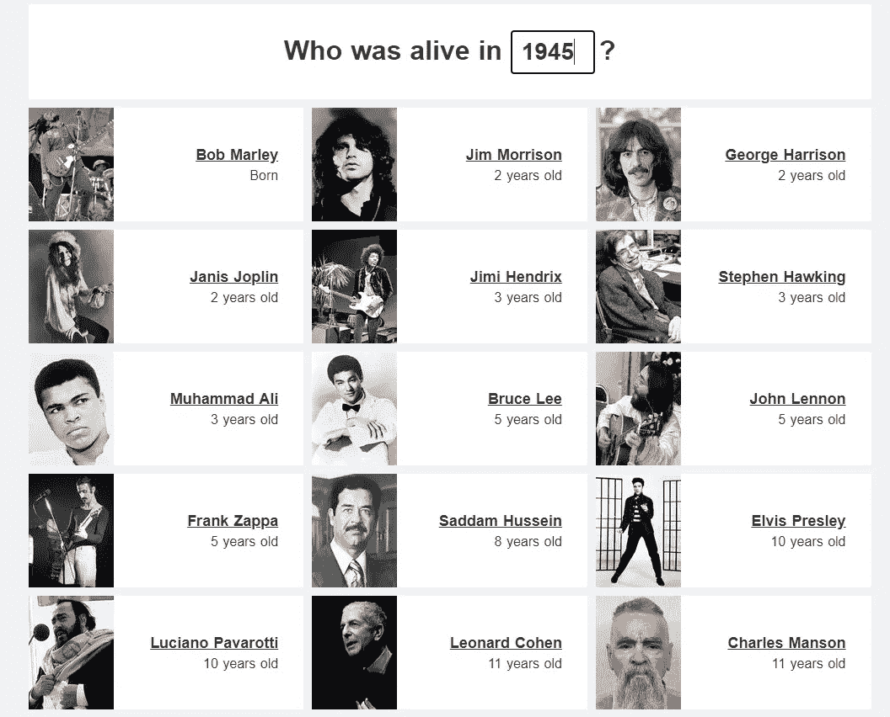
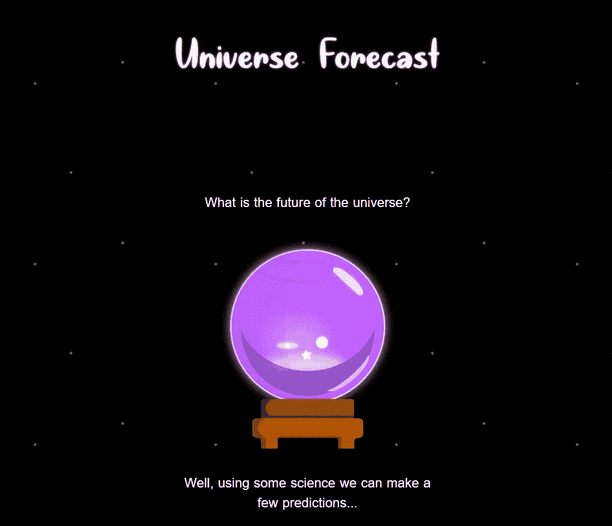
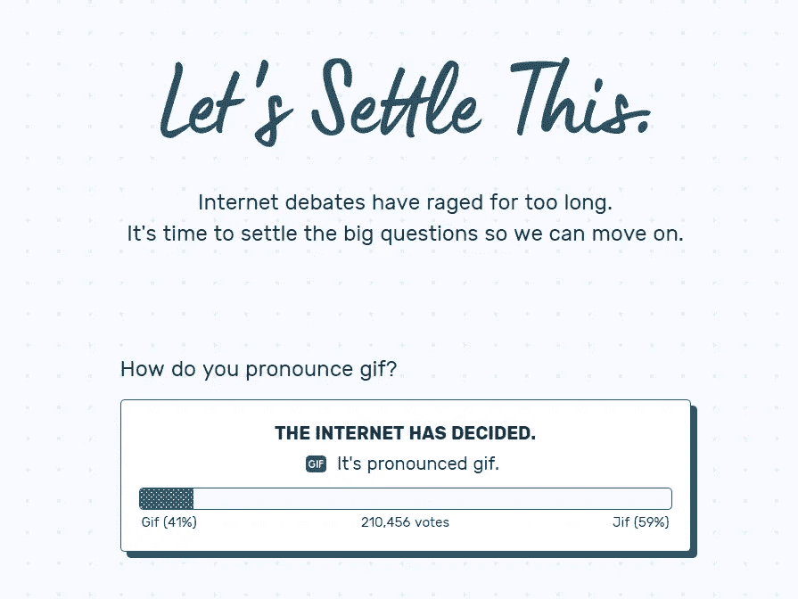

# 治愈无聊的 10 个网站|第一部分

> 原文：<https://levelup.gitconnected.com/10-websites-to-cure-boredom-part-1-10a62311faaf>

## 你再也不会感到无聊了！

## 这些网站会在你无聊的时候娱乐你。

这些网站将帮助你治愈你的无聊，并以一种有趣的方式打发时间。如果你以前没有遇到过 Tik Toks，或者 YouTube 上谈论这类网站的短片，那么这很好，因为这意味着你转而阅读了这篇文章。

这里有一些我在网上找到的可以娱乐你的最好的网站。它们不仅是无聊时用的，也可以用来打发时间。

> 在这个时代，无聊是对自己的侮辱。

不要再浪费时间了，让我们继续这篇文章的其余部分。以下是帮助你治愈无聊的十大网站。

# [1。更高更低的游戏](http://www.higherlowergame.com/)

这是最受欢迎的帮助你解闷的网站之一。我已经记不清我总共玩了多少次这个游戏了。这是一个有趣的想法，这个游戏非常简单，你只需要从呈现给你的两个选项中猜高一点或低一点。

这是一个新的浏览器，这就是为什么它是 0，但相信我，当我说我的最高分是 37。

你必须猜猜这两个选择中哪一个被谷歌搜索得更多。如果你认为你有能力击败我的 37 分，那么我挑战你把截图贴在下面。这个网站一定会帮你消除无聊。从我的经验来看，小心它会让人上瘾哈哈。

# [2。粉色长号](https://dood.al/pinktrombone/)

嗯，这有点奇怪，因为这个网站模拟了我们的坐骑是如何工作的，以及我们是如何发声的。你可以摆弄它，学习我们如何制造噪音，例如，我们的语言。

对声音和音高的控制非常棒。你可以选择舌头的位置，并且可以轻松地移动舌头发出不同的声音。最重要的是，你还可以控制嘴巴移动的方式来发出独特的声音。挑战是你能用这个工具拼写你的名字吗？

# [3。人体基准](https://humanbenchmark.com/)

这是一个很棒的网站，它可以帮助你消除无聊，并真正了解你自己。我也曾用这个网站和朋友一起玩一个有趣的游戏来测量我们的反应时间和记忆力，它真的很有趣。

有许多选择可供你选择，而且每一个都很有趣和吸引人。找出你是平均水平，高于，还是低于世界上其余的用户。对我来说，一些最有趣的游戏是反应时间、数字记忆和打字游戏。

对于打字游戏，我在每分钟 60 到 70 个单词之间，我知道这不是那么令人印象深刻，但你认为你能打破我的分数吗？

# [4。内存中的徽标](https://neal.fun/logos-from-memory/)

顾名思义，这是一个通过做一些简单的回忆和绘画来帮助你消除无聊的网站。你将会测试你对世界各地流行品牌的了解以及它们的样子。

我离得够近了，对吧？无红利(ex-dividend)

第一次做这个测试对我来说真的很有趣，我可以说我记住了其中的大部分。然而，这个没有可替换性。一旦你做了，就没有必要再去尝试，但这是一个很酷的网站，可以展示给朋友看，看看他们做得怎么样。

# [5。摇滚游戏](https://neal.fun/rocks/)

这是一个简单的游戏，可以帮你打发时间，但也有可能让你很烦。目标是让四块石头相互平衡。你可以这样做，这实际上是可能的，但在处理岩石时需要很大的耐心和精确度。

令人惊讶的是，游戏运行非常流畅，重力模拟器也非常棒。这款游戏无疑是无聊的解药，但它也会让一些人感到烦恼..*咳咳*显然不是我，呵呵..你能把石头一个压一个地放在一起吗？如果有，花的时间长吗？

如果你们感兴趣的话，我会在我的 YouTube 频道上做一个完整的游戏，或者至少创下这些游戏的记录。考虑通过访问[链接进行订阅。](https://www.youtube.com/channel/UC-eBvs08sTifFIsztEKJs0Q?sub_confirmation=1)

# [6。拍卖游戏](https://neal.fun/auction-game/)

你认为你对猜测随机物品的正确价格有一种直觉吗？如何猜测从雕塑到图片的随机艺术品的正确价格。你有一个猜测，把它放在文本框里，然后按下锤子。这个游戏肯定会治愈你的无聊，并在这个过程中向你展示一些很酷的艺术。

我的建议是，通常越旧的东西越贵。

你要对每个不同的物品进行 9 轮猜测，根据你与实际售价的接近程度，你会得到分数。最后，你会得到一个分数。我相信我的最高分大约是 2500 到 3000 分，你认为你能超过吗？

# [7。生命统计](https://neal.fun/life-stats/)

治疗无聊的一个好方法是像在电子游戏中一样查看你的生活统计数据。嗯，它可能没有你需要的所有统计数据，但肯定有一些有趣的数据，你需要 ***查看一下！***

输入您的生日，然后按“开始”按钮。然后通过向下滚动来享受你生活的统计数据。你将会看到你眨了多少次眼睛，你的心脏跳动了多少次，以及更多更酷的事情。这是帮助消除无聊的最好的网站之一。

# [8。谁还活着？](https://neal.fun/who-was-alive/)

这是一个简单的网站，它将以一种有趣的方式帮助你消除无聊。你会发现哪个人，无论是政治家、哲学家、伟大的工程师、数学家、宇航员、伟人等等，在特定的年份还活着。

你只需要在空的复选框中输入你想要检查的年份，然后列表就会被填充。它还会告诉你那一年这些人的年龄。这绝对是一个治愈无聊和做一些研究的好方法。

# [9。宇宙预测](https://neal.fun/universe-forecast/)

这是一个治疗无聊的好网站，如果你是个太空迷，你会爱上它的。这是对宇宙以及未来几年、几个世纪甚至更久将会发生什么的预测。

你将会学到很多东西，有些会变得非常可怕，比如地球可以居住的那一年，但是好的一面是，当那发生的时候，火星将会准备好等待我们。这绝对是一本有趣的读物，我非常喜欢。

# 10.让我们解决这个问题

嗯，这是一个网站，在这里你可以对互联网上最受欢迎的不同投票进行投票。此外，互联网上最有争议的选择，如发音 Gif 或 Jif？

先有蛋还是先有鸡？这件衣服是黑色和蓝色的还是金色和白色的？在这个网站上分享你的观点，看看大多数用户是如何投票的。这是最好的网站之一，可以治愈无聊，并且一劳永逸地解决互联网上的争论。

# 结束语

希望这份治愈无聊的十大网站清单对你的无聊有所帮助。这些网站确实帮助了我，让我开心了一段时间。这就是为什么我列出这个清单，为什么我决定分享。请继续关注，在接下来的几周内将会有更多更酷的网站出现。

如果你对这篇文章有任何问题或建议，请不要犹豫，在评论区回复。喜欢你读的东西吗？为什么不关注我的媒体简讯，这样你就不会错过我未来的任何文章了？很简单，点击[这里](https://kgabeci.medium.com/subscribe)输入你的邮箱地址，然后点击订阅。

你喜欢阅读媒体上的文章吗？考虑成为会员，有很多功能，你将获得所有创作者的内容，每月只需 5 美元。使用[这个链接](https://kgabeci.medium.com/membership)，你也帮我赚一点佣金，点击成为会员，输入你的信息。