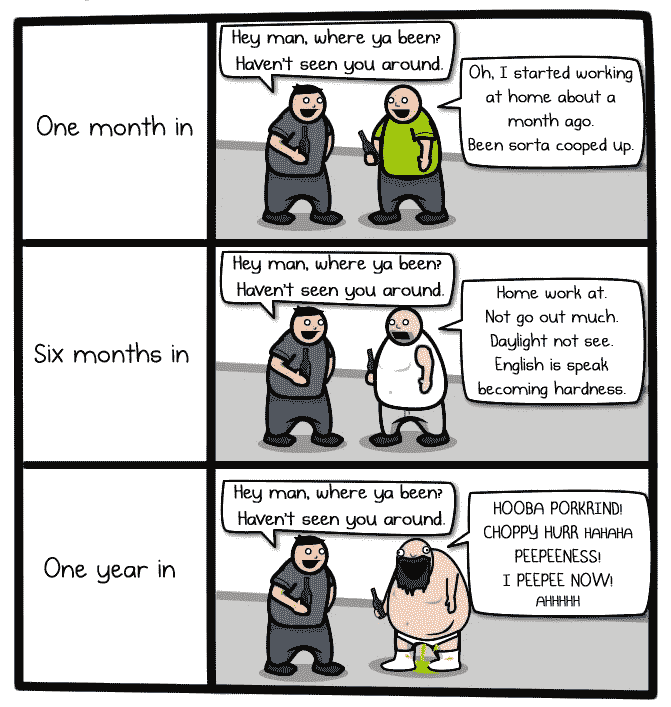
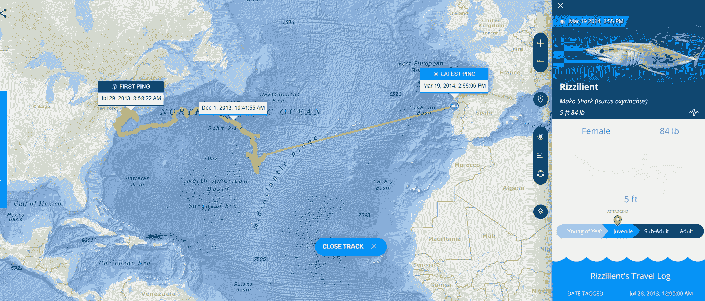
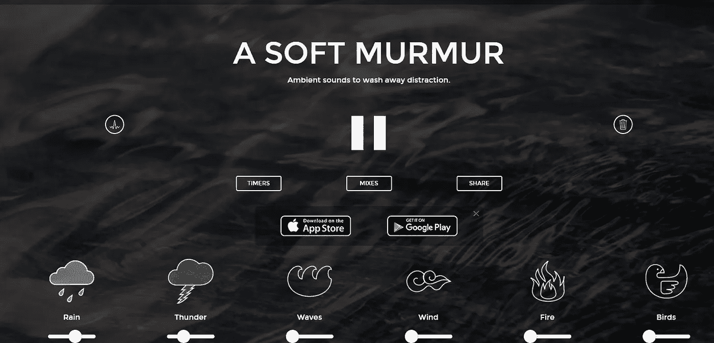
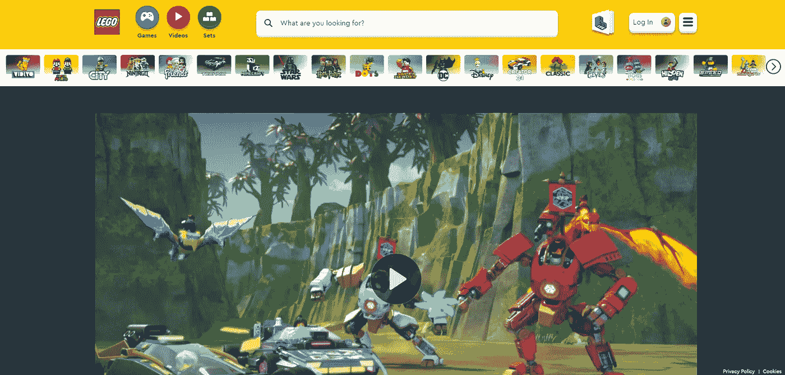
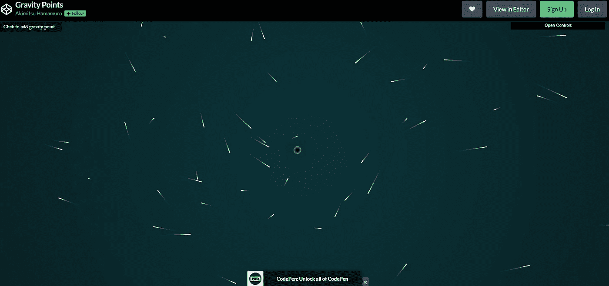
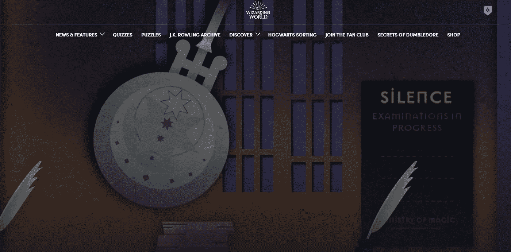
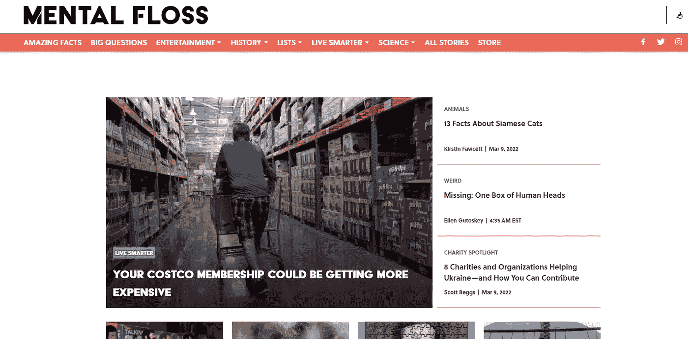
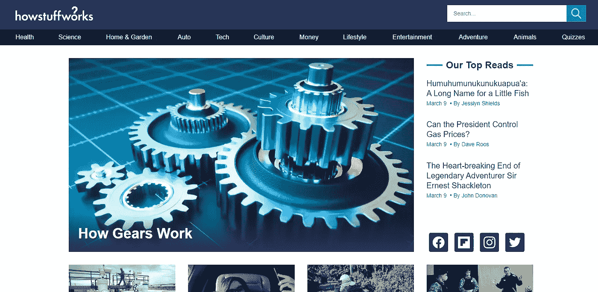

# 治愈无聊的 10 个网站|第二部分

> 原文：<https://levelup.gitconnected.com/10-websites-to-cure-boredom-part-2-db0ea79effc>

## 你再也不会感到无聊了！

## 这些网站会在你无聊的时候娱乐你。

我认为应该对这些网站给予更多的关注，因为并不是所有的东西都与 Reddit、YouTube、Instagram、Twitter 或你消费的任何社交媒体有关。

你也应该向其他网站表达你的爱，这些网站的首要任务是用令人惊奇的内容来治愈你的无聊。这就是为什么我决定将这一部分作为文章的第二部分。而且我已经为你找到了一些 ***惊人的*** 新网站！

**以下是能让你解闷的网站列表:**

*   **燕麦片**
*   **Ocearch**
*   **轻轻的杂音**
*   **乐高**
*   **重力点**
*   **波特莫尔**
*   **洋葱**
*   **精神牙线**
*   **东西是如何工作的**

# [燕麦粥](https://theoatmeal.com/)

这是我最喜欢的网站之一，用来打发我在网上的空闲时间。你会发现各种主题的有趣漫画，最棒的是它们是由一个人创作的。

这是治疗我无聊的最好地方，我喜欢这个家伙的幽默。看到上面这个漫画的时候我都热泪盈眶了，主要是有点太有共鸣了哈哈。我相信你会喜欢去那里的，所以我建议你去给马修一些爱。

# [**oceach**](https://www.ocearch.org/)

有了这个鲨鱼追踪器工具，海洋研究小组 OCEARCH 可以让你追踪世界各地的鲨鱼。你甚至可以非常近距离地观察，看清楚哪些鱼在海滩上游荡，它们在哪里漂浮。

不管你是不是海洋世界的粉丝，我肯定你会发现这个网站很有趣，它会让你分心几分钟。我试着在我的区域周围定位鲨鱼，但是没有被标记的鲨鱼，然而，有一些乌龟在周围盘旋，那真的很酷。

# [轻轻的低语声](https://asoftmurmur.com/)

对于喜欢在工作或学习时有背景噪音的我们来说，这是一个完美的网站。对我来说，这有助于集中注意力，在发现这个网站之前，我经常看 10 个小时的 YouTube 视频和雨声。

这个网站最棒的 之处在于它可以让你定制你想听到的声音，这太棒了。我尝试了雨声、轻微的雷声和鸟鸣的酷炫混合。效果很好，让我觉得自己是亚马逊森林。请在下面的评论中告诉我哪种组合最适合你。

# [乐高世界](https://www.lego.com/en-us/kids/videos/ninjago/get-ready-to-be-a-ninja-master-14f46fc4845a497ea2d60daedd4f6611)

如果你是乐高迷，你会喜欢这个的。你知道乐高多年来一直在创造价值数小时的视频内容吗？所有这些视频都在他们的网站上按主题和故事分类。

你也可以从你的浏览器玩游戏，享受无数小时的动画。它不是专门为孩子们制作的，因为包括我在内的所有年龄的人都喜欢乐高。

# [重力点](https://codepen.io/akm2/full/AGgarW)

重力点是一个惊人的数字笔由浜本明光。它允许您通过在显示器上绘制重心来模拟重力的效果。这个网站允许你通过在屏幕上绘制不同的重力点来模拟重力的效果。

当您将小的浮动对象添加到模拟中时，它们开始聚集在这些重力点周围。这使得视觉上有趣和混乱的显示，特别是当结合吸收重力点的能力形成一个巨大的黑洞。

你可以花几个小时在那里调整，这就是为什么它是一个伟大的网站来治愈无聊。

点击这里查看我的前十个网站:

 [## 治愈无聊的 10 个网站|第一部分

### 这些网站会在你无聊的时候娱乐你。

levelup.gitconnected.com](/10-websites-to-cure-boredom-part-1-10a62311faaf) 

# [波特莫尔](https://www.wizardingworld.com/)

许多人认为 Pottermore 是一个在线平台，他们在这里学习个人魔法，但不关心背后的品牌。但是 Pottermore 其实和其他网站有很大的不同。首先，它是免费的！

如果你想成为一个超级哈利波特迷，你可以试试波特摩尔。他们有一些很酷的功能，包括测验来确定你属于哪个房子。顺便说一下，我是格兰芬多的，在评论里留下你的房子，我们可以看看谁的房子更多。

> 你可能属于格兰芬多，那里住着勇敢的人，他们的勇气、胆量和骑士精神使格兰芬多与众不同。

# [洋葱](https://www.theonion.com/)

这是一个很棒的网站，可以消除你的无聊，也是我最喜欢的网站之一。他们写的幽默而深刻的讽刺文章一定会让你会心一笑。如果你不经常阅读，现在是开始阅读的好时机。

他们始于 1988 年，他们的头条一直很搞笑。你会发现那里有很多内容，除了解闷，它还会让你开怀大笑。

# [牙线](https://www.mentalfloss.com/)

他们是一个超级有趣的网站，文章涵盖了不经常被谈论的广泛话题。他们的文章总是写得很好，研究得很好，并且涵盖了不太受关注的话题。

他们回答的问题包括“为什么洗头时要反复冲洗”和“为什么这么多流行歌曲大概只有三分钟长？”。如果你对这类问题感兴趣，那么我强烈推荐这本杂志。

# [东西是如何工作的](https://www.howstuffworks.com/)

如果你像我一样好奇，想知道事物是如何在深层次上运作的，那么这个网站将满足你的好奇心。此外，这是消除无聊的好方法，我强烈推荐。

这个网站涵盖了几乎所有可以想象到的话题，从安全气囊到再生药物到自行车。它有如此多的内容，不可能没有主题。

# 结束语

我希望这些网站能帮助你消除无聊，就像它们确实帮助了我一样。如果对这篇文章有足够的关注，我将制作第 3 部分，所以如果你想看更多，请告诉我。

如果你对这篇文章有任何问题或建议，请不要犹豫，在评论区回复。喜欢你读的东西吗？为什么不关注我的媒体简讯，这样你就不会错过我未来的任何文章了？很简单，点击[这里](https://kgabeci.medium.com/subscribe)输入你的邮箱地址，然后点击订阅。

你喜欢阅读媒体上的文章吗？考虑成为会员，有很多功能，你将获得所有创作者的内容，每月只需 5 美元。使用[这个链接](https://kgabeci.medium.com/membership)，你也帮我赚一点佣金，点击成为会员，输入你的信息。