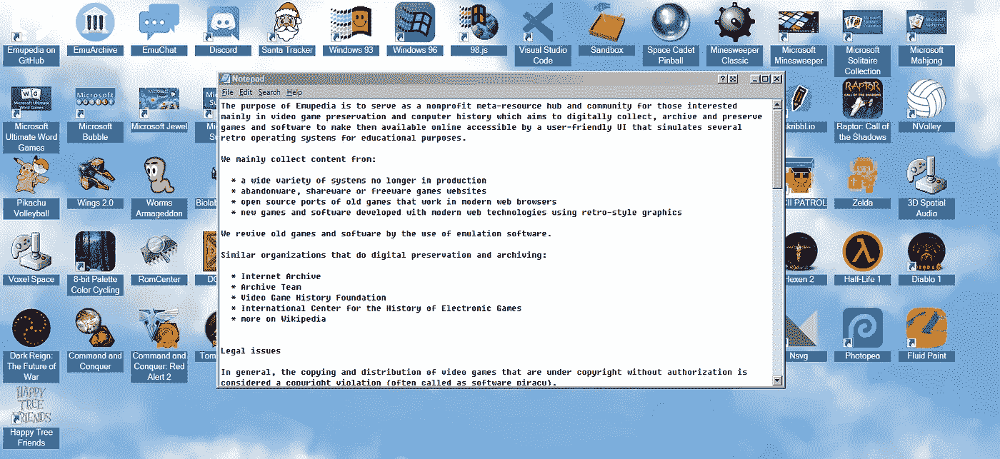
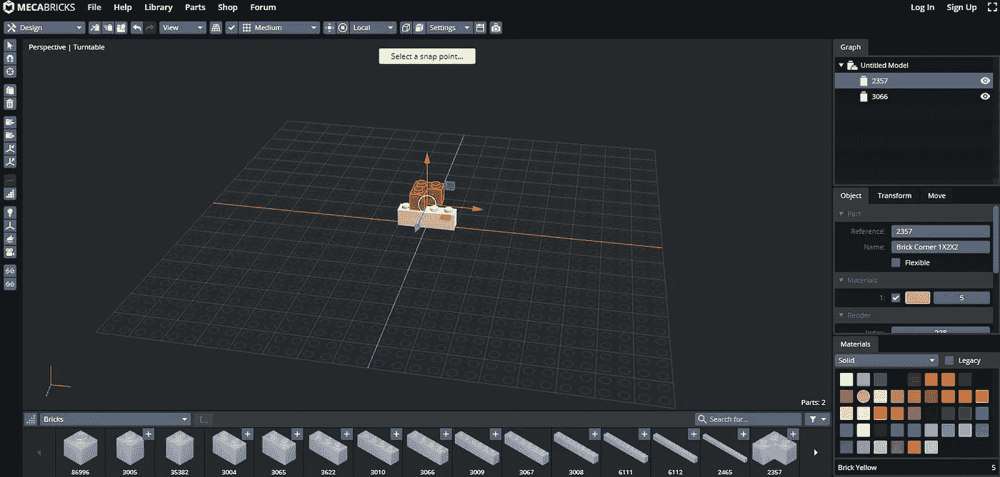
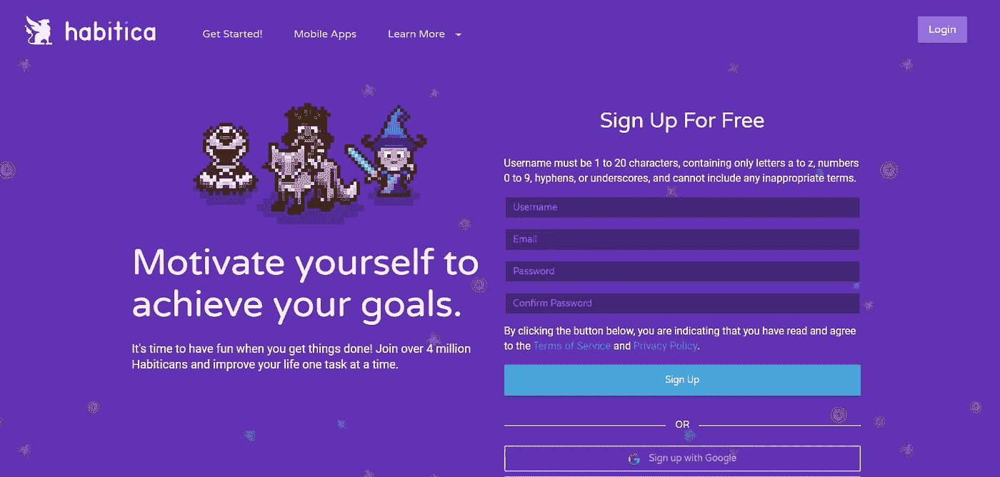

# 治愈无聊的 10 个网站|第三部分

> 原文：<https://levelup.gitconnected.com/10-websites-to-cure-boredom-part-3-b6bdfac5c724>

## 你再也不会感到无聊了！

## 这些网站会在你无聊的时候娱乐你。

这些网站将帮助你治愈你的无聊，并以一种有趣的方式打发时间。如果你以前没有遇到过 Tik Toks，或者 YouTube 上谈论这类网站的短片，那么这很好，因为这意味着你转而阅读了这篇文章。

这里有一些我在网上找到的可以娱乐你的最好的网站。它们不仅是无聊时用的，也可以用来打发时间。

> 在这个时代，无聊是对自己的侮辱。

不要再浪费时间了，让我们继续这篇文章的其余部分。以下是帮助你治愈无聊的十大网站。

## [1。动车组操作系统](https://emupedia.net/beta/emuos/)

如果你想怀旧的话，这个网站很不错。Emu OS 是一个开源的元资源，旨在使旧的计算机游戏和软件在线可用。它的界面模拟了运行不同操作系统的旧电脑。

它还模仿了几款老式游戏机，包括任天堂娱乐系统、世嘉创世纪、超级任天堂娱乐系统、Game Boy Advance、雅达利 2600、索尼 PlayStation 和 Dreamcast。

## [2。兆字节](http://Mecabricks.com)

通过自己在 Meca 积木上搭建乐高玩具，重现您对儿童时代的怀念！内置编辑器是我很久以来用过的最流畅的网络应用之一。

在网页浏览器中设计和创建乐高模型。然后，您可以进行 3D 渲染和/或下载设计的 CAD 文件。我个人认为这很棒，我会用它来为我的老房子设计乐高玩具，呵呵。

## [3。城市猜测者](https://virtualvacation.us/guess)

是的，就像 GeoGuesser 有一个城市版本。它是不同的，因为它不是由同一个创作者制作的，但它仍然完美地工作，当你无聊时，你可以玩它。

城市猜测者有两种模式:单人模式和多人模式。选择您想去的地方，然后根据难度选择一个选项(容易、中等、困难)。一旦你做出选择，点击播放！。玩游戏时，您可以通过从右上角的菜单中选择多人来与另一个人对战。

## [4。真实尺寸](https://www.thetruesize.com/#?borders=1~!MTM3NDk4NTg.MTI0ODgxMzQ*MjE1MjE5OTg(MTgwNDM3MjY~!NZ*MTcwNzQwODk.MTgwMDY3NjU)NQ~!GL*NjAwNDgwMw.MzA0MTEzNTI)Ng~!AL*Mzg1Mzcx.OTM3ODE0OA)MA)

这是一个很棒的网站，可以帮助你消除几分钟的无聊，它在过去确实帮助了我哈哈。我专注于我的国家与意大利相比有多小，我通过描绘我国家的轮廓来进行计算。

我们通常使用的平面地图并不能让我们真正了解一个国家有多大。真实大小可以让你一次比较多个国家。我建议你给这个网站一个机会，你会在那里浪费几分钟。

## [5。播放短语我](https://playphrase.me/)

在搜索栏中输入一个单词或短语，这个网站会给你一个使用它的电影场景。这是一个令人敬畏和有趣的网站，工作完美，没有任何延迟，但是，如果你想要更多的结果，你需要注册。

要播放电影中的一个场景，只需在播放电影场景中输入电影的名称，你会得到一些有趣的结果。你可以用它们来创造迷因。

如果你有兴趣在当地购买整个互联网费用最低的比特币，那么我建议你使用[当地比特币](https://advertizing.illusive-moose.ca/afflink/YUJBv7BcPtA9yCDZdNYFas5ReBM)。点击[此处](https://advertizing.illusive-moose.ca/afflink/YUJBv7BcPtA9yCDZdNYFas5ReBM)开始赢取小额奖金。

## [6。我有多正常](https://www.hownormalami.eu/)

你知道人工智能(AI)可以根据一种算法告诉你你有多“正常”和好看吗？这个网站可以做到这一点，但它也可以计算你的身体质量指数(身体质量指数)，预测你什么时候会死，并猜测你是否有吸引力。

这些看起来很有趣，直到它得出一些令人担忧的结果哈哈。尽管如此，还是要有所保留。这种算法并不完美，还需要改进，但很有趣。

## [7。火锅](https://hotpot.ai/)

这是一个有趣的网站，可以编辑和修复你的旧照片或其他东西。你会发现一些工具，比如给图片上色、增加饱和度、移除背景项等等。

火锅让你只需两分钟就能还原老照片。如果你上传一张图片，这个平台会消除划痕等瑕疵，或者将图片涂成黑白。你想对这张照片做什么都可以！所以编辑愉快。

## [8。在电视上佩戴](https://medium.com/demagsign/12-websites-to-cure-boredom-cdb3fd5c1a02)

你痴迷于时装秀和看电视吗？在 wear On TV，你可以查看是否有与你在电视上看到的相似的东西，而且价格更便宜。

这真的很简单，你只需输入电视节目，然后向下滚动，查看市场上的可用选项。如果你最终找到了你一直在寻找的东西，不要犹豫，在下面留下评论，告诉我这个网站有所帮助。

## [9。Habitica](https://habitica.com/static/home)

如果你先用 Habitica 游戏化你的生活，你也许能激励自己去实现你的目标。首先，注册一个账户，为自己创建一些任务。

当你在现实中完成任务并检查它们，赚取经验和黄金，你将能够购买一些物品，提高你的级别，并解锁额外的内容！

## [10。Roomstyler](https://roomstyler.com/)

RoomStyler 允许您在没有任何经验的情况下生成计划。它易于使用，安装快捷。这是一个很好的方法，可以帮助你消除无聊，同时又不会太投入或太累。

你可以很容易地找到数以千计的现成模板和装饰品，包括灯罩，绘画，地毯，等等。此外，还有一份可供购买的家具清单，包括从床到扶手椅、书桌和桌子的所有物品。此外，还有成千上万个由社区成员设计的房间。

# 结束语

我希望我在这个话题的第三部分中列出的这些网站能帮助你消除无聊，或者至少能让你放松几分钟。

如果你对这篇文章有任何问题或建议，请不要犹豫，在评论区回复。喜欢你读的东西吗？为什么不关注我的媒体简讯，这样你就不会错过我未来的任何文章了？很简单，点击[这里](https://kgabeci.medium.com/subscribe)输入你的邮箱地址，然后点击订阅。

你喜欢阅读媒体上的文章吗？考虑成为会员，有很多功能，你将获得所有创作者的内容，每月只需 5 美元。使用[这个链接](https://kgabeci.medium.com/membership)，你也帮我赚一点佣金，点击成为会员，输入你的信息。