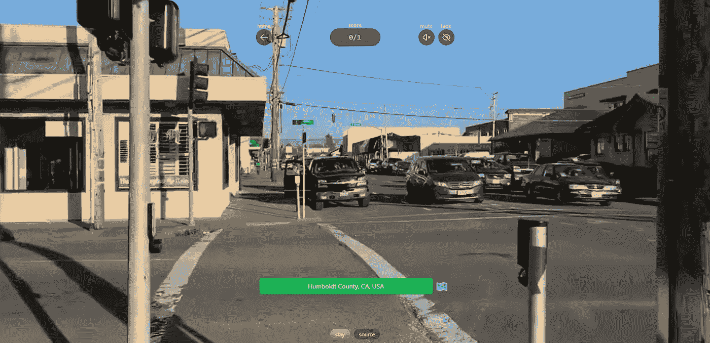
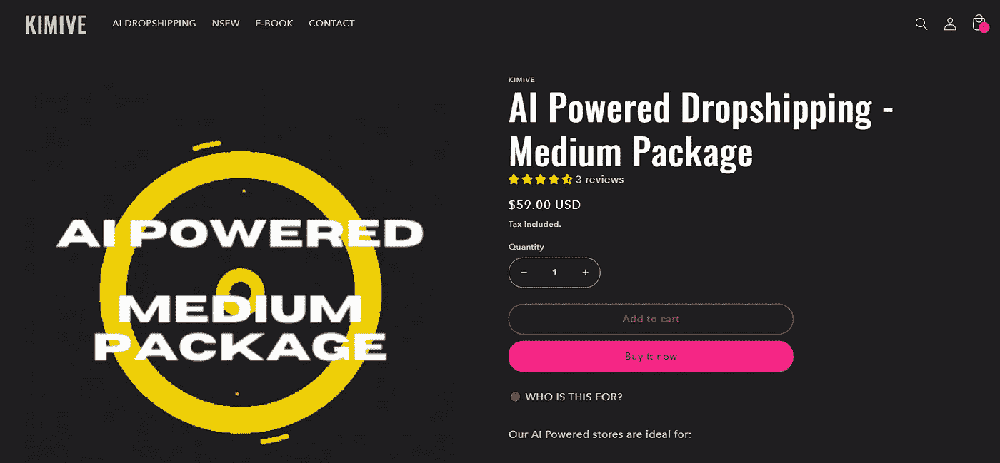
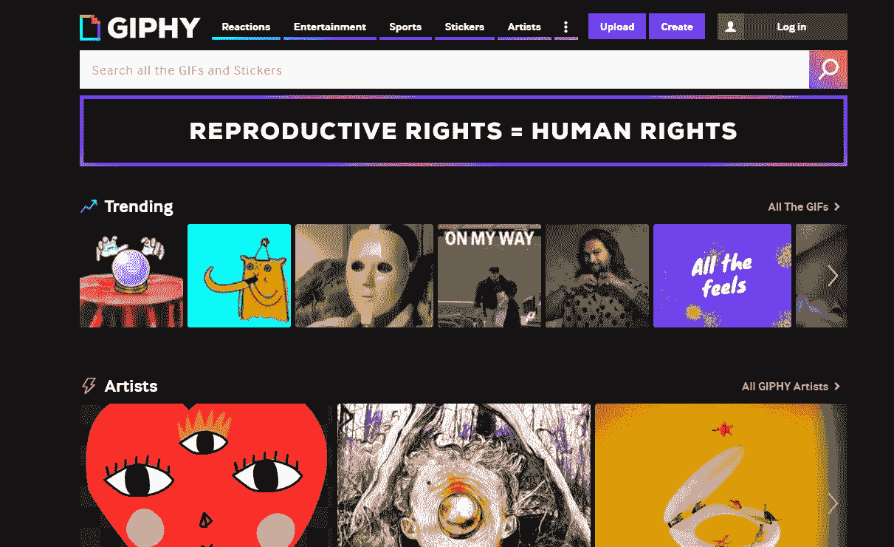
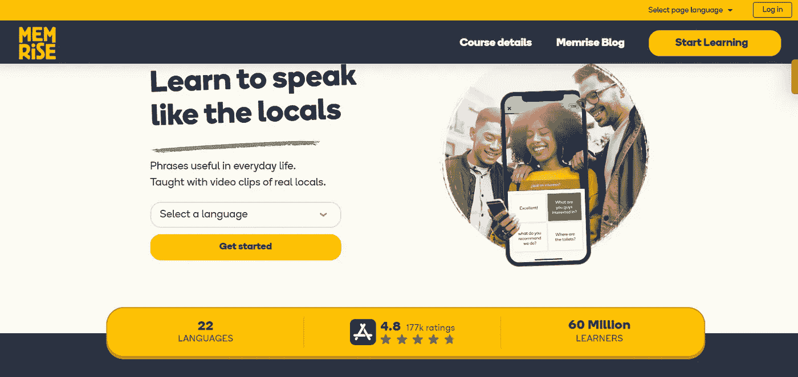
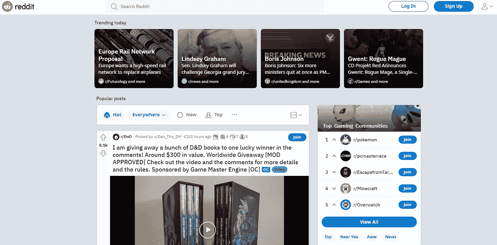
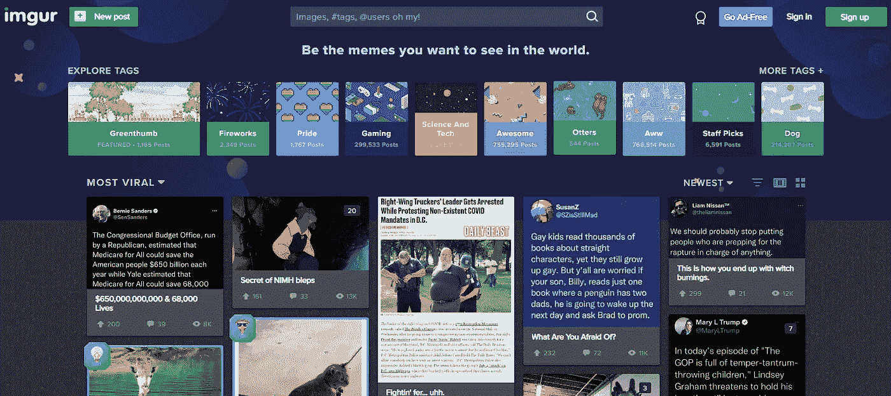
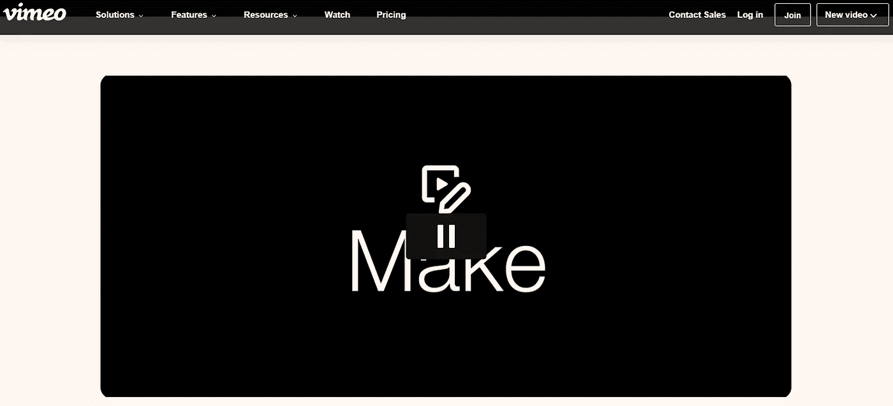
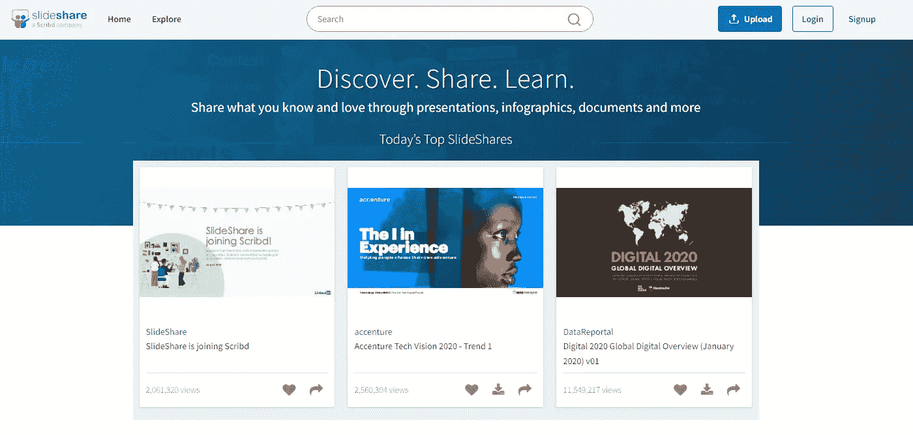

# 治愈无聊的 10 个网站|第四部分

> 原文：<https://levelup.gitconnected.com/10-websites-to-cure-boredom-part-4-d4cb79b967c9>

## 你再也不会感到无聊了！

## 这些网站会在你无聊的时候娱乐你。

这些网站将帮助你消除无聊，以娱乐的方式打发时间。如果你以前没有遇到过 Tik Toks，或者 YouTube 上谈论这类网站的短片，那么这很好，因为这意味着你转而阅读了这篇文章。

这里有一些我在网上找到的可以娱乐你的最好的网站。它们不仅是无聊时用的，也可以用来打发时间。

> 在这个时代，无聊是对自己的侮辱。

不要再浪费时间了，让我们继续这篇文章的其余部分。以下是帮助你治愈无聊的十大网站。

# [1。探索号](https://www.explordle.com/map/wor)

如果你想玩一个很酷很刺激的 GeoGuessr 版本，这个网站是个不错的网站。你点击 ***【开始】*** 按钮，然后你会看到一个人在某个城市漫步的 10 秒短片。

[https://www.explordle.com/map/wor](https://www.explordle.com/map/wor)

然后你必须猜猜它在世界的什么地方，如果你猜对了，你就能得分。你认为你有能力打败你的朋友吗，为什么不向他们挑战呢？通过访问网站[这里](https://www.explordle.com/map/wor)来玩这个令人敬畏的游戏吧。

# [2。基米夫](https://kimive.com/)

这是一个利基网站，你必须有创业精神才能有意义。这是一个疯狂的概念，也是我们生活在未来的证明。

一个人工智能将在几个小时内生成一个直运网站，它将考虑诸如趋势产品、趋势标签、最流行的设计风格等因素。然后开发人员会检查它，并会修复或编辑需要它的部分。

一天之内，你几乎可以凭空拥有一家蒸蒸日上的企业。如果你感兴趣，点击链接[这里](https://kimive.com/)开始。

# [3。吉菲](https://giphy.com/)

Giphy 已经存在很多年了，而且还在增长。这是另一个允许你在互联网上搜索图片和视频的网站。最棒的是，他们把所有的东西都归类到不同的主题中，这样你就不必浪费时间去搜索特定的东西了。

你甚至可以给图片和视频添加你自己的说明。你还在等什么？在这里参观遗址[。](https://giphy.com/)

## [4。Quizlet](https://quizlet.com/)

Quizlet 是一个网站，在那里你可以学习新的语言或学习你可能感兴趣的科目。这就像抽认卡，但更好，因为你可以创建自己的一套，并按照自己的节奏练习。

你还可以下载 Android 和 iOS 的应用程序，让你可以从任何地方访问它们的所有内容。点击查看[网站。](https://quizlet.com/)

## [5。记忆上升](https://www.memrise.com/)

Memrise 是一个你学习词汇的网站。类似于 Anki 这种流行的学习类 app。但是你不用卡片，而是用网页。

这背后的想法是，如果你把信息记在纸上，你会记得更好。一旦你学完一门课程，你可以随时复习。

所以你还在等什么，访问网站[这里](https://www.memrise.com/)。

## [6。Digg](https://digg.com/)

Digg 创建于 2004 年，是一个社交新闻网站。你提交故事，其他人投票赞成或反对这些故事。

票数最高的故事登上头版。人们喜欢在上面分享东西，这很容易让人上瘾。点击[这里](https://digg.com/)可以访问网站。

## [7。Reddit](https://www.reddit.com/)

Reddit 是一个社交社区，你可以在这里分享链接、文章、迷因和许多其他类型的帖子。有成千上万的子论坛，所以你可以找到你想要的。

在这个地方，任何人都可以发表任何东西，任何人都可以回复任何评论。他们称自己为“互联网的首页”,这是真的，因为当有人想对某个主题进行研究时，这确实是第一站。点击[此处](https://www.reddit.com/)访问 Reddit。

## [8。Imgur](https://imgur.com/)

Imgur 是一个上传照片和 gif 的网站。你可以直接上传，也可以浏览别人的作品。

这有点像 Pinterest，但更有趣。网站本身是完全免费的，每月向用户付费。你可以点击[这里](https://imgur.com/)来访问这个网站。

## 9。Vimeo

Vimeo 是最古老的网站之一，它以在线视频托管平台而闻名。

但你知道上传视频其实也能赚钱吗？你所需要的只是一个 YouTube 账户，然后前往货币化部分。

在那里你可以选择你每周想要多少浏览量，以及你想在你的视频上显示哪些广告。你可以访问这个网站[这里](http://vimeo.com)。

## [10。幻灯片共享](https://www.slideshare.net/)

SlideShare 是一个允许您上传演示文稿和幻灯片的网站。这些可以是公共的或私人的，它们可以下载为 PDF 文件。

有几个功能，包括添加背景音乐，创建信息图表，制作演示模板等等。

这些演示可以通过电子邮件分享，或者嵌入到博客和网站上。有些人甚至通过推广这些演示来赚钱。

# 结束语

我希望我在这个话题的第四部分中列出的这些网站能帮助你消除无聊，或者至少能让你暂时忘却烦恼。

如果你对这篇文章有任何问题或建议，请不要犹豫，在评论区回复。喜欢你读的东西吗？为什么不关注我的媒体简讯，这样你就不会错过我未来的任何文章了？很简单，点击[这里](https://kgabeci.medium.com/subscribe)输入你的邮箱地址，然后点击订阅。

你喜欢阅读媒体上的文章吗？考虑成为会员，有很多功能，你将获得所有创作者的内容，每月只需 5 美元。使用[这个链接](https://kgabeci.medium.com/membership)，你也帮我赚一点佣金，点击成为会员，输入你的信息。