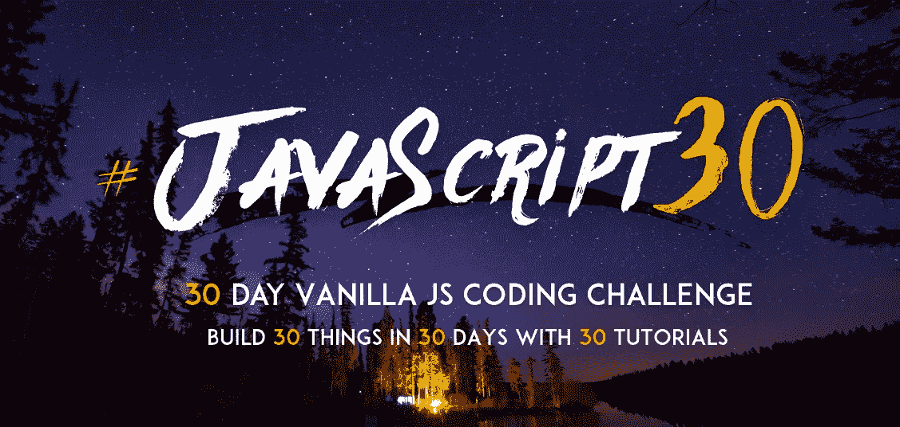
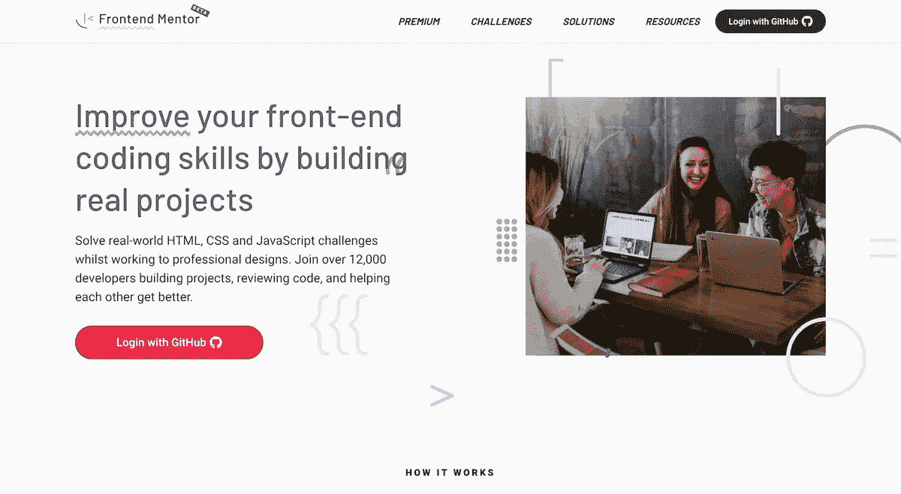
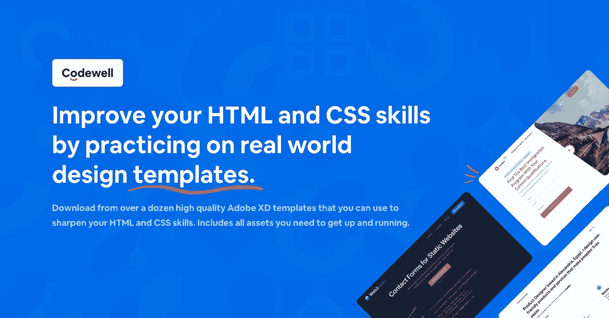
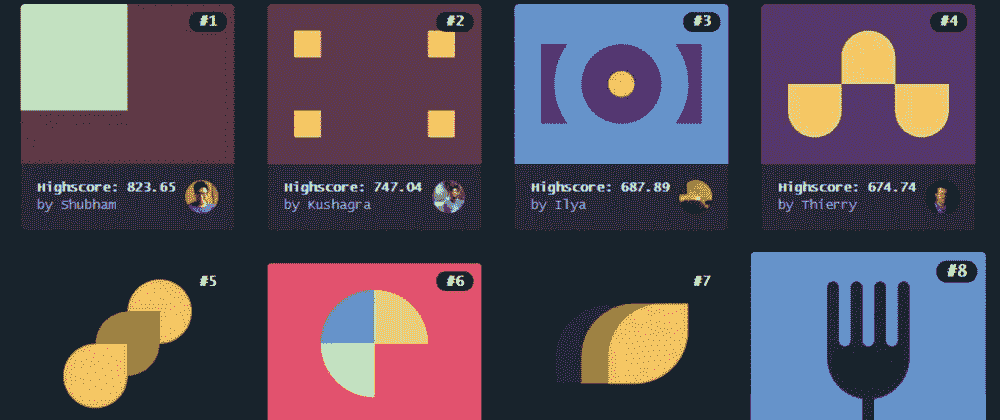
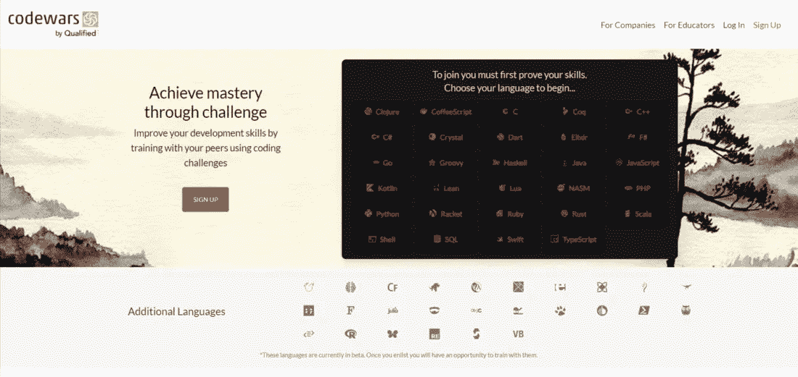
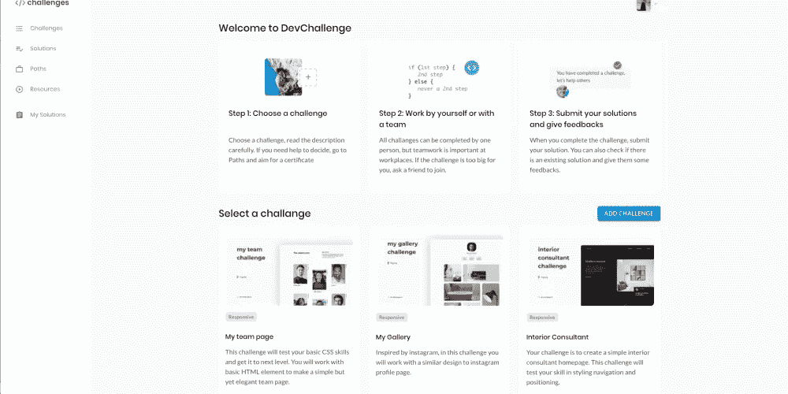
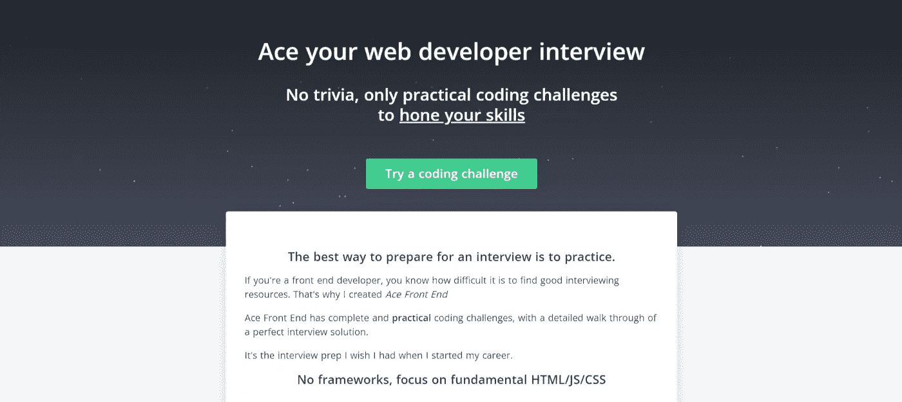
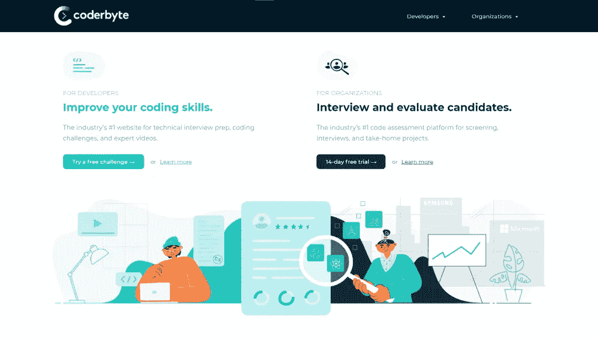
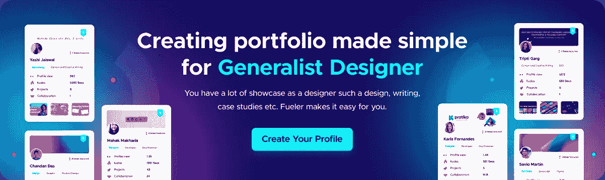
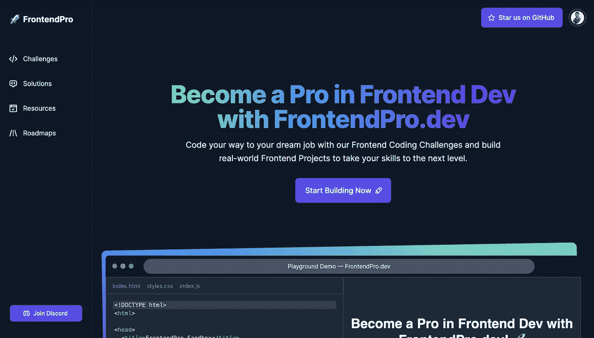

# 练习前端开发技能的 10 个网站😲

> 原文：<https://levelup.gitconnected.com/10-websites-to-practice-your-frontend-development-skills-fd1275d4c4f1>

练习前端技能的网站

边做边学是最好的学习方法。毫无疑问，学习程序的最佳方式是通过构建项目和解决现实世界的问题。这就是为什么在这篇文章中，我们收集了一个 **10 个伟大网站的列表，在那里你可以练习前端开发技能！**

所以，让我们通过这 10 个经典网站将你的前端技能提升到一个新的水平:

1.  [**Javascript 30**](https://javascript30.com/)

这是一个为期 30 天的普通 JS 编码挑战。在这 30 天左右的时间里，你可以尽情享受网飞风格的教程，想怎么慢就怎么慢，因为你可以立即免费观看所有的视频。

**2。**

**通过解决现实世界中的 HTML、CSS 和 JavaScript 挑战来提高您的前端编码技能，同时致力于专业设计。**

****

****3。** [**Codepen 挑战**](https://codepen.io/challenges)**

**挑战是通过构建事物来提升技能的有趣机会。每周，你都会收到一个围绕每月主题的新提示。**

****

****4。** [**码井**](https://www.codewell.cc/)**

**通过在真实的设计模板上练习来提高你的 HTML 和 CSS 技能。有了 Codewell，你可以浏览高质量的 Figma 模板，这些模板可以用来提高你的 HTML 和 CSS 技能。**

****

****5。** [**CSS 之战**](https://cssbattle.dev/)**

**使用你的 CSS 技能，用尽可能少的代码复制目标。随意检查目标&测试你的 CSS 技能。**

****

****6。**[**FreeCodeCamp**](https://www.freecodecamp.org/)**

**超过 7000+教程和吨的挑战，以完成沿途测试你学到了什么。而且那也是免费的！**

****

****7。**[**Codewars**](https://www.codewars.com/collections/coding-challenges)**

**作为[前端开发者](https://fueler.io/use-case/developer)，Codewars 是一个很好的练习 JavaScript 的平台。这是一个培养你解决问题能力的绝佳平台。！**

****

****8。**[**dev challenges . io**](https://devchallenges.io/)**

**DevChallenges 是一个社区和平台，面向任何希望通过构建真实项目和解决实际任务成为软件工程师的人。DevChallenges 的目标是让您建立一个出色的投资组合。**

****

****9。** [**Ace 前端**](https://www.acefrontend.com/)**

**Ace 前端计划旨在向您介绍编码世界，并向您全面概述如何设计有效的面试解决方案。**

****

****10。**[**CoderByte**](https://coderbyte.com/challenges)**

**旨在帮助您练习编程和提高编码技能的 web 应用程序。他们的编码挑战和网络开发课程可以帮助你准备即将到来的面试。**

****

****结论****

**感谢阅读，如果你喜欢这篇文章，请分享🤞💜**

**查看我的[Twitter](https://twitter.com/souptikdn)&[LinkedIn](https://www.linkedin.com/in/souptikdn/)更多精彩内容。**

**立即创建您的 [Fueler](https://fueler.io/register) 个人资料！**

****

**和 do check out[FrontendPro](https://www.frontendpro.dev/)让你的技能更上一层楼🚀**

****