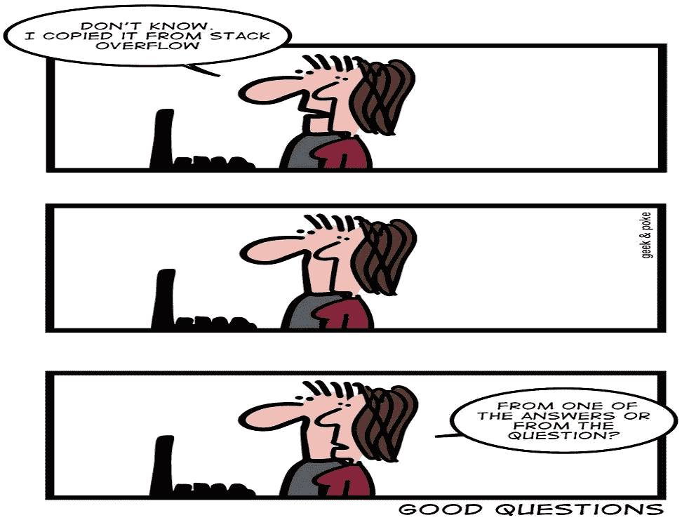

# 给真正程序员的 10 个诙谐的编程笑话

> 原文：<https://levelup.gitconnected.com/10-witty-programming-jokes-for-the-true-programmers-299c651b01af>

## 幽默

## 不是程序员也不用担心。这些笑话仍然会逗得你捧腹大笑。

使用 kapwing.com 创建

软件工程师是真正的无名英雄。他们开发了世界上的软件，所以很难不关注它！然而，这些精通技术的创意人员很有幽默感。他们在充满挑战的环境中茁壮成长，充分展示创造力。

> 没有笑声的生活无论如何都不会很充实。

从他们迷人的工作-生活经历中获得线索，这里试图通过笑话和连环漫画展示开发人员的旅程。

你想认识那些通过超能力拯救开发者世界的超级英雄吗？一直读到奖金部分。

> **注意:**如果您正在喝热饮料，请在进一步阅读前安全放下。

# 0.正则表达式

是的，这个词本身就让我感到不安。如果没有 Google God 的帮助，我永远也不知道如何编写一个合适的正则表达式。

信用: [xkcd](https://xkcd.com/1313/)

# 1.昆虫繁殖

当你被分配到一个缺陷时，第一条规则是尝试重现这个 bug。不要盲目相信 bug 追踪器中的细节。如果你不能复制它，为了安全起见，宣布它不可复制，以免你想为一场战斗做准备。

信用:[猴子用户](https://www.monkeyuser.com/2021/seldom/)

# 2.开发人员生产力的惊人图表

下面的图表描述了一个开发人员一天的工作效率的真实情况。嗯，这可能还不包括往返办公室的交通时间。除此之外，它是完美的。😄

信用:[猴子用户](https://www.monkeyuser.com/2016/developer-productivity/)

# 3.项目交付 101

无论几十年过去了，项目管理风格仍然保持不变。过度承诺和不可能的期限是整个开发人员社区的宿敌。

信用:[工作时间](https://workchronicles.com/how-to-deliver-a-project-in-4-easy-steps/)

# 4.没关系

作为开发者，很难感受到强大。即使我们创造了惊人的产品来运行这个世界，我们仍然无法控制我们周围的每个人如何从我们的日常日程中偷走时间。

信用:[工作时间](https://workchronicles.com/i-am-the-master-of-my-fate/)

# 5.问还是不问

管理会谈总是一把双刃剑。他们希望开发人员大胆提问。但他们在现实中想要的只是你听从指挥，照他们说的去做。

信用:[工作时间](https://workchronicles.com/ask-questions/)

# 6.当尊重不是双向的

我想这是一个普遍的职场问题，不管是不是这个行业。公司希望他们的员工遵守政策，或者根据政策对他们的好处灵活变通。

鸣谢:[工作地点漫画](https://www.reddit.com/r/ABoringDystopia/comments/mvlbr9/respect_your_work_schedule/)

# 7.复制粘贴是一种技能

复制粘贴是一种技能。如果你知道如何正确地做，你将会成为一名优秀的程序员。或者，也许我可以说它是一个超级大国。如果你明智地使用它，你将统治软件世界。

只要确保你知道从哪里拷贝什么到哪里，你就万事俱备了。

鸣谢:[极客&戳](https://geek-and-poke.com/?offset=1502624606843)

# 8.你最好祈祷

有经验的开发人员知道不仅仅是希望。如果你的代码在最初的几次尝试中不工作，祈祷比简单地希望你的下一个补丁能坚持更好。

信用:[极客&戳](https://geek-and-poke.com/?offset=1385804449778)

# 9.混乱的局面

一个真正的程序员的真实标志是他们的笔记本电脑上的电线网络有多复杂。有点同理心，永远不要让他们把电脑从桌子上拿走。

或者，如果你很慷慨，你也可以帮助他们解决问题。(*咳*扩展坞*咳*)

贷方: [CommitStrip](https://www.commitstrip.com/en/2016/01/07/the-desktop-laptop/)

# 奖金:我知道我们都喜欢一点点奖金

正如文章开头所承诺的那样，开始吧——看看那些每天不知疲倦地帮助我们的程序员朋友的超级英雄们。我们甚至无法想象一个没有这些英雄的软件开发世界。

信用:[猴子用户](https://www.monkeyuser.com/2020/code-superheroes/)

谢谢你边看边笑。如果您还不是 Medium， [**的付费会员，您可以通过访问此链接**](https://lokajit-tikayatray.medium.com/membership) 进行注册。你可以无限制地阅读媒体上的所有报道。我会收到你的一部分会员费作为介绍费，而你不必支付更多。

**您可能也想阅读:**

 [## 程序员给程序员的 10 个终极编程笑话

### 让你笑破肚皮的笑话，即使你不是程序员

levelup.gitconnected.com](/10-ultimate-programming-jokes-by-the-programmers-for-the-programmers-4e24a3b701f2)  [## 缺乏经验的程序员的 7 大标志

### 了解这些迹象，这样你就不会在你的软件开发生涯中犯同样的错误

levelup.gitconnected.com](/top-7-signs-of-an-inexperienced-programmer-5fc3f04658f3)  [## 这就是优秀的软件开发人员努力奋斗的原因

### 知道成为一名优秀的开发人员的不利之处，以及如何制定解决方案来克服这些困难

levelup.gitconnected.com](/this-is-why-good-software-developers-struggle-2267b5daf33)