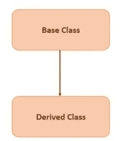
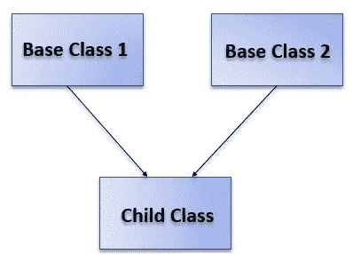
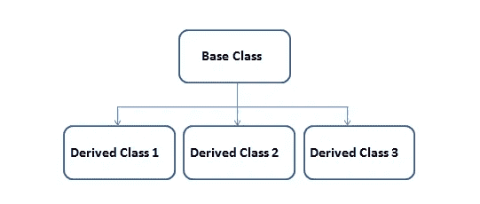
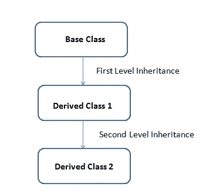
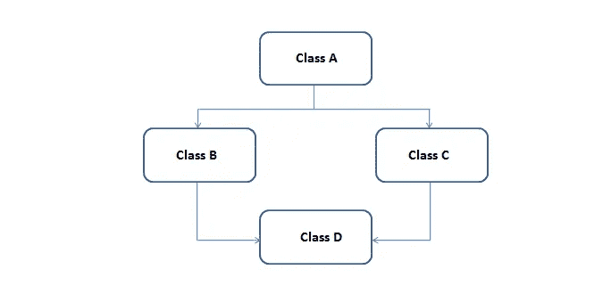
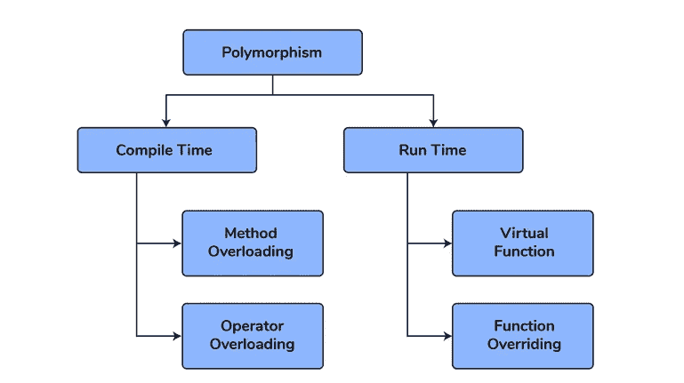

# 100 个 C++面试问题

> 原文：<https://levelup.gitconnected.com/100-c-interview-questions-e7b9b90e373e>

# 1.OOP 是什么？

OOP 代表面向对象编程。OOP 是一种依赖于类和对象概念的编程范式。它用于将软件程序构建成简单的可重用代码蓝图(通常称为类)，这些代码蓝图用于创建对象的单个实例。

C 是一种过程化的语言，而 C++是一种面向对象的语言，因为它有类并且可以利用多态性。

# 2.什么是课？

类是反映实体属性和动作的蓝图。从技术上讲，定义一个类就是设计一个用户定义的数据类型。下面是一个简单的 C++示例类。

```
class Window {public:
     Window();
     ~Window();};
```

# 3.什么是对象？

一个类的实例称为对象

您可以像这样创建一个窗口对象:

```
Window window;
```

这是窗口类的一个实例，即一个窗口对象。

# 4.列出 C++中支持的继承类型

**单一继承** —派生类只继承一个基类。它允许继承自基类(也称为父类或超类)的特性的可重用性。



单一遗传

这里有一些伪代码，带有一个类**基类**和它的派生类**派生类**。

```
class base_class {
     // code
};class derived_class : **<access modifier>** base_class {
     // code
};int main() { base_class object1; derived_class object2;}
```

在显示 **<访问修饰符>** 的地方，你可以使用 **public** 、 **private** 或 **protected** 。

**多重继承** —派生类有多个基类



以下是一些伪代码示例:

```
class base_class1 {
     // code
};class base_class2 {
     // code
};class derived_class : **<access modifier>** base_class1, **<access modifier>** base_class2 {
     // code
};int main() {derived_class object;}
```

**层次继承** —从单个基类创建多个派生类时。



分层继承

下面是一些伪代码来说明

```
class base_class {
     // code
};class derived_class1 : **<access modifier>** base_class {
     // code
};class derived_class2 : **<access modifier>** base_class {
     // code
};class derived_class3 : **<access modifier>** base_class {
     // code
};int main() {derived_class object;}
```

**多级继承—** 当一个派生类是从另一个派生类创建的。例如，你可以说子类有一个父类和一个祖父类。



多层次继承

下面是一个伪代码示例:

```
class base_class {
     // code
};class derived_class1 : **<access modifier>** base_class {
     // code
};class derived_class2 : **<access modifier>** derived_class1 {
     // code
};int main() {derived_class2 object;}
```

**混合遗传—** 这是一种以上遗传类型的结合。这有时也被称为**多路径** **继承**。

下面显示了一个示例，但这不是唯一可能的配置。



# 5.受保护访问说明符的作用是什么？

类成员被声明为 **protected** 可以被类的成员函数和友元(类或函数)使用。此外，它们可以由从类派生的类使用。

# 6。什么是封装？

将数据和作用于数据的功能绑定在一个实体(类)中的过程

# 7.什么是抽象？

抽象是指隐藏内部实现，只展示必要的细节。

# 8.什么是内联函数？

内联函数是对编译器的一种建议，建议将该函数视为一个宏。这比正常调用函数要快。编译器会在编译时将函数的内容粘贴到执行指令中，而不是在运行时使用子例程。

示例:

```
Class A {
public:
     inline int add(int a, int b) { return (a + b); }};
```

或者

```
Class A {
public: 
     int add(int a, int b);};inline int A::add(int a, int b) { return (a + b); }
```

# 9.什么是存储类？

定义变量和/或函数的范围和寿命。这些说明符位于它们所修改的类型之前。这些是 C++存储类:

*   汽车
*   注册
*   静电
*   走读生
*   易变的

**自动存储类**

自动存储类是所有局部变量的默认存储类。

```
void myFunction() {
int a;
auto int b;
}
```

这两个变量具有相同的存储类。Auto 只能在函数中使用，即。局部变量。

**寄存器存储类**

用于定义应该在寄存器而不是 RAM 中定义的局部变量。这意味着变量的最大大小等于寄存器大小(通常是一个字)，并且不能应用一元' & '运算符(因为它没有内存位置)

```
{
     register int miles;
}
```

应该只用于需要快速访问的变量，如计数器。**寄存器**是给编译器的一个*建议*，并不保证变量会存储在寄存器中。

**静态存储类**

**静态**存储类指示编译器在程序的生命周期中保持一个局部变量的存在，而不是在每次进入和离开范围时创建和销毁它。因此，将局部变量设为静态允许它们在函数调用之间保持它们的值。

静态修饰符也可以应用于全局变量。当这样做时，它会导致该变量的范围被限制在声明它的文件中。

**外部存储类**

extern 存储类用于提供对所有程序文件可见的全局变量的引用。当使用 extern 时，变量不能被初始化，因为它所做的只是将变量名指向一个先前定义的存储位置。

当你有多个文件并且你定义了一个全局变量或函数，这个变量或函数也将在其他文件中使用，那么 extern 将在另一个文件中使用以给出引用或函数。

第一个文件:main.cpp

```
#include <iostream>
int count ;
extern void write_extern();

main() {
   count = 5;
   write_extern();
}
```

第二个文件:support.cpp

```
#include <iostream>

extern int count;

void write_extern(void) {
   std::cout << "Count is " << count << std::endl;
}
```

**可变存储类**

可变说明符只适用于类对象。它允许对象的成员覆盖常量成员函数。也就是说，可变成员可以被常量成员函数修改。

可变存储类说明符仅用于类数据成员，以使其可修改，即使该成员是声明为 const 的对象的一部分。不能将可变说明符与声明为 static、const 或引用成员的名称一起使用。

在下面的**示例中**

```
class A
{
   public:
   A() : x(4), y(5) { };
   mutable int x;
   int y;
};

int main()
{
   const A var2;
   var2.x = 345;
   // var2.y = 2345;
}
```

编译器不允许 var2.y = 2345 赋值，因为 var2 已被声明为 const。编译器将允许赋值 var2.x = 345，因为 A::x 已被声明为可变的。

# 10.什么是虚函数？

C++虚函数是您在派生类中重新定义的基类成员函数。它是使用虚拟关键字声明的。

它用来告诉编译器对函数执行动态链接或后期绑定。

有必要使用单个指针来引用不同类的所有对象。因此，我们创建了指向基类的指针，该指针引用了所有的派生类对象，但是，当基类指针包含派生类对象的地址时，总是执行基类函数。这个问题只能使用“虚拟”功能解决。

当函数成为虚拟函数时，C++根据基类指针指向的对象类型来决定在运行时调用哪个函数。

虚函数的规则

*   虚函数必须是某个类的成员
*   虚函数不能是静态成员
*   它们是通过对象指针来访问的
*   他们可以是另一个阶层的朋友
*   即使不使用虚函数，也必须在基类中定义它。
*   基类和所有派生类的虚函数的原型必须相同。如果两个函数同名但原型不同，C++会认为它们是重载函数
*   我们不能有虚构造函数，但是我们可以有虚析构函数

# 11.什么是纯虚函数？

纯虚函数不执行任何任务，它只是一个占位符。这是一个什么都不做的函数。包含纯虚函数的类不能用来声明它自己的对象，这样的类被称为抽象基类。

基类的主要目标是为派生类提供特征，并创建用于实现运行时多态性的基指针。

纯虚函数可以定义为:

```
virtual void display()= 0;
```

让我们看一个简单的例子:

```
using namespace std;
class Base {
public:
     virtual void show() = 0;};class Derived : public Base {
public: 
     void show() {
          std::cout << "Derived class is derived from the base class" << std::endl; }};
```

# 12.引用和指针有什么区别？

引用和指针都可以用来在一个函数内部改变另一个函数的局部变量。当大对象作为参数传递给函数或从函数返回时，它们都可以用来保存大对象的副本，从而提高效率。尽管有以上相似之处，引用和指针之间还是有以下不同之处。

引用没有指针强大。

1.  引用一旦创建，以后就不能引用另一个对象；它不能被重新拔插。这通常是通过指针来实现的。
2.  引用不能为空，指针经常被设置为空，以表明它们没有指向任何有效的东西。
3.  引用在声明时必须初始化。指针没有这种限制。

由于上述限制，C++中的引用不能用于实现链表、树等数据结构。在 Java 中，引用没有上述限制，可以用来实现所有的数据结构。引用在 Java 中更强大，这是 Java 不需要指针的主要原因。

参考更安全、更易于使用:

1.  更安全:由于引用必须初始化，所以类似于通配符指针的通配符引用不太可能存在。仍然有可能存在不指向有效位置的引用。
2.  更容易使用:引用不需要解引用操作符来访问值。它们可以像普通变量一样使用。需要& operator。

# 13.什么是多态性？

多态这个词的意思是“多种形式”。

C++中有两种类型的多态性:

*   编译时多态性
*   运行时多态性



[1]

为了在 C++中拥有运行时多态性，需要三样东西

1.  基类和派生类
2.  基类和派生类中具有相同名称的函数，这样就可以执行所谓的覆盖的**函数**
3.  指向或引用派生类的对象的基类类型的指针或引用。

# 14.这个指针是什么？

this 指针作为隐藏参数传递给所有非静态成员函数调用，并作为所有非静态函数体内的局部变量。这个指针是一个常量指针，保存当前对象的内存地址。该指针在静态成员函数中不可用，因为静态成员函数可以在没有任何对象(带有类名)的情况下被调用

# 15.什么是 VTABLE 和 VPTR？

vtable 是一个函数指针表。它是按类维护的。VPTR 是指向 vtable 的指针。它是按对象维护的。编译器在两个地方添加了额外的代码来维护和使用 vtable 和 vptr。

1.  每个构造函数中的代码。这段代码设置正在创建的对象的 vptr。这段代码将 vptr 设置为指向类的 vtable。
2.  多态函数代码失败。无论在哪里进行多态调用，编译器都会插入代码，首先使用基类指针或引用查找 vptr。(在上面的例子中，由于指向的引用对象是派生类型，所以访问派生类的 vptr)一旦获取了 vptr，就可以访问派生类的 vtable。使用 vtable，访问并调用派生类函数 show()的地址。

# 16.区分浅层拷贝和深层拷贝

一般来说，如果一个对象的变量是动态分配的，那么就需要进行深度复制来创建该对象的副本。

**浅抄:**

在浅层复制中，通过简单地复制原始对象的所有变量的数据来创建对象。如果对象的任何变量都没有在内存的堆部分定义，那么这样做很好。如果有些变量是从堆段动态分配内存的，那么被复制的对象变量也将引用相同的内存位置。

这将产生歧义和运行时错误悬空指针。因为两个对象都将引用同一个内存位置，所以一个对象所做的更改也会反映到另一个对象中。因为我们想要创建对象的副本，所以浅拷贝不能满足这个目的。

注意:C++编译器隐式创建一个复制构造函数并重载赋值运算符，以便在编译时执行浅层复制。

**深度复制:**

在深度复制中，对象是通过复制所有变量的数据来创建的，它还为对象分配具有相同值的相似内存资源。为了执行深度复制，我们需要显式地定义复制构造函数，并在需要时分配动态内存。此外，还需要为其他构造函数中的变量动态分配内存。

# **17。什么是 C++中的抽象类？**

至少有一个纯虚函数的类。我们不能实例化一个抽象类

```
class abstractClass {public:      virtual void show() = 0;
};
```

# 18.静态成员关键字对类成员变量有什么作用？

静态变量确实存在，尽管没有创建相应类的对象。静态成员变量在为各自的类创建的所有对象之间共享一个公共内存。可以使用类名本身引用静态成员变量。

# 19.命名可用于在 C++中存储宽字符的数据类型

wchar_t

# 20.用来访问类成员的操作符是什么？

点(。)和箭头(->)

# 21.什么是函数重载？

使用唯一的参数列表定义多个同名函数。

# 22.什么是运算符重载？

针对类对象为现有操作员定义新作业。您将在类定义中重载一个运算符。

示例:重载+运算符以将两个帐户对象相加。

```
class Account { Account operator+(const Account& account) {
        Account newAccount;
        newAccount.users = this->users + account.users;
        newAccount.profit = this->profit + account.profit;
    }};
```

# 23.在 C++中我们有字符串原始数据类型吗？

不，它是来自 STL(标准模板库)的一个类

# 24.命名 C++中的默认标准流。

cin，cout，cerr 和木屐

**使用 cout:** 使用 cout 打印调试输出

```
#include <iostream>
using namespace std;int main() {
     cout << "hello world!" << endl;
     return 0;
}
```

**使用 cin** :使用 cin 从用户那里获得控制台输入

```
#include <iostream>
using namespace std;int main() {
     int input = 0;
     cout << "Enter a number: " << endl;
     cin >> input;
     return 0;
}
```

**使用 cerr** :初学 C++的程序员使用 cout 来显示错误，使用标准输出来调试他们的程序，但是使用 cerr 来显示错误总是一个好的做法。

这是因为您可以稍后更改错误流，将错误写入文件，而不是将错误流显示在屏幕上。

```
#include <iostream>
#include <fstream>
using namespace std;int main() { char filename[] = "data.txt";
     if stream infile(fileName); if(infile)
          cout << infile.rdbuf();
     else
          cerr << "Error while opening the file " << fileName << endl; return 0;}
```

**使用 clog** : clog 和 cerr 都与 stderr 相关联，但它与 cerr 的不同之处在于，clog 中的流是缓冲的，不会自动与 cout 绑定。

缓冲输出比无缓冲输出更有效。在缓冲输出的情况下，所有的输出都保存在一个变量中，并一次性写入磁盘。对于无缓冲输出，我们必须不断写入磁盘。

对于严重错误，缓冲输出不是首选。在系统崩溃的情况下，可能会出现这样一种情况，即输出仍然在缓冲区中，没有写入磁盘，并且无法检索错误消息。我们不能在系统崩溃的情况下丢失错误数据，所以我们继续将关键错误写入磁盘，即使这样会更慢。

clog 通常用于日志记录。对于非关键事件日志记录，效率更重要，因此 clog 比 cerr 更受欢迎。

```
#include <iostream>
#include <fstream>
using namespace std;int main() {
     char fileName[] = "data.txt";
     ifstream infile(fileName); if(infile) 
          cout << infile.rdbuf();
     else
          clog << "Error while opening the file " << fileName << endl;
     return 0;}
```

这将打印控制台，类似于如果您使用 cout，但它会更有效。

如果您希望 clog 和 stream 操作符写入文件而不是控制台，您需要将输出重定向到文件。

```
#include <iostream>
#include <fstream>int main() {
    std::ofstream out("test.txt");

    // get the rdbuf of clog
    // we need it to reset the value before exiting
    auto old_rdbuf = std::clog.rdbuf(); // set the rdbuf of clog
    std::clog.rdbuf(out.rdbuf()); // write to clog
    // The output should go to test.txt
    std::clog << "Test test test/n"; // reset the rdbuf of clog
    std::clog.rdbuf(old_rdbuf); return 0;}
```

# 25.多态性的利弊是什么？

**优点:**

*   它帮助程序员在编写、测试和实现之后重用代码和类。它们可以以多种方式重用。
*   单个变量名可以用来存储多种数据类型的变量(float、double、long、int 等)
*   多态性有助于减少不同功能之间的耦合

**缺点:**

*   多态性的缺点之一是开发人员发现很难在代码中实现多态性。
*   运行时多态性会导致性能问题，因为机器需要决定调用哪个方法或变量，所以它基本上会降低性能，因为决策是在运行时做出的。
*   多态性降低了程序的可读性。人们需要识别程序的运行时行为来识别实际的执行时间。

# 26.什么是名称空间？

名称空间是一个声明性区域，它为其中的标识符(类型、函数、变量等的名称)提供了一个范围。命名空间用于将代码组织到逻辑组中，并防止可能发生的名称冲突，尤其是当您的代码库包含多个库时。

命名空间范围内的所有标识符彼此可见，没有限定。命名空间之外的标识符可以通过使用每个标识符的完全限定名来访问成员，例如

```
std::vector<std::string> vec;
```

或者通过对单个标识符的“使用声明”

```
using std::string
```

或者对名称空间中的所有标识符使用“using 指令”

```
using namespace std;
```

头文件中的代码应该始终使用完全限定的命名空间名称。(不要在头文件中使用名称空间 std，而是在需要时使用 std::来代替)

下面的示例显示了命名空间声明以及命名空间之外的代码访问其成员的三种方式。

```
namespace MyNameSpace {
     class MyClass {
     public:
          void doSomething();
     }; void Func(MyClass) {}
}
```

使用完全限定名

(记住在头文件中始终使用完全限定名)

```
MyNameSpace::MyClass object;
object.doSomething();
MyNameSpace::Func(object);
```

使用 using 声明将一个标识符带入范围:

```
using MyNameSpace::MyClass;MyClass object;
object.doSomething();
Func(object);
```

# 27.结构和类的区别是什么？

**结构—**

*   默认情况下，该结构的成员是公共的
*   当从类/结构派生结构时，基类/结构的默认访问说明符是公共的。

**类—**

*   默认情况下，该类的成员是私有的
*   当派生类时，默认访问说明符是私有的

# **28。C++中有哪些不同的数据类型？**

下面给出了 C++中的 4 种数据类型。

*   **原始数据类型**(基本数据类型)——如 char、short、int、float、long、double bool 等。
*   **派生的数据类型** —如数组、指针等。
*   **枚举** —例如枚举
*   **用户定义的数据类型**——如结构、类等。

# 奖金 1。解释 volatile 关键字的用途

volatile 关键字用于告诉编译器该值可能会随时改变，而编译器在附近找到的代码不会采取任何行动。实际上，这种情况主要发生在三种情况下。

1.  存储器映射外设寄存器
2.  由中断服务程序修改的全局变量
3.  多线程应用程序中多个任务访问的全局变量。

您可以像这样声明一个可变变量:

```
volatile uint16_t x;
```

或者像这样:

```
uint16_t volatile x;
```

将 volatile 关键字放在数据类型之前还是之后并不重要。

以下是指向可变变量的指针:

```
volatile uint8_t * p_reg;
// OR
uint8_t volatile * p_reg;
```

你甚至可以有一个指向可变变量的可变指针:

```
uint16_t * volatile * volatile p_y;
```

# 参考

[1][https://www.interviewbit.com/cpp-interview-questions/](https://www.interviewbit.com/cpp-interview-questions/)