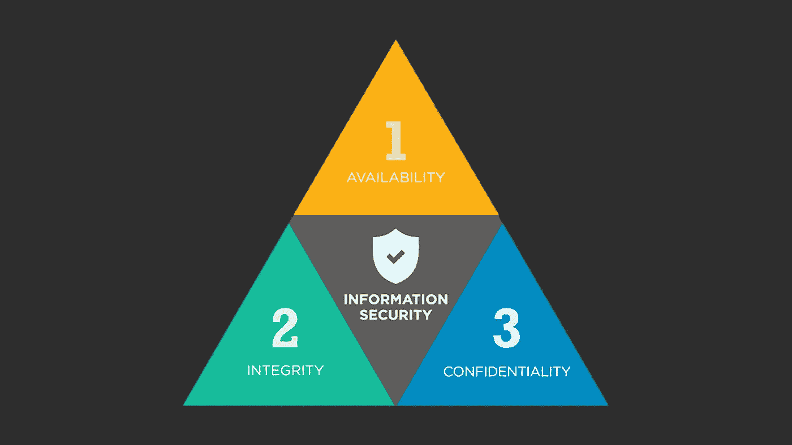
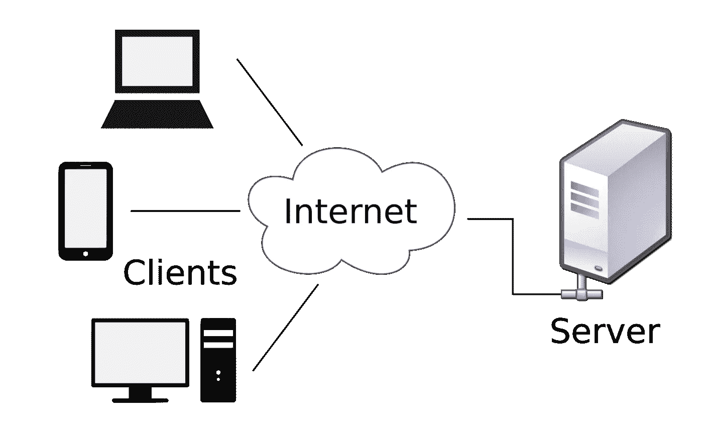
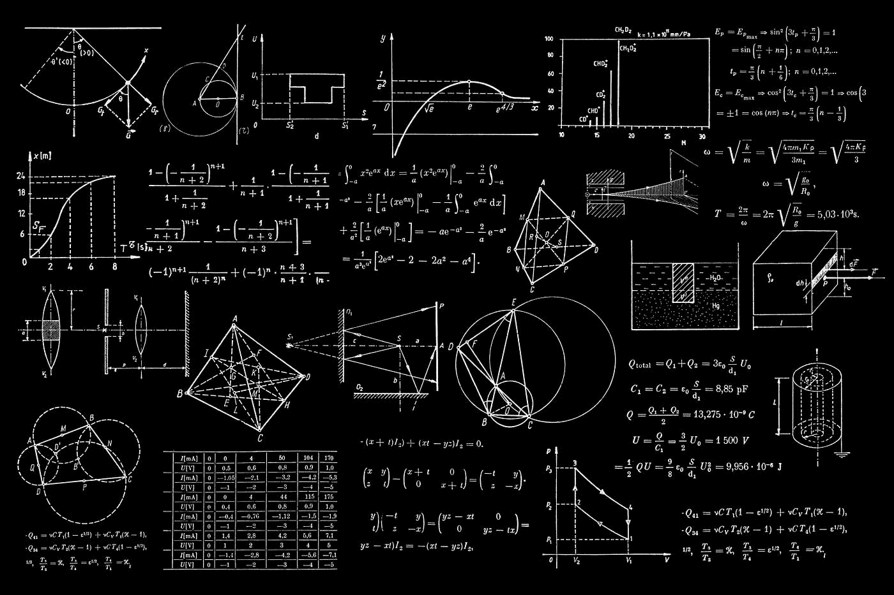

# 每个开发人员都必须知道的 100 个基本网络安全概念(第 1 部分:1–10)

> 原文：<https://levelup.gitconnected.com/100-essential-cybersecurity-concepts-that-every-developer-must-know-part-1-1-10-852e118e8244>

这些是 100 个基本的网络安全概念，将帮助您构建安全的应用程序。

为了保证可读性，我将这些分成多篇博文。

由[丹·尼尔森](https://unsplash.com/@danny144?utm_source=medium&utm_medium=referral)在 [Unsplash](https://unsplash.com?utm_source=medium&utm_medium=referral) 上拍摄的照片

# 1.中情局三人组

CIA triad 是建立数据安全系统的一套标准。

这是一个三元组，包括:

*   **保密性**
    防止对信息的有意/无意的未授权访问
*   **完整性**
    数据应准确、可靠、防篡改
*   **可用性**

中情局三位一体(来源:[https://csilinux . com/blog/CIA-Triad-confidential-Integrity-avail ability/](https://csilinux.com/blog/CIA-Triad-Confidentiality-Integrity-Availability/))

# 2.数据泄露

数据泄露是指未经授权的一方有意或无意地获取敏感、受保护或机密数据的安全违规行为。

下面是一个数据泄露的例子:

 [## 网上发现了一个庞大的脸书用户电话号码数据库

### 在网上发现了上亿个与脸书账户相关的电话号码。

techcrunch.com](https://techcrunch.com/2019/09/04/facebook-phone-numbers-exposed/) 

# 3.数据挤压

这是一种数据盗窃形式，其中一方从计算机系统执行未经授权的数据传输。

下面是一个数据挤压的例子:

 [## 亚马逊解雇泄露客户电子邮件的员工

### 图片来源:Michael Nagle/彭博 via Getty Images 你还知道其他内幕数据滥用的例子吗？我们很乐意…

www.vice.com](https://www.vice.com/en/article/dy8zwz/amazon-fired-employee-leaking-customer-emails) 

# 4.最小特权原则

该原则规定，主体只应被赋予完成其任务所需的特权。

如果主体不需要访问权限，则主体不应该拥有该权限。([来源](https://www.cisa.gov/uscert/bsi/articles/knowledge/principles/least-privilege#:~:text=The%20Principle%20of%20Least%20Privilege%20states%20that%20a%20subject%20should,should%20not%20have%20that%20right.))

由[弗兰克](https://unsplash.com/@franckinjapan?utm_source=medium&utm_medium=referral)在 [Unsplash](https://unsplash.com?utm_source=medium&utm_medium=referral) 上拍摄的照片

# 5.客户机-服务器体系结构

它是一个分布式系统架构，工作在**请求-响应周期**。

这是一个 [***客户端***](/100-essential-systems-design-concepts-that-every-developer-must-know-part-1-1318c2c402ca) 向 [***服务器***](/100-essential-systems-design-concepts-that-every-developer-must-know-part-1-1318c2c402ca) 发送数据资源请求，然后*服务器*做出响应的地方。

客户端-服务器架构(图片来自维基百科)

# 6.IP 包/网络包

它是通过[互联网协议](/100-essential-systems-design-concepts-that-every-developer-must-know-part-1-1318c2c402ca)进行通信的基本单元。

一个 IP 数据包包括:

*   **报头**
    由源和目的 IP 地址以及发送数据包所需的其他网络信息组成
*   **有效载荷** 由数据包的实际数据内容组成，根据协议报头字段的值进行解释。

# 7.密码散列法

它是使用哈希函数将任意大小的数据映射到固定大小的值的过程。

**散列函数**是确定性的数学单向函数。常用散列函数的一些例子有 **RipeMD** 和 **SHA** 。

哈希运算产生一致的结果，易于执行，但难以逆转。

例如:

字符串`ashish`的 [**SHA256**](https://en.wikipedia.org/wiki/SHA-2) hash 为`05d08de271d2773a504b3a30f98df26cccda55689a8dc3514f55d3f247553d2b`(可以[轻松算出](https://emn178.github.io/online-tools/sha256.html))。

但是不能*( *直到当前日期)*执行相反的操作，即找到用于计算给定散列的字符串(除非他们使用比较所有可能的关键字-散列对的强力方法)。

丹·克里斯蒂安·pădureț在 [Unsplash](https://unsplash.com?utm_source=medium&utm_medium=referral) 上拍摄的照片

# 8.加密

它是一种使用加密算法将人类可读数据编码成 [*密文*](https://en.wikipedia.org/wiki/Ciphertext) (非人类可读数据)的技术，以确保只有授权用户才能解码数据并访问数据。

哈希和加密的区别在于:

> ***使用特定的密钥，可以进行反向加密/解密。***

[regularguy.eth](https://unsplash.com/@moneyphotos?utm_source=medium&utm_medium=referral) 在 [Unsplash](https://unsplash.com?utm_source=medium&utm_medium=referral) 上的照片

# 9.对称密钥加密

这是一种使用单个密钥来加密和解密数据的加密类型。

这个密钥由参与数据交换的双方共享。

一些流行的对称密钥算法包括 [AES](https://en.wikipedia.org/wiki/Advanced_Encryption_Standard) 、 [DES](https://en.wikipedia.org/wiki/Data_Encryption_Standard) 、 [Twofish](https://en.wikipedia.org/wiki/Twofish) 和 [Serpent](https://en.wikipedia.org/wiki/Serpent_(cipher)) 。

# 10.非对称加密/ **公钥加密**

这种加密使用两个密钥(一个公钥和一个私钥)来加密和解密数据。

这些密钥对使用[单向](https://en.wikipedia.org/wiki/One-way_function)密码算法生成。

在这种加密方案中，数据使用*公钥*(公开共享)加密，并且只能使用*私钥*(保密)解密。

HTTPS(超文本传输协议安全协议)通信协议依赖于非对称加密。

由 [Alp Duran](https://unsplash.com/@alpduran?utm_source=medium&utm_medium=referral) 在 [Unsplash](https://unsplash.com?utm_source=medium&utm_medium=referral) 上拍摄的照片

非常感谢你阅读这篇文章！下一部分再见！

 [## 每个开发人员都必须知道的 100 个基本网络安全概念(第 2 部分:11–20)

### 构建安全应用程序的必备清单

levelup.gitconnected.com](/100-essential-cybersecurity-concepts-that-every-developer-must-know-part-2-11-20-a35f6eb41e49) 

*如果你是 Python 或编程的新手，可以看看我的新书，书名是'* [**《没有公牛**t 学习 Python 指南》**](https://bamaniaashish.gumroad.com/l/python-book) **'** *下面:*

 [## 学习 Python 的无牛指南

### 你是一个正在考虑学习编程却不知道从哪里开始的人吗？我有适合你的解决方案…

bamaniaashish.gumroad.com](https://bamaniaashish.gumroad.com/l/python-book)  [## 通过我的推荐链接加入 Medium-Ashish Bama nia 博士

### 阅读 Ashish Bamania 博士(以及 Medium 上成千上万的其他作家)的每一个故事。您的会员费直接…

bamania-ashish.medium.com](https://bamania-ashish.medium.com/membership)