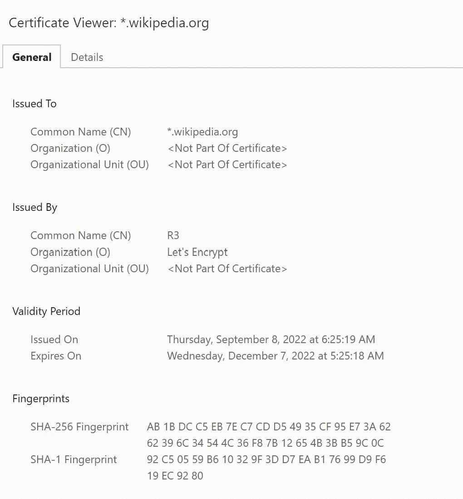
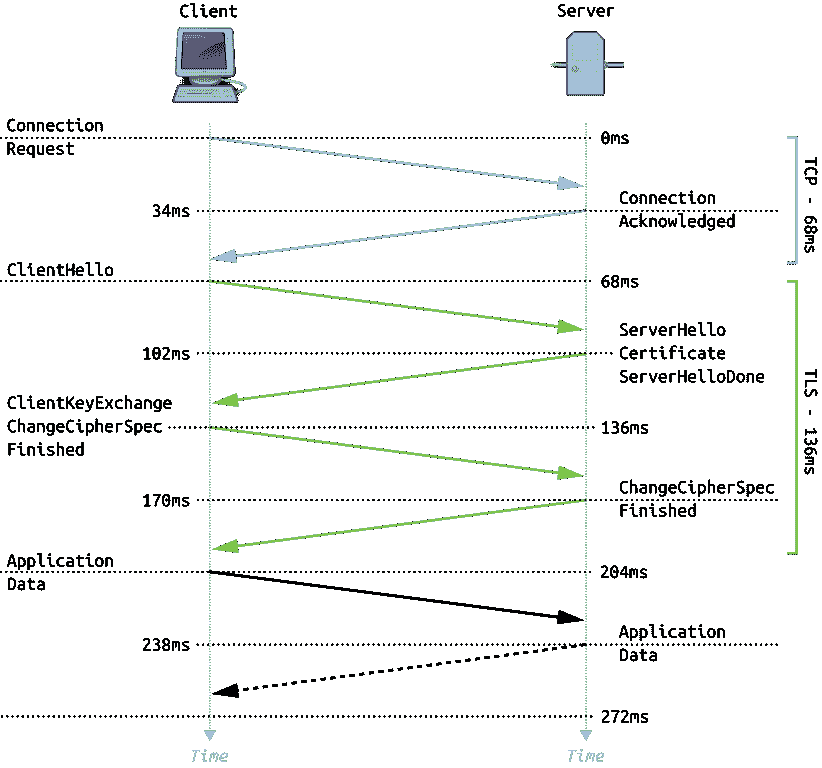

# 每个开发人员都必须知道的 100 个基本网络安全概念(第 2 部分:11–20)

> 原文：<https://levelup.gitconnected.com/100-essential-cybersecurity-concepts-that-every-developer-must-know-part-2-11-20-a35f6eb41e49>

这些是 100 个基本的网络安全概念，将帮助您构建安全的应用程序。

为了保证可读性，我将这些分成多篇博文。

由[弗兰克](https://unsplash.com/@franckinjapan?utm_source=medium&utm_medium=referral)在 [Unsplash](https://unsplash.com?utm_source=medium&utm_medium=referral) 上拍摄

下面列出了前一部分的链接:

 [## 每个开发人员都必须知道的 100 个基本网络安全概念(第 1 部分:1–10)

### 构建安全应用程序的必备清单

levelup.gitconnected.com](/100-essential-cybersecurity-concepts-that-every-developer-must-know-part-1-1-10-852e118e8244) 

# 11.高级加密标准

它是由美国国家标准与技术研究所(NIST)建立的基于对称密钥加密的标准。

算法输入 128 位，输出 128 位加密的[密文](https://en.wikipedia.org/wiki/Ciphertext)。

要了解 AES 的工作原理，请参考以下链接:

 [## 高级加密标准(AES) - GeeksforGeeks

### 高级加密标准(AES)是由美国政府制定的电子数据加密规范

www.geeksforgeeks.org](https://www.geeksforgeeks.org/advanced-encryption-standard-aes/) 

# 12.认证授权

它是一个存储、签名和颁发数字证书的可信第三方实体。

数字证书证明公钥属于证书的指定主题。

互联网上的客户端首先在服务器证书上验证证书颁发机构的签名。如果成功，它将启动与服务器的安全 HTTPS 连接。

[IdenTrust](https://en.wikipedia.org/wiki/IdenTrust) 、 [DigiCert](https://en.wikipedia.org/wiki/DigiCert) 和 [Sectigo](https://en.wikipedia.org/wiki/Sectigo) 是全球三大认证机构。

Photo by [戸山 神奈](https://unsplash.com/@toyamakanna?utm_source=medium&utm_medium=referral) on [Unsplash](https://unsplash.com?utm_source=medium&utm_medium=referral)

# 13.SSL/TLS 证书

它是一种数字证书，用于鉴定网站服务器的身份，并帮助启用客户端和服务器之间的加密 HTTPS 连接。

SSL/TLS 证书由证书颁发机构颁发，托管在网站的服务器上。

SSL/TLS 证书包括:

*   网站的域名
*   证书颁发给的个人、组织或设备的详细信息
*   证书颁发机构的详细信息及其数字签名(使用证书颁发机构的私钥创建)
*   发行日期和到期日期
*   网站的[公钥](/100-essential-cybersecurity-concepts-that-every-developer-must-know-part-1-1-10-852e118e8244)(稍后客户端使用它来建立与网站服务器的 HTTPS 连接)

> 请注意，在颁发 SSL/TLS 证书时，网站的私钥与公钥同时生成。
> 
> 它对服务器保密，不嵌入在 SSL 证书中。

维基百科的 SSL 证书(图片作者提供)

# 14.传输层安全性(TLS)

它是一种保护计算机网络上两个实体(例如客户端和服务器)之间通信的协议。

它建立在现在已经废弃的 **SSL(安全套接字层**)规范之上。

它是 [OSI 模型](/100-essential-systems-design-concepts-that-every-developer-must-know-part-1-1318c2c402ca)中**应用层(第 7 层)**的一部分。

# 15.HTTPS

超文本传输协议安全或 HTTPS，HTTP 的扩展，确保计算机网络上实体间的安全通信。

> **HTTPS = HTTP over TLS**

请注意:

*   **端口 80** 通常用于未加密的 [HTTP](https://en.wikipedia.org/wiki/Hypertext_Transfer_Protocol) 流量
*   **端口 443** 是用于加密 [HTTPS](https://en.wikipedia.org/wiki/HTTPS) 流量的通用端口

# 16.TLS 握手

这是客户端和服务器通过 HTTPS 建立安全连接的过程。

其步骤大致如下:

*   客户端向服务器发送 **ClientHello** 消息
*   服务器用一个 **ServerHello** 消息来响应
*   服务器发送一个**证书**消息和一个**服务器密钥交换**消息(包含一个包含服务器公钥的 SSL 证书)
*   然后服务器发送一个 **ServerHelloDone** 消息
*   客户端使用证书颁发机构的公钥和签名来验证 SSL 证书(注意，证书颁发机构使用证书颁发机构的私钥来签署 SSL 证书)
*   客户端发回一个 **ClientKeyExchange** 消息(包含一个 **PreMasterSecret** ，使用服务器证书中收到的公钥对其进行加密)。
*   客户端和服务器使用 **PreMasterSecret** 生成对称加密会话密钥，用于加密它们之间的所有进一步通信。
*   客户端向服务器发送 **ChangeCipherSpec** 和**完成**消息
*   服务器试图使用其私钥解密客户端的**完成的**消息
*   最后，服务器发送一个 **ChangeCipherSpec** 和**完成**消息。这就完成了 TLS 握手。

TLS 握手(图片来自维基百科)

# 17.网络攻击

这是一种恶意尝试，目标是破坏单个/多个计算机系统。

 [## 优步黑客-18 岁的黑客声称是大规模入侵的幕后黑手

### 《纽约时报》报道称优步遭到黑客攻击。这是我们目前所知道的关于这个突发事件的信息…

www.forbes.com](https://www.forbes.com/sites/daveywinder/2022/09/15/has-uber-been-hacked-company-investigates-cybersecurity-incident-as-law-enforcement-alerted/) 

# 18.中间人攻击

当恶意方秘密拦截并可能改变两方之间的通信，而这两方认为他们的通信是私人的，这就是网络攻击。

HTTPS 是一种用于防范 MITM 攻击的协议。

照片由[阿扎马特 E](https://unsplash.com/@esen_aza?utm_source=medium&utm_medium=referral) 在 [Unsplash](https://unsplash.com?utm_source=medium&utm_medium=referral) 上拍摄

# 19.渗透测试

它是一种获得 It 系统安全性保证的方法，通过使用与对手可能使用的相同工具和技术，试图破坏该系统的部分或全部安全性。

[渗透测试](https://www.ncsc.gov.uk/guidance/penetration-testing)用于识别源于软件和硬件漏洞的技术风险等级。

照片由[斯科特·格雷厄姆](https://unsplash.com/@homajob?utm_source=medium&utm_medium=referral)在 [Unsplash](https://unsplash.com?utm_source=medium&utm_medium=referral) 上拍摄

# 20.黑/白/灰帽子黑客

黑帽黑客是为了个人或经济利益而入侵计算机系统的个人或团体。

白色仇恨黑客是有道德的黑客，他们在系统所有者的许可下闯入计算机系统。这样做是为了识别系统漏洞，以保护它们免受网络攻击。

灰色帽子黑客未经系统所有者的许可就闯入计算机系统，并经常要求支付费用来修复他们在此过程中发现的问题。他们通常不会利用已发现的系统漏洞。

米卡·鲍梅斯特在 [Unsplash](https://unsplash.com?utm_source=medium&utm_medium=referral) 上的照片

*非常感谢你阅读这篇文章！下一部分再见！*

 [## 每个开发人员都必须知道的 100 个基本网络安全概念(第 3 部分:21–30)

### 构建安全应用程序的必备清单

bamania-ashish.medium.com](https://bamania-ashish.medium.com/100-essential-cybersecurity-concepts-that-every-developer-must-know-part-3-21-30-20957d06c4ab) 

*如果你是 Python 或编程的新手，可以看看我的新书，书名是'* [**【没有公牛**t 学习 Python 指南**](https://bamaniaashish.gumroad.com/l/python-book)**'***:*

 [## 学习 Python 的无牛指南

### 你是一个正在考虑学习编程却不知道从哪里开始的人吗？我有适合你的解决方案…

bamaniaashish.gumroad.com](https://bamaniaashish.gumroad.com/l/python-book)  [## 通过我的推荐链接加入 Medium——Ashish Bama nia 博士

### 阅读 Ashish Bamania 博士(以及 Medium 上成千上万的其他作家)的每一个故事。您的会员费直接…

bamania-ashish.medium.com](https://bamania-ashish.medium.com/membership)