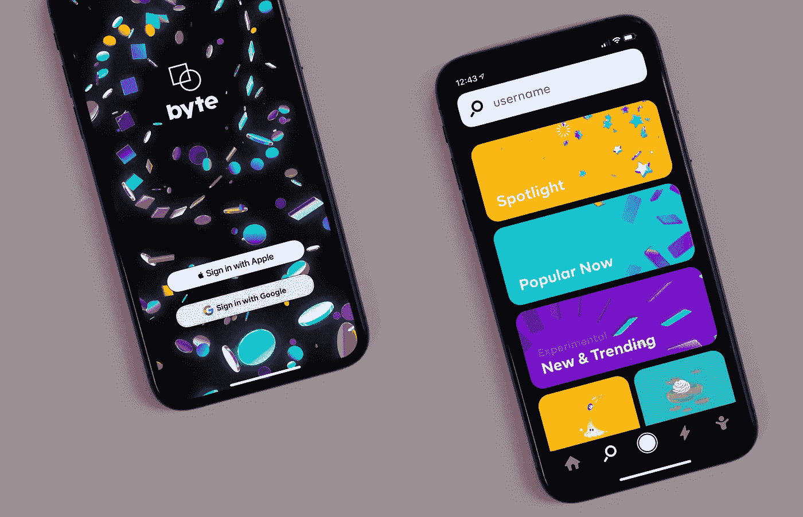
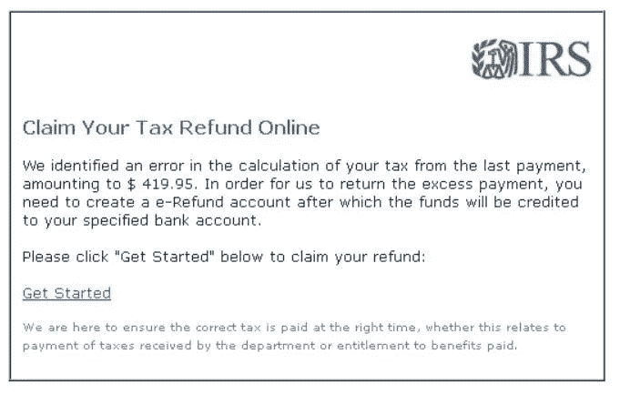

# 每个开发人员都必须知道的 100 个基本网络安全概念(第 3 部分:21–30)

> 原文：<https://levelup.gitconnected.com/100-essential-cybersecurity-concepts-that-every-developer-must-know-part-3-21-30-20957d06c4ab>

这些是 100 个基本的网络安全概念，将帮助您构建安全的应用程序。

为了保证可读性，我将这些分成多篇博文。

**本文给出的信息绝不是宣传/鼓励他人使用这些技术。**

[摄于](https://unsplash.com/@disruptxn?utm_source=medium&utm_medium=referral) [Unsplash](https://unsplash.com?utm_source=medium&utm_medium=referral) 的 Desola Lanre-Ologun

下面列出了前面部分的链接:

 [## 每个开发人员都必须知道的 100 个基本网络安全概念(第 1 部分:1–10)

### 构建安全应用程序的必备清单

levelup.gitconnected.com](/100-essential-cybersecurity-concepts-that-every-developer-must-know-part-1-1-10-852e118e8244)  [## 每个开发人员都必须知道的 100 个基本网络安全概念(第 2 部分:11–20)

### 构建安全应用程序的必备清单

levelup.gitconnected.com](/100-essential-cybersecurity-concepts-that-every-developer-must-know-part-2-11-20-a35f6eb41e49) 

# 21.证明

它是在授权用户访问所请求的资源之前验证用户身份的过程。

简单来说，就是确认一个用户跟自己说的一样(他们的**身份**)。

> 认证通常在授权之前进行。

例如，当一个人试图使用他们的用户名和密码访问他们的媒体帐户时，就会出现这种情况。

[charlesdeluvio](https://unsplash.com/@charlesdeluvio?utm_source=medium&utm_medium=referral) 在 [Unsplash](https://unsplash.com?utm_source=medium&utm_medium=referral) 上拍摄的照片

# 22.批准

它是验证用户是否有权访问所请求的资源的过程。

> 授权通常在成功认证后执行

例如，授权可以确保公司内部服务器的访问权限只授予其员工，而不是其产品的用户。

安妮·斯普拉特在 [Unsplash](https://unsplash.com?utm_source=medium&utm_medium=referral) 上的照片

# 23.OAuth2.0

这是授权的行业标准协议。

该协议将授权过程委托给托管用户帐户的服务(Google、脸书、Medium 等)。).

该服务授权第三方应用程序访问该用户的帐户信息。

要了解 OAuth 如何工作的更多信息，请参考我下面的一篇文章:

 [## OAuth 2.0 是如何工作的？

### 理解 OAuth 2.0 流程

medium.com](https://medium.com/codex/how-does-oauth-2-0-work-for-user-authorization-b0120504731b) 

# 24.社会工程

它是利用人类心理获取用户机密信息的过程。

例如，这是当一个人冒充银行职员要求他们的身份验证细节来欺骗某人。

点击此处了解更多关于社会工程的真实例子:

 [## 优步的黑客展示了社会工程的顽强力量

### 像许多其他黑客一样，优步的主要安全漏洞始于一条短信。引用由所谓的…提供的细节

www.theverge.com](https://www.theverge.com/2022/9/16/23356959/uber-hack-social-engineering-threats) 

# 25.社会工程原理

社会工程通常利用如下人类特征来工作:

*   社交证明
    一个人被操纵提供他们的身份验证信息，而公司里的其他人都在这么做
*   **熟悉度/一致性** 这是操纵者在询问机密信息之前建立融洽关系和发展联系的时候
*   权威
    操纵者试图展示对某人的权威，以获取他们的机密信息
*   操纵者试图变得讨人喜欢，然后说服他们透露想要的信息
*   **互惠**
    机械手为某人做了一件好事，并试图在另一个人想要回报时获得想要的信息。
*   **稀缺性** 操纵者试图证明稀缺性。
    例如，这时他们可能会打电话给某人，告诉他有一个很好的投资机会，但仅限于前 50 名客户，他们需要他们的银行详细信息才能利用这个机会。
*   紧急程度
    机械手试图展示紧急程度。
    例如，请求告知用户健康保险即将到期的机密细节。

# 26.网络钓鱼

这是一种社交工程攻击，攻击者发送欺骗性消息(电子邮件/短信/语音消息/虚假登录页面/被操纵的 URL ),旨在泄露用户的机密信息。

退税钓鱼邮件(来源:[https://us . Norton . com/internet security-online-scams-Phishing-Email-examples . html](https://us.norton.com/internetsecurity-online-scams-phishing-email-examples.html))

阅读以下大规模网络钓鱼欺诈的示例:

 [## 这个骗子是如何利用钓鱼邮件从谷歌和脸书窃取超过 1 亿美元的

### 骗子以一种创造性的方式从脸书和谷歌窃取了超过 1 亿美元:他们给科技巨头发电子邮件，要求…

www.cnbc.com](https://www.cnbc.com/2019/03/27/phishing-email-scam-stole-100-million-from-facebook-and-google.html) 

# 27.捕鲸

这是一种针对组织中重要个人(首席执行官、首席技术官等)的网络钓鱼攻击。).

在下面的例子中了解更多关于捕鲸的信息:

 [## CEO 邮件骗局后 Snapchat 泄露员工薪酬数据

### Snapchat 的图片在被查看几秒钟后就会自动删除。不幸的是，同样的情况并没有发生在…

www.theguardian.com](https://www.theguardian.com/technology/2016/feb/29/snapchat-leaks-employee-data-ceo-scam-email) 

# 28.鱼叉网络钓鱼

这是一种针对特定个人、组织或企业的网络钓鱼攻击，目的是出于恶意破坏机密数据。

由[布雷特·乔丹](https://unsplash.com/@brett_jordan?utm_source=medium&utm_medium=referral)在 [Unsplash](https://unsplash.com?utm_source=medium&utm_medium=referral) 上拍摄的照片

# 29.域名抢注

它是指恶意方基于常见拼写错误的变化注册域名。

当用户不小心输入错误时，他们会被重定向到他们想要访问的原始网站的虚假版本。

这有助于恶意方获取他们的机密信息。

例如，攻击者可能会注册虚假的域名，如`www.goodle.com`或`www.goole.com`，当重定向到时会显示虚假的登录页面。

照片由 [Sofya](https://unsplash.com/@s_o_f_i_k?utm_source=medium&utm_medium=referral) 在 [Unsplash](https://unsplash.com?utm_source=medium&utm_medium=referral) 上拍摄

# 30.电子邮件安全协议

这些安全协议有助于防范电子邮件网络攻击。

一些常见的电子邮件安全协议有:

*   **发件人策略框架(SPF)** 用于邮件认证。
    它允许接收邮件服务器检查声称来自特定域的邮件是否由该域管理员授权的 IP 地址提交。
*   **域密钥识别邮件(DKIM)** 这是一种电子邮件认证协议，允许电子邮件接收者使用发送者创建的加密数字签名来检查电子邮件是否由该域的所有者发送和授权。
*   **基于域的消息认证、报告和一致性(DMARC)** 它使用一组一致的策略将 SPF 和 DKIM 结合在一起。
*   **MTA-STS(邮件传输代理严格传输安全)** 这是一种安全协议，确保通过加密连接安全传输电子邮件。
*   **SSL/TLS** 点击此处了解更多信息:

 [## 每个开发人员都必须知道的 100 个基本网络安全概念(第 2 部分:11–20)

### 构建安全应用程序的必备清单

levelup.gitconnected.com](/100-essential-cybersecurity-concepts-that-every-developer-must-know-part-2-11-20-a35f6eb41e49) 

非常感谢你阅读这篇文章！下一部分再见！

 [## 每个开发人员都必须知道的 100 个基本网络安全概念(第 4 部分:31–40)

### 构建安全应用程序的必备清单

levelup.gitconnected.com](/100-essential-cybersecurity-concepts-that-every-developer-must-know-part-4-31-40-c33d43b618f8)  [## 通过我的推荐链接加入 Medium-Ashish Bama nia 博士

### 阅读 Ashish Bamania 博士(以及 Medium 上成千上万的其他作家)的每一个故事。您的会员费直接…

bamania-ashish.medium.co](https://bamania-ashish.medium.com/membership)