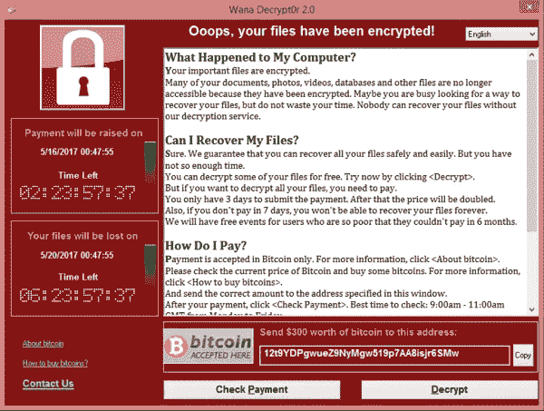

# 每个开发人员都必须知道的 100 个基本网络安全概念(第 4 部分:31–40)

> 原文：<https://levelup.gitconnected.com/100-essential-cybersecurity-concepts-that-every-developer-must-know-part-4-31-40-c33d43b618f8>

这些是 100 个基本的网络安全概念，将帮助您构建安全的应用程序。

*为了保证可读性，我将这些分成多篇博文。*

**本文给出的信息绝不是宣传/鼓励他人使用这些技术。**

加布里埃尔·海因策在 [Unsplash](https://unsplash.com?utm_source=medium&utm_medium=referral) 上的照片

下面列出了前面部分的链接:

 [## 每个开发人员都必须知道的 100 个基本网络安全概念(第 1 部分:1–10)

### 构建安全应用程序的必备清单

levelup.gitconnected.com](/100-essential-cybersecurity-concepts-that-every-developer-must-know-part-1-1-10-852e118e8244)  [## 每个开发人员都必须知道的 100 个基本网络安全概念(第 2 部分:11–20)

### 构建安全应用程序的必备清单

levelup.gitconnected.com](/100-essential-cybersecurity-concepts-that-every-developer-must-know-part-2-11-20-a35f6eb41e49)  [## 每个开发人员都必须知道的 100 个基本网络安全概念(第 3 部分:21–30)

### 构建安全应用程序的必备清单

levelup.gitconnected.com](/100-essential-cybersecurity-concepts-that-every-developer-must-know-part-3-21-30-20957d06c4ab) 

# 31.域名欺诈

这是一种网络攻击，旨在通过以下方式将用户重定向到虚假网站:

*   操作用户计算机上的`hosts`文件(将[主机名](https://en.wikipedia.org/wiki/Hostname)映射到 [IP 地址](https://en.wikipedia.org/wiki/IP_address)的操作系统文件)，或者通过
*   危害 DNS 服务器(将主机名解析为 IP 地址的服务器)

这种虚假网站可能是用户打算访问的网站的复制品，并可能从其中窃取机密信息。

# 32.恶意软件

它是网络攻击中使用的任何形式的恶意软件。

它的一些例子是病毒、特洛伊木马、广告软件、间谍软件等。

# 33.病毒

它是一种模拟生物病毒的恶意软件，在未经系统管理员允许的情况下，复制自身并将其插入到其他程序或可执行文件中。

然后，它可以利用这些文件进行传播，并修改和删除计算机系统上的数据。

阅读以下关于这些著名病毒的更多信息:

 [## 梅利莎(计算机病毒)-维基百科

### Melissa 病毒是一种在 1999 年 3 月 26 日左右发布的邮件群发宏病毒。它针对微软 Word 和…

en.wikipedia.org](https://en.wikipedia.org/wiki/Melissa_%28computer_virus%29)  [## 大脑(计算机病毒)-维基百科

### 大脑是 1986 年 1 月 19 日首次发布的一种计算机病毒的行业标准名称，它是…

en.wikipedia.org](https://en.wikipedia.org/wiki/Brain_%28computer_virus%29) 

[疾控中心](https://unsplash.com/@cdc?utm_source=medium&utm_medium=referral)在 [Unsplash](https://unsplash.com?utm_source=medium&utm_medium=referral) 拍摄的照片

# 34.虫

它是一种递归自我复制的恶意软件，通过网络在计算机系统之间传播，而不会主动感染其他文件。

蠕虫的目的是通过降低系统速度来降低系统可用性。

> 与需要激活(点击受感染的恶意可执行文件)的病毒相比，蠕虫不需要任何干预就能发挥作用。

冲击波蠕虫(图片来自维基百科)

阅读以下关于这些著名蠕虫的更多信息:

 [## 莫里斯蠕虫-维基百科

### 1988 年 11 月 2 日的莫里斯蠕虫或互联网蠕虫是通过互联网传播的最古老的计算机蠕虫之一…

en.wikipedia.org](https://en.wikipedia.org/wiki/Morris_worm)  [## Blaster(电脑蠕虫)-维基百科

### 技术名称为爆破蠕虫。Blaster(Global Hauri)W32/Blaster(Norman)W32/Blaster(Sophos)W32。冲击波。蠕虫…

en.wikipedia.org](https://en.wikipedia.org/wiki/Blaster_%28computer_worm%29)  [## ILOVEYOU -维基百科

### ILOVEYOU，有时被称为爱虫或情书，是一种计算机蠕虫，感染了超过一千万…

en.wikipedia.org](https://en.wikipedia.org/wiki/ILOVEYOU) 

# 35.广告软件

这是一种恶意软件，旨在在用户屏幕上显示多个不想要的广告。

目的是:

*   当用户点击广告时，从广告中产生收入
*   使用广告链接传播其他恶意软件
*   减慢浏览器的速度

[汤姆·狄龙](https://unsplash.com/@tdillon19?utm_source=medium&utm_medium=referral)在 [Unsplash](https://unsplash.com?utm_source=medium&utm_medium=referral) 上拍照

# 36.间谍软件

它是一种恶意软件，用于跟踪用户的机密信息，并将其传输给从事间谍活动的第三方。

# 37.键盘记录器

这是一个记录用户键盘输入的程序。

作为间谍软件的一部分，这些记录可以被转移到从事间谍活动的第三方，以获取密码和其他机密信息。

[张杰](https://unsplash.com/@jay_zhang?utm_source=medium&utm_medium=referral)在 [Unsplash](https://unsplash.com?utm_source=medium&utm_medium=referral) 上的照片

# 38.勒索软件

这是一种恶意软件，它会:

*   阻止受害者访问其计算机系统或
*   威胁要泄露受害者的机密信息

并要求赎金来阻止这些行为。

WannaCry 勒索软件(图片来自维基百科)

阅读下面著名的 WannaCry 勒索软件攻击，该攻击感染了 150 多个国家的 230，000 台计算机。

该软件对运行微软 Windows 操作系统的电脑上的数据进行加密，并要求以比特币支付赎金。

 [## WannaCry 勒索软件攻击-维基百科

### 日期 2017 年 5 月 12 日-2017 年 5 月 15 日(首次爆发)[1]持续时间 4 天地点全球也称为…

en.wikipedia.org](https://en.wikipedia.org/wiki/WannaCry_ransomware_attack)  [## NHS 网络攻击:全球定位系统和医院被勒索软件攻击

### 英格兰和苏格兰的 NHS 服务受到大规模网络攻击，导致医院和全科医生服务中断

www.bbc.co.uk](https://www.bbc.co.uk/news/health-39899646) 

# 39.特洛伊木马

它是一种非复制型恶意软件，伪装成良性实用软件(例如磁盘清理器/防病毒软件)。

一旦安装和执行，有效载荷(间谍软件/加密挖掘软件等。)中的木马被激活。

> 与病毒和蠕虫不同，特洛伊木马不会感染其他文件或自我传播。

[超级摄影师](https://unsplash.com/@supersnapper27?utm_source=medium&utm_medium=referral)在 [Unsplash](https://unsplash.com?utm_source=medium&utm_medium=referral) 上的照片

# 40.Rootkit

它是一种恶意软件，用于:

*   获得对计算机系统的未经授权的管理权限(通过创建一个 [**后门**](https://en.wikipedia.org/wiki/Backdoor_(computing)) )
*   掩盖了它的存在
*   掩盖另一个恶意软件的存在

阅读以下内容，了解被无关恶意软件利用的索尼 BMG 复制保护 rootkits:

 [## 索尼 BMG 版权保护 rootkit 丑闻-维基百科

### 2005 年，索尼 BMG 公司对大约 2200 万张 CD 实施版权保护措施的丑闻爆发。当…

en.wikipedia.org](https://en.wikipedia.org/wiki/Sony_BMG_copy_protection_rootkit_scandal) 

非常感谢你阅读这篇文章！下一部分再见！

 [## 每个开发人员都必须知道的 100 个基本网络安全概念(第 5 部分:41–50)

### 构建安全应用程序的必备清单

bamania-ashish.medium.com](https://bamania-ashish.medium.com/100-essential-cybersecurity-concepts-that-every-developer-must-know-part-5-41-50-2ef82ce2b867) 

*如果你是 Python 或编程的新手，可以看看我的新书《没有公牛**t 学习 Python 指南**’***》:**

 [## 学习 Python 的无牛指南

### 你是一个正在考虑学习编程却不知道从哪里开始的人吗？我有适合你的解决方案…

bamaniaashish.gumroad.com](https://bamaniaashish.gumroad.com/l/python-book)  [## 通过我的推荐链接加入 Medium——Ashish Bama nia 博士

### 阅读 Ashish Bamania 博士(以及 Medium 上成千上万的其他作家)的每一个故事。您的会员费直接…

bamania-ashish.medium.com](https://bamania-ashish.medium.com/membership)