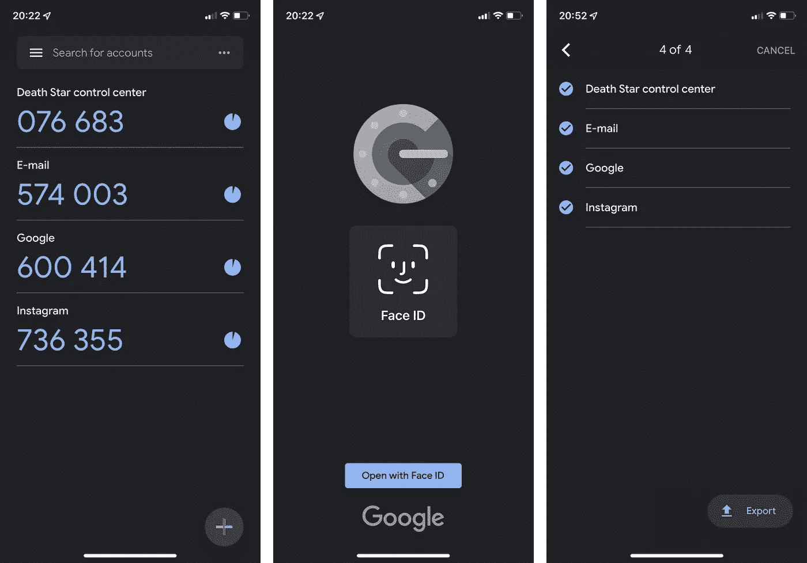

# 每个开发人员都必须知道的 100 个基本网络安全概念(第 5 部分:41–50)

> 原文：<https://levelup.gitconnected.com/100-essential-cybersecurity-concepts-that-every-developer-must-know-part-5-41-50-2ef82ce2b867>

这些是 100 个基本的网络安全概念，将帮助您构建安全的应用程序。

为了保证可读性，我将这些分成多篇博文。

**本文给出的信息绝不是宣传/鼓励他人使用这些技术。**

照片由[洛伦佐·埃雷拉](https://unsplash.com/@lorenzoherrera?utm_source=medium&utm_medium=referral)在 [Unsplash](https://unsplash.com?utm_source=medium&utm_medium=referral) 拍摄

下面列出了前面部分的链接:

 [## 每个开发人员都必须知道的 100 个基本网络安全概念(第 1 部分:1–10)

### 构建安全应用程序的必备清单

levelup.gitconnected.com](/100-essential-cybersecurity-concepts-that-every-developer-must-know-part-1-1-10-852e118e8244)  [## 每个开发人员都必须知道的 100 个基本网络安全概念(第 2 部分:11–20)

### 构建安全应用程序的必备清单

levelup.gitconnected.com](/100-essential-cybersecurity-concepts-that-every-developer-must-know-part-2-11-20-a35f6eb41e49)  [## 每个开发人员都必须知道的 100 个基本网络安全概念(第 3 部分:21–30)

### 构建安全应用程序的必备清单

levelup.gitconnected.com](/100-essential-cybersecurity-concepts-that-every-developer-must-know-part-3-21-30-20957d06c4ab)  [## 每个开发人员都必须知道的 100 个基本网络安全概念(第 4 部分:31–40)

### 构建安全应用程序的必备清单

levelup.gitconnected.com](/100-essential-cybersecurity-concepts-that-every-developer-must-know-part-4-31-40-c33d43b618f8) 

# 41.秘密的

它是指一种绕过计算机系统的认证过程并获得远程访问以获取机密信息或操纵数据的方法。

后门创建通常与 rootkits 和特洛伊木马相关联。

照片由[马頔·佩丘林](https://unsplash.com/@pechka?utm_source=medium&utm_medium=referral)在 [Unsplash](https://unsplash.com?utm_source=medium&utm_medium=referral) 上拍摄

点击此处了解三星 Galaxy 设备中发现的一个著名后门:

 [## 三星 Galaxy 设备中的后门“允许远程访问数据”

### 基于 CyanogenMod 的 Android 操作系统 Replicant 的开发者声称，他们已经在…的调制解调器中发现了一个后门

www.zdnet.com](https://www.zdnet.com/article/backdoor-in-samsung-galaxy-devices-allows-remote-access-to-data/) 

# 42.无文件恶意软件

它是一种恶意软件，存在于计算机系统的内存中，而不是文件系统中。

无文件恶意软件从不写入文件系统，并保持活动状态，直到内存被擦除/系统重新启动。

**Kovter** 和 **Powelike** 是通过 Windows 注册表操作工作的无文件恶意软件的例子。

[拥有摄影](https://unsplash.com/@possessedphotography?utm_source=medium&utm_medium=referral)的照片在 [Unsplash](https://unsplash.com?utm_source=medium&utm_medium=referral) 上

# 43.暴力攻击

这是一种通过尝试密码中可能存在的所有可能的字符组合来破解密码的方法。

随着密码长度的增加，找到正确密码的平均时间呈指数增长**。**

# **44。密码喷涂**

**这是一种暴力攻击，攻击者在多个用户名上尝试一个密码，以防止在一个用户名上尝试多个密码时发生的帐户锁定。**

****

**照片由 [Towfiqu barbhuiya](https://unsplash.com/@towfiqu999999?utm_source=medium&utm_medium=referral) 在 [Unsplash](https://unsplash.com?utm_source=medium&utm_medium=referral) 上拍摄**

# **45.字典攻击**

**这是一种通过尝试字典中存在的所有单词(及其变体)来破解密码的方法。**

**这是一种有针对性的暴力攻击。**

****

**由[桑迪·米勒](https://unsplash.com/@sandym10?utm_source=medium&utm_medium=referral)在 [Unsplash](https://unsplash.com?utm_source=medium&utm_medium=referral) 上拍摄的照片**

# **46.盐碱滩**

**当密码存储在数据库中时，它不是以[明文](https://en.wikipedia.org/wiki/Plaintext)(未加密形式)存储的。**

**使用加密单向哈希函数对其进行哈希[处理](/100-essential-cybersecurity-concepts-that-every-developer-must-know-part-1-1-10-852e118e8244),结果哈希存储在数据库中。**

**请记住，因为这是一个单向函数，密码永远无法从其散列中获得(除了暴力攻击)。**

**为了更好地保护这些密码，名为 **salt** 的随机数据被附加到密码中，并且结果值被散列。**

**产生的散列(称为**加盐密码散列**)连同**加盐**一起存储在数据库中。**

**`**Salted Password Hash = SHA256(Password + Salt)**`**

**因此，加盐将防止攻击者预先计算公共密码的散列(像在*字典攻击*中或者当使用*彩虹表*时)，因为当两个用户具有相同的密码时，加盐的密码散列是不同的。**

****

**[Jason Tuinstra](https://unsplash.com/@wjtuinstra?utm_source=medium&utm_medium=referral) 在 [Unsplash](https://unsplash.com?utm_source=medium&utm_medium=referral) 上拍摄的照片**

****示例:****

**假设我们有两个密码相同的用户，即**

*   **`user1`的密码为`password`,并且**
*   **`user2`的密码是`password`**

**在使用 SHA256 散列密码的非 salted 密码数据库中，它们的密码散列将是相同的。**

*   **`user1`密码哈希将是`5e884898da28047151d0e56f8dc6292773603d0d6aabbdd62a11ef721d1542d8`**
*   **`user2`密码哈希将是`5e884898da28047151d0e56f8dc6292773603d0d6aabbdd62a11ef721d1542d8`**

**如果攻击者获得了对该数据库的访问权，并且他们尝试字典攻击来寻找密码散列。这对于拥有相同密码的用户来说很常见。而且，攻击者不费吹灰之力就能危及许多帐户的安全。**

**另一方面，在加盐密码数据库中:**

*   **`user1`获得一个随机盐`a618238471`附加到他们的密码。这个结果值的散列是`5413a7b8c2d94eda5095d079cdd8d79d1031956481d7a52e8a8c9f78fa0717f1`**
*   **`user2`得到一个随机的盐`7s828s921`附加到他们的密码上。这个结果值的散列是`6c1c0c988f3fca1178ad23bbf7b8f92e308a5eb9eb2cb4be990575e08929a462`**

**由于哈希差别很大，攻击者将无法判断这两个用户是否拥有相同的密码。**

****

**马库斯·斯皮斯克在 [Unsplash](https://unsplash.com?utm_source=medium&utm_medium=referral) 上拍摄的照片**

# **47.使布满**

**像 salting 一样，这是一种技术，在散列和存储密码到数据库之前，一个叫做 **pepper** 的秘密随机值被添加到密码中。**

**不像 salt(那不是秘密，而是在数据库中与 salt 密码散列一起存储的唯一随机值)，pepper 是**秘密**和**不能存储在同一个数据库**。**

**盐应该单独存储**在另一个介质中**，例如安全硬件设备。**

****

**Alexis Antoine 在 [Unsplash](https://unsplash.com?utm_source=medium&utm_medium=referral) 上拍摄的照片**

# **48.彩虹桌攻击**

**是一种利用彩虹表破解密码的方法。**

**彩虹表是常见密码及其哈希值的表格。**

****举例:****

**如果攻击者侵入数据库并访问用户名-密码-哈希表，他们可能会执行暴力攻击，在这种攻击中，他们将哈希一系列常用密码，并将其与数据库中现有的哈希进行比较。**

**如果攻击者有一个通用密码预计算散列的彩虹表，它将使这个过程更少耗时和计算成本更低。**

**可以通过以下方式防止彩虹表攻击:**

*   **使用加盐和胡椒的密码**
*   **使用多因素身份认证**
*   **使用 OAuth 2.0 身份验证**

****

**照片由 [Unsplash](https://unsplash.com?utm_source=medium&utm_medium=referral) 上的 [Max Di Capua](https://unsplash.com/ja/@maxdicapua?utm_source=medium&utm_medium=referral) 拍摄**

# **49.双因素/多因素身份认证(2FA/MFA)**

**如果用户能够为以下两项或更多项提供证据，则对于用户而言，这是一种成功的[身份验证](/100-essential-cybersecurity-concepts-that-every-developer-must-know-part-3-21-30-20957d06c4ab)方法:**

*   **用户的秘密:密码/ PIN**
*   **可以提供安全令牌的用户设备**
*   **用户的位置**
*   **用户的固有因素(面部/声音/指纹)**

# **50.第三方认证者 (TPA)**

**它是一个第三方应用程序，由另一个应用程序用来为其上的用户启用双因素/多因素身份认证。**

**它提供了一个频繁变化的随机码作为认证的依据。**

**许多流行的第三方授权码是:**

*   **谷歌认证器**
*   **微软认证器**
*   **Authy**

****

**谷歌认证应用(来源:[卡巴斯基博客](https://www.kaspersky.com/blog/best-authenticator-apps-2022/43261/))**

**非常感谢您的阅读！下一部分再见！**

** [## 每个开发人员都必须知道的 100 个基本网络安全概念(第 6 部分:51–60)

### 构建安全应用程序的必备清单

bamania-ashish.medium.com](https://bamania-ashish.medium.com/100-essential-cybersecurity-concepts-that-every-developer-must-know-part-6-51-60-5464f878839)**