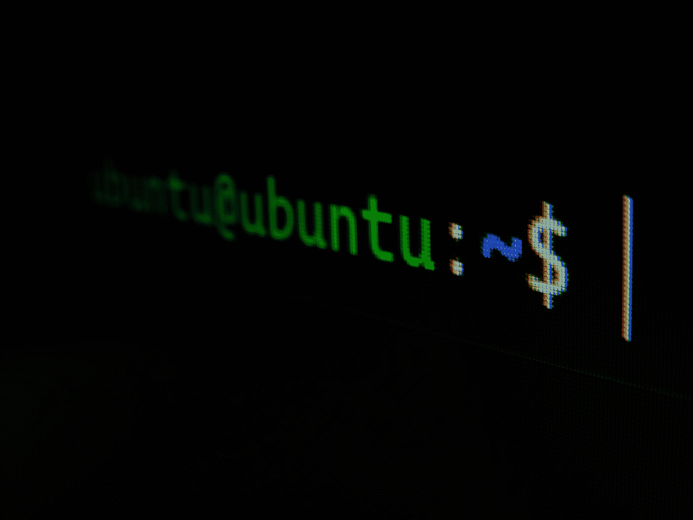
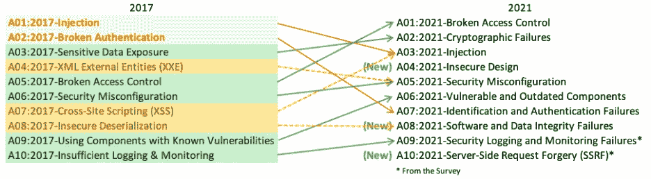

# 每个开发人员都必须知道的 100 个基本网络安全概念(第 6 部分:51–60)

> 原文：<https://levelup.gitconnected.com/100-essential-cybersecurity-concepts-that-every-developer-must-know-part-6-51-60-5464f878839>

这些是 100 个基本的网络安全概念，将帮助您构建安全的应用程序。

为了保证可读性，我将这些分成多篇博文。

**本文给出的信息绝不是宣传/鼓励他人使用这些技术。**

照片由[肯尼·埃利亚松](https://unsplash.com/es/@neonbrand?utm_source=medium&utm_medium=referral)在 [Unsplash](https://unsplash.com?utm_source=medium&utm_medium=referral) 上拍摄

下面列出了前面部分的链接:

 [## 每个开发人员都必须知道的 100 个基本网络安全概念(第 1 部分:1–10)

### 构建安全应用程序的必备清单

levelup.gitconnected.com](/100-essential-cybersecurity-concepts-that-every-developer-must-know-part-1-1-10-852e118e8244)  [## 每个开发人员都必须知道的 100 个基本网络安全概念(第 2 部分:11–20)

### 构建安全应用程序的必备清单

levelup.gitconnected.com](/100-essential-cybersecurity-concepts-that-every-developer-must-know-part-2-11-20-a35f6eb41e49)  [## 每个开发人员都必须知道的 100 个基本网络安全概念(第 3 部分:21–30)

### 构建安全应用程序的必备清单

levelup.gitconnected.com](/100-essential-cybersecurity-concepts-that-every-developer-must-know-part-3-21-30-20957d06c4ab)  [## 每个开发人员都必须知道的 100 个基本网络安全概念(第 4 部分:31–40)

### 构建安全应用程序的必备清单

levelup.gitconnected.com](/100-essential-cybersecurity-concepts-that-every-developer-must-know-part-4-31-40-c33d43b618f8)  [## 每个开发人员都必须知道的 100 个基本网络安全概念(第 5 部分:41–50)

### 构建安全应用程序的必备清单

bamania-ashish.medium.com](https://bamania-ashish.medium.com/100-essential-cybersecurity-concepts-that-every-developer-must-know-part-5-41-50-2ef82ce2b867) 

# 51.绕轴旋转

在计算机网络中，对一台机器进行未经授权的访问，然后使用这台机器来危害其他机器的过程称为旋转。

照片由 [marianne bos](https://unsplash.com/@mariannebos?utm_source=medium&utm_medium=referral) 在 [Unsplash](https://unsplash.com?utm_source=medium&utm_medium=referral) 上拍摄

# 52.供应链攻击

这是一种针对组织的攻击，目标是安全性较低的可信第三方/合作伙伴，他们可以访问组织的系统或者是组织的提供商。

一次著名的供应链攻击发生在网络安全管理软件产品，这家公司开发软件来管理其他企业的网络、系统和信息技术基础设施。

*‘客户包括许多美国财富 500 强公司、美国前十大电信公司、美国前五大会计师事务所、美国军方所有分支机构、五角大楼、国务院，以及全球数百所大学和学院。*

*在攻击中，黑客攻破了*的系统，并向软件用户分发了含有木马的更新。**

****

**图片由 DCStudio 在 [Freepik](https://www.freepik.com/) 上提供**

# **53.跨站点脚本(XSS)**

**这是一种网络攻击，其中恶意脚本被注入到应用程序的前端/客户端。**

**这种攻击的目的是针对应用程序的**用户**，而不是应用程序本身。**

**不同类型的 XSS 攻击包括:**

*   ****非持久/反射 XSS** 在这种情况下，恶意脚本被临时注入到提供用户输入功能的网站的 HTML 中，并在浏览器上返回结果。
    当用户点击 HTML 中包含恶意代码的网站链接时，恶意脚本就会被执行，从而窃取用户的凭据/机密信息。**
*   ****持久 XSS /存储 XSS** 与反射 XSS 不同，攻击者在网页的 HTML 中永久嵌入恶意脚本。
    每当加载此类页面时，就会执行脚本，这可用于窃取用户的凭据/机密信息。**

**XSS 也可以归类为:**

*   ****服务器端 XSS

    应用的漏洞在于服务器端恶意代码。****
*   ****客户端 XSS**** 

**点击此处了解更多关于 XSS 的信息:**

** [## XSS 的类型

### 本文描述了许多不同类型或类别的跨站脚本(XSS)漏洞，以及如何…

owasp.org](https://owasp.org/www-community/Types_of_Cross-Site_Scripting) 

# 54.跨站点请求伪造

在这种攻击中，用户被操纵在任何通过身份验证的 web 应用程序上执行不需要的操作。

例如:

假设一个用户登录了他们银行的应用程序。

在另一个浏览器选项卡上，如果用户点击一个链接/加载一个包含向攻击者转移资金的恶意脚本的页面，银行的 web 应用程序将认为该请求有效并执行转移。

[科技日报](https://unsplash.com/@techdailyca?utm_source=medium&utm_medium=referral)在 [Unsplash](https://unsplash.com?utm_source=medium&utm_medium=referral) 上拍摄的照片

# 55.服务器端请求伪造

在这种攻击中，攻击者破坏并操纵服务器，向非预期的资源发出请求，这可能有助于他们访问服务器凭据和资源。

例如，对于基于 AWS 的服务器，攻击者可能会尝试伪造服务器端请求，并在目标的 AWS 帐户中访问 EC2 实例。

照片由[克里斯蒂娜@ wocintechchat.com](https://unsplash.com/@wocintechchat?utm_source=medium&utm_medium=referral)在 [Unsplash](https://unsplash.com?utm_source=medium&utm_medium=referral) 上拍摄

# 56.SQL 注入

这是一种在网页的输入字段中使用 SQL 查询的攻击。

该 SQL 查询可以:

*   从数据库中读取敏感数据
*   修改数据库数据
*   对数据库执行管理操作
*   向托管数据库的服务器的操作系统发出命令

来源:[https://xkcd.com/327/](https://xkcd.com/327/)

在上面的漫画中，当在输入字段中键入`Robert'); DROP TABLE Students; --`以将数据插入到学校的`Students`表中时，这被翻译为:

`INSERT INTO Students VALUES ( 'Robert'); DROP TABLE Students; --' )`

这将从数据库中删除`Students`表。

# 57.操作系统命令注入攻击

在这种攻击中，攻击者输入命令来操纵应用服务器的操作系统并获得对它的控制。

它用于使用用户输入进行操作系统调用的应用程序中。

Gabriel Heinzer 在 [Unsplash](https://unsplash.com?utm_source=medium&utm_medium=referral) 上拍摄的照片

# 58.LDAP 注入

LDAP 或**轻量级目录访问协议**是一种开源协议，用于访问和维护分布式目录信息服务。

在网络上，它用于查找其他个人、文件和设备等资源，并方便用户对这些资源的身份验证和授权。

与 SQL 注入攻击类似，攻击者可以在输入字段中编写恶意的 LDAP 查询，并获得对服务器上机密信息(用户、角色、权限等)的未授权访问。)，并导致 LDAP 树内部的内容修改。

照片由[乔丹·哈里森](https://unsplash.com/@jordanharrison?utm_source=medium&utm_medium=referral)在 [Unsplash](https://unsplash.com?utm_source=medium&utm_medium=referral) 上拍摄

# 59.路径遍历攻击

这是一种攻击，攻击者可以通过在 URL 中使用点-点-斜线(`../`)序列遍历根文件夹之外的文件系统来访问 web 服务器的关键系统文件。

例如:

为了执行路径遍历攻击，攻击者可以在运行于 Linux/UNIX 的 web 服务器上插入恶意字符串`../../../../etc/passwd`来包含密码哈希文件。

`[http://example.com/getUserProfile.jsp?item=../../../../etc/passwd](http://example.com/getUserProfile.jsp?item=../../../../etc/passwd)`

由[加布里埃尔·海因策](https://unsplash.com/@6heinz3r?utm_source=medium&utm_medium=referral)在 [Unsplash](https://unsplash.com?utm_source=medium&utm_medium=referral) 上拍摄的照片

# 60.OWASP 十大

OWASP 或**Open Web Application Security Project**是一个为 Web 安全提供免费开放资源的在线社区。

**OWASP 的十大**是一份面向开发人员和 web 应用程序安全的文档，强调了 web 应用程序的十大最关键的安全风险。

OWASP 的十大关键 Web 应用安全风险(来源:[https://owasp.org/www-project-top-ten/](https://owasp.org/www-project-top-ten/)

请查看以下文档:

 [## OWASP 十大

### OWASP Top 10 是开发人员和 web 应用程序安全性的标准认知文档。它代表了广泛的…

owasp.org](https://owasp.org/www-project-top-ten/) 

非常感谢您阅读这篇文章！下一部分再见！

 [## 每个开发人员都必须知道的 100 个基本网络安全概念(第 7 部分:61–70)

### 构建安全应用程序的必备清单

bamania-ashish.medium.com](https://bamania-ashish.medium.com/100-essential-cybersecurity-concepts-that-every-developer-must-know-part-7-61-70-4a0d9aaa1e7b)  [## 通过我的推荐链接加入 Medium-Ashish Bama nia 博士

### 阅读 Ashish Bamania 博士(以及 Medium 上成千上万的其他作家)的每一个故事。您的会员费直接…

bamania-ashish.medium.com](https://bamania-ashish.medium.com/membership)**