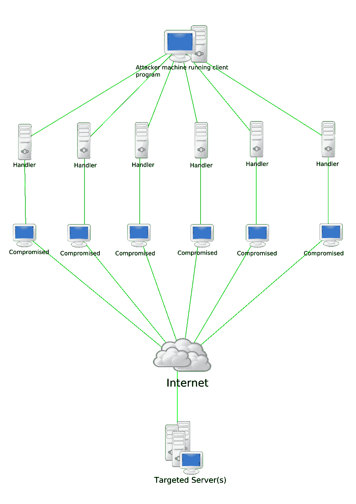

# 每个开发人员都必须知道的 100 个基本网络安全概念(第 7 部分:61–70)

> 原文：<https://levelup.gitconnected.com/100-essential-cybersecurity-concepts-that-every-developer-must-know-part-7-61-70-4a0d9aaa1e7b>

这些是 100 个基本的网络安全概念，将帮助您构建安全的应用程序。

为了保证可读性，我将这些分成多篇博文。

**本文给出的信息绝不是宣传/鼓励他人使用这些技术。**

肯·苏亚雷斯在 [Unsplash](https://unsplash.com?utm_source=medium&utm_medium=referral) 上的照片

下面列出了前面部分的链接:

 [## 每个开发人员都必须知道的 100 个基本网络安全概念(第 1 部分:1–10)

### 构建安全应用程序的必备清单

levelup.gitconnected.com](/100-essential-cybersecurity-concepts-that-every-developer-must-know-part-1-1-10-852e118e8244)  [## 每个开发人员都必须知道的 100 个基本网络安全概念(第 2 部分:11–20)

### 构建安全应用程序的必备清单

levelup.gitconnected.com](/100-essential-cybersecurity-concepts-that-every-developer-must-know-part-2-11-20-a35f6eb41e49)  [## 每个开发人员都必须知道的 100 个基本网络安全概念(第 3 部分:21–30)

### 构建安全应用程序的必备清单

levelup.gitconnected.com](/100-essential-cybersecurity-concepts-that-every-developer-must-know-part-3-21-30-20957d06c4ab)  [## 每个开发人员都必须知道的 100 个基本网络安全概念(第 4 部分:31–40)

### 构建安全应用程序的必备清单

levelup.gitconnected.com](/100-essential-cybersecurity-concepts-that-every-developer-must-know-part-4-31-40-c33d43b618f8)  [## 每个开发人员都必须知道的 100 个基本网络安全概念(第 5 部分:41–50)

### 构建安全应用程序的必备清单

bamania-ashish.medium.com](https://bamania-ashish.medium.com/100-essential-cybersecurity-concepts-that-every-developer-must-know-part-5-41-50-2ef82ce2b867)  [## 每个开发人员都必须知道的 100 个基本网络安全概念(第 6 部分:51–60)

### 构建安全应用程序的必备清单

levelup.gitconnected.com](/100-essential-cybersecurity-concepts-that-every-developer-must-know-part-6-51-60-5464f878839) 

# 61.拒绝服务(DoS)攻击

在这种类型的网络攻击中，目标机器受到的请求数量超过了它在特定时间内能够处理的数量。

这会使目标机器饱和，使其对通常的客户端不可用。

照片由[大卫·普帕扎](https://unsplash.com/@dav420?utm_source=medium&utm_medium=referral)在 [Unsplash](https://unsplash.com?utm_source=medium&utm_medium=referral) 上拍摄

# 62.分布式拒绝服务(DDoS)攻击

这是一种使用**多台**恶意机器(一种恶意分布式系统)执行的 DoS 攻击，这些机器向目标系统发送大量请求，目的是使目标系统对其普通客户端不可用。

DDoS 攻击(图片来自维基百科)

# 63.僵尸网络

它是一组被称为**机器人**的受损设备(电脑/手机/物联网设备)的集合，这些设备由一台名为**机器人牧人**的恶意机器控制。

在 DDoS 攻击期间，这些设备作为一个单元一起工作。

了解著名的 [*Meris 僵尸网络*](https://blog.cloudflare.com/meris-botnet/) 因 DDoS 攻击互联网上包括谷歌在内的多个网站而闻名。

 [## 谷歌:下面是我们如何阻止有史以来最大的网络 DDoS 攻击

### 谷歌云透露，它阻止了有记录以来最大的分布式拒绝服务(DDoS)攻击，峰值在…

www.zdnet.com](https://www.zdnet.com/article/google-blocked-largest-web-ddos-ever/) 

# 64.服务质量下降攻击

这是一种网络攻击，被入侵的名为**脉冲僵尸**的机器间歇性地向目标机器发送大量请求。

这会导致目标机器变慢，而不是崩溃。

照片由 [LOGAN WEAVER | @LGNWVR](https://unsplash.com/@lgnwvr?utm_source=medium&utm_medium=referral) 在 [Unsplash](https://unsplash.com?utm_source=medium&utm_medium=referral) 上拍摄

# 65.永久拒绝服务(PDoS)攻击

这是一种针对机器硬件的网络攻击。

目的是通过替换固件/攻击关键组件，使硬件完全无法使用。

[BrickerBot](https://en.wikipedia.org/wiki/BrickerBot) 是一种恶意软件，用于对物联网(IoT)设备进行 PDoS 攻击，通过删除其关键文件并使其无法使用来运行。

Ashkan Forouzani 在 [Unsplash](https://unsplash.com?utm_source=medium&utm_medium=referral) 上拍摄的照片

# 66.叉形炸弹

这是一种拒绝服务攻击，其中恶意软件不断复制自己，以消耗机器 CPU 的所有资源。

这使得目标机器对其通常的客户端不可用。

叉形炸弹(图片来自维基百科)

# 67.内存泄漏攻击

当程序不再需要内存时，如果开发人员未能释放内存，就会导致内存泄漏。

如果攻击者能够找到在目标机器中造成内存泄漏的方法，他们就可以造成内存耗尽并使机器崩溃(就像在 DoS 服务攻击中一样)

照片由[哈里森·布罗德本特](https://unsplash.com/@harrisonbroadbent?utm_source=medium&utm_medium=referral)在 [Unsplash](https://unsplash.com?utm_source=medium&utm_medium=referral) 上拍摄

# 68.DLL 注入攻击

动态链接库(DLL)是包含许多程序可以链接和利用的共享代码的 Windows 文件。

例如，I/O 设备驱动程序的 DLL 文件，可以由使用该设备的多个程序/进程使用。

在 DLL 注入攻击中，程序/进程通常使用的 DLL 文件被呈现为恶意的。

这有助于攻击者将恶意代码注入进程。

# 69.缓冲区溢出攻击

缓冲区是由程序分配用来存储数据的内存区域。

如果一个缓冲区接收的数据超过了它的处理能力，它将导致*溢出*，并将数据写入可能包含程序/处理器指令不使用的数据的相邻存储区。

这可能导致目标机器崩溃或执行攻击者想要的恶意代码。

由[在](https://unsplash.com/@lacarta?utm_source=medium&utm_medium=referral) [Unsplash](https://unsplash.com?utm_source=medium&utm_medium=referral) 上拍摄的照片

# 70.混沌工程

它是一个分支，处理生产中的系统，对基础设施故障、网络故障和应用程序故障具有弹性。

**Chaos Monkey** 是由**网飞**开发的工具，它在生产环境中随机选择服务器，并在工作时间关闭它们。

这有助于测试和确保服务对实例故障具有弹性。

 [## 家庭混乱猴子

### 混沌猴负责随机终止生产中的实例，以确保工程师实现他们的…

netflix.github.io](https://netflix.github.io/chaosmonkey/) 

脸书的**项目风暴**是另一个混沌工程工具，用于其数据中心的灾难防护。

*非常感谢您阅读这篇文章！下一部分再见！*

 [## 通过我的推荐链接加入 Medium-Ashish Bama nia 博士

### 阅读 Ashish Bamania 博士(以及 Medium 上成千上万的其他作家)的每一个故事。您的会员费直接…

bamania-ashish.medium.com](https://bamania-ashish.medium.com/membership)