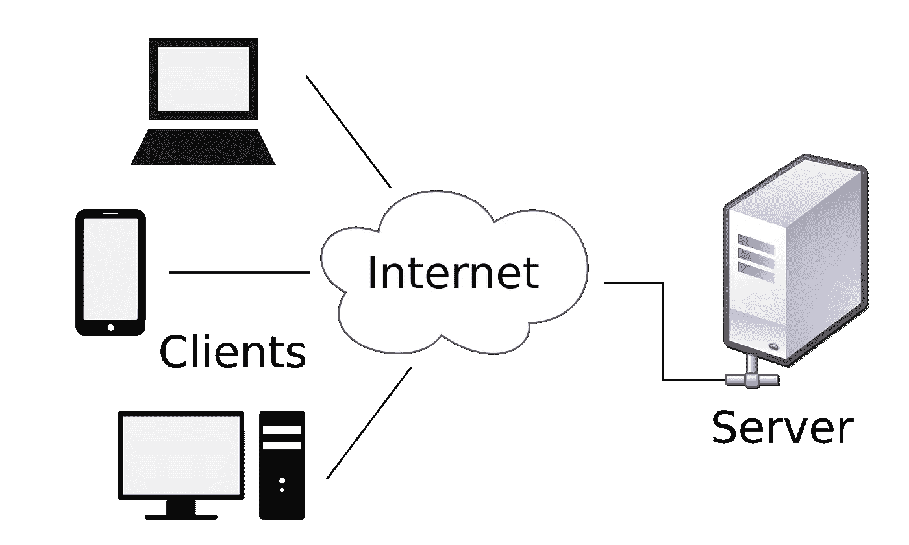
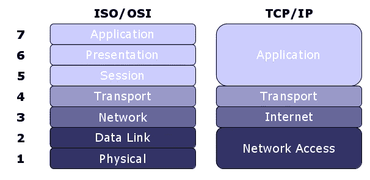

# 每个开发人员必须知道的 100 个基本系统设计概念(第 1 部分:1–10)

> 原文：<https://levelup.gitconnected.com/100-essential-systems-design-concepts-that-every-developer-must-know-part-1-1318c2c402ca>

这些是作为开发人员必须知道的 100 个基本系统设计概念。

这些将帮助您设计高效、容错和可伸缩的系统。

为了保证可读性，我将这些分成多篇博文。

*如果你是 Python 或编程的新手，可以看看我的书《Python 学习指南》******下面:*****

**** [## 学习 Python 的无牛指南

### 你是一个正在考虑学习编程却不知道从哪里开始的人吗？我有适合你的解决方案…

bamaniaashish.gumroad.com](https://bamaniaashish.gumroad.com/l/python-book) 

由 [Med Badr Chemmaoui](https://unsplash.com/@medbadrc?utm_source=medium&utm_medium=referral) 在 [Unsplash](https://unsplash.com?utm_source=medium&utm_medium=referral) 上拍摄的照片**** 

## ****1.计算机网络****

****它是一组相互共享资源的计算机。****

****网络中的每台计算机称为一个节点，它们可以通过有线或无线技术相互连接。****

****网络的一些例子是:****

*   ****局域网:在一个小区域内连接计算机****
*   ****广域网(WAN):连接大范围地理区域内的计算机，例如互联网****

********

****奥马尔·弗洛雷斯在 [Unsplash](https://unsplash.com?utm_source=medium&utm_medium=referral) 上拍摄的照片****

## ****2.客户****

****请求计算机网络中的资源的计算机节点。例如，当使用浏览器打开您的媒体配置文件时，您的计算机。****

## ****3.计算机网络服务器****

****包含资源并向计算机网络中的其他计算机节点提供资源的计算机节点。例如，包含您的媒体配置文件数据的计算机，该数据在请求时被发送回您的浏览器。****

********

****图片来自维基百科****

## ****4.**开放系统互联** ( **OSI** )模型****

****一种概念性的通信模型，将计算机节点之间的通信分成 7 个不同的抽象层:****

*   ****第 1 层:物理层****
*   ****第 2 层:数据链路层****
*   ****第 3 层:网络层****
*   ****第 4 层:传输层****
*   ****第 5 层:会话层****
*   ****第 6 层:表示层****
*   ****第 7 层:应用层****

## ****5. **TCP/IP 模型******

****OSI 模型的精简版本，使用 4 层，并参考了当前互联网的实现方式。****

*   ****第 1 层:网络接入层****
*   ****第 2 层:互联网层****
*   ****第 3 层:传输层****
*   ****第 4 层:应用层****

********

****图片来自[https://networkengineering.stackexchange.com/](https://networkengineering.stackexchange.com/)****

## ****6.网络协议****

****一组规定计算机节点如何通过网络交换数据的规则。****

## ****7.因特网协议****

****TCP/IP 的 Internet 层中的一组规则，用于根据数据包的 IP 地址控制数据包从源主机到目的主机的传输。****

****它的两个版本是 IPv4 和 IPv6。****

********

****[钳工](https://unsplash.com/@benchaccounting?utm_source=medium&utm_medium=referral)在 [Unsplash](https://unsplash.com?utm_source=medium&utm_medium=referral) 上拍照****

## ****8.传输控制协议****

****TCP/IP 传输层中的一组规则，确保计算机节点之间可靠的数据传输。****

****它是一个面向连接的协议，确保在发送任何数据包之前，在发送方/客户端和接收方/服务器节点之间建立可靠的连接。****

## ****9.三次握手过程****

****一个关于如何建立 TCP 连接的过程。****

****通过一个电话的例子可以很容易理解这些步骤。****

*   ******SYN** 客户端向服务器发送 SYN(同步序列号)。这就像打电话说“你好”。****
*   ******SYN + ACK** 服务器通过发回 SYN-ACK 信号来确认连接请求。
    这就像你接到电话时回敬一句“你好”。****
*   ******ACK** 客户端确认(ACK)服务器的响应，发送 ACK 信号，与服务器建立可靠连接。这就像说“这是 Ashish”。我想谈谈……”****

********

****照片由 [Cytonn 摄影](https://unsplash.com/@cytonn_photography?utm_source=medium&utm_medium=referral)在 [Unsplash](https://unsplash.com?utm_source=medium&utm_medium=referral) 上拍摄****

## ****10.**用户数据报协议******

****TCP/IP 传输层中的一组规则，在传输数据包时，发送方和接收方之间不需要固定的可靠通道。****

****与 TCP 不同，它是无连接的，可以确保快速的数据传输。****

*****感谢阅读！下一部分再见！*****

**** [## 每个开发人员都必须知道的 100 个基本系统设计概念(第 2 部分)

### 设计高效、容错和可扩展系统的首选清单

bamania-ashish.medium.com](https://bamania-ashish.medium.com/100-essential-systems-design-concepts-that-every-developer-must-know-part-2-b6c4c6239af8)**** 

*****如果你是 Python 或编程的新手，可以看看我的新书，书名是'* [**《没有公牛**t 学习 Python 指南》**](https://bamaniaashish.gumroad.com/l/python-book) **'** *下面:*****

**** [## 学习 Python 的无牛指南

### 你是一个正在考虑学习编程却不知道从哪里开始的人吗？我有适合你的解决方案…

bamaniaashish.gumroad.com](https://bamaniaashish.gumroad.com/l/python-book)  [## 通过我的推荐链接加入 Medium-Ashish Bama nia 博士

### 阅读 Ashish Bamania 博士(以及 Medium 上成千上万的其他作家)的每一个故事。您的会员费直接…

bamania-ashish.medium.com](https://bamania-ashish.medium.com/membership)****