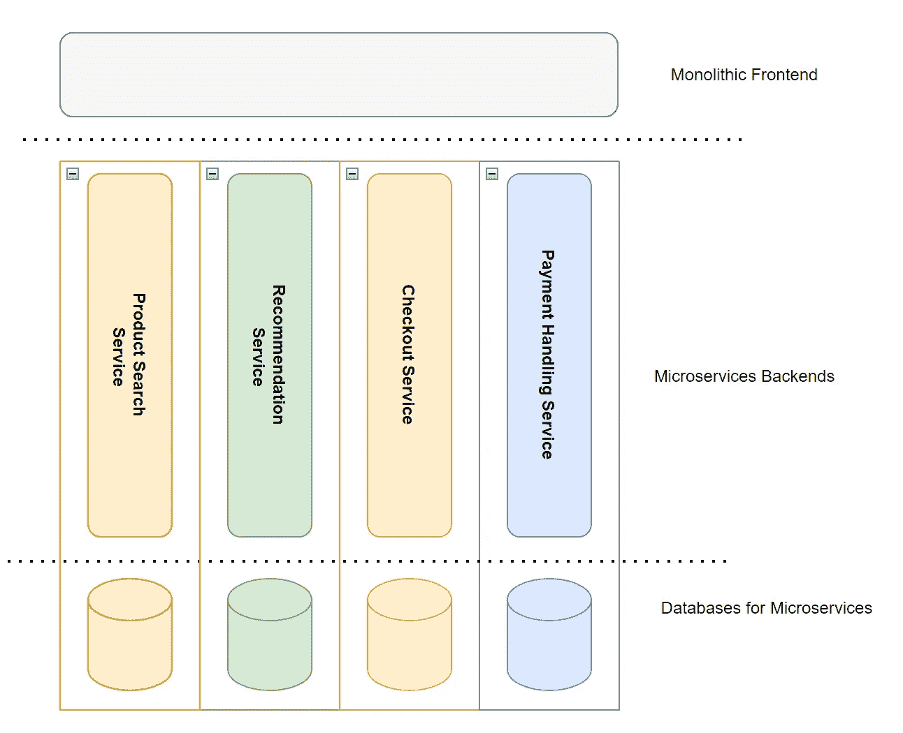
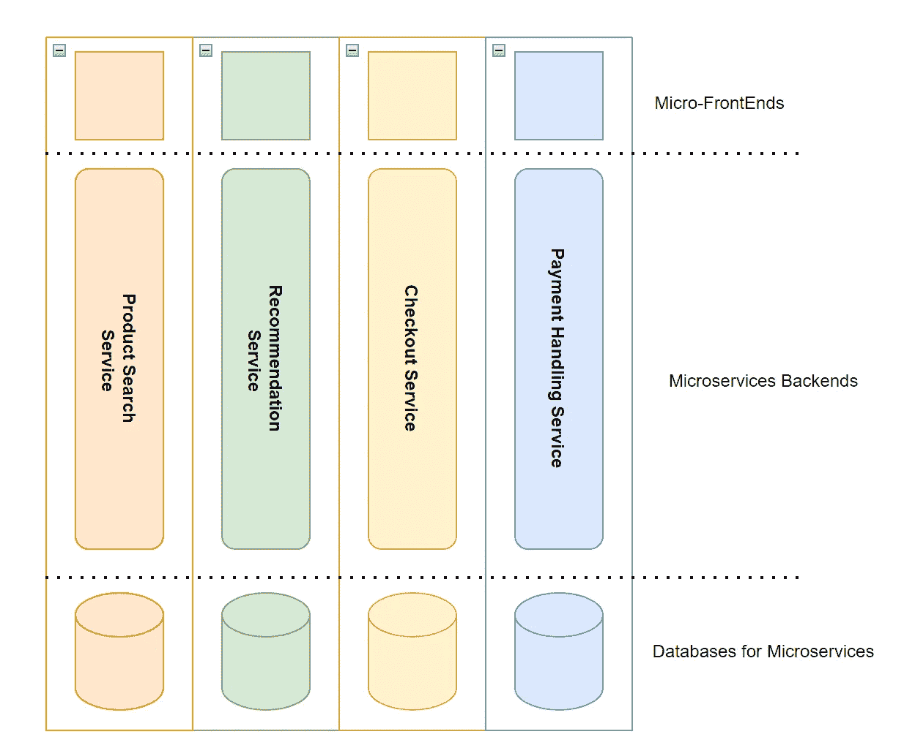
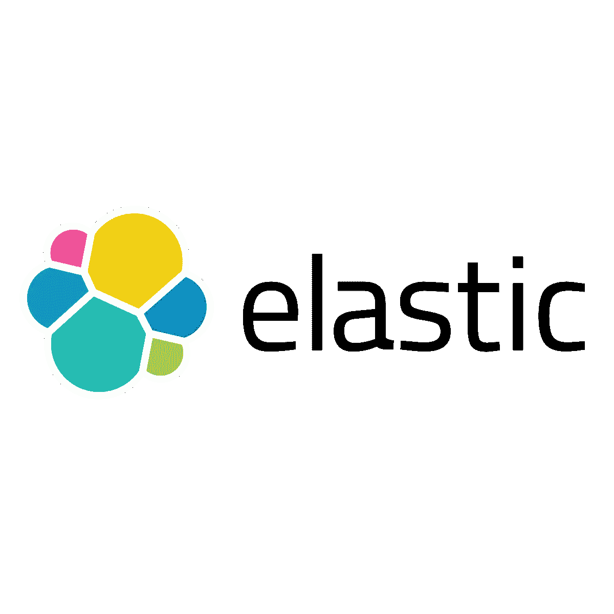

# 每个开发人员都必须知道的 100 个基本系统设计概念(第 10 部分:91–100)

> 原文：<https://levelup.gitconnected.com/100-essential-systems-design-concepts-that-every-developer-must-know-part-10-91-100-e947abc837ce>

这些是作为开发人员必须知道的 100 个基本系统设计概念。

这些将帮助您设计高效、容错和可伸缩的系统。

*为了保证可读性，我将这些分成多篇博文。*

[张杰](https://unsplash.com/@jay_zhang?utm_source=medium&utm_medium=referral)在 [Unsplash](https://unsplash.com?utm_source=medium&utm_medium=referral) 上拍照

可以在下面找到以前部分的链接:

 [## 每个开发人员都必须知道的 100 个基本系统设计概念(第 1 部分)

### 设计高效、容错和可扩展系统的首选清单

levelup.gitconnected.com](/100-essential-systems-design-concepts-that-every-developer-must-know-part-1-1318c2c402ca)  [## 每个开发人员都必须知道的 100 个基本系统设计概念(第 2 部分)

### 设计高效、容错和可扩展系统的首选清单

levelup.gitconnected.com](/100-essential-systems-design-concepts-that-every-developer-must-know-part-2-b6c4c6239af8)  [## 每个开发人员都必须知道的 100 个基本系统设计概念(第 3 部分)

### 设计高效、容错和可扩展系统的首选清单

levelup.gitconnected.com](/100-essential-systems-design-concepts-that-every-developer-must-know-part-3-256762dbed0e)  [## 每个开发人员必须知道的 100 个基本系统设计概念(第 4 部分:31–40)

### 设计高效、容错和可扩展系统的首选清单

bamania-ashish.medium.com](https://bamania-ashish.medium.com/100-essential-systems-design-concepts-that-every-developer-must-know-part-4-31-40-733d19958c37)  [## 每个开发人员都必须知道的 100 个基本系统设计概念(第 5 部分:41–50)

### 设计高效、容错和可扩展系统的首选清单

levelup.gitconnected.com](/100-essential-systems-design-concepts-that-every-developer-must-know-part-4-41-50-8bfa8c3292c)  [## 每个开发人员都必须知道的 100 个基本系统设计概念(第 6 部分:51–60)

### 设计高效、容错和可扩展系统的首选清单

levelup.gitconnected.com](/100-essential-systems-design-concepts-that-every-developer-must-know-part-6-51-60-978801728a4b)  [## 每个开发人员都必须知道的 100 个基本系统设计概念(第 7 部分:61–70)

### 设计高效、容错和可扩展系统的首选清单

bamania-ashish.medium.com](https://bamania-ashish.medium.com/100-essential-systems-design-concepts-that-every-developer-must-know-part-7-61-70-510cf1bfed63)  [## 每个开发人员必须知道的 100 个基本系统设计概念(第 8 部分:71–80)

### 设计高效、容错和可扩展系统的首选清单

levelup.gitconnected.com](/100-essential-systems-design-concepts-that-every-developer-must-know-part-8-71-80-c1efc83663)  [## 每个开发人员必须知道的 100 个基本系统设计概念(第 9 部分:81–90)

### 设计高效、容错和可扩展系统的首选清单

levelup.gitconnected.com](/100-essential-systems-design-concepts-that-every-developer-must-know-part-9-81-90-a2048c9bfb84) 

# 91.幂等性

当一个运算可以多次执行，并且在第一次执行后不会改变结果时，该运算称为幂等运算。

例如:如果一个操作符将一个名为`isCompleted`的变量的值设置为`True`，重复的操作不会导致这个变量的值发生任何变化。这种运算称为幂等运算。

幂等运算通常用在消息传递服务中，以确保消息至少被传递给消费者一次。

# 92.大数据

大数据是指数量太大/太复杂而无法由现代计算机处理和分析的结构化/非结构化数据。

*请记住，没有设定阈值，超过该阈值的数据才被视为大数据。*

大数据以 **3Vs** 为代表:

*   **量**:大数据大到无法用现有的计算能力处理(想想苹果手表为所有顾客产生的健康数据加起来)
*   **速度**:大数据产生得很快(想想每天产生的推文数量)
*   **多样性**:大数据包括结构化数据(数据库表、JSON)和非结构化数据(音频、视频、图像)

照片由 [imgix](https://unsplash.com/@imgix?utm_source=medium&utm_medium=referral) 在 [Unsplash](https://unsplash.com?utm_source=medium&utm_medium=referral) 上拍摄

# 93.分布式文件系统

分布式文件系统允许在多个计算机/节点上存储和访问大型数据集(机器的**集群**)。

每个集群可以有:

*   管理集群资源的**集群管理器节点**
*   **存储和处理数据的工作节点**

分布式文件系统使用冗余来确保数据的高可用性，并根据需要添加工作节点。

示例:

*   Hadoop 分布式文件系统(HDFS)
*   谷歌文件系统(GFS)
*   GlusterFS
*   Quantcast 文件系统(QFS)

大卫·布鲁诺·席尔瓦在 [Unsplash](https://unsplash.com?utm_source=medium&utm_medium=referral) 上的照片

# 94。HDFS

[**Hadoop 分布式文件系统(HDFS)**](https://hadoop.apache.org/docs/r1.2.1/hdfs_design.html#Introduction) 由 Apache 开发的是一种流行的开源分布式文件系统。

它是 Google 文件系统(GFS)的开源重新实现。

HDFS 包括:

*   **中央服务器( *NameNode* )** 记录每台机器上存储的文件块
*   **工作机( *DataNode* )** 运行网络守护进程，允许其他节点访问其上存储的文件

HDFS 可以被视为一个大型文件系统，它使用多台计算机的磁盘空间。

系统的文件块在多台机器上复制，以确保容错。

来自该文件系统的数据可以在以后处理(例如，通过使用 [Apache Hadoop](/100-essential-systems-design-concepts-that-every-developer-must-know-part-9-81-90-a2048c9bfb84) 中的 [MapReduce](/100-essential-systems-design-concepts-that-every-developer-must-know-part-9-81-90-a2048c9bfb84) )。

点击此处了解更多关于 HDFS 建筑的信息:

 [## HDFS 建筑指南

### Hadoop 分布式文件系统(HDFS)是一个分布式文件系统，旨在运行在商用硬件上。它有…

hadoop.apache.org](https://hadoop.apache.org/docs/r1.2.1/hdfs_design.html) 

# 95.成批处理

它涉及大量输入数据的自动化处理，以通过被称为**批处理** **作业**的软件程序产生期望的输出。

批处理作业按照计划在最少甚至没有人工干预的情况下执行，可能需要**几分钟到几天才能完成**。

批处理系统的主要性能通过其 [**吞吐量**](/100-essential-systems-design-concepts-that-every-developer-must-know-part-3-256762dbed0e) 来衡量。

批处理系统可用于:

*   创建搜索索引
*   创建推荐系统
*   处理财务数据(每月工资数据)等。

示例:

*   MapReduce 是一种流行的批处理算法，在 Google、Hadoop、CouchDB 和 MongoDB 的各种开源数据系统中实现。
*   [Spring Batch](https://spring.io/projects/spring-batch) 是另一个用于批处理的开源框架。

卢卡斯·布拉塞克在 [Unsplash](https://unsplash.com?utm_source=medium&utm_medium=referral) 拍摄的照片

# 96.流处理

它涉及对数据流中的数据进行处理，以产生所需的输出。

与批处理相比，流处理是在无限的数据流上实时执行的，而不是在固定大小的输入上执行的。

流处理系统可用于:

*   构建欺诈检测系统
*   日志监控
*   构建股票价格数据分析工具等。

[亚马逊 Kinesis](https://aws.amazon.com/kinesis/) 是一个流行的流处理服务。

Apache Kafka Streams 和 [Apache Spark](https://spark.apache.org/docs/latest/streaming-programming-guide.html) 是其他开源流处理服务。

照片由[康尼·施耐德](https://unsplash.com/@choys_?utm_source=medium&utm_medium=referral)在 [Unsplash](https://unsplash.com?utm_source=medium&utm_medium=referral) 上拍摄

# 97.微前端

微前端是一种以较小的块(**垂直切片**)构建大型应用程序的模式，其中每个功能由不同的团队端到端地构建、测试和部署(包括前端、后端和数据库)。

这些卡盘在以下位置组合在一起:

*   客户端(使用直接链接/框架，如[单一 SPA](https://single-spa.js.org/)
*   服务器端(使用框架，如[平台](https://podium-lib.io/)

使用单片前端的传统方法

微前端(图片作者提供)

# 98.多语种持久性

它是根据最佳用例对应用程序的不同微服务使用不同的数据库技术。

例如:

*   关系数据库(MySQL、Postgres)可以用来存储用户的数据和关系
*   图形数据库( [NeoJ4](https://neo4j.com/) )可用于构建产品推荐服务
*   键值存储(Redis)可以用来缓存数据

在此阅读有关不同类型的数据库模型的更多信息:

 [## 每个开发人员都必须知道的 100 个基本系统设计概念(第 5 部分:41–50)

### 设计高效、容错和可扩展系统的首选清单

levelup.gitconnected.com](/100-essential-systems-design-concepts-that-every-developer-must-know-part-4-41-50-8bfa8c3292c) 

# 99.多模型数据库

它是一个数据库管理系统，旨在支持多种数据模型，如关系模型、面向文档的模型、图模型、键值模型等。

例如:

*   [ArangoDB](https://en.wikipedia.org/wiki/ArangoDB) :支持文档(JSON)、图形、键值模型
*   [Redis](https://en.wikipedia.org/wiki/Redis) :支持键值、文档(JSON)、属性图、流、时序模型
*   [EnterpriseDB](https://en.wikipedia.org/wiki/EnterpriseDB) :支持文档(XML 和 JSON)，键值模型

照片由 [Unsplash](https://unsplash.com?utm_source=medium&utm_medium=referral) 上的 [Sunder Muthukumaran](https://unsplash.com/@sunder_2k25?utm_source=medium&utm_medium=referral) 拍摄

# 100.弹性搜索

[ElasticSearch](https://www.elastic.co/) 是一个免费开放的搜索和分析引擎，支持不同类型的数据(文本、数字、地理空间、结构化和非结构化数据)。

原始数据从使用 [**Beats**](https://www.elastic.co/beats/) 的各种来源流入 Elasticsearch。

使用 [**Logstash**](https://www.elastic.co/logstash/) 对这些数据进行解析、规范化和丰富，最后在 Elasticsearch 中建立索引。

然后，用户可以:

*   对他们的数据运行复杂的查询
*   检索其数据的复杂摘要
*   使用 [**Kibana**](https://www.elastic.co/kibana/) 创建其数据的可视化

这个技术栈通常被称为 **ELK 栈** ( **Elasticsearch，Logstash，**和 **Kibana** )。

“弹性”标志(图片来自维基百科)

非常感谢你阅读这篇文章！

如果你觉得这些文章有帮助，请鼓掌、分享并留下评论！

*如果你是 Python 或编程的新手，可以看看我的新书《没有公牛**t 学习 Python 指南**’***》:**

 [## 学习 Python 的无牛指南

### 你是一个正在考虑学习编程却不知道从哪里开始的人吗？我有适合你的解决方案…

bamaniaashish.gumroad.com](https://bamaniaashish.gumroad.com/l/python-book)  [## 通过我的推荐链接加入 Medium——Ashish Bama nia 博士

### 阅读 Ashish Bamania 博士(以及 Medium 上成千上万的其他作家)的每一个故事。您的会员费直接…

bamania-ashish.medium.com](https://bamania-ashish.medium.com/membership)