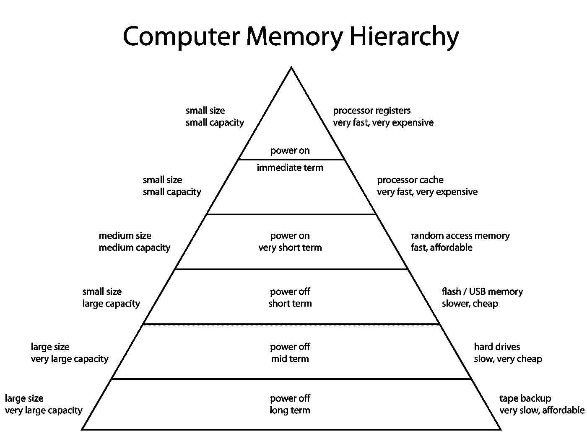

# 每个开发人员必须知道的 100 个基本系统设计概念(第 2 部分:11–20)

> 原文：<https://levelup.gitconnected.com/100-essential-systems-design-concepts-that-every-developer-must-know-part-2-b6c4c6239af8>

这些是作为开发人员必须知道的 100 个基本系统设计概念。

这些将帮助您设计高效、容错和可伸缩的系统。

为了保证可读性，我将这些分成多篇博文。

哈尔·盖特伍德在 [Unsplash](https://unsplash.com?utm_source=medium&utm_medium=referral) 上拍摄的照片

第 1 部分的链接可以在下面找到:

 [## 每个开发人员都必须知道的 100 个基本系统设计概念(第 1 部分)

### 设计高效、容错和可扩展系统的首选清单

bamania-ashish.medium.com](https://bamania-ashish.medium.com/100-essential-systems-design-concepts-that-every-developer-must-know-part-1-1318c2c402ca) 

## 11.超文本传送协议

HTTP(超文本传输协议)是一种互联网协议，用于在客户端和服务器之间发送和接收数据。

为了执行 CRUD *(创建、读取、更新和删除)*操作，HTTP 使用了像`GET`、`POST`、`PUT`、`PATCH`和`DELETE`这样的动词。

## 12.域名服务器(Domain Name Server)

DNS 或域名系统协议用于查找与域名对应的 IP 地址。

可以把它想象成一个电话号码的目录

当你在浏览器中输入`www.google.com`(域名)时，一个请求被发送到一个 DNS 服务器。该服务器返回该域名对应的 IP 地址，即`216.58.212.206`。显示 Google 主页所需的资源需要这个 IP 地址。

[Firmbee.com](https://unsplash.com/@firmbee?utm_source=medium&utm_medium=referral)在 [Unsplash](https://unsplash.com?utm_source=medium&utm_medium=referral) 上的照片

## 13.简单邮件传输协议

SMTP 或简单邮件传输协议是一种用于通过互联网发送电子邮件的协议。

## 14.文件传送协议

FTP 或文件传输协议用于在计算机节点之间发送和接收文件。

Clem Onojeghuo 在 [Unsplash](https://unsplash.com?utm_source=medium&utm_medium=referral) 上拍摄的照片

## 15.港口

它是一个分配的编号，用于唯一标识计算机的连接端点，并将数据定向到特定服务，如 SMTP(端口 25/587)、DNS(端口 53)等。

## 16.嘘

SSH 或安全外壳协议用于通过不安全的网络从另一台计算机安全地访问远程计算机节点。

[regularguy.eth](https://unsplash.com/@moneyphotos?utm_source=medium&utm_medium=referral) 在 [Unsplash](https://unsplash.com?utm_source=medium&utm_medium=referral) 上的照片

## 17.磁盘/辅助存储器

非易失性(断电后数据仍可保存)存储器，可长时间存储数据。

磁盘通常指 HDD(硬盘驱动器)或 SSD(固态驱动器)。

固态硬盘速度更快，但比硬盘更贵。

## 18.随机存取存储器/主存储器

计算机处理器用来短期/临时存储数据的易失性存储器(断电时数据被擦除)。

读写 RAM 比读写磁盘快。

照片由[利亚姆·布里斯](https://unsplash.com/@liam_1?utm_source=medium&utm_medium=referral)在 [Unsplash](https://unsplash.com?utm_source=medium&utm_medium=referral) 上拍摄

## 19.高速缓冲存储器

位于计算机处理器附近的高速内存，用于临时存储可重复使用的数据，以避免从 RAM 中访问这些数据。

## 20.注册

速度最快的易失性内存，位于计算机处理器附近，用于执行快速计算。

图片来自维基百科

*感谢阅读！下一部分再见！*

 [## 每个开发人员都必须知道的 100 个基本系统设计概念(第 3 部分)

### 设计高效、容错和可扩展系统的首选清单

bamania-ashish.medium.com](https://bamania-ashish.medium.com/100-essential-systems-design-concepts-that-every-developer-must-know-part-3-256762dbed0e) 

*如果你是 Python 或编程的新手，可以看看我的新书，书名为“* [**”《没有公牛**t 学习 Python 指南**](https://bamaniaashish.gumroad.com/l/python-book)**”***下面:*

 [## 学习 Python 的无牛指南

### 你是一个正在考虑学习编程却不知道从哪里开始的人吗？我有适合你的解决方案…

bamaniaashish.gumroad.com](https://bamaniaashish.gumroad.com/l/python-book)  [## 通过我的推荐链接加入 Medium——Ashish Bama nia 博士

### 阅读 Ashish Bamania 博士(以及 Medium 上成千上万的其他作家)的每一个故事。您的会员费直接…

bamania-ashish.medium.com](https://bamania-ashish.medium.com/membership)