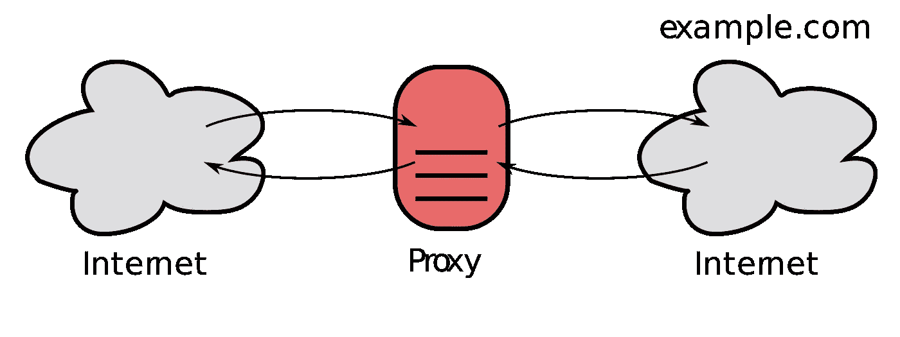
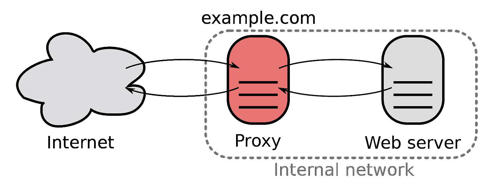
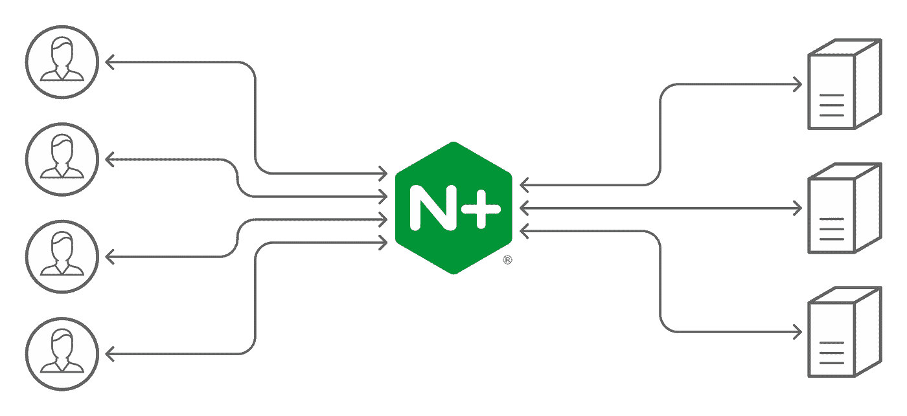

# 每个开发人员都必须知道的 100 个基本系统设计概念(第 6 部分:51–60)

> 原文：<https://levelup.gitconnected.com/100-essential-systems-design-concepts-that-every-developer-must-know-part-6-51-60-978801728a4b>

这些是作为开发人员必须知道的 100 个基本系统设计概念。

这些将帮助您设计高效、容错和可伸缩的系统。

为了保证可读性，我将这些分成多篇博文。

照片由 [Balázs Kétyi](https://unsplash.com/@balazsketyi?utm_source=medium&utm_medium=referral) 在 [Unsplash](https://unsplash.com?utm_source=medium&utm_medium=referral) 上拍摄

可以在下面找到以前部分的链接:

 [## 每个开发人员都必须知道的 100 个基本系统设计概念(第 1 部分)

### 设计高效、容错和可扩展系统的首选清单

levelup.gitconnected.com](/100-essential-systems-design-concepts-that-every-developer-must-know-part-1-1318c2c402ca)  [## 每个开发人员都必须知道的 100 个基本系统设计概念(第 2 部分)

### 设计高效、容错和可扩展系统的首选清单

levelup.gitconnected.com](/100-essential-systems-design-concepts-that-every-developer-must-know-part-2-b6c4c6239af8)  [## 每个开发人员都必须知道的 100 个基本系统设计概念(第 3 部分)

### 设计高效、容错和可扩展系统的首选清单

levelup.gitconnected.com](/100-essential-systems-design-concepts-that-every-developer-must-know-part-3-256762dbed0e)  [## 每个开发人员必须知道的 100 个基本系统设计概念(第 4 部分:31–40)

### 设计高效、容错和可扩展系统的首选清单

bamania-ashish.medium.com](https://bamania-ashish.medium.com/100-essential-systems-design-concepts-that-every-developer-must-know-part-4-31-40-733d19958c37)  [## 每个开发人员都必须知道的 100 个基本系统设计概念(第 5 部分:41–50)

### 设计高效、容错和可扩展系统的首选清单

levelup.gitconnected.com](/100-essential-systems-design-concepts-that-every-developer-must-know-part-4-41-50-8bfa8c3292c) 

## 51.整体建筑

一种软件体系结构，其中软件应用程序执行的所有功能都被部署为一个统一的单元。

照片由[你好我是 Nik](https://unsplash.com/@helloimnik?utm_source=medium&utm_medium=referral) 上 [Unsplash](https://unsplash.com?utm_source=medium&utm_medium=referral)

## 52.微服务架构

一种软件体系结构，其中软件应用程序执行的所有功能都被部署为不同的独立功能服务。

例如，亚马逊可以分为购物车服务、支付服务和库存服务，这些服务既独立运行，又相互交互。

由 [Vlad Hilitanu](https://unsplash.com/@vladhilitanu?utm_source=medium&utm_medium=referral) 在 [Unsplash](https://unsplash.com?utm_source=medium&utm_medium=referral) 上拍摄的照片

## 53.代理/转发代理

充当[客户端](/100-essential-systems-design-concepts-that-every-developer-must-know-part-1-1318c2c402ca)和[服务器](/100-essential-systems-design-concepts-that-every-developer-must-know-part-1-1318c2c402ca)之间中介的服务器，帮助客户端完成以下工作:

*   通过代表客户端向服务器发出请求来提高客户端的隐私性
*   帮助缓存数据，以加快对客户端常见请求的响应

代理(图片来自维基百科)

## 54.反向代理

充当[服务器](/100-essential-systems-design-concepts-that-every-developer-must-know-part-1-1318c2c402ca)和[客户端](/100-essential-systems-design-concepts-that-every-developer-must-know-part-1-1318c2c402ca)之间中介的服务器，帮助服务器完成以下工作:

*   提高服务器的安全性
*   负载平衡
*   缓存对服务器常见请求的响应
*   日志管理

反向代理(图片来自维基百科)

## 55.负载平衡器

一种反向代理，有助于在作为系统一部分的服务器之间分发传入请求。

一个流行的反向代理和负载平衡器的例子是 Nginx。

负载平衡(图片取自[nginx.com](https://www.nginx.com/products/nginx/load-balancing/)

## 56.隐藏物

存储硬件，用于存储对服务器常见请求的响应或计算开销大的操作的结果，以减少系统中的[延迟](/100-essential-systems-design-concepts-that-every-developer-must-know-part-3-256762dbed0e)。

例如，来自普通 DNS 查找请求的结果被缓存、存储并返回给客户端，以避免重复查询 DNS 数据库，从而减少[延迟](/100-essential-systems-design-concepts-that-every-developer-must-know-part-3-256762dbed0e)。

[弗洛里安·克拉姆](https://unsplash.com/@floriankrumm?utm_source=medium&utm_medium=referral)在 [Unsplash](https://unsplash.com?utm_source=medium&utm_medium=referral) 上拍摄的照片

## 57.缓存命中

当在服务器缓存中找到对客户机请求的响应时，它就出现了。

## 58.缓存未命中

当在服务器缓存中找不到对客户端请求的响应时，就会出现这种情况。

拉斯·金勒在 [Unsplash](https://unsplash.com?utm_source=medium&utm_medium=referral) 上拍摄的照片

## 59.缓存失效

当数据库条目发生更改时，缓存条目会变得“过时”或无效。这些高速缓存条目按照下面提到的方案被替换:

*   **直写缓存**:新条目同时写入缓存和对应的数据库
*   **绕写缓存**:新条目绕过缓存写入数据库
*   **回写高速缓存**:新条目被写入高速缓存，随后有条件地写入相应的数据库

## 60.缓存替换/驱逐策略

一种策略，指导当缓存已满以及发生缓存未命中时，缓存中的哪些条目将被替换。

一些常用的策略包括:

*   **随机替换(RR)** :随机替换缓存的条目
*   **最近最少使用(LRU)** :将替换最近最少使用的缓存条目
*   **最不常用(LFU)** :最不常用的缓存条目将被替换
*   **先进先出(FIFO)** :缓存条目按照它们进入缓存的顺序进行替换

[布鲁斯洪](https://unsplash.com/@hongqi?utm_source=medium&utm_medium=referral)在 [Unsplash](https://unsplash.com?utm_source=medium&utm_medium=referral) 上拍照

*感谢阅读！下一部分再见！*

 [## 每个开发人员都必须知道的 100 个基本系统设计概念(第 7 部分:61–70)

### 设计高效、容错和可扩展系统的首选清单

bamania-ashish.medium.com](https://bamania-ashish.medium.com/100-essential-systems-design-concepts-that-every-developer-must-know-part-7-61-70-510cf1bfed63)  [## 通过我的推荐链接加入 Medium-Ashish Bama nia 博士

### 阅读 Ashish Bamania 博士(以及 Medium 上成千上万的其他作家)的每一个故事。您的会员费直接…

bamania-ashish.medium.com](https://bamania-ashish.medium.com/membership)