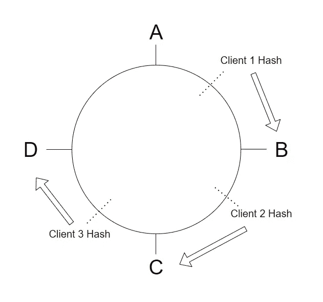
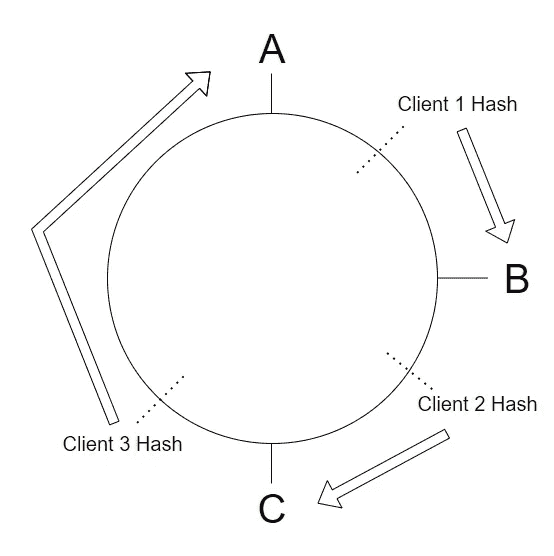

# 每个开发人员都必须知道的 100 个基本系统设计概念(第 7 部分:61–70)

> 原文：<https://levelup.gitconnected.com/100-essential-systems-design-concepts-that-every-developer-must-know-part-7-61-70-510cf1bfed63>

这些是作为开发人员必须知道的 100 个基本系统设计概念。

这些将帮助您设计高效、容错和可伸缩的系统。

为了保证可读性，我将这些分成多篇博文。

[Barney Yau](https://unsplash.com/@barneyyau?utm_source=medium&utm_medium=referral) 在 [Unsplash](https://unsplash.com?utm_source=medium&utm_medium=referral) 上的照片

可以在下面找到以前部分的链接:

 [## 每个开发人员都必须知道的 100 个基本系统设计概念(第 1 部分)

### 设计高效、容错和可扩展系统的首选清单

levelup.gitconnected.com](/100-essential-systems-design-concepts-that-every-developer-must-know-part-1-1318c2c402ca)  [## 每个开发人员都必须知道的 100 个基本系统设计概念(第 2 部分)

### 设计高效、容错和可扩展系统的首选清单

levelup.gitconnected.com](/100-essential-systems-design-concepts-that-every-developer-must-know-part-2-b6c4c6239af8)  [## 每个开发人员都必须知道的 100 个基本系统设计概念(第 3 部分)

### 设计高效、容错和可扩展系统的首选清单

levelup.gitconnected.com](/100-essential-systems-design-concepts-that-every-developer-must-know-part-3-256762dbed0e)  [## 每个开发人员必须知道的 100 个基本系统设计概念(第 4 部分:31–40)

### 设计高效、容错和可扩展系统的首选清单

bamania-ashish.medium.com](https://bamania-ashish.medium.com/100-essential-systems-design-concepts-that-every-developer-must-know-part-4-31-40-733d19958c37)  [## 每个开发人员都必须知道的 100 个基本系统设计概念(第 5 部分:41–50)

### 设计高效、容错和可扩展系统的首选清单

levelup.gitconnected.com](/100-essential-systems-design-concepts-that-every-developer-must-know-part-4-41-50-8bfa8c3292c)  [## 每个开发人员都必须知道的 100 个基本系统设计概念(第 6 部分:51–60)

### 设计高效、容错和可扩展系统的首选清单

levelup.gitconnected.com](/100-essential-systems-design-concepts-that-every-developer-must-know-part-6-51-60-978801728a4b) 

## 61.负载平衡服务器选择策略

负载平衡器使用不同的策略将输入流量分配给不同的服务器。

常见的负载平衡策略有:

*   **循环策略**
    请求以循环方式分发到所有服务器。
    如果我们有三台服务器 A、B 和 C，请求首先被发送到 A，然后是 B 和 C，从 A 开始返回。
*   **加权循环法** 根据服务器处理请求的能力，将权重分配给不同的服务器。
    请求根据它们的权重以循环方式分布到所有这些服务器。
*   **随机选择** 请求以随机方式分配给所有服务器。
*   **根据 IP 地址的选择** 客户端的 IP 地址被散列以创建用于将请求重定向到特定服务器的唯一密钥。
*   **根据服务器性能选择** 根据这种策略，请求可以被重定向到拥塞最少/响应时间最快的服务器。

照片由 [Max](https://unsplash.com/@notquitemax?utm_source=medium&utm_medium=referral) 在 [Unsplash](https://unsplash.com?utm_source=medium&utm_medium=referral) 拍摄

## 62.散列函数

这是一个将任意大小的数据映射到固定大小的值的函数，称为哈希/哈希摘要。

## 63。SHA(安全哈希算法)

这些是由美国国家标准技术研究院(NIST)发布的一系列流行的散列函数。

**SHA-2** 和 **SHA-3** 是现今使用的流行哈希函数。

请在下面阅读更多信息:

 [## 安全散列算法-维基百科

### 安全散列算法是由美国国家安全研究所发布的一系列加密散列函数

en.wikipedia.org](https://en.wikipedia.org/wiki/Secure_Hash_Algorithms) 

## 64.一致散列法

这是一种哈希技术，可以在调整哈希表大小时最大限度地减少键到值的重新映射。

让我们以服务器 A、B、C 和 d 为例。

客户机被散列和映射，以便它们的请求以顺时针方式被分发到最近的服务器。

客户端到服务器的映射(图片由作者提供)

当服务器 D 停机时，来自客户机 3 的请求被重定向到服务器 A，同时保留其他客户机的客户机-服务器关系。

这对于简单的散列策略是不可能的。

当服务器 D 停机时客户端到服务器的映射(图片由作者提供)

## 65.会合/最高随机权重散列

与一致性哈希类似，这是一种哈希策略，可以在调整哈希表大小时最大限度地减少键到值的重新映射。

按照这种策略，客户机对可用的服务器进行加权，并将请求发送给权重最高的服务器。

如果该服务器关闭，客户端将向权重次高的服务器发送请求。

Mauro Sbicego 在 [Unsplash](https://unsplash.com?utm_source=medium&utm_medium=referral) 上拍摄的照片

## 66.数据库索引

它是一种数据库结构，有助于在数据库上执行更快的搜索和过滤。

在此阅读有关数据库索引的更多信息:

 [## 每个开发人员都必须知道的 10 个基本 SQL 概念

### 是的，不是——SQL 数据库提供了灵活性，但是抛弃 SQL 是一个大错误！

bamania-ashish.medium.com](https://bamania-ashish.medium.com/10-essential-sql-concepts-that-every-developer-must-know-c005fdad0761) 

## **67。主副本复制**策略

这是一种通过创建数据库副本来扩展数据库的策略。

可以从复制的实例中读取数据，但只能将数据写入主数据库。

写入主数据库的数据在副本中异步更新。

这种策略损害了数据库的 [**一致性**](/100-essential-systems-design-concepts-that-every-developer-must-know-part-3-256762dbed0e) 。

## 68.多主机复制策略

这是一种通过创建数据库副本来扩展数据库的策略。

每个复制的实例都支持读取和写入数据库。

这种策略会导致在写入数据库时产生冲突(创建两个具有相同 ID 的行)。

照片由 [Sunder Muthukumaran](https://unsplash.com/@sunder_2k25?utm_source=medium&utm_medium=referral) 在 [Unsplash](https://unsplash.com?utm_source=medium&utm_medium=referral) 拍摄

## 69.数据库分片

它是将一个数据库划分成多个称为**碎片的小单元的过程。**

该策略[水平扩展](/100-essential-systems-design-concepts-that-every-developer-must-know-part-4-31-40-733d19958c37)并增加数据库的 [**吞吐量**](/100-essential-systems-design-concepts-that-every-developer-must-know-part-3-256762dbed0e) 。

点击此处阅读更多关于数据库分片的信息:

 [## 了解数据库分片|数字海洋

### 任何有显著增长的应用程序或网站最终都需要扩展以适应增长…

www.digitalocean.com](https://www.digitalocean.com/community/tutorials/understanding-database-sharding) 

## 70.热点

这是一个术语，指的是比其他服务器接收更多查询/请求的数据库碎片或服务器。

这可能是由于次优的分片密钥或哈希函数。

由[主题照片](https://unsplash.com/@themephotos?utm_source=medium&utm_medium=referral)在 [Unsplash](https://unsplash.com?utm_source=medium&utm_medium=referral) 上拍摄

*感谢阅读！下一部分再见！*

 [## 每个开发人员必须知道的 100 个基本系统设计概念(第 8 部分:71–80)

### 设计高效、容错和可扩展系统的首选清单

bamania-ashish.medium.com](https://bamania-ashish.medium.com/100-essential-systems-design-concepts-that-every-developer-must-know-part-8-71-80-c1efc83663) 

*如果你是 Python 或编程的新手，可以看看我的新书，书名是'* [**《没有公牛**t 学习 Python 指南》**](https://bamaniaashish.gumroad.com/l/python-book) **'** *下面:*

 [## 学习 Python 的无牛指南

### 你是一个正在考虑学习编程却不知道从哪里开始的人吗？我有适合你的解决方案…

bamaniaashish.gumroad.com](https://bamaniaashish.gumroad.com/l/python-book)  [## 通过我的推荐链接加入 Medium-Ashish Bama nia 博士

### 阅读 Ashish Bamania 博士(以及 Medium 上成千上万的其他作家)的每一个故事。您的会员费直接…

bamania-ashish.medium.com](https://bamania-ashish.medium.com/membership)